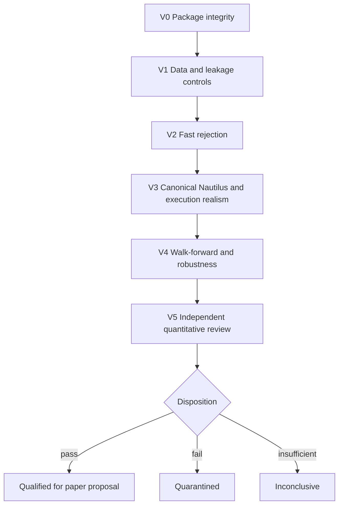
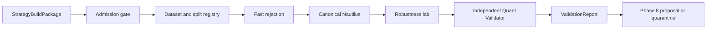
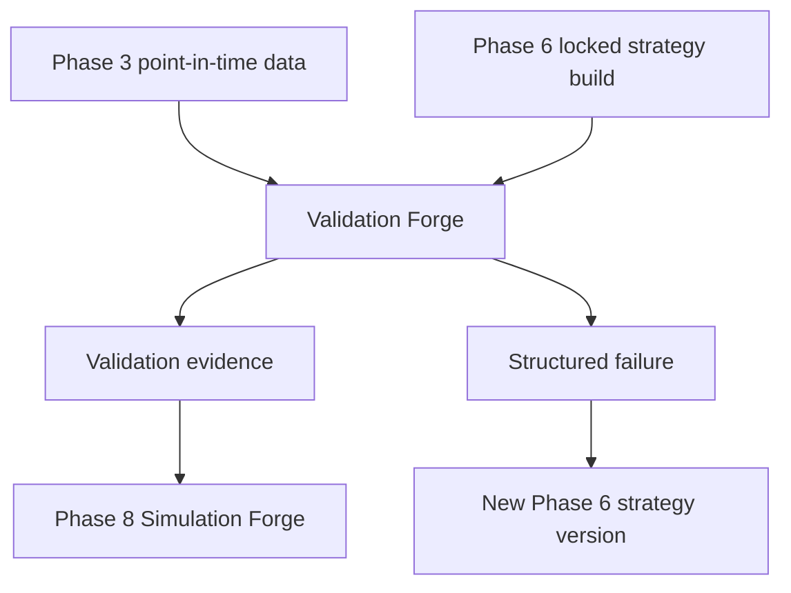
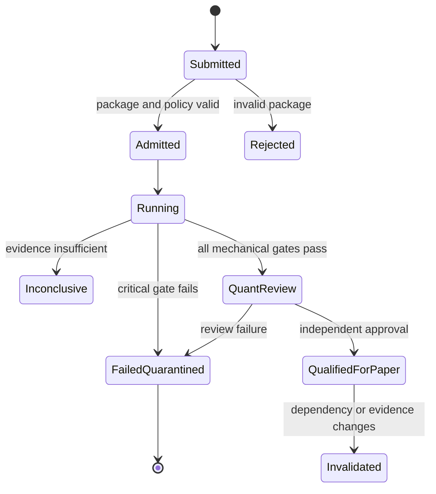

# Phase 7 — Validation Forge

> **Status:** Build-ready planning package  
> **Prerequisite:** Phase 6 Strategy Lock, immutable `StrategyBuildPackage`, and bounded `ValidationRequest`  
> **Produces:** Machine-readable `ValidationReport`, independent qualification decision, and bounded Phase 8 proposal  
> **Anchor:** **F7 — Profitability is a claim; robustness and reproducibility are qualification.**

---

## 1. Idea

Create a rejection-first qualification ladder that detects leakage, overfitting, unrealistic fills, unstable parameters, narrow historical luck, broken accounting, and irreproducible results before a strategy can enter paper simulation.

```text
StrategyBuildPackage
→ integrity and poisoned-control gates
→ immutable split plan
→ fast rejection
→ canonical Nautilus backtest
→ execution stress
→ walk-forward and robustness
→ benchmark and multiple-testing review
→ independent Quant Validator
→ ValidationReport
→ paper-eligible or quarantined
```

A profitable backtest cannot skip a failed gate. Phase 7 qualifies evidence for Phase 8; it does not deploy paper/live strategies, connect a broker, allocate capital, or place orders.

---

## 2. Reality at Entry

The workspace already contains:

- standalone pandas and experimental backtest loops;
- partial Nautilus runners;
- VectorBT-oriented guidance and templates;
- parameter optimizers;
- cross-validation code comparing summary metrics;
- numerous result JSON files;
- strategy reports with unverified win-rate and profit-factor claims.

Known warning signs already present:

- a reported 100% win rate where every exit was labeled `sl`;
- profit factors above 100 without a locked accounting audit;
- single-instrument, fixed-period optimization;
- hard-coded execution and pip assumptions;
- empty or partial result sets;
- engine comparison based on aggregate metrics instead of exact trades/events;
- no canonical train/validation/holdout registry;
- no multiple-testing ledger or independent qualification report.

Existing results are research leads. They are not Phase 7 evidence until reproduced from a locked Phase 6 package under this ladder.

---

## 3. Canonical Decisions

| Decision | Lock |
|---|---|
| Orchestration | OCE remains the sole validation spine |
| Strategy input | Immutable Phase 6 build package; no target edits |
| Data | Phase 3 point-in-time manifests plus immutable split registry |
| Thresholds | Frozen before outcome-bearing runs |
| Fast runner | Rejection only; never sufficient for qualification |
| Canonical engine | Generated Nautilus target and pinned execution models |
| Holdout | Sealed, access-controlled, one declared use per hypothesis generation |
| Overlap | Purge/embargo based on feature and holding horizons |
| Costs | Base, adverse, and stress scenarios |
| Randomness | Registered seeds, methods, and distributions |
| Parameters | Full declared space and neighborhood surfaces |
| Trials | Complete experiment/multiple-testing ledger |
| Review | Independent Quant Validator |
| Outcomes | `qualified_for_paper`, `failed_quarantined`, or `inconclusive` |
| Handoff | Phase 8 eligibility proposal, not paper deployment |

---

## 4. Qualification Ladder



The ladder is conjunctive:

```text
qualified =
  V0_pass
  AND V1_pass
  AND V2_pass
  AND V3_pass
  AND V4_pass
  AND V5_pass
```

No blended score can compensate for a critical failure.

---

## 5. Book Sequence

| Book | Document | Builds | Exit |
|---:|---|---|---|
| 1 | [Validation Contracts, Splits, and Leakage Lab](book-1-contracts-splits-leakage.md) | Policies, dataset registry, purge/embargo, sealed holdout, poisoned controls | Data and evaluation design are immutable and leakage-safe |
| 2 | [Engines and Execution Realism](book-2-engines-execution-realism.md) | Fast rejection, canonical Nautilus, trade accounting, costs/fills/slippage/latency | Canonical results survive realistic execution scenarios |
| 3 | [Robustness and Statistical Qualification](book-3-robustness-statistical-qualification.md) | Walk-forward, bootstrap/Monte Carlo, sensitivity surfaces, regimes/assets, benchmarks, multiple testing | Edge is not isolated to one parameter, sample, asset, or lucky path |
| 4 | [Quant Review, Reports, and Quarantine](book-4-quant-review-reports-quarantine.md) | Metrics, independent review, decision gates, `ValidationReport`, failure lifecycle | Qualification is explainable, scoped, and independently approved |
| 5 | [Validation Operations and Lock](book-5-validation-operations-lock.md) | OCE jobs, reproducibility, load/recovery, Validation Lock, Phase 8 handoff | Clean rerun reproduces and Phase 8 accepts bounded eligibility |

Books execute in order. A failing result may return to Phase 6 as structured evidence, but no book may patch strategy code or consume a sealed holdout twice under the same hypothesis.

---

## 6. Architecture





---

## 7. Core Artifacts

| Artifact | Purpose |
|---|---|
| `ValidationPolicy` | Frozen stages, thresholds, metrics, critical failures, and scope |
| `ValidationRunRequest` | Admitted execution request tied to one Strategy Lock |
| `DatasetSnapshot` | Immutable point-in-time dataset and coverage manifest |
| `SplitPlan` | Train/validation/holdout and walk-forward boundaries |
| `HoldoutSeal` | Access policy, hash, authorized use, and burn status |
| `TrialLedger` | Every model, parameter, rule, data, and hypothesis trial |
| `CostModel` | Fees, spread, borrow/funding, market impact, and scenario |
| `FillModel` | Trigger, queue/path, partial fill, gap, and ambiguity assumptions |
| `LatencyModel` | Observation, computation, submission, and acknowledgement delays |
| `BacktestRunManifest` | Engine, inputs, parameters, seed, and environment |
| `TradeLedger` | Canonical event/trade/fill/cost/cash accounting |
| `WalkForwardPlan` | Train/tune/test windows and parameter selection rule |
| `SensitivitySurface` | Full parameter neighborhood and failure topology |
| `RobustnessReport` | Resampling, perturbation, regime, asset, and tail evidence |
| `ValidationReport` | Machine-readable stage results, metrics, limitations, and decision |
| `QuarantineRecord` | Failure reasons, evidence, and permitted next actions |
| `ValidationLockManifest` | Phase completion proof |

---

## 8. Validation Lifecycle



`qualified_for_paper` means eligible to enter Phase 8 approval and observation. It is not paper deployment, a live recommendation, or capital authorization.

---

## 9. Metrics Policy

Every metric declares:

- exact formula and unit;
- gross versus net basis;
- sampling frequency and annualization;
- treatment of flat periods and overlapping positions;
- initial cash/test-unit assumptions;
- confidence interval or uncertainty method;
- minimum effective sample and coverage;
- benchmark and null comparison;
- aggregation across folds, assets, and regimes;
- critical threshold frozen before results.

Core evidence may include:

```text
trade count and effective independent sample
net expectancy in R and currency test units
hit rate with interval
average win/loss and payoff ratio
profit factor with denominator guard
exposure, turnover, and capacity proxy
maximum drawdown and duration
tail loss and expected shortfall
Sharpe/Sortino with declared assumptions
probabilistic or deflated Sharpe where applicable
walk-forward efficiency and fold dispersion
parameter neighborhood stability
cost break-even and stress survival
benchmark/null excess performance
```

No universal threshold such as “30 trades” or “Sharpe above X” is silently applied to every strategy family.

---

## 10. Target Layout

```text
validation_forge/
  contracts/
  datasets/
  splits/
  leakage/
  engines/
  execution_models/
  accounting/
  walk_forward/
  robustness/
  statistics/
  benchmarks/
  review/
  reports/
  quarantine/
  operations/
  lock/
  handoff/
```

---

## 11. Critical Test Matrix

| Test | Proof | Book |
|---|---|---:|
| P7-LKA-001 | Intentional future-data strategy fails | 1 |
| P7-SRV-001 | Survivor-only universe fails | 1 |
| P7-HLD-001 | Holdout remains sealed until authorized use | 1 |
| P7-FST-001 | Fast runner rejects known broken strategy | 2 |
| P7-NAU-001 | Canonical Nautilus run reproduces | 2 |
| P7-CST-001 | Fee/slippage stress changes results correctly | 2 |
| P7-ACC-001 | Stop-labeled winning-exit poison is detected | 2 |
| P7-WFA-001 | Walk-forward results reproduce | 3 |
| P7-PRM-001 | Parameter cliff is detected | 3 |
| P7-MCT-001 | Multiple-testing ledger changes significance | 3 |
| P7-RNG-001 | Same seed reproduces; different seeds remain distributionally stable | 3 |
| P7-REV-001 | Independent Quant Validator controls disposition | 4 |
| P7-QRT-001 | Failed strategy enters quarantine | 4 |
| P7-E2E-001 | Locked strategy-to-paper-eligibility run reproduces | 5 |
| P7-HOF-001 | Phase 8 accepts a valid bounded proposal | 5 |
| P7-AUT-001 | Paper/live/broker/capital actions remain unavailable | 5 |

---

## 12. Phase Invariants

1. OCE is the sole validation orchestrator.
2. Every run targets one immutable Strategy Lock.
3. Validation never edits generated strategy code.
4. Policies and thresholds freeze before outcome-bearing runs.
5. Every dataset is point-in-time and manifest-backed.
6. Universe membership is survivorship-safe.
7. Split boundaries use time, event availability, and holding horizon.
8. Overlapping labels/trades require purge and embargo.
9. Holdout access is sealed, logged, and purpose-bound.
10. A used holdout cannot become “unseen” again.
11. Every trial enters the ledger, including failures and abandoned runs.
12. Fast evaluation may reject but cannot qualify.
13. Nautilus is the canonical event-driven backtest for qualification.
14. Engine parity compares trades/events, not only summary metrics.
15. Trade, fill, fee, cash, and position ledgers reconcile.
16. Costs include all material asset/venue-specific components.
17. Base, adverse, and stress execution scenarios are required.
18. Same-bar and gap behavior follow pinned models.
19. Random tests declare algorithm, seed, distribution, and sample count.
20. Dependence-aware resampling is preferred over naive IID shuffling.
21. Parameter neighborhoods matter more than a single optimum.
22. Walk-forward parameter selection cannot inspect its test window.
23. Benchmark and null models use the same data and cost assumptions.
24. Multiple testing includes all known strategy and parameter trials.
25. Regime/asset scope cannot be narrowed after seeing failures without a new version and trial penalty.
26. Critical failures cannot be averaged away.
27. Independent review is required.
28. Failed strategies are quarantined and cannot auto-retry with hidden changes.
29. Qualification is scoped to exact data, assets, horizons, costs, and assumptions.
30. Phase 7 cannot approve paper/live deployment, route orders, or allocate capital.
31. Material dependency changes invalidate the result.
32. A passing Validation Lock is required for Phase 8.

---

## 13. Agent Extension Contract

An agent extending Phase 7 must:

1. read this blueprint and the active book;
2. pin the Strategy Lock and validation policy;
3. register every dataset, split, model, threshold, and trial;
4. preserve holdout access controls;
5. run cheap rejection stages before expensive qualification;
6. use the generated Phase 6 targets unchanged;
7. reconcile event/trade/accounting ledgers;
8. report full uncertainty, negative results, and limitations;
9. submit evidence to the independent Quant Validator;
10. stop at Phase 8 eligibility proposal or quarantine.

The agent must pause if a threshold was not prefrozen, the holdout was exposed, execution assumptions are unsupported, a data manifest fails, the strategy build changed, or trial history is incomplete.

---

## 14. Completion Definition

Phase 7 is complete only when:

- intentional look-ahead and survivorship poison cases fail;
- immutable purge/embargo splits and sealed holdout controls work;
- fast rejection and canonical Nautilus runs reconcile;
- trade, fill, fee, position, and cash accounting pass;
- base/adverse/stress costs and latency are evaluated;
- walk-forward, resampling, parameter, regime, asset, benchmark, and null tests complete;
- multiple-testing and trial-history penalties are applied;
- same-seed reproducibility and different-seed distributional stability pass;
- the independent Quant Validator issues a scoped disposition;
- failures quarantine correctly;
- clean replay and backup/restore work;
- the Validation Lock verifies;
- Phase 8 accepts the bounded proposal;
- no paper/live deployment, broker routing, order placement, or capital authority occurs.

---

## 15. Handoff to Phase 8

Phase 8 receives only strategies with `qualified_for_paper` status:

- immutable Strategy Build and Validation Lock references;
- machine-readable `ValidationReport`;
- permitted instruments, sessions, horizons, and parameter baseline;
- paper observation duration and minimum event/trade requirements;
- canonical expected signal/trade/fill behavior;
- base/adverse/stress assumptions and break-even costs;
- expected performance ranges and uncertainty—not promises;
- drawdown/tail envelopes and operational guard proposals;
- known limitations and invalidation triggers;
- reconciliation tolerances;
- bounded `PaperEligibilityProposal`.

Phase 8 decides whether and how to deploy in paper/shadow mode. Phase 7 cannot start that deployment.
