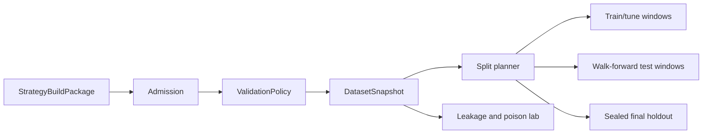

# Phase 7, Book 1 — Validation Contracts, Splits, and Leakage Lab

> **Purpose:** Freeze qualification policy, construct immutable evaluation datasets/splits, seal holdouts, and prove leakage controls with poisoned cases  
> **Input:** Phase 6 StrategyBuildPackage, Strategy Lock, and ValidationRequest  
> **Output:** `ValidationPolicy`, `DatasetSnapshot`, `SplitPlan`, `HoldoutSeal`, and leakage audit  
> **Previous:** Phase 6 — Strategy Forge  
> **Next:** [Book 2 — Engines and Execution Realism](book-2-engines-execution-realism.md)

---

## 1. Success Statement

Every observation belongs to a declared role before testing begins; future information, current survivors, overlapping outcomes, revisions, and exposed holdout data cannot enter a qualification run. Intentionally contaminated strategies and datasets fail deterministically.

---

## 2. Applicable Anchors

- **A1:** One Orchestration Spine
- **A2:** Evidence Before Narrative
- **A3:** Point-in-Time Data
- **A4:** Stable Identity Everywhere
- **A8:** Idempotent Event Handling
- **A9:** Separate Research From Approval
- **A10:** Observable and Reconstructable
- **F3:** Passing data manifest required
- **F6:** One spec, no silent divergence
- **F7:** Robustness and reproducibility qualify

---

## 3. Data-Control Topology



---

## 4. Work Packages

### 4.1 Validation admission

Verify Strategy Lock, package hashes, generated-target integrity, requested scope, data availability, parameter permissions, prior trial lineage, and proposed qualification criteria.

```yaml
validation_run_request_id: typed-id
strategy_build_package_ref: artifact-ref
strategy_lock_ref: artifact-ref
validation_policy_ref: policy-id
dataset_policy_refs: []
requested_scope: {}
trial_family_ref: typed-id
resource_budget_ref: policy-id
idempotency_key: string
```

### 4.2 ValidationPolicy

The frozen policy declares:

- required ladder stages;
- critical versus advisory gates;
- metrics/formulas;
- minimum effective evidence;
- train/tune/test/holdout rules;
- purge and embargo method;
- cost/fill/latency scenarios;
- walk-forward plan;
- allowed parameter selection objective;
- robustness methods and seeds;
- regime/asset/benchmark/null tests;
- multiple-testing method;
- qualification, failure, and inconclusive criteria;
- Phase 8 handoff requirements.

The final evaluator cannot move thresholds after observing results.

### 4.3 Dataset snapshot

```yaml
dataset_snapshot_id: content-id
as_of: timestamp
instrument_and_universe_refs: []
data_manifest_refs: []
source_record_hashes: []
fields_and_frequencies: {}
availability_rules: {}
corporate_action_policies: {}
calendar_and_tz_versions: {}
coverage: {}
quality_findings: []
```

Rows and instruments use stable ordering before hashing.

### 4.4 Split roles

```text
research_history
training
parameter_selection_validation
walk_forward_test
final_sealed_holdout
diagnostic_only
```

Research history already seen during discovery/strategy design cannot be relabeled unseen.

### 4.5 Purging and embargo

For outcome or trade horizons that cross boundaries:

- purge training samples whose information/outcome interval overlaps test;
- embargo observations after training/test boundaries where dependency persists;
- include feature lookback, label horizon, maximum holding period, session state, and overlapping positions;
- warm up features/state from prior data without allowing warm-up returns into the test score.

### 4.6 Holdout seal

```yaml
holdout_seal_id: typed-id
dataset_partition_hash: content-hash
authorized_purpose: final_qualification
authorized_roles: [independent_quant_validator]
maximum_authorized_opens: integer
created_at: timestamp
opened_at: optional-timestamp
burned_at: optional-timestamp
dependent_hypothesis_family_ref: typed-id
```

After use, the holdout is burned for iterative strategy modification. A revised strategy requires a newly justified untouched period or forward observation.

### 4.7 Trial ledger

Record every:

- strategy family/spec/version;
- parameter set and selection rule;
- universe/asset/timeframe;
- feature or filter variation;
- data/split revision;
- metric/objective;
- seed and resampling method;
- aborted, failed, and null run;
- human/agent decision informed by results.

The ledger begins with known pre-Phase 7 experiments; missing history increases uncertainty and may block final qualification.

### 4.8 Leakage classes

Test for:

- forward bar/quote/trade access;
- future feature or centered-window access;
- macro/fundamental revision leakage;
- filing/news publication-time leakage;
- current-constituent survivorship;
- symbol/corporate-action leakage;
- look-ahead parameter selection;
- test-window normalization;
- cross-sectional universe contamination;
- label overlap;
- holdout reuse;
- selection/reporting leakage.

### 4.9 Poison corpus

Maintain intentionally bad fixtures:

```text
future close strategy
centered moving average
revised macro history
future index constituents
delisted names removed
test-normalized feature
train/test overlap
holdout-selected parameter
future swing confirmation
publication-at-period-end error
```

The validation system is not trusted unless these fail.

### 4.10 Dataset sufficiency

Insufficient history, events, assets, regimes, or effective independent samples produces `inconclusive`, not an invented pass or automatic scope shrink.

---

## 5. Target Layout

```text
validation_forge/
  contracts/
    validation_request.py
    policy.py
  datasets/
    snapshot.py
    coverage.py
  splits/
    planner.py
    purge.py
    embargo.py
    holdout.py
  leakage/
    detectors.py
    poison_corpus.py
    audit.py
  trials/
    ledger.py
```

---

## 6. Deliverables

- Validation request/admission adapter.
- Frozen `ValidationPolicy`.
- Immutable dataset snapshot and coverage report.
- Split-role registry and deterministic planner.
- Horizon-aware purge and embargo engine.
- Holdout seal/access/burn controls.
- Complete trial ledger.
- Static and dynamic leakage detectors.
- Intentional leakage/survivorship poison corpus.
- Data-sufficiency and inconclusive rules.

---

## 7. Required Tests

### P7-REQ-001 — Valid Package Admission

A complete locked Phase 6 package produces one idempotent validation request.

### P7-REQ-002 — Changed Strategy Rejection

A spec, target, fixture, or Strategy Lock mismatch fails admission.

### P7-POL-001 — Threshold Freeze

Metrics, thresholds, stages, scenarios, and critical gates freeze before outcome-bearing runs.

### P7-POL-002 — Post-Result Change Rejection

Changing qualification criteria after results creates a new trial/policy and cannot alter the original disposition.

### P7-DAT-001 — Dataset Identity

Fixed source records, policies, and manifests reproduce the dataset hash.

### P7-DAT-002 — Failed Manifest Block

Any failed material Phase 3 manifest blocks validation.

### P7-DAT-003 — Coverage Disclosure

Missing periods, fields, assets, and quality gaps appear in the coverage report.

### P7-SPL-001 — Deterministic Split Plan

Fixed policy and dataset produce identical time boundaries and partition IDs.

### P7-SPL-002 — Chronological Order

Training and tuning data cannot occur after their corresponding test window.

### P7-SPL-003 — Research-History Label

Previously inspected periods cannot be labeled final unseen holdout.

### P7-PRG-001 — Holding-Horizon Purge

Samples whose outcome/position intervals cross a test boundary are removed from training.

### P7-PRG-002 — Feature-Lookback Purge

Feature state cannot import evaluation-period observations into training.

### P7-EMB-001 — Embargo Window

The declared dependency embargo is enforced exactly around every fold.

### P7-WRM-001 — Warm-Up Isolation

Warm-up data initializes features/state but contributes no scored test return or selection evidence.

### P7-HLD-001 — Holdout Seal

Unauthorized code, users, agents, and stages cannot inspect sealed holdout values or outcomes.

### P7-HLD-002 — Authorized Holdout Open

The authorized final run records actor, purpose, time, package, policy, and partition hash.

### P7-HLD-003 — Holdout Burn

After use, iterative strategy changes cannot reuse the same partition as unseen.

### P7-HLD-004 — Holdout-Driven Parameter Rejection

A parameter chosen from final holdout results fails qualification.

### P7-TRL-001 — Complete Trial Registration

Every run and parameter/spec/data variation has a ledger entry before execution.

### P7-TRL-002 — Failed Trial Preservation

Cancelled, null, error, and losing trials cannot be deleted from the family ledger.

### P7-LKA-001 — Intentional Future Data Failure

A strategy reading a future close fails static and dynamic leakage gates.

### P7-LKA-002 — Centered Window Failure

A centered indicator poison fails.

### P7-LKA-003 — Revision Leakage Failure

Later macro/fundamental revisions cannot appear in historical evaluation.

### P7-LKA-004 — Publication-Time Failure

Period-end dates cannot substitute for later public availability.

### P7-LKA-005 — Future Swing Failure

A swing confirmation requiring future bars cannot signal early.

### P7-SRV-001 — Survivorship Poison Failure

A current-constituent-only dataset fails the survivor-control test.

### P7-SRV-002 — Delisted Asset Presence

Historically eligible delisted instruments appear in universe validation.

### P7-NRM-001 — Test Normalization Failure

Normalization using future/test observations fails.

### P7-OVR-001 — Label Overlap Failure

An intentionally overlapping split fails purge/embargo validation.

### P7-SEL-001 — Selection Leakage Failure

Selecting a rule or scope after seeing test results is recorded as a new trial and invalidates untouched status.

### P7-INC-001 — Insufficient Evidence

Insufficient effective samples, regimes, assets, or coverage returns `inconclusive`.

---

## 8. Failure Modes

- Random row split for time-dependent trading data.
- Present-day index members used historically.
- Revisions available before publication.
- Holdout repeatedly opened during tuning.
- Overlapping trades cross split boundaries.
- Warm-up performance counted in test results.
- Losing experiments removed from trial history.
- Strategy scope narrowed after failures without new version/trial accounting.

---

## 9. Exit Gate

Book 1 is complete only when policy and thresholds are frozen, datasets and splits reproduce, purge/embargo and holdout controls pass, the complete poison corpus fails as expected, trial history is registered, and evidence sufficiency is known before backtesting.

---

## 10. Handoff

Book 2 receives the immutable strategy build, validation policy, dataset snapshot, authorized train/validation/walk-forward partitions, sealed holdout reference, trial-family ID, and leakage audit. It cannot open the final holdout unless its designated stage is authorized.
