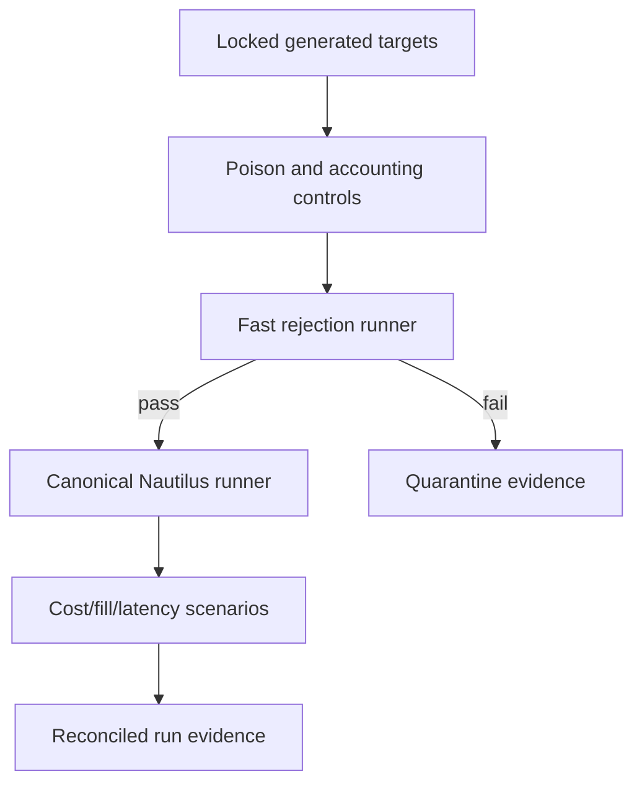

# Phase 7, Book 2 — Engines and Execution Realism

> **Purpose:** Run rejection-first and canonical event-driven tests with reconciled accounting and realistic execution assumptions  
> **Input:** Book 1 policies, datasets/splits, and unchanged Phase 6 generated targets  
> **Output:** Fast-rejection evidence, canonical Nautilus results, execution stress results, and reconciled ledgers  
> **Previous:** [Book 1 — Validation Contracts, Splits, and Leakage Lab](book-1-contracts-splits-leakage.md)  
> **Next:** [Book 3 — Robustness and Statistical Qualification](book-3-robustness-statistical-qualification.md)

---

## 1. Success Statement

Cheap tests rapidly reject broken strategies, while only the canonical generated Nautilus target produces qualification backtests. Every signal, order abstraction, fill, fee, position, cash movement, and exit reason reconciles under pinned base, adverse, and stress execution models.

---

## 2. Applicable Anchors

- **A1:** One Orchestration Spine
- **A2:** Evidence Before Narrative
- **A3:** Point-in-Time Data
- **A5:** Research Is Not Execution
- **A8:** Idempotent Event Handling
- **A10:** Observable and Reconstructable
- **A13:** Local-First Heavy Compute
- **F6:** One spec, no silent divergence
- **F7:** Robustness and reproducibility qualify

---

## 3. Engine Ladder



---

## 4. Work Packages

### 4.1 Fast rejection runner

The generated fast evaluator runs only on train/validation or designated walk-forward partitions. It checks:

- signal/trade presence;
- accounting sanity;
- minimum evidence;
- gross and net expectancy;
- catastrophic drawdown/loss;
- obvious cost failure;
- benchmark/null inferiority;
- rule activation coverage;
- data and runtime errors.

Passing means “worth canonical testing,” not qualified.

### 4.2 Canonical Nautilus runner

The runner pins:

- Phase 6 generated Nautilus artifact and Strategy Lock;
- Nautilus version/config;
- instrument/venue metadata;
- data catalog and manifest;
- clock/calendar/timezone;
- fill, cost, latency, account-test-unit, and margin models;
- starting state and seed;
- partition and warm-up;
- event ordering and same-bar policy.

### 4.3 Engine parity

On deterministic fixtures and selected real-data slices, compare:

- semantic signals and state;
- desired trade intents;
- entry/exit timestamps;
- side and abstract quantity;
- levels and trigger reasons;
- trade lifecycle.

Cost/fill differences are compared only after equal pre-execution intent is proven.

### 4.4 Canonical ledgers

Maintain:

```text
market event ledger
strategy semantic-event ledger
trade-intent ledger
simulated order/fill ledger
position ledger
cash ledger
fee/funding/borrow ledger
trade ledger
equity ledger
```

Ledger identities and sums must reconcile. Summary metrics derive from ledgers, not a separate shortcut.

### 4.5 Cost model

Asset/venue-specific components:

- commissions and fixed fees;
- quoted/effective spread;
- exchange, clearing, regulatory, and tax fees;
- funding/financing;
- borrow availability and cost;
- futures roll;
- options contract/multi-leg fees when applicable later;
- market impact/capacity proxy;
- currency conversion.

Every component declares time, size, side, asset, venue, and data basis.

### 4.6 Fill model

Declare:

- market order reference and spread crossing;
- limit eligibility and price improvement;
- stop triggering;
- gap-through behavior;
- OHLC path ambiguity;
- quote/trade requirement;
- queue/volume participation assumption;
- partial fills;
- tick/lot rounding;
- rejected/unfilled intent treatment.

Optimistic same-bar fills are diagnostic only and cannot qualify a strategy.

### 4.7 Latency model

Break latency into:

```text
market data publication
data transport
strategy computation
intent creation
simulated submission
venue acknowledgement
cancel/replace
```

Test zero-latency only as a theoretical upper bound. Base and adverse models must be plausible for the target operating mode.

### 4.8 Scenarios

At minimum:

```text
ideal diagnostic
base realistic
adverse
stress
```

Qualification thresholds name which scenarios are critical. Ideal results cannot compensate for base/adverse failure.

### 4.9 Accounting invariants

- every fill belongs to one simulated order and intent;
- every position change equals fills;
- cash change equals fills, fees, funding, and corporate actions;
- realized plus unrealized PnL reconciles equity;
- stop exits cannot create a favorable result if the executed stop price is adverse to entry, except a legitimately moved profitable stop documented in state;
- partial targets cannot reduce more than open quantity;
- no return exists without exposure or cash flow.

### 4.10 Suspicious-result detector

Flag:

- 100% win or zero drawdown beyond declared small-sample rules;
- profit factor with zero/nearly zero gross loss;
- stop exits systematically profitable without moved-stop evidence;
- huge return from tiny exposure;
- impossible price fills;
- all trades exiting for one unexpected reason;
- missing losses/fees;
- discontinuity between trade and equity ledgers;
- metrics undefined but rendered as zero or infinity.

Flags trigger investigation and usually a critical accounting failure.

### 4.11 Results

Each `BacktestRunManifest` records strategy/build, dataset/split, engine, models, parameters, seed, environment, ledger hashes, metrics definition versions, and terminal status.

---

## 5. Target Layout

```text
validation_forge/
  engines/
    fast_runner.py
    nautilus_runner.py
    parity.py
  execution_models/
    costs.py
    fills.py
    latency.py
    scenarios.py
  accounting/
    ledgers.py
    reconcile.py
    metrics.py
    suspicious.py
```

---

## 6. Deliverables

- Rejection-only fast runner.
- Canonical Nautilus runner.
- Intent/trade-level engine parity comparator.
- Cost, fill, latency, and scenario registries.
- Canonical event/fill/position/cash/trade/equity ledgers.
- Accounting reconciliation engine.
- Suspicious-result detector and poisoned accounting fixtures.
- Machine-readable run manifest and metric outputs.
- Base/adverse/stress result set.

---

## 7. Required Tests

### P7-FST-001 — Known Broken Strategy Rejection

The fast runner rejects a locked negative-expectancy or broken-accounting fixture.

### P7-FST-002 — Fast Pass Is Nonqualifying

A fast-runner pass cannot issue `qualified_for_paper`.

### P7-FST-003 — Rule Activation Coverage

Unexercised material entry/exit branches produce insufficient-evidence failure.

### P7-NAU-001 — Canonical Nautilus Reproduction

Pinned strategy, data, models, seed, and engine reproduce ledgers and results.

### P7-NAU-002 — Generated Target Integrity

Any change to the Phase 6 generated Nautilus artifact fails before execution.

### P7-NAU-003 — Warm-Up and Score Boundary

Nautilus state warms correctly while scored performance starts exactly at the partition boundary.

### P7-PAR-001 — Intent Parity

Fast and Nautilus targets agree on semantic signals and intended trade lifecycles on parity slices.

### P7-PAR-002 — Trade-Level Comparison

Equal aggregate performance with different trades fails parity.

### P7-PAR-003 — Engine Fixture Equality

Deterministic fill fixtures produce equal expected trade events where engine capability overlaps.

### P7-LED-001 — Fill-to-Position Reconciliation

All position changes equal signed fill quantities.

### P7-LED-002 — Cash Reconciliation

Cash equals initial cash plus all trade cash flows, fees, funding, and adjustments.

### P7-LED-003 — Equity Reconciliation

Equity equals cash plus marked positions within declared rounding tolerance.

### P7-LED-004 — Trade Ledger Reconciliation

Each trade opens/closes from fills and reconciles realized PnL.

### P7-ACC-001 — Stop-Winner Poison Detection

A fixture labeling every favorable exit as `sl` without moved-stop evidence fails accounting.

### P7-ACC-002 — Zero-Loss Profit Factor Guard

Zero gross loss produces an explicitly undefined/bounded metric, not a misleading enormous profit factor.

### P7-ACC-003 — Partial Reduction Conservation

Targets and exits cannot reduce more than open quantity.

### P7-ACC-004 — Exit Reason Fidelity

Exit reason, state transition, price condition, and PnL sign reconcile.

### P7-CST-001 — Fee and Slippage Sensitivity

Increasing fees/spread/slippage changes net results by the exact ledger amount and never improves them.

### P7-CST-002 — Fixed and Variable Fees

Per-order, per-unit, percentage, regulatory, and currency-conversion fees apply correctly.

### P7-CST-003 — Funding and Borrow

Holding-period funding/borrow costs accrue only when applicable and at correct times.

### P7-CST-004 — Cost Break-Even

The runner computes the spread/slippage/fee point where net expectancy reaches zero.

### P7-FIL-001 — Limit Fill Eligibility

A limit fills only under the pinned price/path/queue assumptions.

### P7-FIL-002 — Gap Through Stop

A stop gaps to the declared executable price rather than the ideal stop level.

### P7-FIL-003 — Partial Fill

Partial fills update quantity, fees, cash, targets, and remaining state correctly.

### P7-FIL-004 — Ambiguous Bar Policy

Same-bar entry/stop/target follows the Phase 6 and fill-model policy.

### P7-FIL-005 — Tick and Lot Rounding

Prices and test quantities respect instrument metadata.

### P7-LAT-001 — Latency Degradation

Added observation/submission latency delays eligibility and changes fills according to the tape.

### P7-LAT-002 — No Negative Latency

No action may precede the last required market event.

### P7-SCN-001 — Scenario Ordering

Under identical trades, adverse/stress execution cannot outperform ideal solely from lower modeled costs.

### P7-SCN-002 — Critical Scenario Gate

Failure of a declared critical base/adverse scenario cannot be averaged away.

### P7-SUS-001 — Impossible Fill Detection

Prices outside admissible market/path bounds fail.

### P7-SUS-002 — Suspicious Metric Flag

100% wins, zero drawdown, near-zero losses, or impossible PF invoke declared review controls.

### P7-MAN-001 — Complete Run Manifest

Every result records engine, strategy, data, partition, models, parameters, seed, environment, and ledger hashes.

---

## 8. Failure Modes

- Fast runner issues final qualification.
- Engines agree on PnL but not trades.
- Stops fill at ideal levels through gaps.
- Limit orders fill because the bar touched without path/queue rules.
- Fees are subtracted only from summary return.
- Moved profitable stops are indistinguishable from original protective stops.
- Profit factor divides by near-zero loss and looks extraordinary.
- Partial exits create quantity or cash.

---

## 9. Exit Gate

Book 2 is complete only when fast rejection behaves conservatively, canonical Nautilus runs reproduce, pre-execution intents agree, all ledgers reconcile, suspicious poisons fail, and base/adverse/stress cost-fill-latency scenarios are ready for robustness testing.

---

## 10. Handoff

Book 3 receives immutable run manifests and reconciled ledgers for approved partitions/scenarios, the untouched final holdout status, permitted parameter space, full trial ledger, and frozen statistical/robustness policy.
