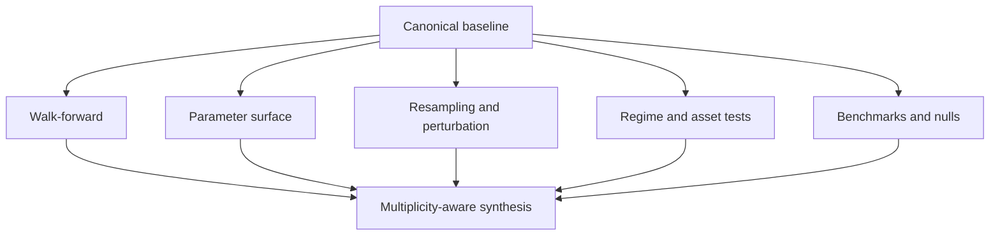

# Phase 7, Book 3 — Robustness and Statistical Qualification

> **Purpose:** Determine whether performance survives time, parameter, execution, path, regime, asset, and benchmark changes with honest trial accounting  
> **Input:** Book 2 reconciled canonical results, frozen policy, permitted parameter space, and trial ledger  
> **Output:** Walk-forward, sensitivity, resampling, regime/asset, benchmark/null, and multiple-testing evidence  
> **Previous:** [Book 2 — Engines and Execution Realism](book-2-engines-execution-realism.md)  
> **Next:** [Book 4 — Quant Review, Reports, and Quarantine](book-4-quant-review-reports-quarantine.md)

---

## 1. Success Statement

The strategy’s evidence is not dependent on one fitted parameter point, one asset, one regime, one lucky trade order, one seed, one execution assumption, or one unpenalized search. All selection occurs without inspecting the corresponding test window.

---

## 2. Applicable Anchors

- **A0:** Human Strategic Authority
- **A2:** Evidence Before Narrative
- **A3:** Point-in-Time Data
- **A9:** Separate Research From Approval
- **A10:** Observable and Reconstructable
- **A13:** Local-First Heavy Compute
- **F4:** Testable research only
- **F6:** One spec, no silent divergence
- **F7:** Robustness and reproducibility qualify

---

## 3. Robustness Topology



---

## 4. Work Packages

### 4.1 Walk-forward plan

```yaml
walk_forward_plan_id: content-id
mode: rolling|anchored
train_window: duration
selection_window: duration
test_window: duration
step: duration
purge_and_embargo_ref: policy-id
warmup: duration
minimum_folds: integer
selection_objective: metric-ref
selection_tie_break: deterministic-rule
parameter_space_ref: artifact-ref
cost_scenario_ref: policy-id
```

Parameter selection uses train/selection only. Each test fold is opened once after selection freezes.

### 4.2 Fold evidence

For each fold, record dates, data hashes, selected parameters, all tried parameters, selection objective, canonical test ledger, net metrics, benchmark/null results, and failure state.

Aggregate by concatenating out-of-sample ledgers where valid, not by averaging incompatible percentages blindly.

### 4.3 Parameter sensitivity surface

Evaluate the full declared local/global space according to policy. Report:

- baseline location;
- neighboring pass rate;
- gradients and curvature;
- connected acceptable region;
- parameter cliffs;
- boundary optimums;
- interactions;
- fold-to-fold selected-parameter drift;
- missing/error cells.

One sharp optimum is evidence of fragility.

### 4.4 Complexity and selection

Track degrees of freedom from:

- numeric/categorical parameters;
- filters and rule branches;
- asset/timeframe/session selection;
- feature and target choices;
- strategy variants;
- discretionary exclusions;
- repeated data views.

Complexity and trial count affect uncertainty and qualification thresholds.

### 4.5 Resampling

Choose methods consistent with dependence:

- block or stationary bootstrap of returns/trades;
- session/day/week blocks;
- clustered bootstrap by event;
- trade-order permutation only when order independence is justified;
- path simulation with declared assumptions;
- bootstrap confidence intervals for key metrics.

Naive IID shuffling cannot stand in for serially dependent strategies.

### 4.6 Monte Carlo

Register algorithm, seed, distribution, sample count, preserved dependencies, and outputs. Evaluate:

- terminal net result;
- maximum drawdown/depth/duration;
- loss streak;
- risk-of-ruin proxy under test units;
- tail loss;
- recovery time;
- threshold breach frequency.

Same seed must reproduce exactly. Different seeds should produce statistically compatible distributions, not identical paths.

### 4.7 Perturbation tests

- price noise respecting OHLC invariants;
- entry/exit delay;
- missing-bar/data dropout;
- spread/slippage/latency changes;
- threshold/parameter perturbation;
- start-date and endpoint shifts;
- bar-boundary alignment;
- small clock/session perturbations where economically meaningful.

Perturbations cannot introduce impossible market data or violate the spec.

### 4.8 Regime validation

Use point-in-time, ex ante regime labels when qualification depends on them. Test declared dimensions such as:

```text
volatility
trend/range
liquidity
spread/cost
macro/policy
session/day
crisis/normal
```

Do not create favorable regimes after seeing strategy results without registering a new hypothesis/trial.

### 4.9 Asset and venue validation

Test the strategy within its declared applicability. Cross-asset failure outside claimed scope is informative, not automatically fatal; failure inside scope is material. Scope contraction after results requires a new StrategySpec/version and multiplicity penalty.

### 4.10 Benchmarks

Depending on family:

- buy/hold or cash;
- asset/sector benchmark;
- simple family baseline;
- equal-risk or equal-exposure control;
- same-time/session unconditional strategy;
- alternative target/exit control.

Apply equal data, exposure, cost, and timing assumptions.

### 4.11 Null models

- randomized entries with preserved frequency/holding period;
- time-shifted signals;
- permuted labels under valid blocks;
- feature-destroyed control;
- sign-flipped or side-neutral control;
- strategy-family null.

Null generation cannot leak test outcomes into selection.

### 4.12 Statistical evidence

Possible methods, chosen and frozen per policy:

- bootstrap confidence intervals;
- probabilistic/deflated Sharpe;
- reality-check or superior-predictive-ability style corrections;
- false-discovery-rate/family-wise controls;
- Bayesian posterior intervals with declared priors;
- effect-size and practical-significance thresholds.

P-values or Sharpe values alone cannot qualify a strategy.

### 4.13 Multiple testing

The test family includes known prior variants, parameter combinations, filters, scopes, repeated folds, and abandoned trials. Report raw and adjusted evidence. An unknown/incomplete trial history may force `inconclusive`.

### 4.14 Final holdout

Only after the full protocol, baseline, parameters, scope, and thresholds freeze may the independent validator open the sealed holdout. No repair follows within the same hypothesis generation.

---

## 5. Target Layout

```text
validation_forge/
  walk_forward/
    plan.py
    folds.py
    select.py
    aggregate.py
  robustness/
    sensitivity.py
    bootstrap.py
    monte_carlo.py
    perturb.py
    regimes.py
    assets.py
  benchmarks/
    registry.py
    nulls.py
  statistics/
    uncertainty.py
    multiplicity.py
    effect_size.py
```

---

## 6. Deliverables

- Rolling/anchored walk-forward planner and runner.
- Fold-level selection and test evidence.
- Parameter-sensitivity surface and cliff detector.
- Dependence-aware bootstrap/Monte Carlo framework.
- Perturbation suite.
- Regime and asset/venue cross-validation.
- Benchmark and null-model registry.
- Statistical uncertainty/effect-size methods.
- Complete multiple-testing accounting.
- Authorized final-holdout runner.
- Machine-readable robustness synthesis.

---

## 7. Required Tests

### P7-WFA-001 — Walk-Forward Reproduction

Pinned data, folds, selection rule, engine, and policy reproduce selected parameters and OOS ledgers.

### P7-WFA-002 — Test-Window Isolation

Parameter selection cannot inspect its corresponding test fold.

### P7-WFA-003 — Fold Purge and Embargo

Every fold enforces Book 1 overlap controls.

### P7-WFA-004 — Warm-Up State

Each fold initializes required state without scoring warm-up performance.

### P7-WFA-005 — Deterministic Selection Tie-Break

Equal selection scores resolve by the prefrozen rule.

### P7-WFA-006 — OOS Aggregation

Concatenated out-of-sample ledgers reconcile without overlap or duplicate trades.

### P7-PRM-001 — Parameter Cliff Detection

An intentionally isolated optimum is flagged as a cliff.

### P7-PRM-002 — Neighborhood Surface

Every permitted neighbor is evaluated or carries an explicit failure reason.

### P7-PRM-003 — Boundary Optimum

An optimum on the declared search boundary is flagged for incomplete-space risk.

### P7-PRM-004 — Parameter Drift

Unstable fold-to-fold parameter selection triggers the declared stability gate.

### P7-PRM-005 — Frozen Parameter Protection

Phase 6 frozen parameters cannot enter the search.

### P7-CMP-001 — Complexity Accounting

Every tunable rule, filter, scope, and parameter contributes to the declared search complexity.

### P7-BST-001 — Block Bootstrap Dependence

Block/session structure remains intact under the configured resampling method.

### P7-BST-002 — IID Misuse Rejection

Naive IID trade shuffling fails when policy declares serial/event dependence.

### P7-RNG-001 — Same Seed Reproduction

Identical algorithm, inputs, and seed reproduce exact resampled outputs.

### P7-RNG-002 — Different Seed Distribution

Different registered seeds produce nonidentical paths with statistically compatible aggregate distributions.

### P7-RNG-003 — Seed Selection Ban

Seeds cannot be selected based on favorable results.

### P7-MON-001 — Monte Carlo Tail Metrics

Drawdown, streak, tail, recovery, and threshold-breach distributions reconcile to simulated paths.

### P7-MON-002 — Simulation Count Stability

Increasing simulations within policy produces estimates inside declared convergence tolerance.

### P7-NOI-001 — OHLC Noise Integrity

Perturbed bars preserve high/low/open/close and instrument constraints.

### P7-DLY-001 — Entry/Exit Delay

Declared one-to-N event delays produce registered degradation evidence.

### P7-DRO-001 — Data Dropout

Missing bars/data follow strategy policy and never forward-fill future information.

### P7-STA-001 — Start-Date Stability

Reasonable prefrozen start/end shifts do not expose a single lucky endpoint without detection.

### P7-REG-001 — Regime Coverage

Every required ex ante regime contains declared effective evidence or returns inconclusive.

### P7-REG-002 — Ex Ante Labels

Regime labels use only information available at the classification time.

### P7-REG-003 — Post-Hoc Regime Rejection

A favorable regime invented after outcome review becomes a new trial/spec scope.

### P7-AST-001 — In-Scope Asset Coverage

Every required in-scope asset/group is tested or explicitly blocks qualification.

### P7-AST-002 — Scope Contraction

Removing failed assets after results requires a new version and trial-family update.

### P7-BMK-001 — Benchmark Fairness

Strategy and benchmark use aligned periods, exposure, cash, costs, and data availability.

### P7-BMK-002 — Simple Family Baseline

The strategy is compared with the prefrozen simpler alternative.

### P7-NUL-001 — Random Entry Null

Random entries preserve declared frequency, side, exposure, and holding-duration constraints.

### P7-NUL-002 — Time-Shift Null

Shifted signals break causal alignment without leaking across partitions.

### P7-NUL-003 — Null Superiority

Qualification evidence accounts for the full null distribution, not one draw.

### P7-MCT-001 — Multiple-Testing Adjustment

Adjusted evidence reflects all registered trials in the hypothesis family.

### P7-MCT-002 — Missing Trial History

Incomplete material trial lineage cannot receive unqualified multiplicity adjustment.

### P7-MCT-003 — Negative Trial Preservation

Removing losing/null trials changes the ledger hash and invalidates the report.

### P7-EFF-001 — Practical Effect

A statistically nonzero but economically immaterial net effect fails the prefrozen practical threshold.

### P7-HLD-010 — Final Holdout Authorization

Only the independent validator opens the holdout after protocol freeze.

### P7-HLD-011 — No Same-Generation Repair

Holdout failure cannot be repaired and retested on the same sealed partition.

---

## 8. Failure Modes

- Best parameter chosen separately for every test window.
- One sharp profitable cell presented as a robust surface.
- IID shuffle destroys dependence and understates risk.
- Best seed is reported.
- Regimes are defined after seeing returns.
- Losing assets removed from claimed scope.
- Benchmark ignores strategy costs or exposure.
- Hundreds of experiments presented as one test.
- Holdout failure followed by immediate retuning on the same holdout.

---

## 9. Exit Gate

Book 3 is complete only when walk-forward evidence reproduces, parameter surfaces expose cliffs, dependence-aware resampling and perturbations finish, regimes/assets/benchmarks/nulls are fairly tested, trial multiplicity is applied, and the final holdout is either still sealed or used exactly once by authorization.

---

## 10. Handoff

Book 4 receives all immutable fold/run ledgers, robustness surfaces/distributions, raw and adjusted statistics, final-holdout state/result, trial ledger, policy thresholds, data/execution limitations, and every critical/advisory gate outcome.
