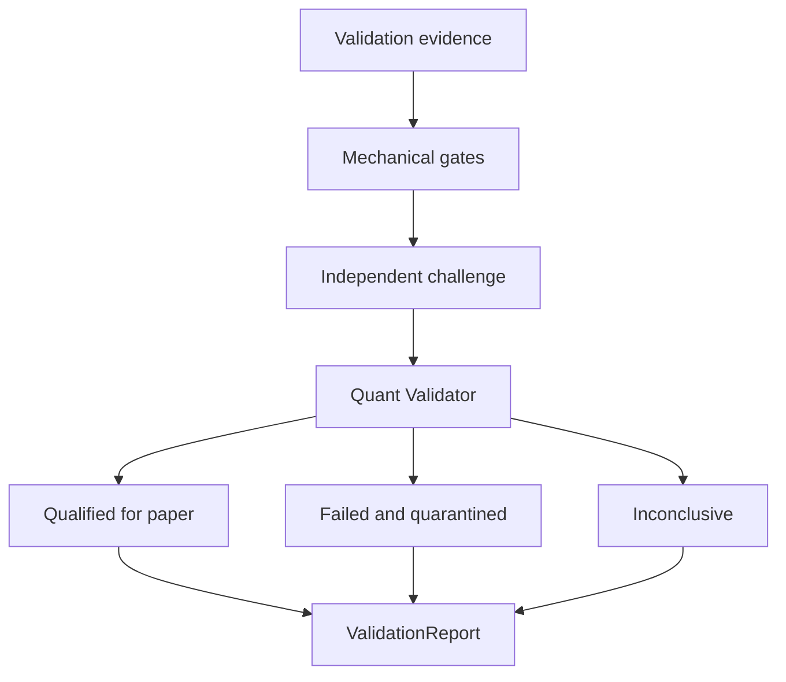

# Phase 7, Book 4 — Quant Review, Reports, and Quarantine

> **Purpose:** Convert mechanical validation evidence into an independent, scoped, machine-readable qualification decision  
> **Input:** Books 1–3 policies, ledgers, diagnostics, robustness evidence, trial history, and holdout result  
> **Output:** `ValidationReport`, Quant Validator decision, qualification scope, or `QuarantineRecord`  
> **Previous:** [Book 3 — Robustness and Statistical Qualification](book-3-robustness-statistical-qualification.md)  
> **Next:** [Book 5 — Validation Operations and Lock](book-5-validation-operations-lock.md)

---

## 1. Success Statement

An independent Quant Validator can reconstruct all evidence, challenge the methodology, and issue one scoped disposition without hiding critical failures behind an aggregate score or treating historical profitability as a promise.

---

## 2. Applicable Anchors

- **A0:** Human Strategic Authority
- **A2:** Evidence Before Narrative
- **A5:** Research Is Not Execution
- **A6:** Explicit Authority and Capability
- **A9:** Separate Research From Approval
- **A10:** Observable and Reconstructable
- **A11:** Repair Before Expansion
- **F4:** Testable research only
- **F7:** Robustness and reproducibility qualify

---

## 3. Decision Topology



---

## 4. Work Packages

### 4.1 Independent Quant Validator

The role is separate from strategy proposer, Phase 6 generator, optimizer, and primary validation-run operator.

Allowed:

- inspect all manifests, ledgers, code hashes, policies, and trial history;
- rerun registered checks;
- challenge assumptions and metric definitions;
- require correction of validation tooling;
- issue scoped disposition;
- quarantine evidence;
- create a Phase 8 eligibility proposal after all gates pass.

Forbidden:

- edit strategy targets or parameters;
- open holdout outside authorization;
- ignore critical failures;
- invent post-result exceptions;
- paper/live deploy;
- route orders or allocate capital.

### 4.2 Mechanical gate matrix

Gate families:

```text
package integrity
data and leakage
split and holdout
engine parity
accounting
execution realism
minimum evidence
net economic effect
walk-forward consistency
parameter stability
resampling and tail risk
regime and asset scope
benchmark and null superiority
multiple-testing adjustment
reproducibility
authority boundary
```

Each gate is `pass`, `fail`, `inconclusive`, or `not_applicable_with_reason`.

### 4.3 Critical failures

Always critical:

- look-ahead or survivorship leakage;
- holdout contamination;
- strategy/build mutation;
- trade/cash/position accounting mismatch;
- impossible/optimistic critical fills;
- missing material costs;
- engine intent/trade parity failure;
- undisclosed trial selection;
- failed reproducibility;
- paper/live/broker/capital authority;
- intentional poison case passing.

Policy may add strategy-specific critical failures before testing.

### 4.4 Quant challenge

The validator performs:

- metric recalculation from raw ledgers;
- random sample trade reconstruction;
- fold/split boundary review;
- trial-ledger and multiplicity reconciliation;
- parameter-surface and cliff review;
- cost/fill/latency plausibility review;
- benchmark/null fairness review;
- suspicious-result investigation;
- scope and limitation challenge;
- counterfactual “what assumption makes this fail?” review.

### 4.5 ValidationReport

```yaml
validation_report_id: content-id
strategy_build_package_ref: artifact-ref
strategy_lock_ref: artifact-ref
validation_policy_ref: policy-ref
dataset_and_split_refs: []
run_manifest_refs: []
trial_ledger_ref: artifact-ref
scope: {}
stage_results: []
gate_matrix: []
metrics:
  gross: {}
  net_base: {}
  net_adverse: {}
  stress: {}
  walk_forward: {}
  tail: {}
  uncertainty: {}
benchmarks_and_nulls: {}
parameter_stability: {}
regime_and_asset_results: {}
multiple_testing: {}
holdout: {}
limitations: []
invalidation_triggers: []
disposition: qualified_for_paper|failed_quarantined|inconclusive
validator_review_ref: artifact-ref
```

### 4.6 Reader-facing report

Lead with:

- disposition and exact scope;
- which claims survived;
- which did not;
- net results under base/adverse/stress assumptions;
- uncertainty and tail risk;
- evidence coverage;
- key fragilities;
- paper-observation requirements;
- reasons for failure/inconclusive.

Avoid promotional language and isolated headline win rate.

### 4.7 Qualification scope

Qualification binds:

- spec/build version;
- instruments/groups and venues;
- timeframe/data/event types;
- sessions/calendars;
- baseline parameters and permitted runtime configuration;
- cost/fill/latency envelopes;
- observation horizon;
- strategy-unit assumptions;
- invalidation triggers.

Any expansion requires new validation.

### 4.8 Quarantine

```yaml
quarantine_record_id: typed-id
strategy_build_package_ref: artifact-ref
validation_report_ref: artifact-ref
failure_codes: []
critical_evidence_refs: []
holdout_burn_state: {}
allowed_next_actions:
  - archive
  - return_to_phase6_new_version
  - gather_new_data
  - repair_validation_tooling
prohibited_actions:
  - retry_same_package_without_new_evidence
  - paper_deploy
  - live_deploy
  - hide_failed_trial
```

### 4.9 Retry rules

- tooling/data defect: correct infrastructure, invalidate affected runs, rerun same immutable strategy only if outcomes were not used to alter it;
- strategy failure: return structured evidence to Phase 6, create new spec/build/version/trial;
- holdout failure: holdout stays burned;
- insufficient evidence: gather new forward/independent data or narrow the original claim through a new version, not post-hoc editing;
- transient worker failure: resume identical run from verified state.

### 4.10 Phase 8 eligibility proposal

Only a qualified report may propose:

- paper/shadow observation scope;
- minimum duration/events/trades;
- expected signal/fill/reconciliation tolerances;
- paper risk-test units and noncapital limits;
- incident/kill-switch proposals;
- invalidation and stop-observation conditions.

Phase 8 must separately approve and deploy.

---

## 5. Target Layout

```text
validation_forge/
  review/
    quant_validator.py
    gate_matrix.py
    challenge.py
    decisions.py
  reports/
    schema.py
    metrics.py
    reader_report.py
  quarantine/
    records.py
    retry_policy.py
  handoff/
    paper_eligibility.py
```

---

## 6. Deliverables

- Independent Quant Validator role/capabilities.
- Mechanical gate matrix and critical-failure registry.
- Evidence challenge/recalculation workflow.
- Machine-readable `ValidationReport`.
- Reader-facing validation report.
- Exact qualification-scope contract.
- Quarantine records and retry policy.
- Structured Phase 6 failure return.
- Bounded `PaperEligibilityProposal`.
- Decision and invalidation event contracts.

---

## 7. Required Tests

### P7-REV-001 — Independent Quant Decision

The proposer, generator, optimizer, and primary runner cannot be the sole validator.

### P7-REV-002 — Metric Recalculation

Validator-calculated metrics from raw ledgers match reported values.

### P7-REV-003 — Trade Reconstruction

Sampled trades reconstruct from market event through signal, fill, fees, exit, and cash.

### P7-REV-004 — Split Challenge

The validator detects intentionally incorrect fold, purge, embargo, or holdout boundaries.

### P7-REV-005 — Trial-Ledger Challenge

Unregistered or removed trials block approval.

### P7-REV-006 — Assumption Challenge

Material cost/fill/latency assumptions have evidence or are tested conservatively.

### P7-GAT-001 — Conjunctive Qualification

Every required gate must pass; no weighted score compensates for failure.

### P7-GAT-002 — Critical Failure Dominance

A critical failure always prevents `qualified_for_paper`.

### P7-GAT-003 — Inconclusive Preservation

Missing evidence produces `inconclusive`, not pass or fail-by-convenience.

### P7-GAT-004 — Not-Applicable Reason

Every N/A gate contains a validated scope-based reason.

### P7-RPT-001 — Report Completeness

The machine report includes every required input, stage, metric, gate, limitation, decision, and review reference.

### P7-RPT-002 — Ledger Metric Fidelity

Report values reconcile to immutable run/ledger hashes.

### P7-RPT-003 — Gross/Net Separation

Gross, base net, adverse net, and stress results remain distinct.

### P7-RPT-004 — Uncertainty Disclosure

Headline metrics include declared intervals or evidence limitations.

### P7-RPT-005 — No Promotional Claim

The report does not transform historical qualification into guaranteed performance.

### P7-SCP-001 — Qualification Scope Lock

The decision binds exact build, assets, data, sessions, parameters, and execution envelopes.

### P7-SCP-002 — Scope Expansion Rejection

Phase 8 cannot expand beyond validated scope without new validation.

### P7-QRT-001 — Failed Strategy Quarantine

A critical strategy failure creates a quarantine record and blocks Phase 8 handoff.

### P7-QRT-002 — Same-Package Retry Block

Changing no evidence or code cannot repeatedly retry a failed strategy.

### P7-QRT-003 — Holdout Burn Preservation

Quarantine records retain consumed holdout state.

### P7-QRT-004 — Failure Evidence Return

Phase 6 receives typed failures tied to exact spec/IR/rules/runs.

### P7-RTR-001 — Tooling Repair Retry

A validation-tool defect may rerun the unchanged package only with invalidated prior run evidence and complete audit.

### P7-RTR-002 — Strategy Repair New Version

Any strategy-rule or parameter change requires a new Phase 6 Strategy Lock and trial.

### P7-RTR-003 — Transient Resume

A worker interruption resumes identical inputs without counting a new hypothesis trial.

### P7-ELG-001 — Valid Paper Eligibility

Only `qualified_for_paper` reports can create a bounded Phase 8 proposal.

### P7-ELG-002 — Observation Requirements

The proposal includes scope, duration, events/trades, tolerances, invalidation, and operational guard requests.

### P7-ELG-003 — No Deployment Authority

The proposal cannot start paper/shadow/live processes or route orders.

### P7-RAU-001 — No Paper or Live Action

Paper/live deployment, broker connection, account action, order routing, and capital allocation are denied and audited.

### P7-RAU-002 — No Strategy Mutation

The validator cannot edit generated targets, spec, baseline, or parameter space.

### P7-RAU-003 — No Holdout Exception

Human or agent override cannot unburn or silently reopen a holdout.

---

## 8. Failure Modes

- Builder approves its own strategy.
- Strong aggregate score hides leakage.
- Inconclusive evidence is called “probably good.”
- Qualification scope is broader than tested scope.
- Historical win rate is marketed as future certainty.
- Failed strategy loops until a favorable seed/period appears.
- Holdout failure disappears from the next report.
- Phase 8 deployment begins directly from the validator.

---

## 9. Exit Gate

Book 4 is complete only when the independent validator reconstructs the evidence, every required gate resolves, the report is complete and scoped, failures quarantine with honest retry rules, and only qualified strategies receive a nondeploying Phase 8 eligibility proposal.

---

## 10. Handoff

Book 5 receives the immutable ValidationReport, decision/review evidence, quarantine or eligibility artifact, all manifests/ledgers, reproducibility requirements, and the exact material dependencies that must invalidate the decision if changed.
