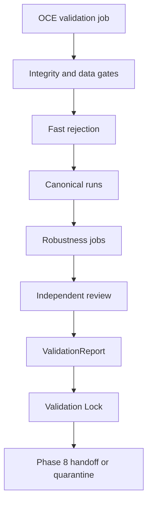

# Phase 7, Book 5 — Validation Operations and Lock

> **Purpose:** Operate validation reproducibly, recover safely, lock evidence, and hand qualified strategies to Simulation Forge  
> **Input:** Books 1–4 complete evidence, independent decision, and immutable report  
> **Output:** `ValidationLockManifest`, reproducible qualification package, and Phase 8 acceptance  
> **Previous:** [Book 4 — Quant Review, Reports, and Quarantine](book-4-quant-review-reports-quarantine.md)  
> **Next:** Phase 8 — Simulation Forge

---

## 1. Success Statement

OCE can reproduce the entire qualification decision from a clean environment, recover interrupted deterministic/stochastic runs without changing their meaning, preserve sealed/burned holdout state, and deliver a bounded paper-eligibility package with no deployment or execution authority.

---

## 2. Applicable Anchors

- **A0:** Human Strategic Authority
- **A1:** One Orchestration Spine
- **A3:** Point-in-Time Data
- **A5:** Research Is Not Execution
- **A6:** Explicit Authority and Capability
- **A8:** Idempotent Event Handling
- **A9:** Separate Research From Approval
- **A10:** Observable and Reconstructable
- **A11:** Repair Before Expansion
- **A13:** Local-First Heavy Compute
- **F7:** Robustness and reproducibility qualify

---

## 3. Operational Topology



---

## 4. Work Packages

### 4.1 Validation job

```yaml
validation_job_id: typed-id
validation_run_request_ref: artifact-ref
strategy_build_package_ref: artifact-ref
validation_policy_ref: policy-ref
dataset_snapshot_ref: artifact-ref
split_plan_ref: artifact-ref
trial_family_ref: typed-id
execution_model_refs: []
resource_budget_ref: policy-id
review_policy_ref: policy-id
idempotency_key: string
correlation_id: typed-id
```

### 4.2 Job graph

```text
admitted
controls_verified
fast_running
canonical_running
robustness_running
holdout_pending
holdout_running
quant_review
qualified
quarantined
inconclusive
locked
handed_off
```

Stages are dependency-aware. Independent robustness cells may parallelize; ordered writes, trial registration, holdout access, and final decision remain serialized.

### 4.3 Deterministic and stochastic identity

Deterministic run identity includes all inputs, code, environment, models, and partition. Stochastic run identity additionally includes PRNG algorithm/version, seed, distribution, sampling method, and simulation count.

### 4.4 Recovery

- deterministic completed artifacts reuse only under exact identity;
- stochastic batches resume with nonoverlapping registered sample indices/streams;
- holdout access does not repeat after uncertain finalization without explicit investigation;
- a failed critical gate prevents scheduling downstream expensive stages;
- resource failure produces resumable infrastructure state, not strategy failure.

### 4.5 Resource and load policy

Local-first heavy compute uses bounded OCE workers. Record wall time, CPU/GPU, memory, storage, cache, task count, retries, queue depth, and cost.

Budget pressure may defer or stop the job. It cannot reduce simulation count, parameter cells, assets, folds, or scenarios silently.

### 4.6 Observability

Expose:

- current stage and progress denominator;
- package/policy/data/split/trial IDs;
- holdout sealed/open/burned state without outcomes before authorization;
- run and batch identities;
- resource/budget use;
- gate failures and typed errors;
- artifact/ledger/report lineage;
- reviewer state and terminal disposition.

### 4.7 Reproducibility exercise

From a clean checkout and isolated environment:

1. verify Phase 6 package and Strategy Lock;
2. restore data/manifests/splits/policies;
3. rerun poison controls;
4. rerun deterministic baseline and selected stochastic batches;
5. reproduce fold selections and parameter surfaces;
6. reconcile ledgers and metrics;
7. verify final report and decision inputs;
8. confirm holdout audit state.

The final holdout need not be unnecessarily rerun if exact stored evidence and policy forbid reuse; verification may reproduce the decision from immutable holdout ledgers.

### 4.8 Backup and restore

Back up all package refs, policies, data/splits, trial ledger, holdout seal/audit, execution models, run manifests, raw ledgers, stochastic streams, surfaces, reports, review, quarantine/eligibility, and lock evidence.

### 4.9 Invalidation

Material changes to strategy build, data corrections, universe, splits, policy thresholds, engine, costs, fills, latency, metrics, trial history, statistical methods, benchmark/nulls, or validator evidence invalidate affected qualification.

### 4.10 Validation Lock Manifest

```yaml
phase: 7
lock_id: immutable-id
commit_sha: git-sha
created_at: timestamp
strategy_build_package_ref: artifact-ref
strategy_lock_ref: artifact-ref
validation_policy_hash: content-hash
dataset_and_split_hashes: {}
holdout_seal_and_audit_ref: artifact-ref
trial_ledger_hash: content-hash
engine_and_environment_versions: {}
execution_model_hashes: {}
run_and_ledger_hashes: {}
walk_forward_and_robustness_refs: []
benchmark_null_and_multiplicity_refs: []
validation_report_ref: artifact-ref
quant_validator_review_ref: artifact-ref
reproducibility_report_ref: artifact-ref
backup_restore_report_ref: artifact-ref
disposition: qualified_for_paper|failed_quarantined|inconclusive
scope: {}
known_limitations: []
approved_phase8_contract_version: semver
prohibited_authorities: []
approvals: []
```

### 4.11 Phase 8 package

```yaml
paper_eligibility_package_id: content-id
strategy_build_package_ref: artifact-ref
validation_report_ref: artifact-ref
validation_lock_ref: artifact-ref
validated_scope: {}
baseline_parameters_ref: artifact-ref
expected_semantic_trace_refs: []
expected_execution_envelopes: {}
paper_observation_requirements: {}
reconciliation_tolerances: {}
incident_and_invalidation_triggers: []
status: eligible_for_phase8_review
```

This package creates no process, account, order, position, or capital commitment.

### 4.12 Phase 8 handoff

Simulation Forge separately configures paper/shadow deployment, market-data/broker-session monitoring, paper fills, reconciliation, heartbeats, incidents, and kill switches.

Any Phase 8 need to alter strategy semantics or validated scope returns to Phase 6/7.

---

## 5. Target Layout

```text
validation_forge/
  operations/
    jobs.py
    graph.py
    stochastic_runs.py
    resources.py
    recovery.py
    observability.py
    reproducibility.py
  lock/
    manifest.py
    verify.py
    invalidation.py
  handoff/
    paper_eligibility_package.py
    phase8_adapter.py
```

---

## 6. Deliverables

- OCE-native validation job graph.
- Deterministic/stochastic run identity.
- Parallel robustness execution with serialized governance.
- Safe retry/resume and holdout handling.
- Resource/load/budget evidence.
- Complete observability.
- Clean-environment reproducibility exercise.
- Backup/restore proof.
- Validation invalidation graph.
- `ValidationLockManifest` and verifier.
- `PaperEligibilityPackage` and Phase 8 adapter.

---

## 7. Required Tests

### P7-JOB-001 — Idempotent Validation Job

The same request and idempotency key create one logical validation job.

### P7-JOB-002 — Gate-Ordered Scheduling

Downstream expensive stages cannot run before prerequisite gates pass.

### P7-JOB-003 — Trial Registration Before Run

Every deterministic or stochastic run registers before accessing results.

### P7-RCV-001 — Deterministic Resume

Interrupted deterministic runs reuse only exact verified artifacts.

### P7-RCV-002 — Stochastic Batch Resume

Resumed simulations use nonoverlapping registered streams and reproduce the intended total sample.

### P7-RCV-003 — Infrastructure Failure Classification

Worker/resource failure does not become a strategy failure or favorable retry.

### P7-RCV-004 — Critical Failure Stop

A critical gate cancels unnecessary downstream jobs.

### P7-HLD-020 — Holdout Uncertain-Outcome Guard

An uncertain holdout execution cannot auto-retry or reopen until its original outcome is resolved.

### P7-LOD-001 — Validation Load

The largest initial folds/assets/parameter grid/scenarios complete within declared resource budgets or stop visibly.

### P7-LOD-002 — No Silent Work Reduction

Budget pressure cannot silently remove parameter cells, folds, assets, simulations, or execution scenarios.

### P7-SOK-001 — Repeated Validation Soak

Repeated jobs remain within queue, storage, memory, error, and orphan-task thresholds.

### P7-OBS-001 — Complete Job Trace

Every stage, run, model, artifact, gate, review, and decision is reconstructable.

### P7-OBS-002 — Holdout Privacy

Observability reveals holdout state without leaking outcomes before authorization.

### P7-REP-001 — Clean Deterministic Replay

A clean environment reproduces poison, baseline, fold, ledger, metric, and report evidence.

### P7-REP-002 — Stochastic Replay

Pinned stochastic batches reproduce exactly by algorithm/seed/stream.

### P7-REP-003 — Decision Reconstruction

The final disposition recomputes from immutable gates and report inputs.

### P7-BKP-001 — Backup Restore

An isolated restore verifies all package, policy, data, trial, ledger, report, review, and lock hashes.

### P7-INV-001 — Strategy Change Invalidation

Any material Strategy Build or Lock change invalidates qualification.

### P7-INV-002 — Data and Model Change Invalidation

Material data correction or execution/statistical model change invalidates affected evidence.

### P7-INV-003 — Trial History Change Invalidation

Adding/removing a material prior trial invalidates multiplicity and the report.

### P7-E2E-001 — Golden Qualification Run

A locked positive strategy completes every ladder stage and creates a bounded paper-eligibility package.

### P7-E2E-002 — Golden Failure Run

A poisoned/broken strategy fails the correct gate, quarantines, and cannot reach Phase 8.

### P7-E2E-003 — Inconclusive Run

Insufficient evidence produces an auditable inconclusive lock without paper eligibility.

### P7-AUT-001 — No Simulation or Execution Authority

Paper/shadow/live deployment, broker/account access, order routing, positions, and capital actions are denied and audited.

### P7-AUT-002 — No Strategy Repair

Validation workers cannot edit the StrategySpec, IR, generated target, or baseline.

### P7-AUT-003 — No Qualification Override

A human or agent cannot override a critical failure under the same policy/package.

### P7-LCK-001 — Manifest Completeness

The Validation Lock contains every package, policy, data, split, holdout, trial, engine, model, run, robustness, report, review, scope, limitation, and authority field.

### P7-LCK-002 — Independent Lock Verification

A separate verifier reconstructs identities, gates, disposition, approvals, and prohibited authorities.

### P7-LCK-003 — Material Change Invalidation

Every declared material dependency change invalidates the lock deterministically.

### P7-HOF-001 — Phase 8 Acceptance

Simulation Forge accepts only a complete qualified paper-eligibility package.

### P7-HOF-002 — Failed or Inconclusive Rejection

Quarantined and inconclusive strategies cannot enter Phase 8 deployment review.

### P7-HOF-003 — Scope Enforcement

Phase 8 rejects instruments, sessions, parameters, or execution envelopes outside validated scope.

### P7-HOF-004 — No Automatic Deployment

Successful handoff does not start paper, shadow, or live operation.

---

## 8. Failure Modes

- Expensive Monte Carlo starts before leakage checks.
- Retried seeds create favorable selection.
- Budget exhaustion silently shortens tests.
- Holdout reruns after ambiguous failure.
- New trial history does not update multiplicity.
- Validation lock cannot be reproduced.
- Qualified handoff automatically starts paper trading.
- Phase 8 expands to unvalidated instruments or parameters.

---

## 9. Exit Gate

Book 5 is complete only when validation jobs are ordered, idempotent, recoverable, observable, resource-honest, and reproducible; holdout state is protected; the Validation Lock verifies independently; failures/inconclusive outcomes stay blocked; and Phase 8 accepts only a scoped, nondeploying eligibility package.

---

## 10. Handoff to Phase 8

Phase 7 ends with a scoped evidence-based qualification or an honest failure. Phase 8 begins by proving that the complete operating system can reproduce expected behavior in paper/shadow conditions without capital exposure.

```text
Validation proves the historical claim survived the qualification ladder.
Simulation proves the running system behaves correctly in live conditions.
Neither result alone authorizes live capital.
```
