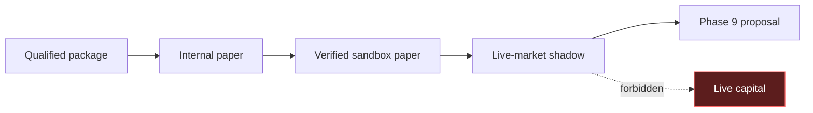
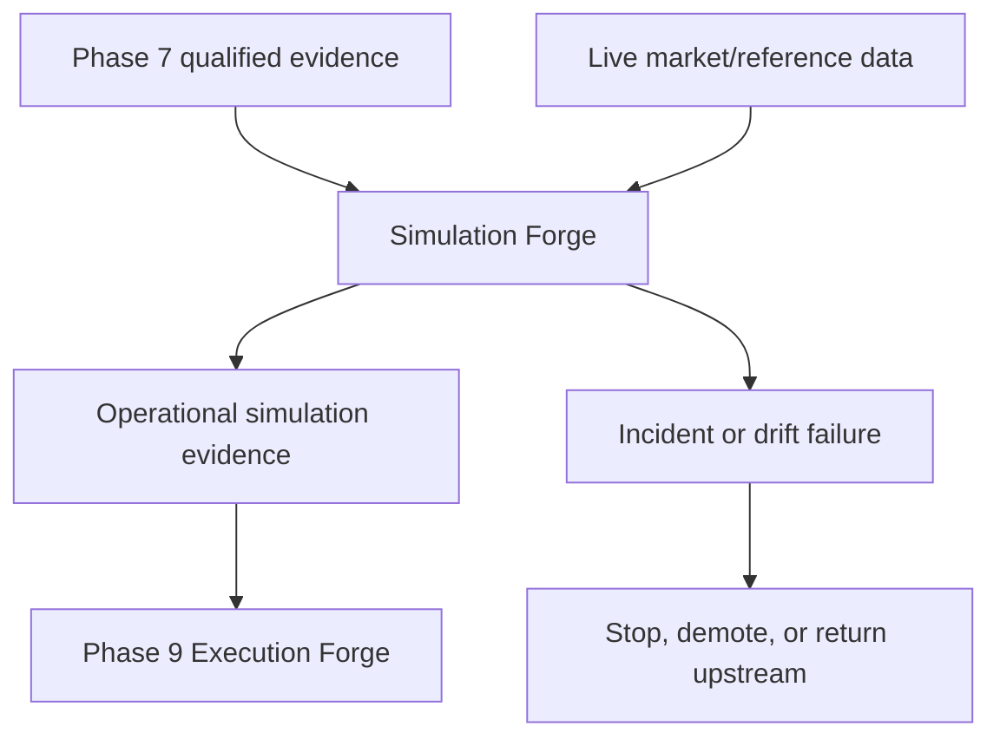
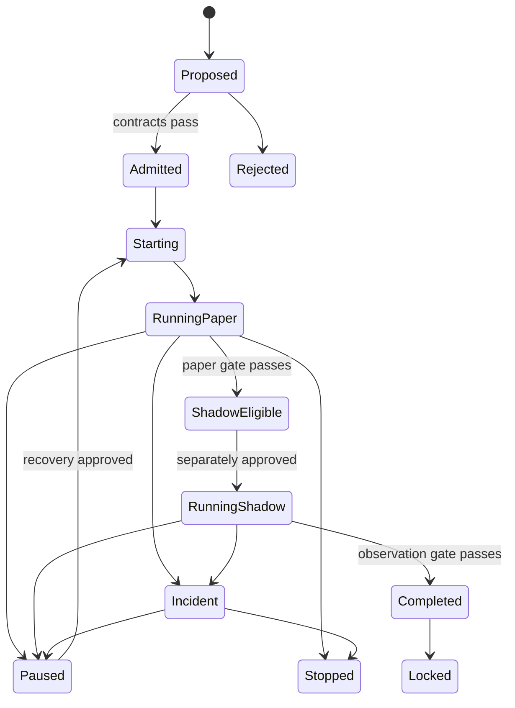

# Phase 8 — Simulation Forge

> **Status:** Build-ready planning package  
> **Prerequisite:** Phase 7 Validation Lock with `qualified_for_paper` disposition and bounded `PaperEligibilityPackage`  
> **Produces:** Reconciled paper/shadow evidence, operational reliability report, Simulation Lock, and nonauthorizing Phase 9 proposal  
> **Anchor:** **F8 — Backtest qualification proves the idea; simulation qualification proves the system.**

---

## 1. Idea

Test the complete running strategy system against live market conditions without capital exposure.

```text
PaperEligibilityPackage
→ governed simulation deployment
→ live market/session health
→ internal or sandbox paper operation
→ nonrouting shadow observation
→ expected-versus-observed fill comparison
→ position/cash/state reconciliation
→ incidents and kill-switch drills
→ operational reliability qualification
→ Simulation Lock
→ Phase 9 execution-integration proposal
```

Phase 8 has no live-capital mode. It cannot use a live account, route a live order, allocate capital, or create the canonical Phase 9 `OrderIntent`.

---

## 2. Reality at Entry

The workspace already contains:

- generated/experimental Nautilus strategy and backtest components;
- an OANDA adapter with practice and live URL options;
- configuration selected through environment variables;
- a `PAPER_TRADING` boolean;
- OCE task orchestration, retries, timeouts, and traces;
- general agent heartbeats;
- many standalone strategy runners.

### Entry code anchors

| Current seam | Evidence | Phase 8 treatment |
|---|---|---|
| OANDA data seam | `projects/trading/nautilus/oanda_adapter.py` selects practice or live URLs from an environment value | Quarantine behind endpoint/account capability verification; never infer safety from the string |
| Trading configuration | `projects/trading/nautilus/config.py` contains `PAPER_TRADING`, host-specific paths, and fixed-offset session values | Replace with locked deployment bindings and IANA/calendar contracts; the boolean is not a safety boundary |
| OCE task runner | `oce/backend/execution_engine.py` runs skill/tool/pipeline/agent software tasks | Reuse only as the orchestration substrate; never interpret an `ExecutionTask` as a market intent |
| Strategy clock debt | Existing strategy helpers perform fixed UTC-to-EST conversion | Treat as an upstream semantic/invalidation concern; final simulation uses the locked DST-aware contract |
| Legacy secret debt | Repository inspection found apparent plaintext credential material in legacy infrastructure artifacts | Treat exposed values as compromised; revoke/rotate out of band and require redacted scan evidence before admission |

These are entry seams, not canonical Phase 8 components. An agent extends them only through the book contracts and may not promote their current behavior by renaming it.

It does **not** yet contain a canonical:

- paper deployment manager;
- simulation-mode capability boundary;
- live feed/session health contract;
- durable strategy runtime checkpoint;
- paper/shadow intent lifecycle;
- expected-versus-paper fill comparator;
- position/cash/order reconciliation system;
- strategy trading heartbeat;
- trading incident and kill-switch workflow;
- paper-to-shadow promotion gate;
- operational reliability report;
- Simulation Lock.

The OCE software-task execution engine is reused only for orchestration. It is not a broker/order execution engine.

---

## 3. Canonical Decisions

All `A*` anchor identifiers in this package use the exact names and meanings defined in [`GLX_FORGE_MASTER_BLUEPRINT.md`](../../GLX_FORGE_MASTER_BLUEPRINT.md). Agents may add phase invariants, but may not rename or reinterpret a numbered anchor.

| Decision | Lock |
|---|---|
| Orchestration | OCE remains the sole simulation control spine |
| Strategy | Immutable Phase 6 build within Phase 7 validated scope |
| Admission | Only `qualified_for_paper` Validation Locks |
| Modes | `internal_paper`, `sandbox_paper`, `live_market_shadow` |
| Forbidden mode | No `live`, `production`, or real-capital mode |
| Paper accounts | Verified sandbox/practice capability only |
| Shadow | Generates nonrouting `ShadowIntent`; never transmits |
| Phase 9 intent | Canonical `OrderIntent` remains unavailable |
| State | Durable event-sourced checkpoints and reconciliation |
| Data | Live feed must pass freshness, sequence, and session gates |
| Fills | Paper fills compared with canonical expected fills |
| Promotion | Paper → shadow requires explicit independent gate |
| Reliability | Critical incidents cannot be averaged away |
| Handoff | `LiveDeploymentProposal` is proposal-only for Phase 9 engineering/governance |

---

## 4. Simulation Modes



### `internal_paper`

Live or recorded admissible market data drives the generated strategy and the internal paper fill/accounting engine.

### `sandbox_paper`

The system may transmit only to a verified broker/exchange practice, sandbox, demo, or testnet account with a deny-by-default capability certificate.

### `live_market_shadow`

Live data produces `ShadowIntent` and expected-fill projections. No intent is sent to any broker, exchange, adapter, account, or venue.

No mode transition is automatic.

---

## 5. Admission and Completion

A deployment is admissible only when:

```text
validation_lock_valid
AND disposition_qualified_for_paper
AND scope_exact
AND mode_allowed
AND sandbox_certificate_valid_if_needed
AND credential_readiness_verified
AND live_capabilities_absent
AND monitoring_and_kill_switch_ready
AND reconciliation_baseline_created
```

A deployment completes only when:

```text
observation_duration_met
AND minimum_events_met
AND minimum_trade_or_intent_evidence_met
AND positions_orders_cash_reconciled
AND drift_within_thresholds
AND heartbeat_and_recovery_slos_met
AND kill_switch_drills_pass
AND no_unresolved_critical_incident
AND independent_review_passes
```

---

## 6. Book Sequence

| Book | Document | Builds | Exit |
|---:|---|---|---|
| 1 | [Simulation Contracts and Deployment Manager](book-1-contracts-deployment-manager.md) | Admission, modes, capability certificates, deployment lifecycle, configuration | Only validated, zero-capital deployments can start |
| 2 | [Runtime Health and Durable State](book-2-runtime-health-durable-state.md) | Market/session monitors, heartbeat, clock, checkpoints, disconnect/reconnect | Runtime detects unhealthy inputs and resumes without state loss |
| 3 | [Paper, Shadow, and Reconciliation](book-3-paper-shadow-reconciliation.md) | Simulation intents, paper lifecycle, expected fills, duplicate suppression, reconciliation, drift | Orders/fills/positions/cash/intents reconcile or fail closed |
| 4 | [Incidents, Kill Switches, and Promotion](book-4-incidents-kill-switches-promotion.md) | Incident workflow, kill switches, reliability score, paper-to-shadow report, proposal | Operational behavior passes drills and independent promotion gate |
| 5 | [Simulation Operations and Lock](book-5-simulation-operations-lock.md) | Scheduling, soak, recovery, backup, Simulation Lock, Phase 9 handoff | Long-running simulation reproduces and the handoff boundary verifies |

Books execute in order. Runtime evidence may demote or stop a deployment; it cannot widen validated scope or modify strategy semantics.

---

## 7. Architecture

```mermaid
flowchart LR
    V["PaperEligibilityPackage"] --> M["Deployment manager"]
    M --> H["Feed/session health"]
    H --> R["Generated strategy runtime"]
    R --> I["Simulation or shadow intent"]
    I --> P["Paper engine or nonrouting sink"]
    P --> C["Expected/observed comparator"]
    C --> X["Reconciliation"]
    X --> O["Reliability and incidents"]
    O --> L["Simulation Lock"]
```





---

## 8. Core Artifacts

| Artifact | Purpose |
|---|---|
| `SimulationAdmission` | Verified Phase 7 scope and prerequisites |
| `SimulationPolicy` | Mode, observation, health, reconciliation, incident, and promotion rules |
| `SandboxCapabilityCertificate` | Proof the selected deployment binding is sandbox-only |
| `CredentialReadinessAttestation` | Redacted scan, rotation, scope, and secret-reference proof |
| `SimulationDeployment` | Immutable runtime identity/configuration |
| `RuntimeCheckpoint` | Durable strategy, intent, order, position, cash, and sequence state |
| `MarketDataHealth` | Freshness, gaps, ordering, duplicates, and clock quality |
| `SessionHealth` | Venue calendar/session, connection, auth, and permission state |
| `StrategyHeartbeat` | Liveness plus progress and last safe state |
| `SimulationIntent` | Internal/sandbox-paper desired action |
| `ShadowIntent` | Nonrouting live-market observation |
| `ExpectedFill` | Canonical fill projection under validated assumptions |
| `PaperExecutionEvent` | Accepted/rejected/cancelled/partial/filled sandbox event |
| `ReconciliationSnapshot` | Internal versus sandbox/market paper state |
| `DriftRecord` | Signal, timing, price, fill, PnL, and state variance |
| `IncidentRecord` | Severity, scope, evidence, response, and resolution |
| `KillSwitchState` | Strategy, deployment, provider, or global stop state |
| `OperationalReliabilityReport` | SLOs, incidents, recovery, drift, and coverage |
| `PaperToShadowPromotionReport` | Independent promotion evidence |
| `LiveDeploymentProposal` | Nonauthorizing Phase 9 engineering/governance request |
| `SimulationLockManifest` | Phase completion proof |

---

## 9. Deployment Lifecycle



---

## 10. Reliability Dimensions

Track separately:

```text
market-data availability and freshness
session/broker-sandbox connectivity
strategy heartbeat and event lag
intent generation fidelity
duplicate suppression
paper order/fill lifecycle correctness
position/cash reconciliation
expected-versus-observed fill drift
restart/recovery correctness
incident rate and resolution time
kill-switch effectiveness
observation coverage
```

An overall score may summarize only after every component and critical gate remains visible.

---

## 11. Target Layout

```text
simulation_forge/
  contracts/
  deployment/
  capabilities/
  market_data/
  sessions/
  runtime/
  intents/
  paper/
  shadow/
  fills/
  reconciliation/
  drift/
  incidents/
  kill_switch/
  reliability/
  promotion/
  operations/
  lock/
  handoff/
```

---

## 12. Critical Test Matrix

| Test | Proof | Book |
|---|---|---:|
| P8-ADM-001 | Qualified scoped package admits | 1 |
| P8-CAP-001 | A live endpoint fails capability verification | 1 |
| P8-MOD-001 | Mode transitions require approval | 1 |
| P8-SEC-001 | Exposed credentials block admission until rotated | 1 |
| P8-DAT-001 | Stale market data blocks intent generation | 2 |
| P8-CON-001 | A disconnect enters safe pause with uncertainty preserved | 2 |
| P8-CON-003 | Recoverable missed events replay once before resume | 2 |
| P8-HBT-001 | Missing heartbeat triggers pause/incident behavior | 2 |
| P8-RST-001 | Restart with open paper positions reconciles | 2 |
| P8-IDM-001 | Duplicate simulation intent/order is suppressed | 3 |
| P8-FIL-001 | Partial fills update state correctly | 3 |
| P8-REJ-001 | A rejected paper order changes no position/fill state | 3 |
| P8-REC-001 | Broker-paper versus internal state reconciles | 3 |
| P8-DRF-001 | Paper/shadow drift thresholds enforce action | 3 |
| P8-KIL-001 | Kill switch stops new intents and reaches safe state | 4 |
| P8-INC-001 | Typed incidents preserve scope, evidence, and timeline | 4 |
| P8-PRM-004 | Open critical incidents block promotion | 4 |
| P8-E2E-001 | Qualified-to-shadow golden run reproduces | 5 |
| P8-HOF-001 | Phase 9 handoff contains bounded requirements only | 5 |
| P8-AUT-001 | Live-capital actions remain unavailable at admission/runtime | 1 |
| P8-AUT-100 | Simulation Lock and handoff grant no live authority | 5 |

---

## 13. Phase Invariants

1. OCE is the sole simulation control spine.
2. Only Phase 7 `qualified_for_paper` packages may admit.
3. Simulation scope cannot exceed validated scope.
4. Strategy build and baseline parameters remain immutable.
5. Modes are explicit and separately approved.
6. Live-capital mode does not exist.
7. Sandbox/practice capability is positively verified, not inferred from a name.
8. Any uncertain account/environment fails closed.
9. Any repository-exposed credential is treated as compromised and never reused.
10. Shadow intents never leave the nonrouting sink.
11. Phase 9 canonical `OrderIntent` is unavailable.
12. Every market event has sequence, source, event time, and receive time.
13. Stale, gapped, duplicated, reordered, or clock-skewed data is visible.
14. Unhealthy required data blocks new intents.
15. Market/session calendars are pinned and DST-aware.
16. Strategy heartbeats include progress, not only process liveness.
17. Runtime state is durably checkpointed.
18. Restart begins with reconciliation before new intents.
19. Every intent has a deterministic idempotency key.
20. Duplicate paper submission is forbidden.
21. Partial, rejected, cancelled, expired, and filled states are distinct.
22. Internal expected fill and observed paper fill are both preserved.
23. Positions, cash, fees, orders, fills, and strategy state reconcile.
24. Drift is measured against Phase 7 envelopes.
25. Threshold breaches trigger declared pause/stop/incident behavior.
26. Kill switches are independent of strategy code.
27. Critical incidents cannot be hidden by reliability averages.
28. Recovery requires safe-state proof and approval.
29. Paper-to-shadow promotion is independent and nonautomatic.
30. Live deployment proposals are proposals only.
31. Phase 8 cannot route live orders or allocate real capital.
32. Material changes invalidate observation evidence.
33. A passing Simulation Lock is required for Phase 9.

---

## 14. Agent Extension Contract

An agent extending Phase 8 must:

1. read this blueprint and active book;
2. pin Strategy and Validation Locks;
3. declare mode, prove zero-capital capability, and clear credential readiness;
4. preserve validated scope and parameters;
5. use OCE for all lifecycle actions;
6. implement durable event/state lineage;
7. test disconnect, duplicate, partial, rejection, restart, stale-data, and kill-switch paths;
8. reconcile before promotion or recovery;
9. report drift and incidents honestly;
10. stop at Phase 9 proposal.

The agent must pause when sandbox status is uncertain, live permissions are present, exposed credentials remain unrotated, state cannot reconcile, data is stale, a critical incident is unresolved, or an upstream lock changes.

---

## 15. Completion Definition

Phase 8 is complete only when:

- only validated scoped packages deploy;
- mode and capability isolation proves zero live-capital access;
- repository-exposed credentials are revoked/rotated and secret-readiness evidence passes;
- market/session/heartbeat health gates work;
- disconnect/reconnect and stale-data behavior fail safely;
- partial, rejected, cancelled, duplicate, and restart paths pass;
- expected versus observed fills and paper/shadow behavior reconcile;
- positions, cash, orders, fills, fees, and runtime state reconcile;
- drift thresholds enforce declared actions;
- incident and kill-switch drills pass;
- required paper and shadow observation windows complete;
- no unresolved critical incident remains;
- operational reliability and promotion receive independent review;
- backup/restore/replay and long soak pass;
- the Simulation Lock verifies;
- the Phase 9 handoff passes its nonauthority and completeness checks;
- no live account, capital, live order route, or canonical `OrderIntent` appears.

---

## 16. Handoff to Phase 9

Phase 9 receives:

- immutable Strategy, Validation, and Simulation Locks;
- exact validated and simulated scope;
- reconciled simulation deployment and runtime manifests;
- paper/shadow intent and lifecycle evidence;
- expected-versus-observed fill distributions;
- connection, latency, rejection, cancellation, partial-fill, and restart evidence;
- reconciliation rules and tolerances;
- incidents, kill-switch drills, and recovery evidence;
- venue/account capability requirements;
- operational reliability and promotion reports;
- proposal-only `LiveDeploymentProposal`;
- bounded `ExecutionIntegrationRequest`.

Phase 9 defines canonical venue-neutral `OrderIntent`, adapters, permission/limit checks, and execution reports. It cannot treat a Phase 8 proposal as authorization to use live capital.
