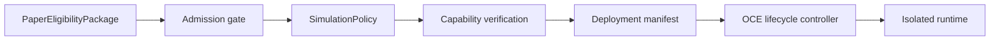

# Phase 8, Book 1 — Simulation Contracts and Deployment Manager

> **Purpose:** Admit qualified strategies, enforce zero-capital modes, and govern durable paper/shadow deployment lifecycles  
> **Input:** Phase 7 PaperEligibilityPackage and Validation Lock  
> **Output:** `SimulationAdmission`, `SimulationPolicy`, capability certificate, and governed `SimulationDeployment`  
> **Previous:** Phase 7 — Validation Forge  
> **Next:** [Book 2 — Runtime Health and Durable State](book-2-runtime-health-durable-state.md)

---

## 1. Success Statement

Only an exact Phase 7-qualified strategy/scope can start, every runtime mode is positively identified, sandbox accounts cannot reach live capital, shadow output is provably nonrouting, and no configuration string or environment variable can silently switch the deployment live.

---

## 2. Applicable Anchors

- **A0:** Human Strategic Authority
- **A1:** One Orchestration Spine
- **A4:** StrategySpec Is Truth
- **A7:** OrderIntent Is the Execution Boundary
- **A8:** Promotion Is State-Based
- **A9:** Separate Research From Approval
- **A10:** Observable and Reconstructable
- **A14:** No Unofficial Production Broker Dependency
- **A15:** Live Autonomy Is Earned
- **F7:** Robustness and reproducibility qualify
- **F8:** Simulation proves the operating system

---

## 3. Deployment Topology



---

## 4. Work Packages

### 4.1 Admission

Verify:

- Strategy, Validation, and package hashes;
- `qualified_for_paper` disposition;
- validated instruments, venues, sessions, parameters, and envelopes;
- observation requirements;
- no upstream invalidation;
- requested mode and provider;
- redacted repository/history secret scan and required rotation evidence;
- monitoring/reconciliation/kill-switch readiness;
- authority and approval.

### 4.2 SimulationPolicy

```yaml
simulation_policy_id: content-id
allowed_modes: [internal_paper, sandbox_paper, live_market_shadow]
validated_scope_ref: artifact-ref
observation_requirements: {}
market_data_health_policy_ref: policy-id
session_health_policy_ref: policy-id
heartbeat_policy_ref: policy-id
checkpoint_policy_ref: policy-id
intent_and_lifecycle_policy_ref: policy-id
reconciliation_policy_ref: policy-id
drift_policy_ref: policy-id
incident_policy_ref: policy-id
kill_switch_policy_ref: policy-id
promotion_policy_ref: policy-id
prohibited_capabilities: []
```

### 4.3 Sandbox capability certificate

For a broker/exchange sandbox:

```yaml
sandbox_capability_certificate_id: typed-id
adapter_ref: artifact-ref
environment_identity: provider-signed-or-verified-id
endpoint_allowlist: []
account_refs: [redacted-stable-ref]
account_class: practice|sandbox|demo|testnet
live_trading_permission: false
funding_or_withdrawal_permission: false
allowed_instruments: []
allowed_actions: []
verification_method: {}
verified_at: timestamp
expires_at: timestamp
```

An `OANDA_ENVIRONMENT=practice` string is not proof by itself. Endpoint, account class, permissions, and adapter capabilities must be verified.

### 4.4 Credential readiness

```yaml
credential_readiness_attestation_id: content-id
repository_scan_ref: artifact-ref
history_scan_ref: artifact-ref
scanned_commit_sha: git-sha
secret_reference_fingerprints: []
exposed_reference_count: integer
rotation_required: boolean
rotation_evidence_refs: []
environment_scope: sandbox|practice|demo|testnet
live_permission: false
verified_at: timestamp
expires_at: timestamp
```

Secret scanners redact values and retain only safe fingerprints, location classifications, status, and evidence references. Any credential exposed in tracked content or history is presumed compromised and cannot be reused. Revocation/rotation happens through the provider or secret manager outside artifacts; Phase 8 records only proof of completion.

### 4.5 Live endpoint denial

Block:

- production/live base URLs;
- live account identifiers;
- adapters with unresolved environment;
- real funding/withdrawal capability;
- unapproved credentials;
- fallback from sandbox to live;
- dynamic endpoint override after startup.

Credentials are referenced through secret management and never written to artifacts/logs.

### 4.6 Shadow sink

`live_market_shadow` uses a terminal nonrouting sink:

```yaml
shadow_sink:
  network_egress: denied
  broker_adapter: none
  account_ref: none
  venue_route: none
  persistence: append_only
  canonical_order_intent_creation: denied
```

### 4.7 SimulationDeployment

```yaml
simulation_deployment_id: typed-id
strategy_build_package_ref: artifact-ref
validation_lock_ref: artifact-ref
paper_eligibility_package_ref: artifact-ref
simulation_policy_ref: policy-ref
mode: internal_paper|sandbox_paper|live_market_shadow
scope: {}
baseline_parameter_ref: artifact-ref
market_data_bindings: []
sandbox_certificate_ref: optional-artifact-ref
credential_readiness_ref: artifact-ref
runtime_environment_ref: artifact-ref
start_window: {}
observation_requirements: {}
state_store_ref: artifact-ref
idempotency_key: string
```

### 4.8 Configuration layering

Precedence:

```text
locked validated configuration
→ simulation policy
→ deployment-specific nonsemantic bindings
→ secret references
```

Environment variables may supply secrets or local addresses only where allowed; they cannot change mode, scope, parameters, endpoint class, limits, or strategy semantics.

### 4.9 Lifecycle controller

OCE actions:

```text
propose
admit
start
pause
resume
stop
complete
promote_to_shadow_proposal
invalidate
archive
```

Every transition requires guards, actor/capability, event, checkpoint, and compensation.

### 4.10 Isolation

Each deployment has separate:

- runtime process/container;
- state namespace;
- data cursor;
- intent/order/fill IDs;
- simulated/sandbox account view;
- logs/metrics;
- kill-switch scope.

One deployment cannot see or mutate another’s state.

### 4.11 OCE execution distinction

OCE `ExecutionTask` schedules simulation lifecycle work. It must never be mapped directly to market `SimulationIntent`, `ShadowIntent`, or Phase 9 `OrderIntent`.

---

## 5. Target Layout

```text
simulation_forge/
  contracts/
    admission.py
    policy.py
    deployment.py
  capabilities/
    certificate.py
    credential_readiness.py
    endpoint_guard.py
    shadow_sink.py
  deployment/
    manager.py
    lifecycle.py
    config.py
    isolation.py
```

---

## 6. Deliverables

- Phase 7-to-8 admission adapter.
- `SimulationPolicy` schema and registry.
- Sandbox capability certificate/verifier.
- Redacted credential-readiness, revocation, and rotation gate.
- Live endpoint/account/permission deny guards.
- Provably nonrouting shadow sink.
- Immutable deployment manifest and config layering.
- OCE lifecycle controller.
- Per-deployment isolation.
- Authority events and audit records.
- Existing OANDA practice adapter quarantine/wrapper requirements.

---

## 7. Required Tests

### P8-ADM-001 — Qualified Package Admission

A complete `qualified_for_paper` package within scope produces one admission.

### P8-ADM-002 — Failed or Inconclusive Rejection

Nonqualified Validation dispositions cannot admit.

### P8-ADM-003 — Upstream Invalidation

An invalid Strategy or Validation Lock blocks start/resume.

### P8-SCP-001 — Validated Scope

Requested instruments, sessions, parameters, and envelopes must be subsets of validated scope.

### P8-SCP-002 — Scope Expansion Rejection

Any unvalidated asset, timeframe, session, parameter, or provider behavior fails.

### P8-MOD-001 — Approved Mode Transition

Every mode transition requires its declared independent approval.

### P8-MOD-002 — Unknown Mode Rejection

`live`, `production`, misspelled, empty, and unknown mode values fail closed.

### P8-MOD-003 — No Environment Override

Environment variables cannot change a deployment from paper/shadow to live.

### P8-CAP-001 — Live Endpoint Rejection

Known production/live endpoints fail capability verification.

### P8-CAP-002 — Live Account Rejection

An account with real trading, funding, or unresolved permissions fails.

### P8-CAP-003 — Sandbox Certificate

Practice/sandbox account class, endpoint, permissions, and expiry verify.

### P8-CAP-004 — Expired Certificate

An expired or revoked sandbox certificate blocks start and resume.

### P8-CAP-005 — No Live Fallback

Sandbox connection failure cannot fall back to a live endpoint/account.

### P8-SHD-001 — Shadow Network Denial

The shadow sink has no broker adapter or network egress path.

### P8-SHD-002 — Shadow Persistence

Every shadow intent is append-only and reconstructable.

### P8-SHD-003 — Canonical OrderIntent Denial

Phase 9 `OrderIntent` cannot be constructed or imported.

### P8-DEP-001 — Deterministic Deployment Identity

Fixed package, policy, mode, scope, and bindings produce the same content identity.

### P8-DEP-002 — Idempotent Admission

Repeated admission with one idempotency key creates one logical deployment.

### P8-CFG-001 — Config Precedence

Locked strategy/scope/policy values cannot be overridden by runtime bindings.

### P8-CFG-002 — Secret Reference Safety

Secrets remain references and never enter manifests or logs.

### P8-SEC-001 — Exposed Credential Gate

Any credential detected in tracked content or history is treated as compromised and blocks admission until redacted revocation/rotation evidence passes.

### P8-SEC-002 — Sandbox Credential Scope

A referenced credential must resolve only to the verified sandbox/practice account and cannot carry live, funding, or withdrawal permission.

### P8-LCY-001 — Lifecycle Guards

Illegal state transitions fail and emit audit events.

### P8-LCY-002 — Start Prerequisites

Monitoring, state store, reconciliation baseline, kill switch, and capability verification must be ready before start.

### P8-ISO-001 — Deployment Isolation

One deployment cannot read/write another’s state, intents, account view, or kill switch.

### P8-OCE-001 — Task/Trade Separation

OCE software `ExecutionTask` cannot be interpreted as a market intent.

### P8-AUT-001 — No Live Capital Authority

Live account, route, funding, withdrawal, real position, and capital actions are denied and audited.

---

## 8. Failure Modes

- A `PAPER_TRADING=true` boolean is treated as sufficient isolation.
- “Practice” name hides live endpoint or account.
- Sandbox connection falls back to live.
- Environment variable widens scope or changes mode.
- Shadow intents pass through a configured broker adapter.
- OCE task execution is confused with order execution.
- Deployment starts before kill-switch or state readiness.
- Two strategies share account/state namespaces.

---

## 9. Exit Gate

Book 1 is complete only when admission enforces exact validated scope, sandbox capabilities are positively verified, shadow is provably nonrouting, mode changes are governed, deployment state is isolated, and no path to live capital or Phase 9 OrderIntent exists.

---

## 10. Handoff

Book 2 receives the admitted immutable deployment, simulation policy, validated expected envelopes, market/session bindings, state-store namespace, mode certificate, health thresholds, and lifecycle controller.
