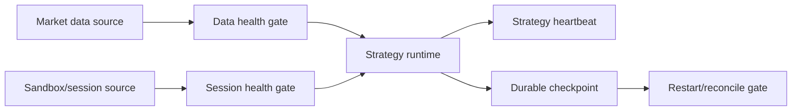

# Phase 8, Book 2 — Runtime Health and Durable State

> **Purpose:** Prove live market/session inputs are healthy and strategy state survives disconnection, restart, and clock/calendar boundaries  
> **Input:** Book 1 admitted deployment and health/checkpoint policies  
> **Output:** Market/session health records, strategy heartbeat, durable checkpoints, and safe reconnect/restart workflow  
> **Previous:** [Book 1 — Simulation Contracts and Deployment Manager](book-1-contracts-deployment-manager.md)  
> **Next:** [Book 3 — Paper, Shadow, and Reconciliation](book-3-paper-shadow-reconciliation.md)

---

## 1. Success Statement

The runtime distinguishes process liveness from strategy progress, blocks new intents on stale or structurally damaged data, handles sessions and DST correctly, checkpoints all material state, and cannot resume after disconnect/restart until external and internal state reconcile.

---

## 2. Applicable Anchors

- **A1:** One Orchestration Spine
- **A3:** Point-in-Time Data
- **A4:** StrategySpec Is Truth
- **A6:** Nautilus Is the Canonical Trading Model
- **A8:** Promotion Is State-Based
- **A10:** Observable and Reconstructable
- **A11:** Repair Before Expansion
- **A12:** Cheap Models Use Tools, Not Memory
- **F3:** Passing data manifest required
- **F6:** One spec, no silent divergence
- **F8:** Simulation proves the operating system

---

## 3. Runtime Topology



---

## 4. Work Packages

### 4.1 Market event envelope

Every input carries:

```yaml
source_id: stable-id
instrument_id: stable-id
event_type: quote|trade|bar|status|reference
source_sequence: optional-integer
event_time: timestamp
source_published_at: optional-timestamp
received_at: timestamp
normalized_at: timestamp
payload_hash: content-hash
quality_flags: []
```

### 4.2 MarketDataHealth

Track:

- connection state;
- last event/quote/trade/bar times;
- source-to-receive and receive-to-process lag;
- sequence gap/rewind;
- duplicate and reorder counts;
- clock skew;
- crossed/locked/impossible price checks;
- bar completeness;
- required instrument coverage;
- provider status and throttling;
- stale thresholds by event type/session.

Health is per instrument/source plus aggregate. One healthy symbol cannot mask another required symbol’s failure.

### 4.3 Data gate behavior

States:

```text
healthy
degraded_noncritical
stale
gapped
reordered_beyond_policy
invalid
disconnected
recovering
```

Required-data failure blocks new intents. Existing paper positions follow prefrozen pause/exit/monitor policy; the system does not invent market prices.

### 4.4 SessionHealth

Track:

- venue calendar/open/close/auction/halt;
- holiday and early close;
- sandbox session authentication;
- connection/subscription state;
- account/environment identity;
- permissions/capability certificate;
- provider maintenance;
- rate-limit state;
- server/local clock difference.

### 4.5 StrategyHeartbeat

```yaml
strategy_heartbeat_id: deterministic-id
deployment_id: typed-id
emitted_at: timestamp
runtime_process_id: opaque-id
last_market_event_ref: typed-id
last_processed_sequence: {}
last_semantic_event_ref: optional-id
last_intent_ref: optional-id
state_hash: content-hash
checkpoint_ref: artifact-ref
mode: registry-value
health: healthy|degraded|blocked|paused|stopping
progress_counters: {}
```

A process heartbeat without advancing required market sequences is not healthy.

### 4.6 RuntimeCheckpoint

Checkpoint:

- strategy IR/runtime state;
- feature/session state and warm-up;
- timers;
- last input sequence/cursor;
- emitted intent idempotency keys;
- pending/active paper orders;
- fills;
- positions/lots;
- simulated/sandbox cash/fees;
- kill-switch/incident state;
- mode and upstream lock hashes.

Use atomic snapshot plus append-only event log.

### 4.7 Checkpoint frequency

Checkpoint on:

- intent before external sandbox submission;
- every lifecycle/fill/position/cash change;
- strategy/session reset;
- pause/stop/incident/kill;
- periodic safe interval;
- before/after reconnect transition.

### 4.8 Disconnect

On required feed/session disconnect:

1. mark health and emit incident candidate;
2. block new intents;
3. checkpoint current state;
4. freeze or manage pending paper orders per policy;
5. continue collecting available acknowledgements safely;
6. enter reconnect backoff;
7. do not assume orders cancelled or positions flat.

### 4.9 Reconnect

Before resume:

1. reverify sandbox endpoint/account/capabilities;
2. resubscribe and establish sequence/cursor;
3. recover missed market/session events or mark gap;
4. fetch sandbox paper orders/fills/positions/cash;
5. restore internal checkpoint/event log;
6. reconcile and classify differences;
7. require gap/state policy pass and approval;
8. resume without replaying already emitted intents.

### 4.10 Restart with open paper positions

The runtime starts in `recovering`, never `running`. It may not create new intents until pending orders, partial fills, positions, cash, market cursor, timers, and strategy state reconcile.

### 4.11 Clock and calendar

Use monotonic time for durations and UTC timestamps for records, with IANA/calendars for session semantics. Detect clock jumps/skew. Market close, early close, DST, weekend, and holiday behavior follows locked upstream contracts.

### 4.12 State integrity

State hashes chain through events/checkpoints. Corrupt, missing, nonmonotonic, or incompatible checkpoints fail closed and require recovery/incident handling.

---

## 5. Target Layout

```text
simulation_forge/
  market_data/
    envelope.py
    health.py
    sequence.py
    freshness.py
  sessions/
    health.py
    calendar.py
    capability_watch.py
  runtime/
    heartbeat.py
    state.py
    event_log.py
    checkpoint.py
    reconnect.py
    restart.py
```

---

## 6. Deliverables

- Canonical live market-event envelope.
- Per-source/instrument market-data health monitor.
- Sandbox/session/calendar health monitor.
- Stale/gap/reorder/clock-skew gates.
- Progress-aware strategy heartbeat.
- Atomic checkpoint plus append-only event log.
- Disconnect/reconnect state machine.
- Restart-with-open-state workflow.
- Missed-event recovery and gap classification.
- State hash-chain and corruption detection.

---

## 7. Required Tests

### P8-DAT-001 — Stale Data Rejection

Required stale data blocks new intents at the declared threshold.

### P8-DAT-002 — Per-Instrument Freshness

One healthy instrument cannot mask a stale required instrument.

### P8-DAT-003 — Sequence Gap

A missing source sequence creates a gap state and blocks according to policy.

### P8-DAT-004 — Duplicate Market Event

Duplicate payload/sequence is recorded once and produces no duplicate strategy effect.

### P8-DAT-005 — Reordered Event

Allowed minor reordering normalizes deterministically; excessive reordering blocks.

### P8-DAT-006 — Impossible Quote

Crossed/impossible/invalid market data fails quality gates.

### P8-DAT-007 — Incomplete Bar

A close-only strategy cannot process an incomplete bar as closed.

### P8-CLK-001 — Clock Skew

Excess source/server/local clock skew blocks time-sensitive intents.

### P8-CLK-002 — Monotonic Duration

Heartbeat, timeout, and backoff durations survive wall-clock adjustment.

### P8-SES-001 — Market Close and Holiday

Closed, holiday, weekend, and early-close sessions follow the pinned calendar.

### P8-SES-002 — Halt State

A venue/instrument halt blocks new intents and preserves existing state.

### P8-SES-003 — Sandbox Identity Drift

Changed endpoint/account/environment identity invalidates the session.

### P8-HBT-001 — Missing Heartbeat

Expired heartbeat triggers pause/incident behavior.

### P8-HBT-002 — Stuck Strategy Detection

Process liveness without required event-sequence progress is unhealthy.

### P8-HBT-003 — Heartbeat State Fidelity

Heartbeat hashes and cursors match current durable state.

### P8-CHK-001 — Atomic Checkpoint

A checkpoint is entirely committed or absent; partial state cannot restore.

### P8-CHK-002 — Intent-Before-Submit Checkpoint

Intent identity persists before sandbox submission.

### P8-CHK-003 — Fill Checkpoint

Each fill/position/cash change durably commits before acknowledgement completion.

### P8-CHK-004 — State Hash Chain

Tampering, loss, or reordering of events/checkpoints is detected.

### P8-CON-001 — Disconnect Safe Pause

Disconnect blocks new intents, checkpoints, and preserves uncertain orders/positions.

### P8-CON-002 — Reconnect Backoff

Reconnect follows bounded backoff and cannot flood the provider.

### P8-CON-003 — Missed Event Recovery

Recoverable gaps replay exactly once before resume.

### P8-CON-004 — Unrecoverable Gap

An unrecoverable material gap prevents resume.

### P8-CON-005 — Capability Reverification

Every reconnect revalidates sandbox endpoint/account/permissions.

### P8-RST-001 — Restart with Open Position

Restart restores and reconciles open paper position state before new intents.

### P8-RST-002 — Restart with Pending Order

Pending/cancel-requested/partially-filled states recover without duplication.

### P8-RST-003 — Corrupt Checkpoint

Corrupt or incompatible checkpoint fails closed and raises an incident.

### P8-RST-004 — Already-Emitted Intent

Restart cannot re-emit a persisted intent.

### P8-DST-001 — DST Runtime Session

Live session transitions match the Phase 6 clock contract across DST.

### P8-EOD-001 — End-of-Session State

Timers, pending intents/orders, and strategy resets follow declared close behavior.

### P8-AUT-010 — Health Cannot Route

Health/reconnect components have no order-routing or capital capability.

---

## 8. Failure Modes

- WebSocket is connected, so data is assumed fresh.
- One feed heartbeat masks stale symbols.
- Restart begins running before reconciliation.
- Disconnect assumes pending paper orders were cancelled.
- Reconnect replays intents.
- Wall-clock jumps break timeouts.
- Open bar is processed as complete.
- Account/environment changes during reconnect.
- Checkpoints omit timers or emitted idempotency keys.

---

## 9. Exit Gate

Book 2 is complete only when data/session/heartbeat health is progress-aware, stale/gap/clock/calendar tests pass, state checkpoints are complete and tamper-evident, and disconnect/reconnect/restart recover without duplicate intents or unreconciled state.

---

## 10. Handoff

Book 3 receives a healthy or explicitly degraded deployment, durable runtime state/cursors, validated simulation mode, market/session envelopes, intent idempotency registry, reconciliation baselines, and all reconnect/restart evidence.
