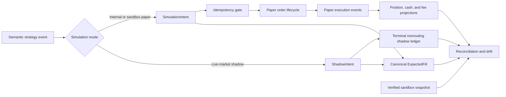
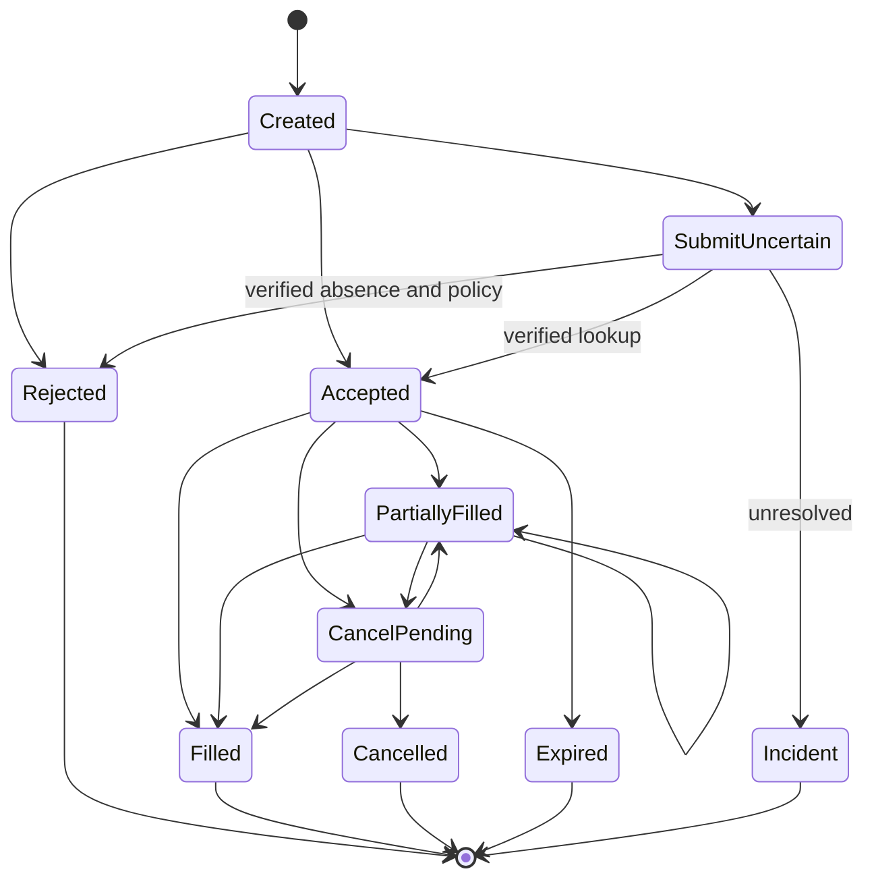

# Phase 8, Book 3 — Paper, Shadow, and Reconciliation

> **Purpose:** Observe strategy decisions and simulated order lifecycles without capital exposure, compare paper behavior with canonical expectations, and continuously reconcile state  
> **Input:** Admitted deployment, verified mode, healthy runtime, durable checkpoint/event log, and Phase 7 execution envelopes  
> **Output:** Reconstructable intent/order/fill ledgers, reconciliation snapshots, and classified drift evidence  
> **Previous:** [Book 2 — Runtime Health and Durable State](book-2-runtime-health-durable-state.md)  
> **Next:** [Book 4 — Incidents, Kill Switches, and Promotion](book-4-incidents-kill-switches-promotion.md)

---

## 1. Success Statement

Every strategy decision has one stable identity and one permitted terminal path; duplicate submission is prevented across retries and restarts; partial fills, rejects, cancels, positions, cash, fees, and pending state are reconstructable; shadow mode cannot route; and every material difference between canonical expectation, internal paper state, and verified sandbox state is classified before the deployment continues.

---

## 2. Applicable Anchors

- **A0:** Human Strategic Authority
- **A3:** Point-in-Time Data
- **A4:** StrategySpec Is Truth
- **A6:** Nautilus Is the Canonical Trading Model
- **A7:** OrderIntent Is the Execution Boundary
- **A8:** Promotion Is State-Based
- **A10:** Observable and Reconstructable
- **A11:** Repair Before Expansion
- **A15:** Live Autonomy Is Earned
- **F8:** Simulation proves the operating system

---

## 3. Lifecycle and Reconciliation Topology



---

## 4. Work Packages

### 4.1 Intent boundary

Phase 8 defines only:

- `SimulationIntent` for `internal_paper` and verified `sandbox_paper`;
- `ShadowIntent` for `live_market_shadow`.

Neither is a Phase 9 canonical `OrderIntent`, live order, capital authorization, or reusable broker-routing command.

```yaml
simulation_intent_id: typed-id
deployment_id: typed-id
mode: internal_paper|sandbox_paper
strategy_package_ref: artifact-ref
semantic_event_id: typed-id
intent_ordinal: integer
instrument_id: canonical-id
side: buy|sell
position_effect: open|increase|reduce|close
test_quantity: decimal
order_style: market|limit|stop|stop_limit
limit_price: optional-decimal
stop_price: optional-decimal
time_in_force: bounded-enum
decision_market_cursor: cursor
decision_state_hash: content-hash
expected_fill_ref: artifact-ref
created_at: timestamp
expires_at: optional-timestamp
idempotency_key: string
policy_refs: []
```

The schema contains enough information to exercise a paper lifecycle, but no live account, live endpoint, production route, funding action, withdrawal action, or capital allocation authority.

### 4.2 ShadowIntent

```yaml
shadow_intent_id: typed-id
deployment_id: typed-id
semantic_event_id: typed-id
intent_ordinal: integer
instrument_id: canonical-id
hypothetical_side: buy|sell
hypothetical_quantity: decimal
hypothetical_order_style: bounded-enum
decision_market_cursor: cursor
decision_state_hash: content-hash
expected_fill_ref: artifact-ref
terminal_sink_ref: artifact-ref
created_at: timestamp
idempotency_key: string
```

`ShadowIntent` is terminal once durably recorded. It never enters an adapter, order gateway, broker queue, or retry-to-provider loop.

### 4.3 Stable identity and duplicate prevention

The logical idempotency key is derived from immutable components:

```text
deployment_id
+ strategy lifecycle instance
+ semantic_event_id
+ intent_ordinal
+ mode
```

Before any sandbox submission:

1. validate current health, session, scope, and mode certificate;
2. reserve the idempotency key;
3. append the intent event;
4. atomically checkpoint intent and reservation;
5. submit once with the provider client key where supported;
6. record provider acknowledgement or uncertain state;
7. resolve uncertain state by query/reconciliation, never blind retry.

Deduplication occurs at strategy ingress, lifecycle creation, provider submission, provider-event ingestion, fill projection, and recovery.

### 4.4 Paper order lifecycle



Terminal state is evidenced, not inferred. A cancel request is not a cancellation, a disconnect is not a cancellation, and a submitted request is not an accepted order.

### 4.5 Paper execution event

```yaml
paper_execution_event_id: typed-id
deployment_id: typed-id
simulation_intent_id: typed-id
paper_order_id: typed-id
provider_event_id: optional-string
provider_order_ref: optional-redacted-ref
event_type: accepted|rejected|partial_fill|fill|cancel_pending|cancelled|expired|correction
event_time: timestamp
received_time: timestamp
instrument_id: canonical-id
event_quantity: decimal
cumulative_filled_quantity: decimal
remaining_quantity: decimal
event_price: optional-decimal
fee_components: []
reject_or_cancel_reason: optional-typed-reason
source_cursor: cursor
previous_event_hash: content-hash
payload_hash: content-hash
```

Provider payloads are retained through immutable redacted evidence. Normalized events do not erase source fields needed for dispute or replay.

### 4.6 ExpectedFill

`ExpectedFill` is derived from the Phase 7 canonical execution model, current point-in-time market state, order terms, latency envelope, costs, and validated scope.

```yaml
expected_fill_id: content-id
intent_ref: typed-id
execution_model_ref: artifact-ref
market_snapshot_ref: artifact-ref
eligibility: fill|partial|reject|expire|indeterminate
price_envelope: {}
latency_envelope: {}
quantity_envelope: {}
partial_fill_envelope: {}
fee_envelope: {}
path_constraints: []
assumptions: []
```

The expected fill is a comparison contract, not a fabricated certainty. An indeterminate expected outcome is reported as such and cannot be scored as a favorable match.

### 4.7 Expected-versus-observed fill comparator

Compare:

- market and session eligibility;
- accepted/rejected/cancelled/expired outcome;
- submission, acknowledgement, and fill latency;
- fill price and slippage;
- filled and remaining quantity;
- number and ordering of partial fills;
- commissions, spread, financing, and other fees;
- timestamp and market-cursor consistency;
- position/cash consequences;
- lifecycle-path legality.

Each comparison produces `within_envelope`, `explainable_variance`, `unexplained_material_variance`, or `critical_mismatch`.

### 4.8 Position, cash, and fee projections

Projections are event-sourced by deployment and simulated account:

```text
intent ledger
→ order lifecycle ledger
→ execution ledger
→ position lots
→ realized/unrealized paper PnL
→ cash and fee ledger
```

Quantity sign, multiplier, currency conversion, price precision, fee timing, financing, splits, dividends, expiry, and other applicable lifecycle semantics use locked upstream contracts. Unsupported semantics fail closed.

### 4.9 Reconciliation

Reconcile at startup, reconnect, every material execution event, scheduled interval, session boundary, kill-switch activation, and completion.

```yaml
reconciliation_snapshot_id: content-id
deployment_id: typed-id
mode: internal_paper|sandbox_paper|live_market_shadow
as_of_market_cursor: cursor
as_of_time: timestamp
internal_state_hash: content-hash
sandbox_snapshot_hash: optional-content-hash
shadow_state_hash: optional-content-hash
intent_differences: []
order_differences: []
fill_differences: []
position_differences: []
cash_differences: []
fee_differences: []
pending_state_differences: []
classification: match|explainable_variance|unexplained_material|critical
evidence_refs: []
required_action: continue|warn|pause|stop|incident
```

For sandbox paper, the internal event log, internal projection, provider event stream, and provider snapshot are independent evidence sources. The reconciler never silently overwrites one with another or labels either side authoritative without a declared correction process.

### 4.10 Correction protocol

A correction requires:

- immutable pre-correction snapshot;
- typed discrepancy and root evidence;
- declared source and transformation;
- approving capability;
- compensating/correction event;
- post-correction reconciliation;
- incident link where material;
- no deletion or mutation of original evidence.

### 4.11 Drift

```yaml
drift_record_id: content-id
deployment_id: typed-id
comparison_window: {}
dimension: signal|timing|price|quantity|fill_rate|fees|pnl|state
baseline_ref: artifact-ref
observed_ref: artifact-ref
value: {}
threshold_ref: policy-ref
classification: normal|warning|material|critical
explanation_refs: []
action: continue|increase_observation|pause|stop|incident
```

Drift is measured across:

- Phase 7 expected behavior versus current live-market observation;
- internal paper expected fill versus internal observed fill;
- canonical expected fill versus sandbox paper fill;
- internal projection versus sandbox snapshot;
- paper versus shadow signal/timing behavior over comparable windows.

Thresholds are fixed before observation. Agents may explain or propose a change; they cannot move a threshold to make a deployment pass.

### 4.12 Restart and reconnect integration

Recovery consumes the durable idempotency registry, pending-order state, provider snapshots, execution-event cursors, position/cash projections, and last reconciliation. New intents remain blocked until uncertainty and material mismatch are resolved.

---

## 5. Target Layout

```text
simulation_forge/
  intents/
    simulation_intent.py
    shadow_intent.py
    identity.py
    idempotency.py
  paper/
    order_state.py
    lifecycle.py
    events.py
    internal_fill.py
    sandbox_adapter.py
  projections/
    positions.py
    cash.py
    fees.py
  reconciliation/
    expected_fill.py
    comparator.py
    snapshot.py
    corrections.py
    drift.py
```

---

## 6. Deliverables

- `SimulationIntent` and `ShadowIntent` schemas with separate namespaces.
- Durable idempotency registry and pre-submit checkpoint protocol.
- Internal paper lifecycle and verified sandbox paper adapter boundary.
- Append-only order/execution ledgers.
- Partial-fill, reject, cancel, expiry, and uncertain-submit handling.
- Position, cash, fee, and pending-state projections.
- Canonical `ExpectedFill` generator and comparator.
- Scheduled/event-driven reconciliation engine.
- Immutable correction protocol.
- Multidimensional drift records, thresholds, and actions.
- Restart/reconnect adapters for unresolved lifecycle state.

---

## 7. Required Tests

### P8-INT-001 — Simulation Intent Scope

Only a qualified deployment in `internal_paper` or verified `sandbox_paper` can create a `SimulationIntent`.

### P8-INT-002 — Shadow Intent Scope

Only `live_market_shadow` can create a `ShadowIntent`, and it terminates in the nonrouting sink.

### P8-INT-003 — Stable Semantic Identity

The same deployment lifecycle and semantic event produce the same logical intent identity.

### P8-INT-004 — Intent Completeness

Missing instrument, side, quantity, cursor, state hash, policy, or idempotency fields fail validation.

### P8-INT-005 — Expired Intent

An expired intent cannot be submitted or filled.

### P8-INT-006 — Out-of-Scope Intent

Unvalidated instrument, session, parameter, order style, or quantity envelope fails closed.

### P8-IDM-001 — Duplicate Order Prevention

Repeated processing of one semantic event creates one logical intent and at most one paper submission.

### P8-IDM-002 — Retry After Timeout

An uncertain sandbox submission is queried and reconciled before any retry.

### P8-IDM-003 — Restart Deduplication

Restart after intent persistence but before acknowledgement cannot submit a duplicate.

### P8-IDM-004 — Duplicate Provider Event

Repeated provider order/fill events affect projections exactly once.

### P8-IDM-005 — Concurrent Reservation

Concurrent attempts to reserve the same idempotency key produce one winner and one recorded duplicate.

### P8-ORD-001 — Legal Lifecycle

Accepted, partial, filled, cancel, rejected, and expired transitions follow the state machine.

### P8-ORD-002 — Illegal Transition

A fill after a confirmed terminal state fails reconciliation and raises an incident candidate.

### P8-ORD-003 — Submit Is Not Acceptance

A sent request remains uncertain until acceptance or verified absence is evidenced.

### P8-ORD-004 — Cancel Is Not Cancelled

A cancel request cannot release pending exposure until cancellation is confirmed.

### P8-ORD-005 — Fill During Cancel

A valid partial or full fill arriving during cancel-pending updates state without loss or duplication.

### P8-ORD-006 — Expiry

Time-in-force expiry follows the pinned session clock and produces a terminal event.

### P8-ORD-007 — Event Ordering

Out-of-order provider events normalize only when causality is provable; otherwise state becomes uncertain.

### P8-ORD-008 — Source Evidence Retention

Normalized lifecycle events retain immutable redacted source evidence and hashes.

### P8-FIL-001 — Partial Fill Accounting

Multiple partial fills update cumulative quantity, remaining quantity, weighted price, fees, position, and cash exactly.

### P8-FIL-002 — Expected Price Envelope

Observed paper fill price outside the predeclared canonical envelope is classified and actioned.

### P8-FIL-003 — Expected Latency Envelope

Acknowledgement or fill latency outside its envelope produces timing drift.

### P8-FIL-004 — Fee Accounting

Commissions, spread, financing, and declared fee components reconcile to projections.

### P8-FIL-005 — Precision and Multiplier

Tick size, lot size, contract multiplier, rounding, and currency conversion follow locked contracts.

### P8-FIL-006 — Indeterminate Expected Fill

An indeterminate canonical expected fill cannot be marked a favorable match.

### P8-FIL-007 — Position Effect

Open, increase, reduce, and close effects cannot flip or exceed simulated exposure outside policy.

### P8-REJ-001 — Rejected Paper Order

A provider or simulator rejection records its typed reason and changes no position or fill state.

### P8-REJ-002 — Unsupported Order Style

Unsupported order type or time-in-force rejects before provider submission.

### P8-REJ-003 — Cancelled Remainder

A partially filled then cancelled order preserves the filled portion and cancels only the remainder.

### P8-REJ-004 — Late Reject

A late or contradictory rejection enters uncertain reconciliation rather than overwriting accepted/fill evidence.

### P8-REC-001 — Broker-versus-Internal Reconciliation

Sandbox orders, fills, positions, cash, fees, and pending states match internal evidence or produce classified differences.

### P8-REC-002 — Scheduled Reconciliation

Reconciliation runs at the declared interval even without order activity.

### P8-REC-003 — Event Reconciliation

Every material execution event triggers a new bounded snapshot.

### P8-REC-004 — Startup Reconciliation

No new intent is created after restart until all open and uncertain state reconciles.

### P8-REC-005 — Reconnect Reconciliation

Provider reconnect restores missed events and snapshots before simulation resumes.

### P8-REC-006 — Cash and Fee Mismatch

A position match cannot hide material cash, fee, or financing mismatch.

### P8-REC-007 — No Silent Source Trust

Mismatch cannot be repaired by blindly replacing internal state with a provider snapshot or vice versa.

### P8-REC-008 — Correction Audit

Every correction retains pre/post state, evidence, authority, reason, and compensating event.

### P8-DRF-001 — Paper/Shadow Drift Threshold

Warning, material, and critical paper/shadow drift thresholds trigger their predeclared actions.

### P8-DRF-002 — Signal Drift

Missing, extra, or directionally different strategy decisions are measured by comparable market window.

### P8-DRF-003 — Timing Drift

Decision and lifecycle latency drift uses monotonic durations and aligned market cursors.

### P8-DRF-004 — Fill-Rate Drift

Observed accept, reject, partial, and fill rates compare with the canonical envelope.

### P8-DRF-005 — State Drift

Intent/order/fill/position/cash divergence cannot be hidden by matching aggregate PnL.

### P8-DRF-006 — Immutable Threshold

An agent or runtime cannot loosen a drift threshold during the observation window.

### P8-DRF-007 — Explainable Variance

An explainable classification requires linked evidence and a policy-approved reason.

### P8-SHW-001 — Shadow Terminality

A shadow intent produces no submission, paper order, provider call, or account mutation.

### P8-SHW-002 — Shadow Expected State

Hypothetical fills and positions remain clearly labeled and isolated from paper state.

### P8-SHW-003 — Comparable Window

Paper-to-shadow comparison uses aligned instruments, sessions, market cursors, and policy versions.

### P8-SHW-004 — Shadow Restart

Restart reconstructs shadow intents exactly once and never replays them toward an adapter.

### P8-AUT-020 — No Canonical Execution Authority

Book 3 components cannot import, create, authorize, or route a Phase 9 `OrderIntent` or live-capital action.

---

## 8. Failure Modes

- A retry after timeout creates a second sandbox order.
- A cancel request is treated as cancelled.
- Partial fills overwrite instead of accumulate.
- Matching net position hides missing orders, cash, or fees.
- Provider snapshot silently replaces internal evidence.
- Internal state is assumed correct because it is local.
- Paper broker fills are treated as canonical truth.
- Expected fills are treated as guaranteed outcomes.
- Shadow output passes through a broker adapter for convenience.
- Drift thresholds are moved after unfavorable observations.
- Aggregate PnL hides signal, timing, fill, or state divergence.

---

## 9. Exit Gate

Book 3 is complete only when all intent and lifecycle paths are idempotent and reconstructable, shadow routing is structurally impossible, partial/reject/cancel/restart cases reconcile, canonical expected fills are compared with observed behavior, and no unexplained material or critical state difference can pass silently.

---

## 10. Handoff

Book 4 receives immutable intent/order/fill/projection ledgers, reconciliation and drift policies, current classified snapshots, evidence-linked correction history, unresolved incident candidates, and the exact thresholds/actions required to govern kill switches, recovery, reliability, and promotion.
