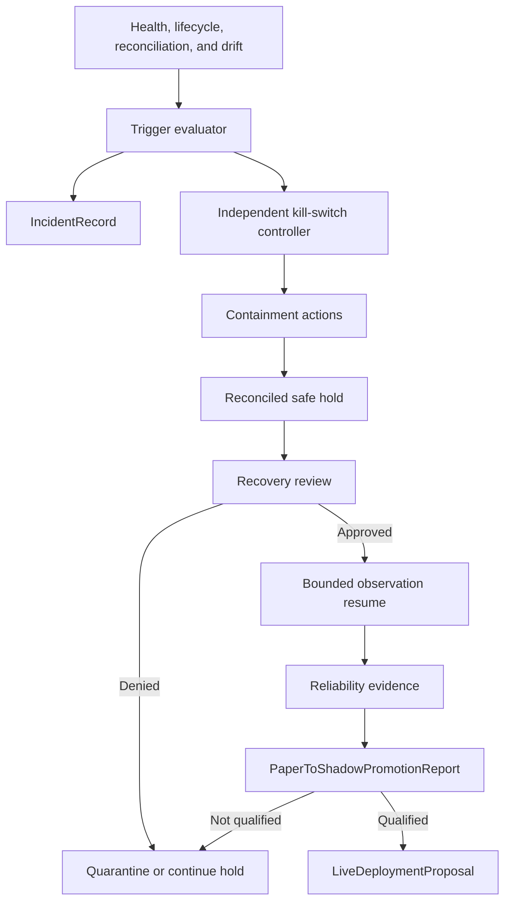
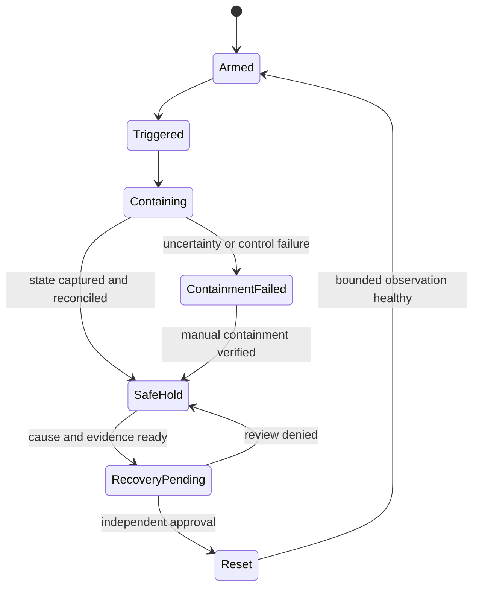

# Phase 8, Book 4 — Incidents, Kill Switches, and Promotion

> **Purpose:** Detect and contain simulation failures, prove safe recovery, score operational reliability, and govern paper-to-shadow promotion  
> **Input:** Healthy deployment evidence, intent/order/fill ledgers, reconciliation snapshots, drift records, and incident candidates  
> **Output:** Incident and kill-switch evidence, reliability reports, promotion decision, and proposal-only Phase 9 input  
> **Previous:** [Book 3 — Paper, Shadow, and Reconciliation](book-3-paper-shadow-reconciliation.md)  
> **Next:** [Book 5 — Simulation Operations and Lock](book-5-simulation-operations-lock.md)

---

## 1. Success Statement

Every material operational fault is classified and contained by an authority outside strategy logic; kill switches stop new simulated action and preserve uncertain state without falsely claiming safety; recovery requires evidence and independent approval; reliability cannot average away a critical failure; and promotion produces a bounded proposal, never permission to trade live capital.

---

## 2. Applicable Anchors

- **A0:** Human Strategic Authority
- **A1:** One Orchestration Spine
- **A7:** OrderIntent Is the Execution Boundary
- **A8:** Promotion Is State-Based
- **A9:** Separate Research From Approval
- **A10:** Observable and Reconstructable
- **A11:** Repair Before Expansion
- **A15:** Live Autonomy Is Earned
- **F8:** Simulation proves the operating system

---

## 3. Control Topology



---

## 4. Work Packages

### 4.1 Incident taxonomy

Incident sources include:

- stale, missing, duplicate, reordered, or invalid market data;
- market-data or sandbox disconnect;
- clock, calendar, session, halt, or capability identity drift;
- heartbeat loss or strategy progress stall;
- duplicate or uncertain submission;
- illegal order lifecycle, late fill, reject, or cancel conflict;
- intent/order/fill/position/cash/fee reconciliation mismatch;
- expected-versus-observed fill or paper/shadow drift;
- corrupted checkpoint, event chain, or projection;
- resource exhaustion, queue backlog, or storage pressure;
- upstream Strategy/Validation Lock invalidation;
- policy, scope, authority, credential, or endpoint violation;
- kill-switch or recovery-control failure.

Severity:

| Severity | Meaning | Minimum action |
|---|---|---|
| `critical` | Capital boundary, state integrity, duplicate action, uncontrolled lifecycle, or safety-control failure | Immediate scoped/global kill, incident commander, no automatic recovery |
| `major` | Material reliability or reconciliation failure with bounded containment | Pause/kill affected deployment, investigate, reconcile |
| `minor` | Degraded behavior inside safe bounds | Warn, record, increased observation |
| `advisory` | Nonmaterial anomaly or leading indicator | Record and trend |

A policy table maps typed triggers to minimum severity. An agent may escalate severity; it cannot reduce the minimum.

### 4.2 IncidentRecord

```yaml
incident_id: typed-id
deployment_ids: []
detected_at: timestamp
source: typed-source
severity: critical|major|minor|advisory
status: detected|triaged|contained|investigating|resolved|verified|closed
trigger_ref: artifact-ref
affected_modes: []
affected_instruments: []
market_cursor_range: {}
state_hashes: {}
impact_assessment: {}
uncertain_orders_or_positions: []
containment_actions: []
timeline_events: []
evidence_refs: []
owner_ref: actor-ref
approver_refs: []
root_cause: optional-typed-record
corrective_actions: []
recovery_ref: optional-artifact-ref
closure_reason: optional-string
```

Detection, containment, root cause, remediation, verification, and closure are separate facts. “Resolved” does not mean “closed.”

### 4.3 Kill-switch authority

The kill-switch controller is external to strategy code and has its own health, durable state, and narrowly scoped capability. Scopes:

- strategy instance;
- deployment;
- market-data or sandbox provider;
- all Phase 8 simulation runtimes.

It may:

- atomically block new `SimulationIntent` or `ShadowIntent` creation;
- stop submission of unsent sandbox-paper intents;
- request cancellation of outstanding sandbox-paper orders;
- checkpoint and freeze timers/state transitions;
- disconnect/quarantine an affected adapter after state capture;
- trigger immediate reconciliation and incident creation;
- stop/pause isolated processes.

It may not create a live order, reach a live endpoint/account, flatten a live position, widen scope, alter strategy semantics, erase uncertain state, or claim that paper exposure is flat without confirmed evidence.

### 4.4 KillSwitchState

```yaml
kill_switch_state_id: content-id
scope: strategy|deployment|provider|global
scope_ref: typed-id
state: armed|triggered|containing|safe_hold|containment_failed|recovery_pending|reset
trigger_type: automatic|human
trigger_ref: artifact-ref
triggered_at: timestamp
blocked_capabilities: []
cancel_requests: []
confirmed_terminal_orders: []
uncertain_orders: []
reconciliation_ref: optional-artifact-ref
incident_ref: typed-id
state_hash: content-hash
reset_approval_refs: []
```



### 4.5 Automatic triggers

At minimum:

- live endpoint/account/capability detected;
- shadow broker/network path detected;
- duplicate sandbox order or unresolved submission uncertainty;
- critical reconciliation mismatch;
- corrupt or nonreconstructable state;
- required market data stale/gapped beyond limit;
- heartbeat/progress failure beyond limit;
- provider identity or sandbox certificate drift;
- drift threshold marked `critical`;
- upstream lock/package invalidated;
- repeated major incidents over policy count/window;
- kill-switch controller health failure.

Triggers and thresholds are versioned before the observation window. Human trigger is always available within granted Phase 8 authority.

### 4.6 Containment protocol

Order of operations is policy-defined and mode-aware:

1. latch the trigger durably;
2. deny new intent creation and submission;
3. capture runtime, cursor, idempotency, pending lifecycle, and health state;
4. request allowed sandbox cancellations;
5. verify each terminal or uncertain order explicitly;
6. checkpoint and reconcile positions, cash, fees, and pending state;
7. quarantine affected data/adapter/process;
8. create or update the incident;
9. enter `safe_hold` only when evidence satisfies policy;
10. otherwise enter `containment_failed` and escalate.

For shadow mode, containment stops hypothetical intent creation and freezes the shadow ledger; there is no cancellation or position action.

### 4.7 Recovery protocol

Recovery requires:

- trigger cause identified or explicitly bounded;
- corrective action applied and tested;
- upstream locks and deployment policy still valid;
- sandbox endpoint, account class, permissions, and certificate reverified;
- credential-readiness attestation still valid with no unresolved exposure;
- market-data gap recovered or formally declared unrecoverable;
- current strategy/market/session heartbeat healthy;
- durable state and event hash chain verified;
- all uncertain lifecycle state resolved;
- orders, fills, positions, cash, fees, and pending state reconciled;
- incident severity-specific review complete;
- independent reset approval;
- staged resume with a fresh observation window.

Critical incidents never recover automatically. A restart does not reset a latched kill switch.

### 4.8 Operational reliability model

Score dimensions independently:

| Dimension | Evidence |
|---|---|
| Data continuity | Freshness, gaps, duplicates, reorder, recovery |
| Session continuity | Calendar, provider, account, capability health |
| Runtime continuity | Uptime, heartbeat progress, restart success |
| Intent integrity | Stable identity, duplicate prevention, scope compliance |
| Lifecycle integrity | Accept/reject/partial/cancel/expiry correctness |
| State integrity | Checkpoints, event chain, projection correctness |
| Reconciliation | Match rate, mismatch age/severity, correction evidence |
| Drift | Signal, timing, fills, state, paper/shadow thresholds |
| Incident response | Detection, containment, recovery, recurrence |
| Control readiness | Kill-switch health/drills and authority separation |

```yaml
operational_reliability_report_id: content-id
deployment_id: typed-id
window: {}
policy_ref: policy-ref
dimension_results: {}
slo_results: {}
incident_summary: {}
kill_switch_drill_refs: []
reconciliation_summary: {}
drift_summary: {}
observation_completeness: {}
critical_gate_results: {}
weighted_score: decimal
disposition: pass|extend_observation|fail_quarantine
limitations: []
review_refs: []
```

The weighted score is reported only after all critical gates pass. Any unresolved critical incident, unexplained material reconciliation difference, failed kill-switch drill, live-capital boundary breach, insufficient window, or upstream invalidation forces `fail_quarantine` or `extend_observation` regardless of average score.

### 4.9 Observation window

The window is inherited from Phase 7 and may add operational requirements:

- minimum wall-clock and eligible-session duration;
- minimum strategy event and intent counts;
- required opens, closes, early closes, weekends, holidays, or rollover events;
- required volatile/quiet conditions where reasonably observed;
- disconnect, restart, and kill-switch exercises;
- minimum reconciliation cadence and clean terminal period;
- maximum tolerated outage, mismatch age, and incident rate;
- data/provider coverage and completeness.

Missing natural market regimes are limitations, not synthetic proof. Approved deterministic drills supplement but do not replace required live observation.

### 4.10 PaperToShadowPromotionReport

Promotion moves a qualified deployment from internal/sandbox paper evidence into `live_market_shadow`, where decisions are observed against live market data through the terminal nonrouting sink.

```yaml
paper_to_shadow_promotion_report_id: content-id
deployment_id: typed-id
paper_modes_observed: []
paper_observation_window: {}
observation_requirement_results: {}
operational_reliability_report_ref: artifact-ref
reconciliation_summary: {}
drift_summary: {}
incident_and_recovery_summary: {}
kill_switch_evidence_refs: []
open_limitations: []
requested_shadow_scope: {}
scope_difference: {}
independent_review_ref: artifact-ref
disposition: promote_to_shadow|extend_paper|quarantine
```

Promotion requires same-or-narrower validated scope and a fresh proof that shadow has no broker adapter or network egress.

### 4.11 Shadow qualification

Shadow observation repeats health, heartbeat, durable state, signal/timing drift, incident, recovery, and kill-switch tests. Because there are no paper broker fills, hypothetical execution remains canonical-model output and is labeled as such.

Terminal dispositions:

- `qualified_for_phase9_proposal`;
- `extend_shadow_observation`;
- `return_to_paper`;
- `quarantine`.

### 4.12 LiveDeploymentProposal

```yaml
live_deployment_proposal_id: content-id
simulation_lock_candidate_ref: artifact-ref
strategy_and_validation_refs: []
qualified_scope: {}
required_asset_classes: []
required_venues_and_sessions: []
required_order_lifecycle_features: []
required_risk_and_limit_controls: []
required_reconciliation_behavior: {}
required_incident_and_emergency_controls: []
sandbox_evidence_refs: []
reliability_and_drift_refs: []
known_limitations: []
phase9_design_questions: []
requested_phase9_review: true
live_authorization: false
capital_allocation: none
account_binding: none
```

This is input to Phase 9 design and review. It cannot create an account binding, capital allocation, live adapter, canonical `OrderIntent`, or deployment approval.

---

## 5. Target Layout

```text
simulation_forge/
  incidents/
    taxonomy.py
    record.py
    detector.py
    workflow.py
  controls/
    kill_switch.py
    containment.py
    recovery.py
    drills.py
  reliability/
    dimensions.py
    score.py
    observation.py
    report.py
  promotion/
    paper_to_shadow.py
    shadow_qualification.py
    live_deployment_proposal.py
```

---

## 6. Deliverables

- Typed incident taxonomy, severity floor, lifecycle, and immutable timeline.
- Strategy-external kill-switch controller with strategy/deployment/provider/global scopes.
- Automatic and human trigger evaluator.
- Mode-aware containment workflow and uncertainty accounting.
- Evidence-gated recovery and independent reset approval.
- Operational reliability dimensions, critical gates, SLOs, and report.
- Observation-window tracker and completeness proof.
- Paper-to-shadow promotion report and independent decision.
- Shadow qualification disposition.
- Proposal-only `LiveDeploymentProposal` generator.

---

## 7. Required Tests

### P8-INC-001 — Incident Workflow

A typed trigger creates one incident with severity, owner, evidence, timeline, status, and affected scope.

### P8-INC-002 — Severity Floor

An agent or operator cannot downgrade below the policy minimum for a trigger.

### P8-INC-003 — Critical Boundary Breach

Any detected live endpoint, live account, live permission, or shadow routing path is critical.

### P8-INC-004 — Incident Deduplication

Repeated observations of one continuing fault update one incident while preserving every event.

### P8-INC-005 — Correlated Incidents

Distinct symptoms may link to a parent incident without erasing their individual evidence.

### P8-INC-006 — Resolve Is Not Close

An incident cannot close until correction, reconciliation, verification, and required review pass.

### P8-INC-007 — Incident Recurrence

Recurrence after closure creates or reopens according to policy and affects reliability scoring.

### P8-INC-008 — Evidence Integrity

Incident timelines and evidence hashes detect mutation, deletion, and reordering.

### P8-INC-009 — Upstream Invalidation Incident

An invalidated Strategy or Validation Lock stops affected deployments and records an incident.

### P8-INC-010 — Resource Exhaustion

Memory, storage, queue, or worker exhaustion pauses safely and is distinguished from strategy failure.

### P8-KIL-001 — Kill Switch and Recovery

A declared trigger blocks new intents, contains the affected deployment, reconciles state, and permits reset only after evidence and approval.

### P8-KIL-002 — Strategy-External Control

Strategy code cannot disable, reset, bypass, or falsely heartbeat the kill-switch controller.

### P8-KIL-003 — Scope Isolation

A strategy-scoped kill stops only its strategy unless policy escalates; provider/global kills stop all affected deployments.

### P8-KIL-004 — Durable Latch

Restart or process replacement cannot clear a triggered kill switch.

### P8-KIL-005 — Immediate Intent Denial

No new simulation or shadow intent is accepted after the trigger latch.

### P8-KIL-006 — Pending Sandbox Cancellation

Allowed sandbox cancellations are requested once and each result remains confirmed or uncertain.

### P8-KIL-007 — No False Flat

The system cannot claim zero paper exposure while any order, fill, position, or provider state is uncertain.

### P8-KIL-008 — Containment Failure

Failure to cancel, snapshot, checkpoint, or reconcile enters `containment_failed` and escalates.

### P8-KIL-009 — Shadow Containment

Shadow kill freezes its ledger and creates no cancellation, order, or account action.

### P8-KIL-010 — Controller Health

An unhealthy kill-switch controller blocks deployment start/resume and triggers escalation if already running.

### P8-KIL-011 — Human Trigger

An authorized human can trigger the correct scope without strategy cooperation.

### P8-KIL-012 — No Live Emergency Action

Phase 8 kill controls have no live-order, live-cancel, live-position, or capital capability.

### P8-KRC-001 — Critical Recovery Approval

A critical incident cannot recover automatically or with the same actor as sole approver.

### P8-KRC-002 — Capability Reverification

Recovery revalidates endpoint, sandbox account class, permissions, and certificate.

### P8-KRC-003 — Gap Resolution

Recovered market/provider gaps replay once; unrecoverable material gaps prevent reset.

### P8-KRC-004 — State Reconciliation

All intents, orders, fills, positions, cash, fees, and pending state reconcile before reset.

### P8-KRC-005 — Corrective Test

The root-cause correction passes a specific regression or drill before recovery.

### P8-KRC-006 — Bounded Resume

Recovery resumes through a new restricted observation window, not directly to qualified state.

### P8-KRC-007 — Restart Does Not Recover

Restarting the strategy, adapter, or controller leaves the kill latch intact.

### P8-KRC-008 — Denied Recovery

A failed review returns to safe hold without losing evidence or creating new intents.

### P8-REL-001 — Critical Gate Dominance

An excellent weighted score cannot override an unresolved critical gate.

### P8-REL-002 — Observation Completeness

Missing minimum duration, sessions, event count, drills, or data coverage prevents pass.

### P8-REL-003 — Dimension Traceability

Every dimension score traces to immutable raw metrics and policy thresholds.

### P8-REL-004 — No Missing-as-Zero

Missing evidence is marked incomplete and cannot be scored as healthy.

### P8-REL-005 — Reconciliation SLO

Mismatch rate, material mismatch age, and clean terminal window meet policy.

### P8-REL-006 — Runtime SLO

Heartbeat progress, uptime, restart, reconnect, and recovery meet declared targets.

### P8-REL-007 — Incident SLO

Detection and containment times, unresolved count, severity, and recurrence affect disposition.

### P8-REL-008 — Kill-Switch Drill

Required scopes pass deterministic trigger, containment, reconciliation, and reset drills.

### P8-REL-009 — Immutable Scoring Policy

Weights, thresholds, critical gates, and observation requirements cannot change mid-window.

### P8-PRM-001 — Paper-to-Shadow Promotion

Promotion requires complete paper evidence, passed critical gates, independent review, and same-or-narrower scope.

### P8-PRM-002 — Scope Expansion

Any wider instrument, session, parameter, provider behavior, or strategy semantics rejects promotion.

### P8-PRM-003 — Shadow Nonrouting Reproof

Promotion re-verifies no broker adapter, account binding, venue route, or network egress.

### P8-PRM-004 — Open Critical Incident

An open or insufficiently verified critical incident blocks promotion.

### P8-PRM-005 — Material Drift

Unexplained material or critical drift blocks promotion.

### P8-PRM-006 — Extended Observation

An incomplete but otherwise healthy window produces `extend_paper`, not pass or fail by guess.

### P8-PRM-007 — Shadow Qualification

Shadow must independently pass its required duration, health, drift, incident, recovery, and kill-switch gates.

### P8-PRM-008 — Proposal-Only Outcome

Shadow qualification produces a Phase 9 proposal candidate and no execution capability.

### P8-LDP-001 — Proposal Completeness

The live-deployment proposal states required venues, lifecycle features, limits, reconciliation, emergency controls, evidence, and limitations.

### P8-LDP-002 — No Account Binding

The proposal contains no live credentials, live account binding, or production endpoint.

### P8-LDP-003 — No Capital Allocation

The proposal cannot specify an active capital allocation or authorize risk.

### P8-LDP-004 — No OrderIntent

Generating or consuming the proposal cannot construct a Phase 9 canonical `OrderIntent`.

### P8-LDP-005 — Independent Phase 9 Review

The proposal is explicitly pending Phase 9 design, risk, permission, adapter, and human approval.

### P8-AUT-030 — Promotion Is Not Deployment

No Book 4 disposition, report, score, or proposal can start live execution or grant capital authority.

---

## 8. Failure Modes

- Strategy logic owns or can bypass its kill switch.
- Restart clears the kill latch.
- Cancellation request is reported as flat.
- Recovery begins before order/position/cash uncertainty is resolved.
- The same agent causes, investigates, approves, and closes a critical incident.
- A weighted reliability average hides a critical control failure.
- Missing observation is scored as zero incidents.
- Synthetic drills replace all live observation.
- Promotion silently widens scope.
- “Qualified for Phase 9 proposal” is treated as live approval.
- Emergency tooling includes a live route “just in case.”

---

## 9. Exit Gate

Book 4 is complete only when incident severity and evidence are immutable, kill switches are external and durable, containment never overstates safety, recovery is independently authorized after complete reconciliation, reliability critical gates dominate scoring, paper/shadow observation satisfies policy, and the only live-facing output is an explicitly nonauthorizing Phase 9 proposal.

---

## 10. Handoff

Book 5 receives the incident ledger, kill-switch state and drill evidence, recovery records, reliability reports, paper-to-shadow promotion decision, shadow qualification evidence, observation completeness state, unresolved limitations, and proposal-only Phase 9 requirements for final soak, lock, and handoff.
