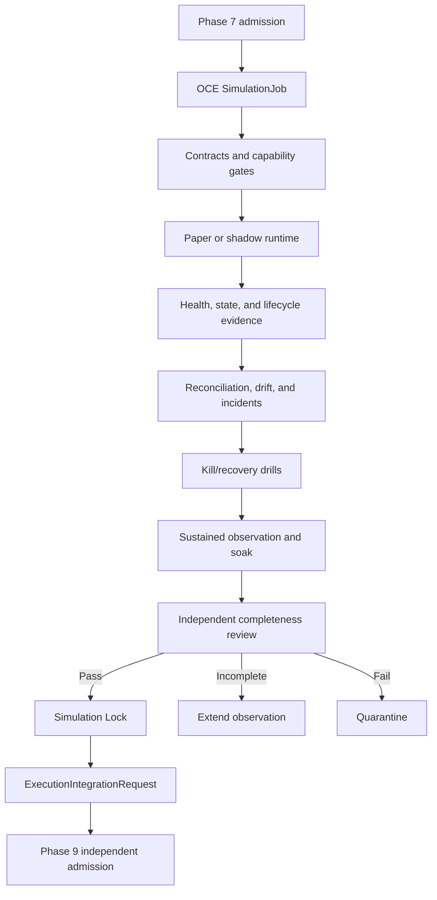

# Phase 8, Book 5 — Simulation Operations and Lock

> **Purpose:** Operate the complete simulation system through sustained observation, prove replay/recovery, lock its evidence, and hand bounded requirements to Execution Forge  
> **Input:** Books 1–4 contracts, ledgers, reconciliation, incidents, controls, reliability, and promotion evidence  
> **Output:** `SimulationLockManifest`, complete operational evidence, and nonauthorizing `ExecutionIntegrationRequest`  
> **Previous:** [Book 4 — Incidents, Kill Switches, and Promotion](book-4-incidents-kill-switches-promotion.md)  
> **Next:** Phase 9 — Execution Forge

---

## 1. Success Statement

OCE can run, observe, stop, recover, and reproduce the complete Phase 8 workflow over the required live-market observation window; sustained load and failure drills preserve identity and state; backups restore independently; all evidence is immutable and traceable; and Phase 9 receives exact execution requirements without inheriting live authority, capital allocation, or an already-approved order path.

---

## 2. Applicable Anchors

- **A0:** Human Strategic Authority
- **A1:** One Orchestration Spine
- **A2:** Evidence Before Narrative
- **A4:** StrategySpec Is Truth
- **A6:** Nautilus Is the Canonical Trading Model
- **A7:** OrderIntent Is the Execution Boundary
- **A8:** Promotion Is State-Based
- **A9:** Separate Research From Approval
- **A10:** Observable and Reconstructable
- **A11:** Repair Before Expansion
- **A12:** Cheap Models Use Tools, Not Memory
- **A13:** Local-First Heavy Compute
- **A14:** No Unofficial Production Broker Dependency
- **A15:** Live Autonomy Is Earned
- **F8:** Simulation proves the operating system

---

## 3. Operational Topology



---

## 4. Work Packages

### 4.1 SimulationJob

```yaml
simulation_job_id: typed-id
simulation_deployment_ref: artifact-ref
paper_eligibility_package_ref: artifact-ref
simulation_policy_ref: policy-ref
mode: internal_paper|sandbox_paper|live_market_shadow
observation_plan_ref: artifact-ref
market_and_session_bindings: []
state_namespace_ref: typed-ref
capability_certificate_ref: artifact-ref
resource_budget_ref: policy-ref
incident_and_kill_policy_refs: []
reconciliation_and_drift_policy_refs: []
idempotency_key: string
correlation_id: typed-id
```

OCE schedules and supervises simulation lifecycle tasks. Its software `ExecutionTask` remains categorically separate from a `SimulationIntent`, `ShadowIntent`, or future market `OrderIntent`.

### 4.2 Job graph

```text
proposed
admission_pending
capability_verified
runtime_ready
observing
paused
recovering
safe_hold
paper_review
shadow_review
soak_complete
lock_review
locked
handed_off
quarantined
invalidated
```

Transitions are guarded, idempotent, evented, and reconstructable. A process exit is not a lifecycle transition.

### 4.3 Mode-specific operation

`internal_paper`:

- local deterministic/canonical fill simulation;
- live or approved delayed market data as declared;
- isolated simulated account;
- no broker order endpoint.

`sandbox_paper`:

- verified sandbox/practice/testnet account only;
- sandbox order/fill lifecycle and provider snapshots;
- local expected-fill and state projections;
- continuous provider-versus-internal reconciliation.

`live_market_shadow`:

- approved live market data;
- terminal append-only nonrouting sink;
- hypothetical canonical expected execution only;
- no broker adapter, order endpoint, or account.

### 4.4 Observation scheduler

The scheduler tracks eligible observation time, not merely elapsed wall time. It accounts for:

- required trading sessions and session boundaries;
- market/provider outages and excluded intervals;
- deployment pauses and recovery periods;
- holidays, early closes, DST, rollover, and applicable corporate events;
- strategy event, intent, and lifecycle sample counts;
- required data regimes and explicitly missing regimes;
- drills completed under pinned fixture and policy versions.

The Phase 7 minimum may be extended by Phase 8 failures or incompleteness; it cannot be shortened by a favorable early result, agent opinion, model cost, or deadline.

### 4.5 Long soak

The final soak runs the complete production-shaped Phase 8 stack for the locked duration and scope:

- realistic concurrent deployment count;
- full market/session coverage;
- continuous heartbeats and checkpoints;
- intent/idempotency and lifecycle processing;
- scheduled and event reconciliation;
- drift and reliability measurement;
- bounded resource usage;
- log/metric/artifact rotation;
- disconnect/reconnect and restart exercises;
- kill-switch/containment/recovery drills;
- clean terminal observation period.

No debug bypass, reduced polling set, simplified state store, alternate fill model, relaxed policy, or privileged manual correction is allowed unless the final system will use that exact behavior.

### 4.6 Load and resource policy

Record:

- events, intents, orders, fills, and reconciliations per unit time;
- queue depth, lag, backpressure, dropped/rejected work;
- CPU, memory, storage, network, file descriptors, and process count;
- provider rate-limit usage and reconnect attempts;
- checkpoint/event-log latency and size;
- incident, kill, and recovery latency;
- model/agent calls, tokens, retries, cost, and unavailable-model behavior.

Free or slow models may propose research/explanations asynchronously, but deterministic guards, state transitions, kill switches, reconciliation, and timing-critical controls never wait on an LLM.

### 4.7 Reproducible replay

Replay consumes immutable:

- normalized market/session stream or bounded fixture;
- provider lifecycle events and snapshots;
- policies, capability state, strategy package, models, and calendars;
- actor/authority events;
- checkpoints and event-log prefix;
- incident and kill-switch triggers.

Replay must reproduce intent identities, lifecycle projections, reconciliation classifications, trigger decisions, and terminal state. Live observation itself cannot be recreated as new live history; the captured stream can be replayed as evidence with its source and limitations retained.

### 4.8 Fault campaign

Required deterministic drills include:

- stale feed and per-instrument staleness;
- sequence gap, duplicate, and reorder;
- market-data disconnect/reconnect;
- sandbox disconnect with uncertain submission;
- duplicate strategy and provider event delivery;
- partial fill during cancel;
- rejected and expired paper order;
- restart with pending order and open paper position;
- clock skew, DST, market close, holiday, and early close;
- corrupt/incompatible checkpoint;
- sandbox account/capability identity drift;
- internal-versus-provider reconciliation mismatch;
- paper/shadow drift threshold;
- resource exhaustion/backpressure;
- kill-switch trigger, containment failure, recovery denial, and approved recovery.

Each drill pins its fixture, injection point, expected state path, evidence, and cleanup/reset procedure.

### 4.9 Backup and restore

Back up:

- admission, policy, deployment, capability, and credential-readiness artifacts;
- runtime configuration and environment lock;
- normalized market/session evidence and cursors;
- checkpoints, append-only event logs, and hash chains;
- intent/order/fill/position/cash/fee ledgers;
- provider snapshots and redacted payload evidence;
- reconciliation, correction, and drift records;
- incident, kill-switch, containment, and recovery records;
- observation, reliability, promotion, and shadow qualification reports;
- job events, metrics, logs, resource evidence, and approvals;
- lock candidates and Phase 9 proposal artifacts.

Restore into a clean isolated namespace, verify hashes and schema compatibility, reconstruct state, reconcile terminal totals, and prove that restored runtimes remain stopped until separately authorized.

### 4.10 Invalidation

Material changes invalidate affected evidence:

- strategy package, parameters, semantic state machine, or scope;
- Strategy Lock, Validation Lock, or PaperEligibilityPackage;
- data normalization, symbology, calendar, clock, or session behavior;
- execution/fill, fees, latency, or risk assumptions;
- deployment mode, provider, account class, endpoint, or adapter;
- intent/lifecycle/idempotency/reconciliation semantics;
- checkpoint/event-log/projection behavior;
- incident, kill, recovery, reliability, or promotion policy;
- runtime environment, dependency, infrastructure, or isolation behavior;
- observation-window or scoring requirements.

The invalidation graph identifies which books/tests/windows must rerun. No agent may label a semantic change “configuration only” to preserve qualification.

### 4.11 Simulation Lock Manifest

```yaml
phase: 8
lock_id: immutable-id
created_at: timestamp
commit_sha: git-sha
strategy_build_package_ref: artifact-ref
strategy_lock_ref: artifact-ref
validation_lock_ref: artifact-ref
paper_eligibility_package_ref: artifact-ref
simulation_admission_ref: artifact-ref
simulation_policy_hash: content-hash
deployment_manifest_hashes: {}
mode_and_capability_certificate_refs: []
credential_readiness_attestation_ref: artifact-ref
runtime_environment_and_config_hashes: {}
market_data_and_session_binding_refs: []
observation_plan_and_window_refs: []
market_and_provider_evidence_hashes: {}
checkpoint_and_event_chain_roots: {}
intent_order_fill_ledger_hashes: {}
position_cash_fee_projection_hashes: {}
reconciliation_and_correction_refs: []
drift_evidence_refs: []
incident_and_kill_switch_refs: []
recovery_and_drill_refs: []
operational_reliability_report_refs: []
paper_to_shadow_promotion_ref: artifact-ref
shadow_qualification_ref: artifact-ref
soak_and_load_report_ref: artifact-ref
replay_report_ref: artifact-ref
backup_restore_report_ref: artifact-ref
known_limitations: []
qualified_scope: {}
disposition: qualified_for_phase9_proposal|extend_observation|quarantined
live_deployment_proposal_ref: optional-artifact-ref
approved_phase9_contract_version: semver
prohibited_authorities: []
approvals: []
```

The lock seals evidence and qualification scope. It does not freeze the repository, grant live authority, or prevent future changes; any material change follows invalidation and requalification.

### 4.12 ExecutionIntegrationRequest

```yaml
execution_integration_request_id: content-id
simulation_lock_ref: artifact-ref
live_deployment_proposal_ref: artifact-ref
qualified_strategy_scope: {}
required_asset_classes: []
venue_and_broker_requirements: []
market_session_and_tif_requirements: []
required_order_styles: []
required_lifecycle_events: []
idempotency_and_retry_requirements: {}
partial_fill_reject_cancel_requirements: {}
position_cash_fee_reconciliation_requirements: {}
latency_and_execution_envelopes: {}
risk_limit_and_permission_requirements: []
emergency_control_requirements: []
sandbox_certification_evidence_refs: []
operational_slos: {}
known_limitations_and_open_questions: []
requested_phase9_admission: true
canonical_order_intent: absent
live_adapter: absent
live_account_binding: absent
capital_allocation: none
live_authorization: false
```

Phase 9 independently owns:

- canonical `OrderIntent` and execution state machine;
- broker/exchange adapters and production endpoint controls;
- live account binding and credential capability;
- pre-trade permissions, limits, risk, and approvals;
- execution reports and live reconciliation;
- emergency controls appropriate to real exposure;
- staged live-deployment and capital-allocation decisions.

Phase 8 may provide evidence and requirements, but it cannot prebuild or preapprove these authorities.

### 4.13 Final review and handoff

Independent reviewers verify:

1. every Book 1–5 deliverable and required test;
2. exact upstream and runtime identities;
3. complete observation and clean terminal window;
4. no unresolved critical incident or material mismatch;
5. explainable paper/expected and paper/shadow variance;
6. kill-switch, recovery, replay, load, and restore evidence;
7. reliability disposition and limitations;
8. lock hashes and prohibited authorities;
9. Phase 9 request contains requirements only;
10. no live route, account binding, order intent, or capital allocation exists.

---

## 5. Target Layout

```text
simulation_forge/
  operations/
    job.py
    graph.py
    scheduler.py
    resources.py
    observability.py
    soak.py
    replay.py
    fault_campaign.py
    backup_restore.py
  lock/
    manifest.py
    verify.py
    invalidation.py
  handoff/
    execution_integration_request.py
    phase9_adapter.py
```

---

## 6. Deliverables

- OCE `SimulationJob` contract, lifecycle graph, and mode-specific runners.
- Eligible-session observation scheduler and completeness tracker.
- Production-shaped long-soak plan and clean-terminal-window rule.
- Load, resource, provider-limit, and local-first cost evidence.
- Deterministic replay harness and required fault campaign.
- Independent backup/restore drill.
- Material-change invalidation graph and rerun planner.
- `SimulationLockManifest` builder and verifier.
- Independent final-review checklist.
- Nonauthorizing `ExecutionIntegrationRequest` and Phase 9 adapter.

---

## 7. Required Tests

### P8-JOB-001 — Deterministic Job Identity

Fixed deployment, policy, mode, bindings, observation plan, and environment produce one job identity.

### P8-JOB-002 — Idempotent Job Start

Repeated start commands for one idempotency key create one logical running deployment.

### P8-JOB-003 — Guarded Transitions

Illegal job transitions fail closed and emit typed audit events.

### P8-JOB-004 — Process/Lifecycle Separation

A process exit, restart, or replacement cannot silently mark the job paused, recovered, complete, or locked.

### P8-JOB-005 — Mode-Specific Runner

Each mode exposes only its declared data, simulator/sandbox, state, and sink capabilities.

### P8-JOB-006 — OCE Task Separation

OCE `ExecutionTask` cannot be interpreted as a simulation, shadow, or market order intent.

### P8-JOB-007 — Resume Prerequisites

Resume requires health, checkpoint, capability, reconciliation, incident, and kill-switch gates.

### P8-JOB-008 — Concurrent Isolation

Concurrent deployments preserve independent state, cursors, ledgers, metrics, and control scope.

### P8-LOD-001 — Sustained Event Load

The stack handles the declared event/intent/lifecycle rate without data loss or identity collision.

### P8-LOD-002 — Backpressure

Queue pressure applies bounded backpressure or safe pause and never drops required ordered state silently.

### P8-LOD-003 — Provider Rate Limit

Sandbox polling/submission/recovery respects provider limits without unbounded retry.

### P8-LOD-004 — Resource Exhaustion

Memory, disk, worker, or descriptor pressure produces safe containment and reconstructable recovery.

### P8-LOD-005 — LLM Independence

Model slowness, failure, or exhaustion cannot delay deterministic safety, state, reconciliation, or kill controls.

### P8-SOK-001 — Required Soak Duration

Soak cannot complete before the pinned eligible duration, sessions, event counts, and drills.

### P8-SOK-002 — No Favorable Early Stop

Good early results cannot shorten the observation requirement.

### P8-SOK-003 — Production-Shaped Stack

The soak uses the same contracts, state store, policies, monitors, and controls intended for qualified simulation.

### P8-SOK-004 — Pause Accounting

Outage, pause, recovering, safe-hold, and excluded intervals do not count as eligible observation.

### P8-SOK-005 — Clean Terminal Window

Completion requires the declared final period with healthy data/session/runtime, clean reconciliation, and no unresolved material incident.

### P8-SOK-006 — Missing Regime Disclosure

Unobserved required or desired market regimes are explicit limitations and cannot be fabricated.

### P8-SOK-007 — Policy Stability

Strategy, scope, execution model, thresholds, and qualification policy remain pinned throughout the scored window.

### P8-RPY-001 — Deterministic Replay

The same captured evidence and versions reproduce intent IDs, projections, reconciliation classes, triggers, and terminal state.

### P8-RPY-002 — Disconnect/Restart Replay

Disconnect, reconnect, and restart fixtures preserve exactly-once intent and lifecycle effects.

### P8-RPY-003 — Incident/Kill Replay

The same trigger produces the expected incident severity, kill scope, containment path, and recovery gate.

### P8-RPY-004 — Partial/Cancel Replay

Partial fill during cancel reconstructs filled quantity, remaining state, fees, position, and cash.

### P8-RPY-005 — Evidence Mutation

Changed market event, provider payload, policy, checkpoint, or event order changes identity or fails verification.

### P8-RPY-006 — Live Observation Label

Captured-stream replay is never represented as a second independent live observation window.

### P8-BKP-001 — Independent Restore

A clean environment restores all required artifacts and reconstructs the same terminal state and hashes.

### P8-BKP-002 — Restore Stays Stopped

A restored deployment cannot emit intents or contact a sandbox until separately admitted and authorized.

### P8-BKP-003 — Missing Backup Component

Missing cursor, checkpoint, ledger, provider snapshot, incident, or policy evidence fails restore verification.

### P8-BKP-004 — Schema Compatibility

An incompatible schema/version cannot partially restore or silently coerce state.

### P8-BKP-005 — Secret Exclusion

Backups contain secret references and redacted evidence, never plaintext credentials.

### P8-INV-001 — Strategy Change

A semantic, parameter, state-machine, or scope change invalidates affected simulation evidence.

### P8-INV-002 — Upstream Lock Change

Changed or revoked Strategy/Validation Locks or PaperEligibilityPackage block lock and handoff.

### P8-INV-003 — Execution Semantics Change

Fill, fee, latency, lifecycle, idempotency, or reconciliation changes rerun affected books and windows.

### P8-INV-004 — Provider or Mode Change

Adapter, endpoint class, sandbox account class, provider, or mode change requires new capability and operational evidence.

### P8-INV-005 — Control Policy Change

Changed health, drift, incident, kill, recovery, scoring, or observation policy invalidates affected results.

### P8-INV-006 — Infrastructure Semantics Change

A runtime/state/isolation dependency change is assessed and rerun when behavior may differ.

### P8-INV-007 — No Configuration Disguise

An agent cannot preserve qualification by labeling a material semantic change as nonsemantic configuration.

### P8-E2E-001 — Full Simulation Path

A qualified Phase 7 package runs admission through paper, shadow, soak, review, lock, and Phase 9 request with complete lineage.

### P8-E2E-002 — Disconnect and Partial Fill

An end-to-end disconnect with an uncertain, partially filled order recovers without duplication and reconciles all state.

### P8-E2E-003 — Reject, Cancel, and Restart

Rejected, cancelled, expired, pending, and open-position restart paths remain reconstructable and safe.

### P8-E2E-004 — Market Close and Holiday

The full runtime observes close, early close, weekend/holiday, and session reopen without illegal intent or timer behavior.

### P8-E2E-005 — Kill and Recovery

A critical drill latches controls, contains state, denies premature recovery, and resumes only through approved bounded observation.

### P8-E2E-006 — Critical Failure Quarantine

A boundary breach, unresolved critical incident, or unreconciled material state produces quarantine and no lock-qualified handoff.

### P8-LCK-001 — Manifest Completeness

The Simulation Lock contains every required upstream, runtime, ledger, control, observation, report, limitation, and approval reference.

### P8-LCK-002 — Hash Verification

Mutation or absence of any locked critical artifact fails verification.

### P8-LCK-003 — Qualified Scope

The locked scope is the intersection of upstream validated scope and successfully observed simulation scope.

### P8-LCK-004 — Critical Exit Gate

No unresolved critical incident, unexplained material reconciliation difference, failed control drill, or incomplete window can lock as qualified.

### P8-LCK-005 — Known Limitations

Missing regimes, provider quirks, modeling gaps, and unresolved noncritical constraints remain explicit.

### P8-LCK-006 — Prohibited Authorities

The lock explicitly denies live adapter, account binding, canonical order intent, capital allocation, and live execution.

### P8-LCK-007 — Lock Invalidation

Material post-lock change marks the lock invalid before any further handoff use.

### P8-LCK-008 — Credential Readiness

The lock cannot qualify while an exposed credential remains reusable, rotation evidence is missing, or the secret-readiness attestation is expired.

### P8-HOF-001 — Phase 9 Handoff Boundary

The handoff contains execution requirements and evidence but no live adapter, live account, capital allocation, canonical `OrderIntent`, or authorization.

### P8-HOF-002 — Lifecycle Requirements

Phase 9 receives explicit partial-fill, reject, cancel, expiry, uncertainty, retry, and idempotency behavior.

### P8-HOF-003 — Risk and Permission Requirements

Phase 9 receives required pre-trade limits, permissions, emergency controls, and independent approval questions.

### P8-HOF-004 — Reconciliation Requirements

Phase 9 receives position, cash, fee, pending-order, and provider reconciliation expectations and tolerances.

### P8-HOF-005 — Sandbox Evidence

Every venue/adapter requirement traces to verified sandbox evidence or an explicit untested limitation.

### P8-HOF-006 — Phase 9 Independent Admission

Execution Forge independently verifies the request, upstream locks, evidence, scope, and authority before design or implementation.

### P8-HOF-007 — Open Question Preservation

Unknown broker, options, venue, account, risk, or operational behavior remains an open design question rather than an invented contract.

### P8-AUT-100 — Simulation Lock Is Not Live Approval

No job state, soak result, reliability score, promotion report, lock, or handoff can route an order, bind a live account, allocate capital, or authorize production trading.

---

## 8. Failure Modes

- OCE job completion is mistaken for market safety.
- Wall-clock time counts outages and pauses as observation.
- Favorable early results shorten the soak.
- A lightweight test stack differs from the final simulation stack.
- Replay is presented as independent new live evidence.
- Restore automatically resumes strategy output.
- LLM availability sits on the kill-switch or reconciliation path.
- A material adapter/runtime change keeps an old qualification.
- Known limitations disappear from the lock.
- Simulation Lock is treated as deployment permission.
- Phase 9 inherits an implicit account, broker, or capital choice.

---

## 9. Exit Gate

Phase 8 is complete only when the full production-shaped simulation stack survives the required eligible observation and fault campaign, all ledgers and state reconcile, paper/expected and paper/shadow variance is explainable, no critical incident remains unresolved, kill/recovery and restore drills pass, the final clean window is complete, independent review verifies the Simulation Lock, and the Phase 9 handoff contains requirements without execution authority.

Formally:

```text
Phase8Complete =
    Books1Through5Passed
    AND ObservationRequirementsSatisfied
    AND ProductionShapedSoakPassed
    AND ReconciliationClean
    AND VarianceExplainable
    AND NoUnresolvedCriticalIncident
    AND KillRecoveryReplayRestorePassed
    AND ReliabilityCriticalGatesPassed
    AND SimulationLockVerified
    AND Phase9HandoffHasNoLiveAuthority
```

---

## 10. Handoff

Execution Forge receives the verified `SimulationLockManifest`, `ExecutionIntegrationRequest`, `LiveDeploymentProposal`, sandbox and lifecycle evidence, operational SLOs, risk/control requirements, qualified scope, and known limitations.

Phase 9 must independently design and approve the canonical `OrderIntent`, production adapters, permissions, limits, execution reports, live reconciliation, staged rollout, account binding, and capital decision. Any need to change strategy semantics, validated scope, simulation behavior, or material execution assumptions returns through the applicable earlier forge and invalidates affected evidence.
