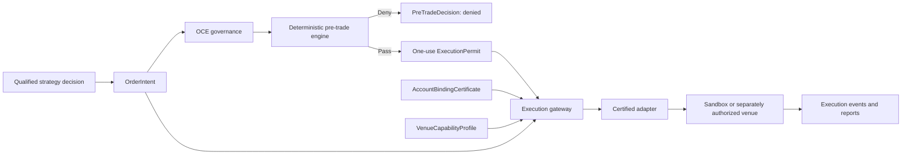
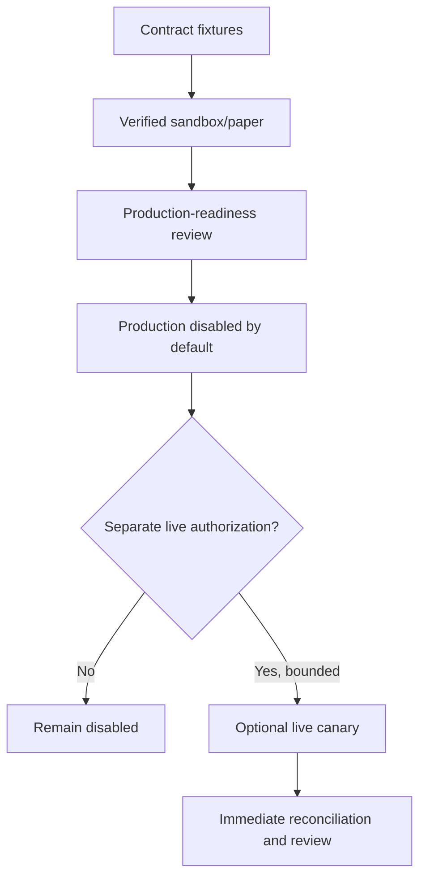
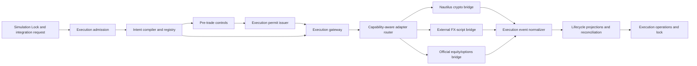
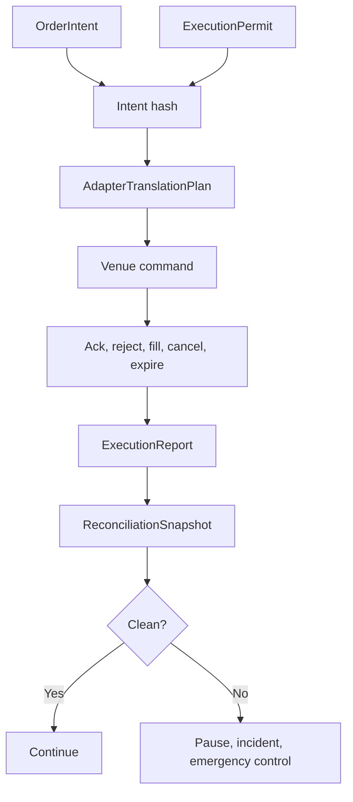

# Phase 9 — Execution Forge

> **Status:** Build-ready planning package  
> **Prerequisite:** Verified Phase 8 `SimulationLockManifest`, bounded `ExecutionIntegrationRequest`, and valid upstream Strategy/Validation Locks  
> **Produces:** Certified venue adapters, canonical execution evidence, `ExecutionLockManifest`, and a nonallocating Phase 10 portfolio handoff  
> **Anchor:** **F9 — Strategies request trades; adapters execute; governance authorizes.**

---

## 1. Idea

Unify multi-asset execution through one venue-neutral intent and one governed lifecycle while preserving the behavior that is genuinely specific to crypto, FX, equities, and options.

```text
SimulationLockManifest
→ ExecutionAdmission
→ canonical OrderIntent or OrderGroupIntent
→ deterministic pre-trade decision
→ one-use ExecutionPermit
→ certified venue adapter
→ venue acknowledgment and fills
→ normalized ExecutionReport
→ account/order/position/cash reconciliation
→ emergency-control and recovery proof
→ Execution Lock
→ Phase 10 portfolio-integration handoff
```

An `OrderIntent` requests an execution outcome. It is not an approval, broker payload, account binding, capital allocation, or permission to route.

---

## 2. Reality at Entry

The workspace contains useful execution ingredients, but no unified production boundary:

| Current seam | Repository evidence | Phase 9 treatment |
|---|---|---|
| Nautilus source tree | `projects/trading/nautilus_trader/version.json` declares v1.227.0 and the tree contains sandbox, crypto, Deribit, and Interactive Brokers adapters | Candidate canonical engine/adapter substrate only after Phase 0 provenance, local-diff, dependency, license, and runtime classification |
| Crypto adapters | Local Nautilus tree includes candidates such as Binance, Bybit, OKX, Kraken, dYdX, Deribit, and Hyperliquid | Certify only explicitly selected venues; source presence is not operational approval |
| Equity/options candidate | Local Nautilus Interactive Brokers adapter includes order, combo, and option-position handling | Candidate behind official API, account-permission, sandbox, lifecycle, and options-specific certification |
| FX path | Phase 0 requires the operator’s actual FX execution script to be identified separately | If unavailable or uninspectable, FX remains a critical blocked adapter; never substitute MT5 MCP |
| MT5 MCP | `projects/trading/mt5-mcp/` exposes direct trade functions and reusable strategy/backtest logic | Quarantined from the production execution path unless separately reclassified; not the operator’s declared FX executor |
| OANDA seam | `projects/trading/nautilus/oanda_adapter.py` selects practice/live URLs and currently fetches data | Data/reference seam only; not an execution adapter |
| OCE ExecutionEngine | `oce/backend/execution_engine.py` schedules skill/tool/pipeline/agent software tasks | Reuse for orchestration only; its `ExecutionTask` is never a market command |
| Credential debt | Phase 8 records apparent repository-exposed credential material | Every affected value is treated as compromised; Phase 9 admission requires current redacted rotation and scope evidence |

The workspace does **not** yet contain a canonical:

- `OrderIntent`, amend/cancel intent, or multi-leg `OrderGroupIntent`;
- one-use `ExecutionPermit`;
- account/environment binding certificate;
- venue capability registry;
- adapter conformance protocol;
- normalized venue command boundary;
- cross-venue `ExecutionReport`;
- production order lifecycle and uncertainty model;
- deterministic pre-trade permission/limit engine;
- options legging, assignment, exercise, and expiry controls;
- execution reconciliation service;
- asset-specific emergency-control fabric;
- adapter certification report;
- Execution Lock.

These entry seams are evidence, not permission to wire them together.

---

## 3. Canonical Decisions

All `A*` identifiers use the exact names and meanings from [`GLX_FORGE_MASTER_BLUEPRINT.md`](../../GLX_FORGE_MASTER_BLUEPRINT.md).

| Decision | Lock |
|---|---|
| Orchestration | OCE remains the sole execution control and authority spine |
| Strategy truth | Immutable qualified StrategySpec/StrategyIR within Simulation Lock scope |
| Canonical request | `OrderIntent`; multi-leg work uses hash-linked `OrderGroupIntent` |
| Lifecycle actions | Submit, amend, and cancel use separate typed intents |
| Authorization | A short-lived one-use `ExecutionPermit` bound to exact intent/account/environment |
| Pre-trade | Deterministic permission and limit decision; no LLM on the route path |
| Adapter role | Translate and execute only; never select a strategy, size capital, or self-authorize |
| Engine | Nautilus is canonical where the approved asset/venue path supports it |
| FX | Actual operator script behind an adapter; unavailable script means blocked FX |
| MT5 MCP | Not a production substitute |
| Equities/options | Official documented, permissioned broker API only |
| Crypto | Explicitly selected and certified Nautilus-native venue adapters |
| Account binding | Stable, redacted, environment-specific, expiring certificate |
| Environments | `contract_fixture`, `sandbox`, and `production_disabled_by_default` |
| Live activation | Separate human/governance authorization plus bounded capital envelope |
| Phase completion | Sandbox/chaos certification is sufficient; live canary is optional and separately authorized |
| Phase 10 boundary | Phase 9 proves execution mechanics; Phase 10 coordinates aggregate capital/exposure |
| Emergency action | Independent typed permit; “flatten” is never an unbounded generic command |
| APIs | No unofficial production broker dependency |

---

## 4. Authority Topology



Routing is valid only when:

```text
CanRoute =
    ExecutionAdmissionValid
    AND UpstreamLocksValid
    AND IntentSchemaAndScopeValid
    AND PreTradeDecisionPassed
    AND ExecutionPermitValidAndUnused
    AND PermitIntentHashMatches
    AND AccountBindingValid
    AND EnvironmentIdentityMatches
    AND AdapterCertifiedForRequestedCapability
    AND MarketSessionAndReferenceDataHealthy
    AND EmergencyControlsArmed
    AND NoBlockingIncidentOrReconciliationMismatch
```

No single agent, strategy, adapter, credential, configuration value, or model response satisfies this equation alone.

---

## 5. Execution Environments



### `contract_fixture`

No external route. Deterministic provider fixtures prove translation, lifecycle, failures, and reconciliation.

### `sandbox`

Only provider-recognized paper, demo, testnet, or sandbox accounts and endpoints. It exercises the real adapter protocol without real capital.

### `production_disabled_by_default`

Production code paths and endpoint identities may be certified statically, but credentials and routing remain unavailable until a separate authorization artifact exists.

### Optional live canary

A canary is not required to finish Phase 9. If MAD separately authorizes one, it has a one-time account, strategy, instrument, venue, duration, notional, loss, order-count, and emergency-action envelope. It cannot broaden itself or become a standing allocation.

---

## 6. Admission and Completion

Phase 9 admission requires:

```text
simulation_lock_valid
AND execution_integration_request_valid
AND upstream_scope_exact
AND credential_readiness_valid
AND selected_adapter_provenance_resolved
AND official_api_or_documented_external_script
AND account_environment_binding_verifiable
AND risk_and_emergency_policies_frozen
AND reconciliation_baseline_available
AND independent_reviewer_assigned
```

Phase 9 completes when:

```text
all_five_books_pass
AND every_selected_adapter_contract_passes
AND sandbox_lifecycle_and_fault_campaign_pass
AND idempotency_and_uncertainty_paths_pass
AND multi_asset_semantics_preserved
AND positions_orders_cash_fees_margin_reconcile
AND pretrade_and_emergency_controls_pass
AND production_code_remains_disabled_without_external_authorization
AND execution_lock_verifies
AND phase10_handoff_has_no_aggregate_capital_allocation
```

---

## 7. Book Sequence

| Book | Document | Builds | Exit |
|---:|---|---|---|
| 1 | [Execution Contracts and Authority](book-1-execution-contracts-authority.md) | Admission, `OrderIntent`, groups, permits, account/capability bindings | Nothing can route without exact intent, deterministic pass, and one-use authority |
| 2 | [Adapter Fabric and Asset Bridges](book-2-adapter-fabric-asset-bridges.md) | Adapter protocol, translation plans, crypto/FX/equity/options bridges | Every selected adapter preserves semantics or rejects explicitly |
| 3 | [Lifecycle, Reports, and Reconciliation](book-3-lifecycle-reports-reconciliation.md) | Order state machine, idempotency, delayed ack, reports, restart/reconciliation | Venue and internal state converge without blind retries or silent correction |
| 4 | [Pre-Trade Risk and Emergency Controls](book-4-pretrade-risk-emergency-controls.md) | Permissions, limits, asset-specific controls, multi-leg risk, emergency action | Every action is bounded before route and safely containable afterward |
| 5 | [Execution Operations and Lock](book-5-execution-operations-lock.md) | Certification, chaos/soak, optional canary gate, recovery, Execution Lock | Production readiness is proved without creating standing live authority |

Books execute in order. An adapter discovered in a later book cannot bypass Book 1 contracts or Book 4 controls.

---

## 8. Architecture





---

## 9. Core Artifacts

| Artifact | Purpose |
|---|---|
| `ExecutionAdmission` | Verifies Phase 8 evidence, scope, dependencies, and reviewers |
| `ExecutionPolicy` | Freezes routing, lifecycle, reconciliation, risk, certification, and canary rules |
| `VenueCapabilityProfile` | Machine-readable supported/unsupported venue behavior |
| `AccountBindingCertificate` | Redacted proof of account, environment, permissions, and endpoint class |
| `OrderIntent` | Venue-neutral request to submit one atomic order |
| `OrderGroupIntent` | Coordinated bracket, OCO, basket, or multi-leg request |
| `OrderAmendIntent` | Hash-linked request to modify an existing order |
| `OrderCancelIntent` | Hash-linked request to cancel an existing order |
| `PreTradeDecision` | Deterministic allow/deny result with every rule outcome |
| `ExecutionPermit` | Expiring one-use authorization bound to exact action and account |
| `AdapterTranslationPlan` | Reviewable mapping from canonical semantics to venue semantics |
| `VenueCommandRecord` | Redacted hash of the exact submitted venue command |
| `ExecutionEvent` | Normalized immutable provider lifecycle event |
| `ExecutionReport` | Canonical requested/accepted/rejected/filled/cancelled outcome |
| `ExecutionStateSnapshot` | Durable order/group/position/cash/fee/margin projection |
| `ExecutionReconciliationSnapshot` | Internal, adapter, and venue-state comparison |
| `EmergencyControlState` | Independent block/cancel/reduce/hold control state |
| `AdapterCertificationReport` | Contract, sandbox, chaos, load, and limitation evidence |
| `ProductionReadinessProposal` | Nonauthorizing statement of production readiness and gaps |
| `LiveCanaryAuthorization` | Optional external human/governance canary authority |
| `ExecutionLockManifest` | Immutable Phase 9 completion proof |
| `PortfolioExecutionHandoff` | Phase 10 capability, cost, liquidity, and hard-limit input |

---

## 10. Canonical Intent Boundary

```yaml
order_intent_id: content-id
intent_version: semver
execution_admission_ref: artifact-ref
strategy_package_ref: artifact-ref
simulation_lock_ref: artifact-ref
strategy_instance_id: typed-id
semantic_event_id: typed-id
instrument_id: canonical-id
side: buy|sell
position_effect: open|increase|reduce|close
quantity: decimal
order_type: market|limit|stop_market|stop_limit|trailing|market_if_touched|limit_if_touched
limit_price: optional-decimal
stop_price: optional-decimal
trigger_type: optional-enum
trailing_offset: optional-record
time_in_force: GTC|GTD|DAY|IOC|FOK|AT_OPEN|AT_CLOSE
expire_time: optional-timestamp
post_only: boolean
reduce_only: boolean
display_quantity: optional-decimal
contingency_ref: optional-typed-id
order_group_ref: optional-typed-id
execution_constraints: {}
decision_market_cursor: cursor
decision_state_hash: content-hash
created_at: timestamp
valid_until: timestamp
idempotency_key: string
```

Forbidden fields include raw credentials, provider-native payloads, mutable strategy code, implicit account selection, unconstrained “best available” venue, and standing capital authority.

---

## 11. Asset-Class Preservation Matrix

| Dimension | Crypto | FX/CFD | Equities | Options |
|---|---|---|---|---|
| Quantity | Base/quote/contracts | Lots/units | Shares/fractional rules | Contracts and leg ratios |
| Account model | Spot/margin/futures | Hedging/netting, leverage | Cash/margin | Options level and buying power |
| Position controls | Reduce-only, position mode | Min distance, stop level | Locate/short/extended hours | Defined risk, naked exposure, assignment |
| Lifecycle | 24/7 maintenance/funding | Session/rollover | Exchange sessions/halts | Expiry/exercise/settlement |
| Group semantics | Bracket/OCO where supported | Broker-specific attached orders | Bracket/OCO | Native combo or declared legging |
| Emergency concern | Liquidation and venue outage | Gap/margin/terminal state | Halt/locate/corporate action | Leg risk, expiry, assignment, pin risk |

Venue-neutral does not mean lowest-common-denominator. Unsupported semantics are rejected, never silently downgraded.

---

## 12. Target Layout

```text
execution_forge/
  contracts/
    admission.py
    policy.py
    order_intent.py
    order_group_intent.py
    lifecycle_intents.py
    permit.py
  capabilities/
    venue_profile.py
    account_binding.py
    environment_guard.py
  gateway/
    preflight.py
    router.py
    translation_plan.py
    submission.py
  adapters/
    protocol.py
    nautilus/
    crypto/
    fx_external/
    equities/
    options/
  lifecycle/
  reports/
  reconciliation/
  risk/
  emergency/
  certification/
  operations/
  lock/
  handoff/
```

The exact repository path is chosen during implementation from the approved Reality Lock. Agents may not create a second orchestration spine or patch the vendored Nautilus tree casually.

---

## 13. Critical Test Matrix

| Test | Proof | Book |
|---|---|---:|
| P9-ADM-001 | Valid Simulation Lock and bounded request admit once | 1 |
| P9-INT-001 | Canonical intent round-trips without venue leakage | 1 |
| P9-PER-001 | Permit is exact, expiring, and one-use | 1 |
| P9-BND-001 | Account/environment mismatch fails closed | 1 |
| P9-ADP-001 | Every adapter passes the same conformance contract | 2 |
| P9-FXS-001 | Missing actual FX script blocks FX without MT5 substitution | 2 |
| P9-OPT-001 | Multi-leg capability and atomicity are explicit | 2 |
| P9-IDM-001 | Retry cannot duplicate a venue order | 3 |
| P9-ACK-001 | Delayed acknowledgment enters uncertainty, not blind retry | 3 |
| P9-FIL-001 | Partial fills preserve quantity, price, fee, and group state | 3 |
| P9-REC-001 | Internal and venue order/position/cash state reconcile | 3 |
| P9-RST-001 | Restart resolves open and uncertain orders before routing | 3 |
| P9-RSK-001 | Price, size, permission, and capital limits deny pre-route | 4 |
| P9-MLG-001 | Multi-leg max loss and legging constraints enforce | 4 |
| P9-EMG-001 | Emergency control blocks new routing and preserves uncertainty | 4 |
| P9-CERT-001 | Adapter cannot certify without contract and sandbox evidence | 5 |
| P9-CAN-001 | Live canary is impossible without separate bounded authorization | 5 |
| P9-LCK-001 | Execution Lock verifies every selected adapter and control | 5 |
| P9-HOF-001 | Phase 10 receives capabilities without aggregate allocation | 5 |
| P9-AUT-100 | Execution Lock is readiness evidence, not standing live authority | 5 |

---

## 14. Phase Invariants

1. OCE is the sole execution authority spine.
2. OCE software `ExecutionTask` is never a market instruction.
3. Only a valid Phase 8 Simulation Lock may admit.
4. Execution scope cannot exceed Strategy, Validation, or Simulation Locks.
5. `OrderIntent` is venue-neutral and immutable.
6. `OrderIntent` alone cannot route.
7. Every submit, amend, cancel, or emergency action has a distinct typed authority.
8. Every `ExecutionPermit` binds one action hash, account, environment, and validity window.
9. A permit is single-use even after timeout, retry, restart, or failover.
10. Pre-trade rules are deterministic and versioned.
11. LLM/model availability is absent from routing, risk, reconciliation, and emergency paths.
12. Adapters translate; they do not decide.
13. Strategies and agents cannot call adapters directly.
14. Venue capability must be positively proven.
15. Unsupported semantics fail instead of degrading silently.
16. Account and endpoint environment identities must match.
17. Production is disabled by default.
18. Sandbox failure cannot fall back to production.
19. Official documented APIs are required for production brokers/venues.
20. The operator’s actual FX script is distinct from MT5 MCP.
21. Unavailable FX script means blocked FX execution.
22. Vendored Nautilus code is pinned and classified before use.
23. Every client-order ID is deterministic and venue-safe.
24. Submission timeout creates uncertainty, not permission to resend.
25. Provider events are deduplicated before effects.
26. Partial fill, reject, cancel, expire, and amend states remain distinct.
27. A cancel request is not a cancellation.
28. Internal, adapter, account, and venue state reconcile continuously.
29. No side wins reconciliation by silent overwrite.
30. Manual/external activity is visible and classified.
31. Price, size, session, permission, margin, and capital checks occur before route.
32. Options contract identity includes multiplier, expiry, strike, right, style, and settlement.
33. Multi-leg atomicity and legging policy are explicit.
34. Naked options exposure is denied by default.
35. Emergency controls are independent from strategy code.
36. “Flatten” requires bounded instrument/account/action authority and confirmation.
37. Unknown exposure is never reported as flat.
38. Secret values never enter intents, permits, reports, logs, or locks.
39. Repository-exposed credentials are never reused.
40. Adapter certification is environment-, account-class-, capability-, and version-specific.
41. Live canary is optional and separately authorized by MAD/governance.
42. A canary cannot become a standing allocation.
43. Phase 9 does not allocate aggregate portfolio capital.
44. Material adapter, broker, venue, account, policy, or runtime changes invalidate evidence.
45. Execution Lock proves readiness; it does not compel or authorize live trading.

---

## 15. Agent Extension Contract

An agent extending Phase 9 must:

1. read this blueprint, the active book, and the exact upstream locks;
2. restate the canonical A7 and F9 boundaries;
3. declare asset, venue, account class, environment, and requested capability;
4. prove adapter provenance and official/documented API status;
5. preserve canonical intent semantics;
6. keep deterministic controls outside model judgment;
7. add contract, sandbox, fault, restart, and reconciliation tests;
8. record unsupported behavior and limitations;
9. stop on unresolved account, credential, capability, state, or authority ambiguity;
10. hand only bounded capability evidence to Phase 10.

The agent must pause when the actual FX script is unavailable, an adapter role is unclassified, live permissions appear without external authorization, an intent/permit hash differs, state cannot reconcile, options atomicity is unknown, or an upstream lock changes.

---

## 16. Completion Definition

Phase 9 is complete only when:

- canonical submit/amend/cancel/group contracts are immutable and versioned;
- one-use intent-bound permits and account bindings pass;
- every selected adapter passes the shared conformance suite;
- selected crypto paths preserve Nautilus semantics;
- FX is either certified through the actual script or explicitly blocked;
- equities/options use an official documented API and pass asset-specific tests;
- idempotency, delayed acknowledgment, partial fill, rejection, cancellation, expiry, and restart tests pass;
- execution reports and order/position/cash/fee/margin state reconcile;
- deterministic permissions, limits, and emergency controls pass;
- options multi-leg, expiry, assignment, exercise, and leg-risk boundaries pass where in scope;
- sandbox chaos and soak certification complete;
- any production path remains disabled without separate authorization;
- the Execution Lock verifies;
- Phase 10 receives no implicit account choice or aggregate capital allocation.

---

## 17. Handoff to Phase 10

Portfolio Forge receives:

- immutable Strategy, Validation, Simulation, and Execution Locks;
- certified venue/asset/account-class capability profiles;
- canonical intent, group, permit, lifecycle, and report versions;
- adapter versions, environments, limitations, and operational SLOs;
- execution-cost, latency, slippage, rejection, fill, and capacity evidence;
- position/cash/fee/margin reconciliation rules;
- asset-specific risk and emergency-control behavior;
- optional canary evidence, clearly separated from authorization;
- a `PortfolioExecutionHandoff` with zero aggregate allocation.

Phase 10 owns cross-strategy conflicts, portfolio exposure, concentration, capacity, and aggregate capital envelopes. It cannot reinterpret adapter capability as permission to deploy a strategy or use capital.
