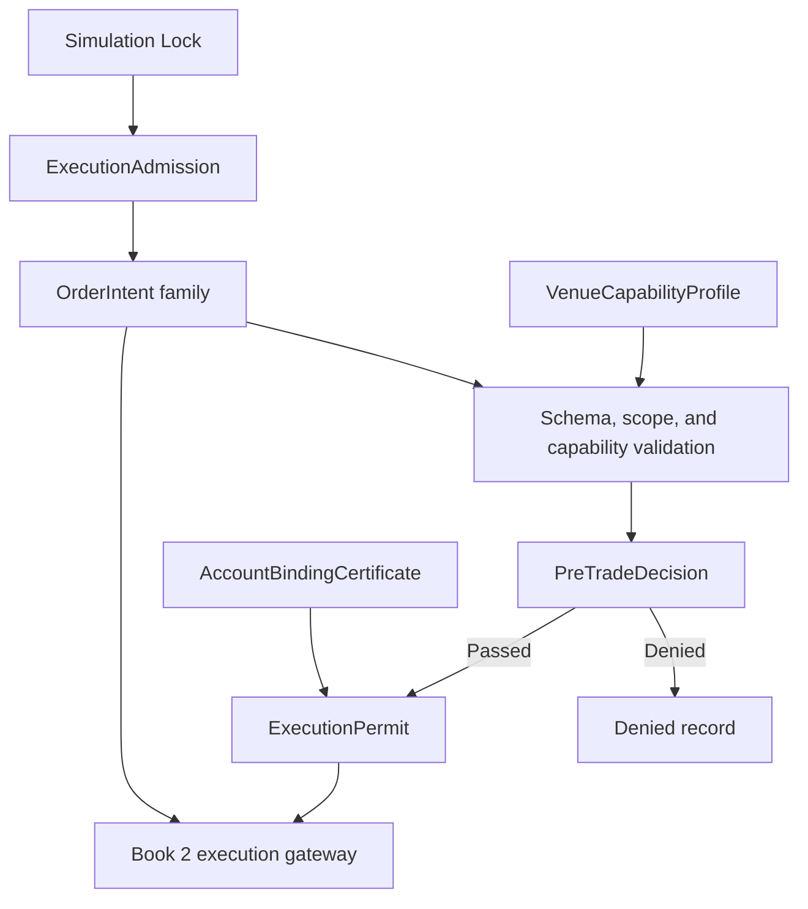

# Phase 9, Book 1 — Execution Contracts and Authority

> **Purpose:** Admit exact Simulation Lock scope, define canonical execution contracts, and make routing impossible without intent-bound one-use authority  
> **Input:** Phase 8 `SimulationLockManifest`, `ExecutionIntegrationRequest`, `LiveDeploymentProposal`, and valid upstream locks  
> **Output:** `ExecutionAdmission`, `ExecutionPolicy`, canonical intent family, capability/account contracts, and `ExecutionPermit`  
> **Previous:** Phase 8 — Simulation Forge  
> **Next:** [Book 2 — Adapter Fabric and Asset Bridges](book-2-adapter-fabric-asset-bridges.md)

---

## 1. Success Statement

Every requested execution action is immutable, venue-neutral, scope-valid, and independently authorized; every permit binds one exact action to one certified account/environment and is consumed before external submission; and no strategy, agent, adapter, configuration value, credential, or retry can create standing authority.

---

## 2. Applicable Anchors

- **A0:** Human Strategic Authority
- **A1:** One Orchestration Spine
- **A4:** StrategySpec Is Truth
- **A6:** Nautilus Is the Canonical Trading Model
- **A7:** OrderIntent Is the Execution Boundary
- **A8:** Promotion Is State-Based
- **A9:** Separate Research From Approval
- **A10:** Observable and Reconstructable
- **A11:** Repair Before Expansion
- **A14:** No Unofficial Production Broker Dependency
- **A15:** Live Autonomy Is Earned
- **F8:** Simulation qualification proves the system
- **F9:** Strategies request; adapters execute; governance authorizes

---

## 3. Contract and Authority Topology



---

## 4. Work Packages

### 4.1 Execution admission

Verify:

- Strategy, Validation, Simulation, and package hashes;
- Phase 8 disposition and qualified execution scope;
- requested assets, instruments, venues, sessions, order features, and limitations;
- selected adapter provenance/classification status;
- official documented API or inspectable external-script status;
- credential-readiness and rotation evidence;
- account/environment binding ability;
- pre-trade, reconciliation, incident, and emergency policy readiness;
- independent reviewer and authority owner;
- no unresolved critical Phase 8 incident or invalidation.

```yaml
execution_admission_id: content-id
simulation_lock_ref: artifact-ref
execution_integration_request_ref: artifact-ref
live_deployment_proposal_ref: artifact-ref
upstream_lock_refs: []
qualified_scope: {}
requested_adapter_refs: []
dependency_resolution: {}
credential_readiness_ref: artifact-ref
review_policy_ref: policy-ref
status: proposed|admitted|rejected|blocked
blocking_reasons: []
approvals: []
```

Admission creates no account binding, permit, order, route, position, or capital allocation.

### 4.2 ExecutionPolicy

```yaml
execution_policy_id: content-id
admission_ref: artifact-ref
allowed_environments: [contract_fixture, sandbox, production_disabled_by_default]
intent_schema_versions: []
capability_policy_ref: policy-ref
account_binding_policy_ref: policy-ref
pretrade_policy_ref: policy-ref
permit_policy_ref: policy-ref
lifecycle_policy_ref: policy-ref
idempotency_policy_ref: policy-ref
reconciliation_policy_ref: policy-ref
emergency_policy_ref: policy-ref
certification_policy_ref: policy-ref
optional_canary_policy_ref: policy-ref
prohibited_capabilities: []
```

Policies are frozen before adapter tests. Changing a semantic policy invalidates affected evidence.

### 4.3 VenueCapabilityProfile

```yaml
venue_capability_profile_id: content-id
adapter_id: typed-id
adapter_version: immutable-version
venue_id: canonical-id
environment_class: fixture|sandbox|production
asset_classes: []
instrument_classes: []
account_models: []
position_models: []
supported_order_types: []
supported_time_in_force: []
supported_triggers: []
quantity_and_price_constraints: {}
session_and_calendar_behavior: {}
idempotency_behavior: {}
amend_behavior: {}
cancel_behavior: {}
contingency_behavior: {}
multi_leg_behavior: {}
report_and_snapshot_behavior: {}
rate_limits: {}
known_unsupported_semantics: []
evidence_refs: []
valid_from: timestamp
expires_at: timestamp
```

An unsupported field is explicit. Absence never means “probably supported.”

### 4.4 AccountBindingCertificate

```yaml
account_binding_certificate_id: content-id
adapter_id: typed-id
venue_id: canonical-id
environment_identity: provider-verified-id
environment_class: fixture|sandbox|production
account_ref: redacted-stable-ref
account_class: paper|demo|testnet|cash|margin|portfolio_margin|other
asset_permissions: []
instrument_permissions: []
order_permissions: []
options_permission_level: optional-typed-value
short_sale_permission: boolean
margin_permission: boolean
funding_permission: false
withdrawal_permission: false
endpoint_allowlist: []
credential_readiness_ref: artifact-ref
verification_method: {}
verified_at: timestamp
expires_at: timestamp
revocation_state: active|revoked|expired
```

Phase 9 execution credentials never need funding or withdrawal capability. A sandbox certificate cannot bind a production endpoint, and a production certificate does not activate routing.

### 4.5 OrderIntent

```yaml
order_intent_id: content-id
schema_version: semver
execution_admission_ref: artifact-ref
execution_policy_ref: policy-ref
strategy_package_ref: artifact-ref
simulation_lock_ref: artifact-ref
strategy_instance_id: typed-id
semantic_event_id: typed-id
intent_ordinal: integer
instrument_id: canonical-id
side: buy|sell
position_effect: open|increase|reduce|close
quantity: decimal
quantity_unit: canonical-unit
order_type: market|limit|stop_market|stop_limit|trailing|market_if_touched|limit_if_touched
limit_price: optional-decimal
stop_price: optional-decimal
trigger_type: optional-typed-value
trailing_offset: optional-record
time_in_force: GTC|GTD|DAY|IOC|FOK|AT_OPEN|AT_CLOSE
expire_time: optional-timestamp
post_only: boolean
reduce_only: boolean
display_quantity: optional-decimal
contingency_ref: optional-typed-id
order_group_ref: optional-typed-id
execution_constraints: {}
decision_market_cursor: cursor
decision_state_hash: content-hash
risk_context_hash: content-hash
created_at: timestamp
valid_until: timestamp
idempotency_key: string
```

OrderIntent contains canonical semantics only. It excludes:

- provider-native symbols and payloads;
- adapter selection based on mutable “best” logic;
- raw account identifiers or credentials;
- unbounded slippage or quantity;
- standing approvals;
- hidden default order type, TIF, or session;
- executable strategy code;
- prose an adapter must interpret.

### 4.6 OrderGroupIntent

```yaml
order_group_intent_id: content-id
schema_version: semver
group_type: bracket|oco|multi_leg|basket
member_intent_refs: []
group_quantity_basis: {}
group_side_semantics: {}
net_price_constraint: optional-record
atomicity: native_atomic_required|native_atomic_preferred|controlled_legging_allowed|independent
legging_policy_ref: optional-policy-ref
contingency_graph: {}
group_time_in_force: typed-value
group_valid_until: timestamp
maximum_group_loss_ref: policy-ref
idempotency_key: string
```

For options, every leg has independent canonical instrument identity, side, ratio, effect, and quantity. A group cannot be decomposed unless the declared atomicity/legging policy and pre-trade decision permit it.

### 4.7 Amend and cancel intents

```yaml
order_amend_intent_id: content-id
original_order_intent_ref: artifact-ref
current_execution_state_ref: artifact-ref
expected_venue_version: optional-string
field_changes: {}
reason: typed-reason
created_at: timestamp
valid_until: timestamp
idempotency_key: string
```

```yaml
order_cancel_intent_id: content-id
original_order_intent_ref: artifact-ref
current_execution_state_ref: artifact-ref
cancel_scope: single|group|all_for_strategy|all_for_account
reason: typed-reason
created_at: timestamp
valid_until: timestamp
idempotency_key: string
```

Broad cancel scopes require explicitly broader authority. An amend that materially changes side, instrument, quantity envelope, position effect, or risk becomes a new `OrderIntent`.

### 4.8 PreTradeDecision contract

```yaml
pretrade_decision_id: content-id
action_ref: artifact-ref
account_binding_ref: artifact-ref
capability_profile_ref: artifact-ref
market_and_reference_snapshot_refs: []
position_cash_margin_snapshot_ref: artifact-ref
rule_set_hash: content-hash
rule_results: []
aggregate_result: pass|deny|indeterminate
denial_reasons: []
decision_time: timestamp
valid_until: timestamp
```

`indeterminate` denies route. Book 4 defines the complete rules and asset-specific checks.

### 4.9 ExecutionPermit

```yaml
execution_permit_id: content-id
action_ref: artifact-ref
action_hash: content-hash
pretrade_decision_ref: artifact-ref
account_binding_ref: artifact-ref
adapter_and_capability_ref: artifact-ref
environment_identity: verified-id
allowed_operation: submit|amend|cancel|emergency_cancel|emergency_reduce
allowed_quantity_or_scope: {}
issued_by_capability: typed-capability
issued_at: timestamp
not_before: timestamp
expires_at: timestamp
permit_nonce: random-opaque-id
maximum_route_attempts: 1
consumption_state: unconsumed|reserved|consumed|expired|revoked
```

The gateway atomically reserves and consumes the permit **before** any external send attempt. A timeout does not restore it. Recovery queries the venue by deterministic client-order ID; a new route requires a new reviewed action/permit.

### 4.10 Stable action identity

For a submit:

```text
logical_action_key =
    execution_admission_id
    + strategy_instance_id
    + semantic_event_id
    + intent_ordinal
    + canonical_action_type
```

`client_order_id` is deterministically derived from the action identity plus a bounded adapter-safe encoding. Provider length/character limits cannot truncate distinct identities into collision.

Amend, cancel, and emergency actions receive separate identities and causal links.

### 4.11 Authority event chain

```text
execution.admission.proposed
→ execution.admission.approved
→ execution.intent.recorded
→ execution.pretrade.decided
→ execution.permit.issued
→ execution.permit.reserved
→ execution.permit.consumed
→ execution.route.attempted
```

Denied, expired, revoked, uncertain, and recovered branches are first-class events.

### 4.12 Configuration and secret boundary

Environment variables or runtime config may supply secret references and local connection addresses only where policy permits. They cannot:

- change fixture/sandbox/production class;
- select a different account;
- widen scope or permissions;
- change quantity, price, TIF, strategy, or limits;
- issue or restore a permit;
- enable live routing;
- turn an unsupported capability into supported.

Every repository-exposed credential is presumed compromised and cannot appear in a binding certificate.

### 4.13 OCE task/execution distinction

OCE `ExecutionTask` is the orchestration job that may evaluate contracts or schedule work. Market execution requires the complete Phase 9 artifact chain. The identical word “execution” creates no type conversion or authority.

---

## 5. Target Layout

```text
execution_forge/
  contracts/
    admission.py
    policy.py
    order_intent.py
    order_group_intent.py
    lifecycle_intents.py
    pretrade_decision.py
    execution_permit.py
  capabilities/
    venue_profile.py
    account_binding.py
    registry.py
  authority/
    issuer.py
    consumption.py
    events.py
  identity/
    action_id.py
    client_order_id.py
  security/
    config_guard.py
    credential_readiness.py
```

---

## 6. Deliverables

- Phase 8-to-9 admission adapter and blocker registry.
- Immutable `ExecutionPolicy`.
- Versioned canonical `OrderIntent`.
- `OrderGroupIntent` for bracket/OCO/multi-leg/basket semantics.
- Separate amend and cancel intent contracts.
- `VenueCapabilityProfile` schema and registry.
- `AccountBindingCertificate` and environment guard.
- `PreTradeDecision` interface.
- One-use `ExecutionPermit` issuer/consumer protocol.
- Collision-safe deterministic action/client-order identity.
- Authority event chain and audit records.
- Configuration, secret-reference, and OCE vocabulary guards.

---

## 7. Required Tests

### P9-ADM-001 — Valid Execution Admission

A valid Simulation Lock and bounded integration request create one scoped admission.

### P9-ADM-002 — Invalid Upstream Lock

Changed, missing, revoked, or unverifiable Strategy, Validation, or Simulation Lock blocks admission.

### P9-ADM-003 — Scope Expansion

An asset, instrument, venue, session, order feature, or strategy behavior outside qualified scope rejects.

### P9-ADM-004 — Unresolved Dependency

An unclassified adapter, unavailable required external script, or undocumented API produces `blocked`, not an invented substitute.

### P9-ADM-005 — Critical Incident

An unresolved critical Phase 8 incident or reconciliation mismatch prevents admission.

### P9-ADM-006 — Idempotent Admission

Repeated admission of identical evidence creates one logical record.

### P9-CNT-001 — Policy Freeze

Routing, risk, permit, lifecycle, and certification policies remain content-pinned through their evidence window.

### P9-CNT-002 — Unknown Schema Version

Unknown or unsupported intent, permit, capability, or binding versions fail closed.

### P9-CNT-003 — Contract Round Trip

Every contract serializes/deserializes without semantic loss and preserves its content identity.

### P9-CNT-004 — Required Field Failure

Missing typed identity, lineage, scope, time, quantity, or policy data fails before pre-trade evaluation.

### P9-INT-001 — Venue-Neutral Intent

Canonical `OrderIntent` round-trips without provider payload, raw account, endpoint, or credential fields.

### P9-INT-002 — Deterministic Intent Identity

Fixed strategy lifecycle, semantic event, ordinal, and semantics produce the same intent ID.

### P9-INT-003 — Material Change Identity

Changing side, instrument, quantity, price, type, TIF, position effect, or constraints changes the intent ID.

### P9-INT-004 — Invalid Quantity

Zero, negative, nonfinite, overprecision, or undeclared-unit quantity rejects.

### P9-INT-005 — Invalid Price Structure

Missing required limit/stop values, impossible trigger relationships, or nonfinite prices reject.

### P9-INT-006 — Intent Expiry

An expired or not-yet-valid intent cannot receive a route permit.

### P9-INT-007 — Position Effect

Open, increase, reduce, and close are explicit; reduce-only cannot increase or reverse exposure.

### P9-INT-008 — Hidden Defaults

Missing TIF, order type, session, or trigger semantics cannot be silently supplied by an adapter.

### P9-INT-009 — Provider Field Rejection

A provider-native symbol, payload, account ID, or endpoint embedded in intent fails schema validation.

### P9-INT-010 — Stable Market Context

Intent decision cursor, strategy state, and risk context hashes trace to immutable evidence.

### P9-GRP-001 — Group Membership

Every group member exists, is unique, is scope-valid, and references the same approved strategy/deployment context.

### P9-GRP-002 — Options Leg Identity

Every options leg preserves instrument, side, ratio, quantity, effect, multiplier, and expiry identity.

### P9-GRP-003 — Atomicity Declaration

A multi-leg group without explicit atomicity and legging semantics rejects.

### P9-GRP-004 — Contingency Graph

Bracket/OCO activation and cancellation relationships are acyclic, complete, and deterministic.

### P9-GRP-005 — Group Loss Reference

A group cannot pass without a bound maximum-loss policy and risk context.

### P9-GRP-006 — Group Expiry

Expired group or member validity invalidates the whole required-atomic group.

### P9-GRP-007 — Silent Decomposition Denial

An adapter cannot decompose a native-atomic-required group into independent orders.

### P9-PER-001 — Exact One-Use Permit

A permit routes only its exact action hash, account binding, adapter capability, environment, and operation once.

### P9-PER-002 — Permit Expiry

Expired, not-yet-valid, revoked, or consumed permit rejects.

### P9-PER-003 — Hash Mismatch

Any action mutation after permit issuance causes a mismatch and denial.

### P9-PER-004 — Account Mismatch

A permit cannot route through another account or account class.

### P9-PER-005 — Environment Mismatch

A sandbox permit cannot reach production, and a production certificate alone cannot issue a permit.

### P9-PER-006 — Atomic Consumption

Concurrent consumers of one permit produce one reservation/consumption winner.

### P9-PER-007 — Timeout Does Not Refund

Submission timeout leaves the permit consumed and starts uncertainty recovery.

### P9-PER-008 — Operation Scope

A submit permit cannot amend/cancel; a cancel permit cannot submit or increase exposure.

### P9-PER-009 — Permit Issuer Separation

Strategy and adapter code cannot issue, alter, revive, or self-approve a permit.

### P9-BND-001 — Account and Environment Binding

Route requires exact active account, endpoint class, environment identity, and adapter binding.

### P9-BND-002 — Binding Expiry or Revocation

Expired or revoked binding blocks new permits and routes.

### P9-BND-003 — Permission Verification

Requested asset, instrument, order, margin, short, or options permission must be positively present.

### P9-BND-004 — Funding and Withdrawal Denial

Execution credentials and adapters expose no funding or withdrawal operation.

### P9-BND-005 — Endpoint Allowlist

DNS/URL/host override outside the certified allowlist fails before credential use.

### P9-BND-006 — No Environment Fallback

Fixture/sandbox connection failure cannot fall back to production.

### P9-BND-007 — Identity Drift

Changed account, server, environment, endpoint, or permission state invalidates the certificate.

### P9-CAP-001 — Explicit Capability

Only positively declared and evidenced order/session/account features are supported.

### P9-CAP-002 — Unsupported Capability

Unsupported or unknown semantics reject without approximation.

### P9-CAP-003 — Capability Expiry

Expired profile blocks new permits until recertified.

### P9-CAP-004 — Version Binding

A profile certified for one adapter version cannot certify another version.

### P9-CAP-005 — Production Capability Isolation

Production capability metadata cannot activate credentials, account binding, or routing.

### P9-CAP-006 — Conflicting Profile

Conflicting capability evidence fails admission/certification rather than choosing the favorable claim.

### P9-CFG-001 — Config Precedence

Runtime configuration cannot override locked strategy, intent, account, environment, risk, or permit values.

### P9-CFG-002 — Secret Exclusion

Secrets remain references and never enter intents, permits, reports, logs, fixtures, or manifests.

### P9-CFG-003 — Exposed Credential Reuse

A credential found in repository content/history cannot bind until revoked/rotated with redacted proof.

### P9-CFG-004 — Live Toggle Rejection

Boolean/env values such as `LIVE=true` or `PAPER_TRADING=false` cannot activate production routing.

### P9-AUT-001 — Intent Is Not Authority

An otherwise valid `OrderIntent` without a permit cannot reach any adapter submission method.

### P9-AUT-002 — Direct Adapter Denial

Strategy, agent, scanner, UI, and research code cannot invoke a venue adapter directly.

### P9-AUT-003 — No Implicit Capital

Admission, policy, capability, account binding, or permit schema creates no standing capital allocation.

### P9-AUT-004 — OCE Task Separation

OCE software `ExecutionTask` cannot deserialize or cast into a market intent/permit.

### P9-AUT-005 — Unknown Authority

Missing, ambiguous, stale, or conflicting authority fails closed and emits an audit event.

---

## 8. Failure Modes

- `OrderIntent` contains broker JSON or chooses its own account.
- A valid intent is mistaken for approval.
- Adapter holds a reusable “trade enabled” flag.
- Permit is consumed only after acknowledgment and can be retried twice.
- Submission timeout restores authority.
- Configuration changes sandbox to live.
- Unsupported TIF/order type is silently approximated.
- A multi-leg options group is split without declared legging policy.
- Account permission is inferred from successful login.
- MT5 MCP is adopted because the actual FX script is missing.
- Strategy or adapter issues its own permit.
- An OCE software task name crosses into market execution.

---

## 9. Exit Gate

Book 1 is complete only when the canonical intent family preserves every requested semantic, capability/account bindings are positive and expiring, pre-trade decisions are immutable, permits are exact and one-use, environment/configuration cannot activate production, and no route exists from strategy/agent/OCE task to adapter without the complete authority chain.

---

## 10. Handoff

Book 2 receives the admitted immutable scope, Execution Policy, canonical intent family, action/client-order identity rules, capability and account-binding schemas, one-use permit protocol, environment guards, credential-readiness evidence, and all explicitly blocked or unresolved adapter dependencies.
