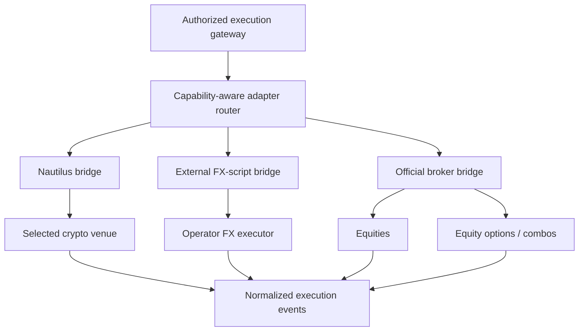

# Phase 9, Book 2 — Adapter Fabric and Asset Bridges

> **Purpose:** Define one certified adapter protocol and preserve asset/venue semantics across Nautilus crypto, the external FX script, and official equity/options APIs  
> **Input:** Book 1 admission, canonical intent family, capability/account contracts, identity rules, environment guards, and permit protocol  
> **Output:** Adapter protocol, translation plans, selected asset bridges, conformance evidence, and explicit blocked-capability records  
> **Previous:** [Book 1 — Execution Contracts and Authority](book-1-execution-contracts-authority.md)  
> **Next:** [Book 3 — Lifecycle, Reports, and Reconciliation](book-3-lifecycle-reports-reconciliation.md)

---

## 1. Success Statement

Every selected venue is reached through the same narrow execution-adapter contract; canonical semantics are translated explicitly and reversibly; fixture/sandbox/production identities remain isolated; crypto uses certified Nautilus-native behavior where supported; FX uses only the inspected operator script; equities/options use official documented APIs; and unsupported or ambiguous behavior blocks rather than mutates the trade request.

---

## 2. Applicable Anchors

- **A1:** One Orchestration Spine
- **A4:** StrategySpec Is Truth
- **A6:** Nautilus Is the Canonical Trading Model
- **A7:** OrderIntent Is the Execution Boundary
- **A10:** Observable and Reconstructable
- **A11:** Repair Before Expansion
- **A13:** Local-First Heavy Compute
- **A14:** No Unofficial Production Broker Dependency
- **A15:** Live Autonomy Is Earned
- **F9:** Strategies request; adapters execute; governance authorizes

---

## 3. Adapter Topology



No adapter is discoverable to strategy/research namespaces. The gateway owns routing and passes only an already authorized action envelope.

---

## 4. Work Packages

### 4.1 ExecutionAdapter protocol

```python
class ExecutionAdapter(Protocol):
    def describe_capabilities(self) -> VenueCapabilityProfile: ...
    def verify_environment(self) -> EnvironmentVerification: ...
    def verify_account(self) -> AccountVerification: ...
    def preflight_translation(self, action) -> AdapterTranslationPlan: ...
    def submit(self, authorized_action, plan) -> SubmissionReceipt: ...
    def amend(self, authorized_action, plan) -> SubmissionReceipt: ...
    def cancel(self, authorized_action, plan) -> SubmissionReceipt: ...
    def query_order(self, client_order_id) -> VenueOrderSnapshot: ...
    def query_open_orders(self) -> list[VenueOrderSnapshot]: ...
    def query_positions(self) -> list[VenuePositionSnapshot]: ...
    def query_balances_and_margin(self) -> AccountStateSnapshot: ...
    def normalize_event(self, raw_event_ref) -> ExecutionEvent: ...
    def health(self) -> AdapterHealth: ...
```

The protocol does not expose generic arbitrary-request, arbitrary-payload, funding, withdrawal, account-management, or strategy-evaluation methods.

### 4.2 AuthorizedActionEnvelope

The gateway supplies:

```yaml
authorized_action_envelope_id: content-id
action_ref: artifact-ref
permit_ref: artifact-ref
permit_consumption_ref: artifact-ref
account_binding_ref: artifact-ref
capability_profile_ref: artifact-ref
translation_plan_ref: artifact-ref
client_order_id: stable-id
route_attempt_id: typed-id
environment_identity: verified-id
created_at: timestamp
```

The adapter re-verifies hashes and environment before send, but cannot issue a new permit or reinterpret a denial.

### 4.3 AdapterTranslationPlan

```yaml
adapter_translation_plan_id: content-id
canonical_action_ref: artifact-ref
adapter_id: typed-id
adapter_version: immutable-version
venue_id: canonical-id
environment_identity: verified-id
instrument_mapping: {}
quantity_mapping: {}
price_and_tick_mapping: {}
order_type_mapping: {}
time_in_force_mapping: {}
trigger_mapping: {}
position_effect_mapping: {}
contingency_or_group_mapping: {}
provider_client_order_id: string
declared_rounding: []
declared_rejections: []
semantic_differences: []
translation_result: exact|policy_permitted_rounding|unsupported|ambiguous
```

Only exact or predeclared policy-permitted rounding may continue. Any difference affecting side, exposure, payoff, trigger, lifecycle, atomicity, risk, or session rejects.

### 4.4 Venue command boundary

The adapter creates a provider-native command only inside its isolated process. Evidence stores:

- canonical action hash;
- translation-plan hash;
- redacted command hash;
- provider client-order ID;
- route attempt;
- send and response timestamps;
- response/evidence reference.

Raw credentials, authentication headers, signing material, and sensitive account identifiers never enter durable command records.

### 4.5 Instrument and symbology translation

Resolve through Phase 3 canonical instrument identity:

- venue/native symbol;
- asset class and contract type;
- base/quote/settlement currencies;
- tick/price precision;
- quantity/lot/contract precision;
- multiplier and inverse/linear behavior;
- venue, exchange, MIC, or routing destination;
- expiry, strike, right, exercise style, settlement, and deliverable for options;
- corporate-action/version identity where applicable.

A string resemblance is not identity. Ambiguous symbol mapping blocks.

### 4.6 Nautilus adapter bridge

The local Nautilus source tree declares v1.227.0 and includes candidate adapters. Before use:

1. resolve whether it is a maintained fork, vendor, editable dependency, reference, or accidental copy;
2. pin upstream origin/tag/commit and local diff;
3. verify license and update strategy;
4. prove the genuine Nautilus model, command, event, cache, and reconciliation path;
5. wrap approved public interfaces outside the vendored tree;
6. prohibit casual direct edits to vendor code;
7. certify each venue/version/environment separately.

The bridge maps FORGE intent/permit artifacts to approved Nautilus commands and maps Nautilus/venue events into Phase 9 `ExecutionEvent`.

### 4.7 Crypto bridge

Candidate local Nautilus venue adapters are inventory, not a selection. For each approved crypto venue, certify:

- spot, margin, perpetual, delivery future, and option distinctions;
- base/quote/contract quantity;
- linear versus inverse contracts;
- one-way versus hedge position mode;
- leverage and margin mode;
- reduce-only, post-only, maker/taker behavior;
- trigger source and conditional/algo order behavior;
- client-order-ID constraints;
- maintenance windows and 24/7 assumptions;
- funding, liquidation, insurance/ADL events;
- API key permissions and IP restrictions;
- rate limits, sequence, reconnect, and snapshot behavior.

Venue selection is an ADR. “Nautilus contains it” is not approval.

### 4.8 External FX-script bridge

The operator’s declared production FX script is a required external dependency if it is not in the repository.

The interface inventory must establish:

```yaml
fx_execution_script_contract:
  source_ref: inspected-artifact-or-external-dependency
  version_identity: immutable-version
  supported_accounts: []
  supported_symbols: []
  symbol_mapping: {}
  sizing_units: lots|units|other
  supported_order_types: []
  supported_time_in_force: []
  hedging_or_netting_model: typed-value
  stop_and_freeze_levels: {}
  submit_interface: {}
  amend_interface: {}
  cancel_interface: {}
  order_position_snapshot_interface: {}
  response_and_error_mapping: {}
  idempotency_behavior: {}
  session_and_terminal_behavior: {}
  emergency_behavior: {}
```

If the script cannot be inspected/tested, FX remains `blocked_external_dependency`. The MT5 MCP and its direct trade tools are not substituted.

### 4.9 Equity broker bridge

The selected broker must provide a documented, permissioned API suitable for the intended environment. Certify:

- instrument/exchange routing;
- whole versus fractional shares;
- cash versus margin account;
- regular and extended-hours behavior;
- short-sale permission, locate, uptick/restriction behavior;
- order types, TIF, auction/open/close orders;
- halts, LULD/rejections, and market-state events;
- buying power and unsettled cash;
- corporate actions and symbol changes;
- fees, commissions, and regulatory charges;
- order/execution/position/cash snapshots.

The local Nautilus Interactive Brokers adapter is a candidate only after provenance, version, official API, gateway/TWS, sandbox, and behavior certification.

### 4.10 Options broker bridge

Certify all equity-options behavior in scope:

- canonical contract identity and chain resolution;
- contract multiplier and deliverable;
- calls/puts, strike, expiry, style, settlement;
- opening/closing and long/short effect;
- options permission level and buying-power treatment;
- native combo/spread orders;
- combo net debit/credit price sign conventions;
- guaranteed versus non-guaranteed combo behavior;
- per-leg and group acknowledgments/fills/fees;
- exercise, assignment, expiration, and external position changes;
- corporate-action-adjusted contracts;
- cancel/replace and partial combo behavior.

If native atomic combos are unavailable, `native_atomic_required` rejects. Controlled legging is a separate Book 4 policy, not an adapter improvisation.

### 4.11 Adapter router

Routing inputs are immutable:

```text
canonical instrument identity
+ selected venue/account binding
+ required capabilities
+ approved environment
+ adapter certification
```

The router does not optimize venue price, choose a broker, or widen capabilities during Phase 9. Future smart order routing requires a separately governed phase/ADR.

### 4.12 Environment isolation

Each adapter instance has:

- one environment class and verified endpoint allowlist;
- one account binding or explicitly declared account set;
- one secret namespace;
- independent process/container and network policy;
- separate client-order namespace;
- separate event cursor and reconciliation state;
- per-adapter emergency control.

Production credentials are absent from fixture and sandbox runtimes.

### 4.13 Conformance suite

Every adapter runs the same top-level contract:

```text
capability declaration
environment/account verification
instrument mapping
translation determinism
valid submit
invalid submit
amend
cancel
duplicate action
timeout/delayed acknowledgment
partial fill
reject/expire
event normalization
snapshot/reconciliation
restart/reconnect
emergency block
secret redaction
```

Asset-specific suites extend this contract; they do not replace it.

---

## 5. Target Layout

```text
execution_forge/
  adapters/
    protocol.py
    authorized_envelope.py
    registry.py
    router.py
    translation.py
    venue_command.py
    nautilus/
      bridge.py
      model_mapping.py
      event_mapping.py
    crypto/
      registry.py
      profiles/
    fx_external/
      contract.py
      bridge.py
      blocker.py
    equities/
      bridge.py
    options/
      bridge.py
      combo_mapping.py
  instruments/
    mapping.py
    precision.py
  tests/
    adapter_conformance/
```

---

## 6. Deliverables

- Narrow `ExecutionAdapter` protocol.
- `AuthorizedActionEnvelope`.
- Deterministic `AdapterTranslationPlan`.
- Redacted `VenueCommandRecord`.
- Canonical-to-venue instrument/symbology mapper.
- Capability-aware nonoptimizing adapter router.
- Classified/pinned Nautilus bridge.
- Selected crypto venue profiles and bridges.
- External FX-script interface map, bridge, or explicit blocker.
- Official equity broker bridge.
- Equity-options and native-combo bridge.
- Environment/process/secret isolation.
- Shared adapter conformance suite plus asset-specific extensions.
- Unsupported-capability and semantic-difference registry.

---

## 7. Required Tests

### P9-ADP-001 — Shared Adapter Conformance

Every selected adapter passes the same capability, translation, lifecycle, snapshot, restart, emergency, and redaction contract.

### P9-ADP-002 — Narrow Interface

The adapter exposes no arbitrary request/payload, funding, withdrawal, strategy, sizing, or permission-issuance method.

### P9-ADP-003 — Authorized Envelope

Submit/amend/cancel rejects without a hash-valid consumed-permit envelope.

### P9-ADP-004 — Adapter Identity

Adapter ID, version, venue, environment, and account binding match certification.

### P9-ADP-005 — Strategy Isolation

Strategy, agent, scanner, UI, and research modules cannot import or acquire an adapter instance.

### P9-ADP-006 — Capability Reverification

Startup and reconnect verify current capability, environment, account, and endpoint state.

### P9-ADP-007 — Unknown Provider Error

Unknown response/error codes normalize as typed unknown failures and do not imply success.

### P9-ADP-008 — Provider Rate Limits

Adapter enforces declared rate/backoff behavior without unbounded retry or queue growth.

### P9-ADP-009 — Process Isolation

One adapter crash, credential namespace, event cursor, or account state cannot corrupt another adapter.

### P9-ADP-010 — No Production Fallback

Fixture/sandbox failure cannot choose a production endpoint or credential.

### P9-TRN-001 — Deterministic Translation

The same canonical action, adapter version, capability, and account binding produce the same translation plan and command hash.

### P9-TRN-002 — Semantic Round Trip

Provider acknowledgment/report fields reconstruct the original canonical side, quantity, price, type, TIF, effect, and group identity.

### P9-TRN-003 — Unsupported Order Type

Unsupported order type rejects before permit consumption/submission.

### P9-TRN-004 — Unsupported TIF or Trigger

Unsupported TIF, trigger, post-only, reduce-only, or contingency behavior rejects explicitly.

### P9-TRN-005 — Rounding Bound

Tick/lot rounding occurs only within frozen policy and is visible in the plan and pre-trade recheck.

### P9-TRN-006 — Material Rounding

Rounding that changes exposure, payoff, max loss, or trigger semantics rejects.

### P9-TRN-007 — Symbol Ambiguity

Ambiguous, stale, delisted, or multiply mapped instrument identity blocks.

### P9-TRN-008 — Provider Payload Isolation

Provider-native command/payload cannot leak back into or mutate canonical intent.

### P9-NAU-001 — Nautilus Provenance

Origin, version, local diff, dependency role, license, and update policy verify before certification.

### P9-NAU-002 — Genuine Model Path

The bridge uses approved Nautilus command/event/instrument/order/cache paths rather than a similarly named standalone simulator.

### P9-NAU-003 — Vendor Tree Protection

FORGE wrappers and mappings do not require unreviewed direct edits to the vendored source.

### P9-NAU-004 — Version Invalidation

Changing Nautilus version or local diff invalidates adapter evidence.

### P9-NAU-005 — Event Identity

Nautilus client/venue/trade IDs map bijectively to canonical execution identities.

### P9-CRY-001 — Crypto Product Distinction

Spot, margin, perpetual, delivery future, and crypto option instruments cannot be confused.

### P9-CRY-002 — Contract Quantity

Base, quote, linear, inverse, and contract quantities translate and reconcile exactly.

### P9-CRY-003 — Position Mode

One-way versus hedge mode mismatch rejects before route.

### P9-CRY-004 — Reduce Only

Reduce-only cannot increase, flip, or open exposure under any venue response path.

### P9-CRY-005 — Post Only

Post-only rejection/adjustment behavior matches declared capability and never silently becomes taker.

### P9-CRY-006 — Funding and Liquidation Events

Funding, liquidation, ADL/insurance, and maintenance events normalize distinctly from ordinary fills.

### P9-CRY-007 — API Permission Scope

Crypto credentials permit trading only for the certified account/products and expose no withdrawal capability.

### P9-CRY-008 — Venue Maintenance

Maintenance/restart and 24/7 session assumptions fail safely and reconcile afterward.

### P9-FXS-001 — Actual FX Script Boundary

Missing or uninspectable operator FX script blocks FX certification and cannot be replaced by MT5 MCP.

### P9-FXS-002 — FX Interface Completeness

The script contract covers submit, amend, cancel, snapshots, errors, idempotency, sessions, and emergency behavior.

### P9-FXS-003 — Lot and Unit Translation

Lots/units, contract size, pip/tick precision, and rounding translate exactly.

### P9-FXS-004 — Hedging/Netting Model

Account position model is positively verified and position-effect semantics remain correct.

### P9-FXS-005 — Stop and Freeze Levels

Broker minimum-distance/freeze restrictions reject or translate only within declared policy.

### P9-FXS-006 — Terminal/Session Identity

Connected terminal, server, account, environment, symbol set, and permissions match the binding certificate.

### P9-FXS-007 — MT5 MCP Quarantine

Production namespaces cannot import or invoke `mt5_open_trade`, `mt5_close_trade`, or equivalent MCP trade tools.

### P9-EQT-001 — Official Equity API

The selected equity adapter traces to a documented permissioned API and certified environment/account.

### P9-EQT-002 — Share Precision

Whole/fractional share constraints and rounding preserve intended exposure.

### P9-EQT-003 — Session Routing

Regular, extended, auction, close/open, halt, and holiday behavior follow capability/calendar contracts.

### P9-EQT-004 — Short Permission

Short-sale, locate, restriction, and account permissions verify before route.

### P9-EQT-005 — Buying Power

Cash, margin, unsettled funds, and buying-power checks reconcile with provider state.

### P9-EQT-006 — Corporate Action Identity

Split, merger, symbol, or instrument-version changes invalidate stale mappings and open-intent assumptions.

### P9-EQT-007 — Regulatory and Fee Reports

Provider commissions/fees/regulatory charges normalize without being hidden in fill price.

### P9-OPT-001 — Multi-Leg Capability

Native combo support, maximum legs, ratio rules, price sign, atomicity, and guaranteed/non-guaranteed behavior are explicit.

### P9-OPT-002 — Contract Identity

Underlying, expiry, strike, right, multiplier, style, settlement, and deliverable map exactly.

### P9-OPT-003 — Open/Close Effect

Buy/sell and open/close effect remain correct for every leg and provider field.

### P9-OPT-004 — Combo Net Price

Net debit/credit sign and tick conventions round-trip without inversion.

### P9-OPT-005 — Atomic Requirement

`native_atomic_required` rejects on a venue/account that cannot guarantee the declared behavior.

### P9-OPT-006 — Combo Partial Fill

Provider leg/group partial-fill semantics normalize without inventing balanced exposure.

### P9-OPT-007 — Option Permission

Account options level and strategy permission cover every proposed leg/group.

### P9-OPT-008 — Exercise and Assignment Event

Exercise, assignment, expiry, and external position change normalize distinctly with causal evidence.

### P9-OPT-009 — Adjusted Contract

Corporate-action-adjusted deliverable/multiplier cannot reuse the stale standard-contract identity.

### P9-OPT-010 — Controlled Legging Boundary

Adapter cannot choose controlled legging; it requires an explicit Book 4-approved policy and permit.

### P9-DOC-001 — API Documentation Evidence

Every production candidate records the exact official API/version/capability evidence used for certification.

### P9-DOC-002 — Deprecated API

Deprecated or withdrawn required behavior invalidates the affected certification.

### P9-DOC-003 — Unofficial API Rejection

An unofficial, reverse-engineered, GUI-automation, or undocumented broker path cannot certify for production.

### P9-DOC-004 — Documentation/Runtime Conflict

Observed behavior conflicting with documentation becomes a blocker/limitation, never a favorable assumption.

### P9-SEC-010 — Credential Namespace Isolation

Fixture, sandbox, and production credentials cannot coexist in one adapter process or fallback chain.

### P9-SEC-011 — Redacted Command Evidence

Command records preserve hashes and outcome evidence without secret/auth/account leakage.

### P9-SEC-012 — Endpoint Override

DNS, proxy, URL, gateway, or terminal override outside the binding certificate blocks.

### P9-SEC-013 — Withdrawal Surface Absence

No adapter protocol or credential grants transfer, withdrawal, or funding capability.

### P9-SEC-014 — Repository Credential Gate

Known exposed credentials cannot start any adapter even if provider login succeeds.

---

## 8. Failure Modes

- A provider SDK object becomes the canonical intent model.
- Adapter silently converts FOK to IOC or stop-limit to limit.
- Symbol mapping relies on a ticker string alone.
- Vendored Nautilus source is assumed production-ready by presence.
- Every bundled crypto venue is enabled.
- MT5 MCP fills the missing FX dependency.
- An unofficial equity/options API is used because setup is easier.
- Sandbox and production credentials share a process/config.
- Options group debit/credit signs invert.
- Combo fills are reported as balanced when only one leg filled.
- Adapter directly calls a risk model or changes quantity.
- Raw signed payloads and account IDs enter logs.

---

## 9. Exit Gate

Book 2 is complete only when every selected adapter implements the narrow protocol, provenance and official-interface evidence are resolved, translations preserve canonical semantics, environment/account/secret isolation passes, asset-specific behavior is certified or explicitly blocked, the actual FX script boundary is honored, and no adapter can invent support, authority, venue selection, or risk decisions.

---

## 10. Handoff

Book 3 receives certified adapter identities and capabilities, deterministic translation plans, canonical/provider ID mappings, normalized raw-event references, snapshot/query interfaces, rate/reconnect behavior, asset-specific lifecycle semantics, and explicit unsupported or blocked capabilities.
