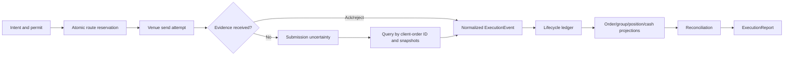
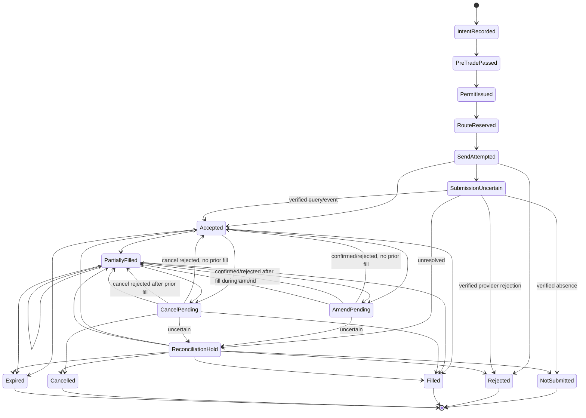

# Phase 9, Book 3 — Lifecycle, Reports, and Reconciliation

> **Purpose:** Make every venue action exactly-once in effect, model uncertainty honestly, normalize lifecycle evidence, and reconcile internal and external execution state  
> **Input:** Book 2 certified adapters, translations, ID mappings, event/snapshot interfaces, and Book 1 intent/permit contracts  
> **Output:** Durable lifecycle ledger, `ExecutionReport`, state projections, reconciliation/correction evidence, and restart/recovery protocol  
> **Previous:** [Book 2 — Adapter Fabric and Asset Bridges](book-2-adapter-fabric-asset-bridges.md)  
> **Next:** [Book 4 — Pre-Trade Risk and Emergency Controls](book-4-pretrade-risk-emergency-controls.md)

---

## 1. Success Statement

Every submit, amend, cancel, fill, reject, expiry, assignment, and recovery event is uniquely identified and reconstructable; network uncertainty never becomes a blind duplicate; partial and grouped execution remains truthful; internal order/position/cash/fee/margin projections reconcile with venue evidence; and restart cannot route until every open or uncertain action is resolved or safely contained.

---

## 2. Applicable Anchors

- **A1:** One Orchestration Spine
- **A4:** StrategySpec Is Truth
- **A6:** Nautilus Is the Canonical Trading Model
- **A7:** OrderIntent Is the Execution Boundary
- **A8:** Promotion Is State-Based
- **A10:** Observable and Reconstructable
- **A11:** Repair Before Expansion
- **A12:** Cheap Models Use Tools, Not Memory
- **A15:** Live Autonomy Is Earned
- **F9:** Strategies request; adapters execute; governance authorizes

---

## 3. Lifecycle Topology



---

## 4. Work Packages

### 4.1 Canonical order lifecycle



`SendAttempted` proves bytes were offered to the provider boundary. It does not prove receipt, acceptance, or absence. `NotSubmitted` requires the policy's complete absence-proof window across order, execution, position, cash, and margin evidence; it is distinct from provider rejection. Terminal state always requires evidence or an explicitly unresolved/quarantined disposition.

### 4.2 Route reservation and submission receipt

Before send, atomically persist:

- action and permit identities/hashes;
- permit consumption;
- deterministic client-order ID;
- adapter/venue/account/environment;
- translation and redacted command hashes;
- route attempt ID and expected provider behavior;
- pre-send state/checkpoint.

```yaml
submission_receipt_id: content-id
route_attempt_id: typed-id
action_ref: artifact-ref
permit_consumption_ref: artifact-ref
client_order_id: stable-id
adapter_ref: artifact-ref
send_started_at: timestamp
send_completed_at: optional-timestamp
transport_result: sent|local_failure|timeout|connection_lost|unknown
provider_immediate_ref: optional-redacted-ref
acceptance_state: unknown|accepted|rejected
```

A local return value is evidence, not necessarily the venue’s final truth.

### 4.3 ExecutionEvent

```yaml
execution_event_id: content-id
schema_version: semver
source: venue_stream|venue_query|account_snapshot|adapter_internal|external_reconciliation
source_event_id: optional-string
source_sequence: optional-integer
adapter_id: typed-id
venue_id: canonical-id
account_binding_ref: artifact-ref
environment_identity: verified-id
client_order_id: stable-id
venue_order_id: optional-redacted-stable-ref
trade_id: optional-redacted-stable-ref
order_group_id: optional-typed-id
event_type: submitted|accepted|rejected|absence_verified|updated|partial_fill|fill|cancel_pending|cancelled|expired|triggered|suspended|exercise|assignment|correction
event_time: timestamp
received_time: timestamp
instrument_id: canonical-id
event_quantity: optional-decimal
cumulative_quantity: optional-decimal
remaining_quantity: optional-decimal
event_price: optional-decimal
average_price: optional-decimal
liquidity_side: optional-enum
fee_components: []
reject_cancel_or_expiry_reason: optional-typed-reason
raw_evidence_ref: artifact-ref
payload_hash: content-hash
previous_event_hash: optional-content-hash
```

Provider event, query result, and account snapshot are distinguishable sources. Synthesized corrections are never mislabeled as venue events.

### 4.4 Idempotency registry

Track separately:

- logical action key;
- canonical intent/amend/cancel ID;
- execution permit and consumption;
- route attempt;
- provider client-order ID;
- venue order ID;
- provider trade/fill IDs;
- raw event ID/hash;
- normalized event ID;
- projection effect ID.

Exactly-once **effects** are built over at-least-once commands/events. Deduplication never discards a contradictory event merely because one ID matches; it quarantines conflicting payloads.

### 4.5 Submission uncertainty

On timeout, network partition, process death, or ambiguous provider response:

1. mark `submission_uncertain`;
2. block a second send;
3. preserve consumed permit and route evidence;
4. query by provider client-order ID where supported;
5. query open/recent orders, executions, positions, cash, and margin;
6. recover missed stream events;
7. classify found, verified absent, ambiguous, or unrecoverable;
8. reconcile before any new action;
9. require a fresh action revision/permit only when verified absence and policy allow.

“Not found yet” is not verified absence.

### 4.6 Acknowledgment model

Track:

- local transport acceptance;
- provider/API request acceptance;
- venue order acceptance;
- trigger activation where applicable;
- exchange/market placement if observable.

Do not collapse these into one `submitted=true`. A delayed acknowledgment may arrive after query or reconnect and must join the same lifecycle.

### 4.7 Partial fills

For every fill:

```text
new_cumulative = prior_cumulative + unique_fill_quantity
remaining = accepted_or_amended_quantity - new_cumulative
weighted_average = sum(fill_price * fill_quantity) / new_cumulative
```

Also update:

- per-currency fees;
- liquidity side;
- position lots and realized basis;
- cash and settlement state;
- margin/buying power;
- group/contingency progress;
- residual exposure and emergency thresholds.

Overfills, negative remaining quantity, duplicate trade IDs, or impossible ordering trigger reconciliation hold.

### 4.8 Amend lifecycle

An amend may be:

- native in-place modification;
- provider cancel/replace;
- unsupported;
- prohibited after partial fill or session state.

The adapter declares which. Cancel/replace creates explicit causal order identities and uncertainty across both actions. An amend is confirmed only by provider evidence matching requested version/fields.

### 4.9 Cancel lifecycle

A cancel action progresses:

```text
cancel_intent_recorded
→ cancel_permit_consumed
→ cancel_send_attempted
→ cancel_pending
→ cancelled | filled | partially_filled | expired | cancel_rejected | uncertain
```

Cancel success applies only to remaining quantity. Fills may race the cancel. “Cancel request sent” and disconnect are never treated as cancelled.

### 4.10 Group lifecycle

Track member and group state independently:

- native group/combination ID;
- member order and venue IDs;
- activation/contingency state;
- filled ratios and residual leg exposure;
- group net price and fees;
- group terminal criteria;
- atomicity/legging policy;
- compensation/emergency actions.

A group is not “filled” merely because one leg or aggregate notional appears complete. Options combo provider reports must preserve group and leg evidence even where the venue reports only one synthetic fill.

### 4.11 ExecutionReport

```yaml
execution_report_id: content-id
schema_version: semver
action_ref: artifact-ref
order_group_ref: optional-artifact-ref
permit_ref: artifact-ref
adapter_translation_ref: artifact-ref
venue_command_record_ref: artifact-ref
client_order_id: stable-id
venue_order_refs: []
current_status: typed-status
requested_quantity: decimal
accepted_quantity: optional-decimal
filled_quantity: decimal
remaining_quantity: decimal
average_fill_price: optional-decimal
fill_refs: []
fee_components: []
reject_cancel_expiry_refs: []
latency_breakdown: {}
position_cash_margin_effect_refs: []
uncertainty_state: none|bounded|material|critical
reconciliation_ref: artifact-ref
timeline_root_hash: content-hash
generated_at: timestamp
```

Reports are current canonical projections over immutable evidence, not destructive replacements. A report may be preliminary, current, or terminal.

### 4.12 ExecutionStateSnapshot

```yaml
execution_state_snapshot_id: content-id
account_binding_ref: artifact-ref
as_of_time: timestamp
as_of_provider_cursor: optional-cursor
open_order_states: []
order_group_states: []
recent_execution_states: []
position_lots: []
cash_and_settlement: []
fees_and_financing: []
margin_and_buying_power: {}
options_exercise_assignment_state: []
external_activity: []
event_chain_root: content-hash
```

Snapshots derive from the append-only ledger and support restart; they do not replace raw evidence.

### 4.13 Reconciliation

Reconcile:

1. canonical action/permit/route ledger;
2. adapter internal state/cache;
3. venue event stream;
4. venue order/execution queries;
5. provider account/position/cash/margin snapshots;
6. clearing/settlement evidence where available.

```yaml
execution_reconciliation_snapshot_id: content-id
account_binding_ref: artifact-ref
venue_id: canonical-id
environment_identity: verified-id
window: {}
internal_state_hash: content-hash
adapter_state_hash: content-hash
venue_state_hash: content-hash
order_differences: []
fill_differences: []
position_differences: []
cash_fee_settlement_differences: []
margin_buying_power_differences: []
group_and_contingency_differences: []
external_activity: []
classification: match|explainable|unexplained_material|critical
required_action: continue|warn|pause|emergency_hold|incident
evidence_refs: []
```

Reconcile at startup, reconnect, each lifecycle event, fixed intervals, session boundaries, emergency action, and shutdown.

### 4.14 Manual and external activity

Broker UI activity, another API client, assignment/exercise, liquidation, corporate action, fee/financing posting, and provider correction can change state outside FORGE.

Classify each as:

- expected external lifecycle;
- authorized external manual intervention;
- unauthorized external activity;
- provider correction;
- unknown.

Unexpected state never disappears into a balancing adjustment.

### 4.15 Correction protocol

A correction requires:

- immutable pre-correction state;
- typed discrepancy;
- source evidence;
- declared transformation;
- independent authority where material;
- append-only correction/compensation event;
- post-correction reconciliation;
- incident/invalidation link.

Neither internal nor venue state silently wins. When provider truth is operationally controlling, the system still preserves why the internal projection differed.

### 4.16 Restart and reconnect

Startup state is `recovering`. Before routing:

1. restore event ledger, snapshot, IDs, consumed permits, and pending actions;
2. reverify adapter/account/environment/capabilities;
3. resume provider event streams from cursor or recover gaps;
4. query orders, fills, positions, cash, fees, margin, and group state;
5. resolve submission/amend/cancel uncertainty;
6. classify external activity;
7. reconcile and run Book 4 risk checks;
8. require recovery approval where policy demands;
9. resume with no replayed external effect.

### 4.17 Cross-venue state

Each account/venue reconciles independently first. A cross-venue view then proves:

- no duplicate strategy action routed to multiple venues;
- canonical position aggregation uses compatible instrument/currency identity;
- transfers are not assumed;
- cash and margin remain venue/account specific;
- Phase 10 receives complete but nonnetted capability/exposure evidence.

Phase 9 does not smart-route or rebalance across venues.

---

## 5. Target Layout

```text
execution_forge/
  lifecycle/
    state_machine.py
    submission.py
    acknowledgment.py
    partial_fills.py
    amend.py
    cancel.py
    groups.py
    uncertainty.py
  events/
    execution_event.py
    normalization.py
    idempotency.py
    ledger.py
  reports/
    execution_report.py
    state_snapshot.py
  reconciliation/
    engine.py
    snapshots.py
    external_activity.py
    corrections.py
    cross_venue.py
  recovery/
    reconnect.py
    restart.py
```

---

## 6. Deliverables

- Canonical order/group lifecycle state machines.
- Atomic route reservation and `SubmissionReceipt`.
- Append-only `ExecutionEvent` ledger.
- Multi-layer idempotency registry.
- Submission uncertainty/query-first recovery.
- Explicit acknowledgment layers.
- Partial-fill and fee/cash/margin projections.
- Amend and cancel race handling.
- Group/contingency/option-combo lifecycle projection.
- Versioned `ExecutionReport`.
- Durable `ExecutionStateSnapshot`.
- Continuous venue/account reconciliation.
- Manual/external-activity classification.
- Append-only correction protocol.
- Restart/reconnect and cross-venue reconciliation workflows.

---

## 7. Required Tests

### P9-LCY-001 — Legal Lifecycle

Submit, accept, reject, partial, fill, amend, cancel, expire, uncertainty, and recovery follow declared transitions.

### P9-LCY-002 — Illegal Transition

Impossible transition fails, preserves evidence, and enters reconciliation hold when state may be material.

### P9-LCY-003 — Send Is Not Acceptance

Transport send/return cannot mark an order accepted without provider evidence.

### P9-LCY-004 — Terminal Evidence

Filled, rejected, cancelled, and expired terminal states require typed provider/reconciliation evidence.

### P9-LCY-005 — Late Event

A valid late event joins its causal lifecycle and cannot be discarded because a local timeout occurred.

### P9-LCY-006 — Contradictory Event

Conflicting terminal/provider events trigger hold and preserve both payloads.

### P9-LCY-007 — Provider Event Ordering

Allowed reorder normalizes deterministically; unprovable causality remains uncertain.

### P9-LCY-008 — Lifecycle Version

State-machine version changes invalidate affected certification/replay evidence.

### P9-LCY-009 — Triggered Order

Pending trigger, triggered, accepted, filled, and expired states remain distinct.

### P9-LCY-010 — Suspension/Halt

Provider suspension or venue halt preserves the order and blocks invalid transitions.

### P9-IDM-001 — Retry Cannot Duplicate

Repeated submit handling, timeout, process retry, and message redelivery produce at most one venue order effect.

### P9-IDM-002 — Deterministic Client Order ID

The same logical action produces the same provider-safe ID without collision/truncation.

### P9-IDM-003 — Duplicate Provider Event

Repeated raw event/trade ID changes projections exactly once.

### P9-IDM-004 — Conflicting Duplicate

Same provider ID with different material payload is quarantined rather than deduplicated away.

### P9-IDM-005 — Permit/Attempt Separation

One consumed permit maps to one route attempt even when acknowledgments repeat.

### P9-IDM-006 — Failover Consumer

Concurrent/failover workers cannot both submit the same reserved action.

### P9-IDM-007 — Amend and Cancel Identity

Amend/cancel actions deduplicate independently from the original submit.

### P9-IDM-008 — Projection Effect Identity

Replay or duplicate normalization cannot apply the same fill/fee/cash effect twice.

### P9-ACK-001 — Delayed Acknowledgment

A delayed acknowledgment enters uncertainty/query recovery and later joins the original order without resend.

### P9-ACK-002 — Network Partition After Send

Partition after possible send consumes authority, blocks retry, and queries venue/account state.

### P9-ACK-003 — Local Failure Before Send

Provable pre-send local failure records no venue order but still follows permit/action retry policy explicitly.

### P9-ACK-004 — Not Found Is Not Absent

One empty query during provider lag cannot prove the order absent.

### P9-ACK-005 — Verified Absence

Only the policy’s complete query/snapshot window may classify a route absent and allow a new action/permit.

### P9-ACK-006 — Late Reject

A late rejection cannot overwrite fill/position evidence and instead triggers reconciliation.

### P9-ACK-007 — Multiple Ack Layers

Transport, provider, venue, and trigger acknowledgments remain distinguishable.

### P9-ACK-008 — Acknowledgment SLO

Threshold breach triggers warn/pause/hold without assuming order outcome.

### P9-FIL-001 — Partial Fill Accounting

Unique partial fills update cumulative/remaining quantity, weighted price, fees, position lots, cash, and margin exactly.

### P9-FIL-002 — Multiple Currencies

Fill price, commission, financing, and settlement currencies remain explicit and reconcile.

### P9-FIL-003 — Duplicate Trade ID

Duplicate fill/trade event has one effect.

### P9-FIL-004 — Overfill

Cumulative fill beyond accepted/amended quantity enters critical reconciliation hold.

### P9-FIL-005 — Fill During Cancel

Fill racing cancel updates exposure while remaining quantity continues through cancel lifecycle.

### P9-FIL-006 — Fill During Amend

Fill racing amend reconciles old/new quantities and provider version without loss.

### P9-FIL-007 — Fee Timing

Late commissions, regulatory fees, funding, and financing update separate ledger events.

### P9-FIL-008 — Liquidity Side

Maker/taker or liquidity classification remains provider evidence and does not alter fill quantity.

### P9-FIL-009 — Options Combo Fill

Group and leg fill evidence preserve ratios, net price, commissions, and residual leg exposure.

### P9-FIL-010 — Precision

Tick, lot, multiplier, inverse contract, and currency precision produce exact bounded arithmetic.

### P9-AMD-001 — Native Amend

Confirmed provider version/fields match the authorized amend before internal state updates.

### P9-AMD-002 — Cancel/Replace Amend

Provider cancel/replace behavior creates explicit linked lifecycle identities and uncertainty.

### P9-AMD-003 — Unsupported Amend

Unsupported field/order/session amend rejects without implicit cancel/new order.

### P9-AMD-004 — Material Amend

Side, instrument, exposure, position effect, or risk-envelope change requires a new order intent.

### P9-AMD-005 — Amend Partial Fill

Amend cannot reduce accepted quantity below already filled quantity.

### P9-AMD-006 — Amend Version Race

Stale expected provider version rejects or reconciles; last-write-wins is forbidden.

### P9-AMD-007 — Amend Permit

Submit/cancel permits cannot authorize an amend.

### P9-CXL-001 — Cancel Is Not Cancelled

Cancel request/send/pending cannot mark remaining quantity cancelled.

### P9-CXL-002 — Cancel Confirmation

Only provider/reconciliation evidence confirms cancelled remainder.

### P9-CXL-003 — Cancel Reject

Cancel rejection preserves original order state and records its reason.

### P9-CXL-004 — Cancel Filled Order

Cancel racing a full fill terminates as filled, not cancelled.

### P9-CXL-005 — Group Cancel

Group/strategy/account cancel scope requires matching explicit permit and tracks each member outcome.

### P9-CXL-006 — Duplicate Cancel

Repeated cancel message produces one logical cancel action and safe provider behavior.

### P9-CXL-007 — Cancel Uncertainty

Timeout/disconnect during cancel preserves remaining exposure as uncertain.

### P9-CXL-008 — Emergency Cancel Evidence

Emergency cancel uses its own authority and cannot claim flat until all outcomes reconcile.

### P9-REP-001 — Report Lineage

Every report traces to intent, permit, translation, command hash, raw events, projections, and reconciliation.

### P9-REP-002 — Requested Versus Executed

Report preserves requested, accepted, filled, remaining, rejected, cancelled, and expired quantities separately.

### P9-REP-003 — Preliminary and Terminal

Nonterminal report cannot be labeled final.

### P9-REP-004 — Latency Breakdown

Decision, permit, queue, send, acknowledgment, fill, and normalization latencies remain separate.

### P9-REP-005 — Uncertainty Visibility

Material/critical uncertainty cannot be omitted from a favorable execution report.

### P9-REP-006 — Group Report

Group report shows every member, leg ratio, atomicity, residual exposure, and net outcome.

### P9-REP-007 — Report Reproduction

Replaying immutable evidence yields the same current/terminal report.

### P9-REP-008 — Correction Visibility

Corrected report retains original state, correction cause, authority, and post-correction result.

### P9-REC-001 — Internal/Venue Reconciliation

Orders, fills, positions, cash, fees, settlement, margin, buying power, and groups match or produce classified differences.

### P9-REC-002 — Adapter Cache Is Not Truth

A matching adapter cache cannot hide disagreement with provider query/account snapshot.

### P9-REC-003 — Scheduled Reconciliation

Reconciliation runs at the fixed interval even with no new executions.

### P9-REC-004 — Event Reconciliation

Every material lifecycle/account event triggers bounded reconciliation.

### P9-REC-005 — Cash and Margin Difference

Matching positions cannot hide cash, fee, settlement, margin, or buying-power mismatch.

### P9-REC-006 — External Manual Trade

Manual/other-client order or fill is classified, surfaced, and never attached to an unrelated FORGE action.

### P9-REC-007 — Exercise/Assignment

Options exercise, assignment, or expiry-generated underlying position reconciles as external lifecycle evidence.

### P9-REC-008 — Provider Correction

Provider bust/correct event preserves original execution and applies a typed correction.

### P9-REC-009 — No Silent Overwrite

Internal or venue state cannot silently replace the other during mismatch.

### P9-REC-010 — Material Mismatch Gate

Unexplained material or critical mismatch blocks new exposure-increasing actions.

### P9-REC-011 — Session Boundary

End-of-session/settlement reconciliation preserves pending orders and unsettled state correctly.

### P9-REC-012 — Cross-Venue View

Cross-venue aggregation preserves account/venue-specific cash/margin and detects duplicate strategy action.

### P9-RST-001 — Restart with Open Orders

Restart restores and reconciles accepted, partial, amend-pending, cancel-pending, and uncertain orders before route.

### P9-RST-002 — Restart with Open Positions

Positions/lots/cash/fees/margin and controlling orders reconcile before new exposure.

### P9-RST-003 — Consumed Permit Restore

Restart cannot revive or reuse consumed permit authority.

### P9-RST-004 — Event Cursor Recovery

Recoverable missed events replay exactly once; unrecoverable material gap blocks.

### P9-RST-005 — Capability/Binding Reverify

Restart/reconnect revalidates adapter, endpoint, environment, account, and permissions.

### P9-RST-006 — Corrupt Snapshot

Corrupt/incompatible snapshot fails closed and rebuilds only from verified ledger/evidence.

### P9-RST-007 — External State Change

State changed while offline is classified and included before recovery.

### P9-RST-008 — Recovery Approval

Policy-required recovery approval cannot be self-issued by strategy/adapter.

### P9-NET-001 — Partition Before Send

Provable pre-send partition records local failure and no venue effect.

### P9-NET-002 — Partition During Send

Ambiguous send enters uncertainty and prevents retry.

### P9-NET-003 — Partition After Ack

Lost local ack is recovered by query/event without duplicate submission.

### P9-NET-004 — Reconnect Backoff

Reconnect uses bounded backoff/jitter and respects provider rate limits.

### P9-NET-005 — Stream and Query Conflict

Conflicting stream/query evidence remains visible and enters reconciliation.

### P9-NET-006 — Prolonged Outage

Outage beyond policy triggers pause/emergency hold without inventing order state.

### P9-XVR-001 — Duplicate Cross-Venue Route

The same logical action cannot route to two venues without an explicit separately authorized group.

### P9-XVR-002 — Venue-Specific Cash

Cash, margin, and settlement never net across accounts/venues implicitly.

### P9-XVR-003 — Canonical Instrument Aggregation

Cross-venue positions aggregate only through exact canonical instrument/economic mapping.

### P9-XVR-004 — No Implicit Transfer

Reconciliation never assumes funds or collateral can transfer between venues.

### P9-XVR-005 — No Smart Routing

Phase 9 router cannot optimize or reroute a denied/failed action to another venue.

---

## 8. Failure Modes

- Sent request is marked accepted.
- Timeout triggers immediate resubmit.
- Permit is revived after process restart.
- Adapter cache is treated as venue truth.
- Cancel request releases risk before confirmation.
- Fill during amend/cancel is dropped.
- Aggregate position match hides order/cash/fee mismatch.
- Options combo reports hide residual single-leg exposure.
- Provider corrections overwrite original fills.
- Manual trades are assigned to the closest strategy.
- Cross-venue cash is netted as if transferable.
- A favorable report omits material uncertainty.

---

## 9. Exit Gate

Book 3 is complete only when every action and event is exactly-once in effect, delayed acknowledgment and network partitions recover query-first, partial/amend/cancel/group paths preserve all exposure, reports reconstruct from immutable evidence, internal/adapter/venue/account state reconciles continuously, external activity is classified, and restart cannot route with unresolved state or revived authority.

---

## 10. Handoff

Book 4 receives canonical lifecycle/current-state projections, open and residual exposure, account cash/margin/buying-power evidence, group/leg state, adapter capabilities, execution reports, reconciliation classifications, uncertainty and incident triggers, and the exact points at which deterministic pre-trade or emergency controls must block, cancel, reduce, or hold.
