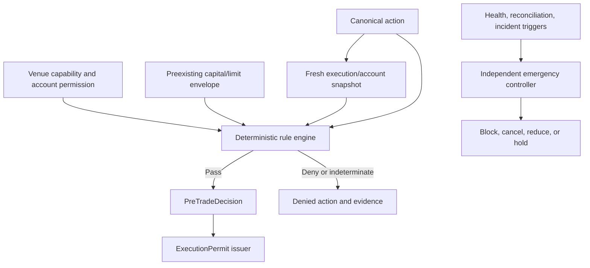

# Phase 9, Book 4 — Pre-Trade Risk and Emergency Controls

> **Purpose:** Deterministically deny unsafe or unauthorized execution before route and contain venue/account exposure through independent asset-specific emergency controls  
> **Input:** Book 3 current execution/account state, uncertainty/reconciliation status, Book 2 capabilities, and Book 1 intent/permit contracts  
> **Output:** Permission/limit engine, asset-specific risk checks, options group-risk controls, and independently authorized emergency/recovery evidence  
> **Previous:** [Book 3 — Lifecycle, Reports, and Reconciliation](book-3-lifecycle-reports-reconciliation.md)  
> **Next:** [Book 5 — Execution Operations and Lock](book-5-execution-operations-lock.md)

---

## 1. Success Statement

No action routes unless deterministic rules prove that its account, asset, instrument, session, price, size, margin, exposure, loss, lifecycle, and authority remain inside a preexisting envelope; multi-leg options cannot hide naked or legging risk; emergency controls operate outside strategy code, never overstate containment, and require separate bounded authority for any exposure-changing action.

---

## 2. Applicable Anchors

- **A0:** Human Strategic Authority
- **A1:** One Orchestration Spine
- **A4:** StrategySpec Is Truth
- **A6:** Nautilus Is the Canonical Trading Model
- **A7:** OrderIntent Is the Execution Boundary
- **A8:** Promotion Is State-Based
- **A9:** Separate Research From Approval
- **A10:** Observable and Reconstructable
- **A11:** Repair Before Expansion
- **A12:** Cheap Models Use Tools, Not Memory
- **A14:** No Unofficial Production Broker Dependency
- **A15:** Live Autonomy Is Earned
- **F9:** Strategies request; adapters execute; governance authorizes

---

## 3. Control Topology



---

## 4. Work Packages

### 4.1 ExecutionPermissionSet

```yaml
execution_permission_set_id: content-id
subject_ref: strategy-or-operator-capability
allowed_strategy_refs: []
allowed_account_binding_refs: []
allowed_environments: []
allowed_venues: []
allowed_asset_classes: []
allowed_instruments: []
allowed_sides_and_position_effects: []
allowed_order_types: []
allowed_time_in_force: []
allowed_sessions: []
options_permission_constraints: {}
short_sale_constraints: {}
margin_constraints: {}
valid_from: timestamp
expires_at: timestamp
revocation_state: active|revoked|expired
approval_refs: []
```

Provider permission and internal permission must both pass. Login success is not permission.

### 4.2 ExecutionCapitalEnvelope

Phase 9 consumes a bounded envelope; it does not allocate one.

```yaml
execution_capital_envelope_id: content-id
source: sandbox_policy|mad_canary_authorization|phase10_portfolio_envelope
strategy_ref: artifact-ref
account_binding_ref: artifact-ref
environment: fixture|sandbox|production
currency: canonical-currency
maximum_order_quantity: {}
maximum_order_notional: money
maximum_position_quantity: {}
maximum_position_notional: money
maximum_gross_exposure: money
maximum_net_exposure: money
maximum_open_orders: integer
maximum_daily_loss: money
maximum_strategy_drawdown: money
maximum_margin_usage: {}
maximum_leverage: decimal
maximum_options_group_loss: money
maximum_canary_order_count: optional-integer
valid_from: timestamp
expires_at: timestamp
```

Sandbox uses explicitly synthetic balances/envelopes. A production envelope exists only through an external human/governance authorization or future Phase 10 output. Phase 9 cannot manufacture a default.

### 4.3 RiskSnapshot

The pre-trade engine reads one freshness-bounded snapshot:

```yaml
risk_snapshot_id: content-id
account_binding_ref: artifact-ref
as_of_time: timestamp
market_data_cursor: cursor
reference_data_ref: artifact-ref
session_state_ref: artifact-ref
open_orders_ref: artifact-ref
positions_and_lots_ref: artifact-ref
cash_settlement_ref: artifact-ref
fees_financing_ref: artifact-ref
margin_buying_power_ref: artifact-ref
strategy_loss_state_ref: artifact-ref
reconciliation_ref: artifact-ref
uncertainty_flags: []
state_hash: content-hash
```

Stale, incomplete, unreconciled, or internally inconsistent snapshot yields `indeterminate`, which denies.

### 4.4 Deterministic pre-trade pipeline

Order:

```text
schema and lineage
→ upstream lock and deployment state
→ permission subject
→ environment/account/capability
→ instrument/reference/session health
→ duplicate and lifecycle conflict
→ price/quantity/precision collars
→ post-action position/exposure
→ cash/margin/buying power
→ loss/drawdown and order-rate limits
→ asset-specific controls
→ group/contingency controls
→ current reconciliation/incident/emergency state
→ pass, deny, or indeterminate
```

Every rule emits:

```yaml
risk_rule_result:
  rule_id: stable-id
  rule_version: semver
  input_refs: []
  observed_value: {}
  limit_or_permission_ref: artifact-ref
  result: pass|deny|indeterminate
  reason: typed-reason
```

No rule is skipped because another rule already denied; complete evaluation is retained where safe.

### 4.5 Price and quantity controls

Check:

- positive finite quantity and price;
- canonical-to-venue precision and permitted rounding;
- min/max quantity, lot, notional, and step;
- price collar against fresh bid/ask/mid/reference;
- limit/stop/trigger relationships;
- maximum market-order notional and slippage envelope;
- fat-finger deviation;
- duplicate or overlapping action;
- maximum open orders/action rate;
- provider/broker minimum and maximum constraints.

A market order still has an explicit maximum slippage/notional/time envelope.

### 4.6 Post-action exposure simulation

Evaluate the worst relevant bounded result, including:

- existing open orders;
- accepted but unfilled quantity;
- submission/amend/cancel uncertainty;
- proposed action;
- group member/contingency activation;
- pending assignment/exercise/settlement;
- account position model;
- fees and margin impact.

Do not assume pending cancels succeed. Reduce/close actions pass only when every plausible execution path cannot worsen exposure beyond its separate authority.

### 4.7 Permission and limit ownership

Ownership:

| Control | Owner |
|---|---|
| Strategic allowed assets/venues/autonomy | MAD |
| Qualified strategy/scope | Phase 6–8 Locks |
| Account/venue permissions | Provider plus Book 1 certificate |
| Per-action execution checks | Phase 9 deterministic engine |
| Optional canary envelope | Separate MAD/governance authorization |
| Aggregate portfolio capital/exposure | Phase 10 |

An agent may propose a limit change. It cannot apply the change inside a pending/running decision window.

### 4.8 Crypto-specific controls

Check:

- spot versus derivatives product identity;
- leverage and margin mode;
- one-way/hedge position mode;
- reduce-only and close-position semantics;
- contract multiplier and inverse/linear notional;
- liquidation distance and maintenance margin;
- funding/settlement windows;
- mark/index/last trigger source;
- post-only/taker behavior;
- venue concentration and balance scope;
- exchange maintenance, degraded state, and withdrawal-disabled trade key.

Opening exposure is denied when liquidation/margin evidence is missing or provider mode differs.

### 4.9 FX/CFD-specific controls

Check:

- actual operator script/environment/account identity;
- symbol contract size, lot step, pip/tick value;
- leverage, margin, and stop-out level;
- hedging/netting behavior and position effect;
- broker stop/freeze/minimum-distance rules;
- spread and price collar;
- market session, rollover, financing, and news/session policies inherited from locks;
- terminal/server clock and connection;
- maximum aggregate uncertainty in pending orders/positions.

MT5 MCP cannot satisfy these controls for production FX.

### 4.10 Equity-specific controls

Check:

- cash/margin account and settled/unsettled funds;
- whole/fractional quantity capability;
- short permission, locate/borrow, restriction state;
- regular/extended/auction session permission;
- exchange halt/LULD/market state;
- price bands and tick table;
- corporate-action/instrument version;
- buying power and open-order reservation;
- restricted/watch lists and account-specific broker limitations.

### 4.11 Options contract and permission controls

Every order/leg validates:

- underlying and canonical option contract identity;
- expiry, strike, right, multiplier, deliverable;
- exercise style and settlement;
- opening versus closing effect;
- long/short direction;
- account options permission level;
- covered/secured/defined-risk classification;
- expiration, exercise, assignment, pin, and corporate-action windows;
- liquidity, quote age, spread, size, and price tick;
- group max loss and buying power.

Opening naked short-option exposure is denied by default. Enabling it requires an explicit future policy and human authority, not an agent inference.

### 4.12 Multi-leg risk

```yaml
multi_leg_risk_assessment_id: content-id
order_group_ref: artifact-ref
contract_snapshot_refs: []
member_exposure_paths: []
native_combo_capability_ref: artifact-ref
atomicity: typed-value
net_debit_credit_limit: {}
defined_max_loss: optional-money
defined_max_gain: optional-money
buying_power_effect: {}
worst_permitted_leg_state: {}
legging_policy_ref: optional-policy-ref
expiry_assignment_scenarios: []
result: pass|deny|indeterminate
```

For `controlled_legging_allowed`, declare:

- leg order and maximum time between legs;
- maximum interim delta/notional/loss;
- limit price and slippage per leg;
- abort and unwind criteria;
- incomplete-group emergency action;
- independent authority and observation.

If risk cannot be bounded, deny.

### 4.13 Contingent and bracket risk

Parent, take-profit, stop, OCO, and child activation paths are evaluated as a graph. Controls prove:

- children cannot open unintended extra exposure;
- OCO cancellation race is handled;
- protective quantity follows actual filled quantity;
- parent partial fill scales protection;
- venue-native versus locally emulated contingency is explicit;
- local emulation has health/restart/emergency proof.

### 4.14 Emergency control scopes

Scopes:

- action/order/group;
- strategy instance;
- instrument;
- account;
- adapter/venue;
- asset class;
- all Phase 9 execution.

Actions:

- block new exposure-increasing intents;
- block all new actions;
- cancel selected or all open orders;
- force reduce-only mode;
- pause adapter routing;
- disconnect/quarantine adapter after state capture;
- request bounded position reduction;
- request bounded flatten for specified positions;
- reconcile and hold.

Cancel/reduce/flatten actions can themselves fail, fill partially, or create slippage. They use the full lifecycle and never bypass evidence.

### 4.15 EmergencyActionPermit

```yaml
emergency_action_permit_id: content-id
emergency_control_state_ref: artifact-ref
account_binding_ref: artifact-ref
scope: {}
allowed_action: block|cancel|reduce|flatten|disconnect
instrument_and_position_refs: []
maximum_quantity: {}
maximum_notional: money
price_and_slippage_constraints: {}
valid_from: timestamp
expires_at: timestamp
issued_by_capability: typed-capability
independent_approval_refs: []
consumption_state: unconsumed|reserved|consumed|expired|revoked
```

`block` may latch automatically under policy. External venue actions require action-specific permits. A generic unrestricted `flatten_all()` capability is prohibited.

### 4.16 EmergencyControlState

```yaml
emergency_control_state_id: content-id
scope: typed-scope
state: armed|triggered|blocking|containing|uncertain|safe_hold|recovery_pending|reset
trigger_type: automatic|human
trigger_ref: artifact-ref
blocked_actions: []
cancel_reduce_flatten_actions: []
confirmed_terminal_orders: []
remaining_open_orders: []
confirmed_positions: []
uncertain_exposure: []
reconciliation_ref: optional-artifact-ref
incident_ref: typed-id
state_hash: content-hash
reset_approval_refs: []
```

Safe hold means new risk is blocked and current state is known/reconciled within policy. It does not necessarily mean flat.

### 4.17 Automatic emergency triggers

At minimum:

- live route without matching external authorization;
- account/environment/credential/capability drift;
- duplicate venue order;
- unreconciled material/critical state;
- overfill or unexpected exposure;
- provider event/cursor corruption;
- stale required market/reference/session data;
- limit, loss, margin, or leverage breach;
- liquidation or stop-out proximity;
- naked/imbalanced options exposure outside policy;
- uncontrolled legging or missing protective order;
- adapter/gateway/permit-controller health failure;
- upstream lock/policy invalidation;
- repeated major incidents.

### 4.18 Emergency recovery

Recovery requires:

- trigger and root cause resolved/bounded;
- all action permits accounted for;
- account/environment/capability/credential reverified;
- provider streams/gaps restored;
- open orders, groups, positions, cash, fees, settlement, and margin reconciled;
- residual/uncertain exposure inside explicit hold policy;
- corrective tests/drills pass;
- independent approval for material/critical events;
- staged restricted resume and new observation window.

Restart does not clear an emergency latch.

---

## 5. Target Layout

```text
execution_forge/
  risk/
    permissions.py
    capital_envelope.py
    snapshot.py
    engine.py
    rules/
      price_quantity.py
      exposure.py
      margin.py
      loss.py
      crypto.py
      fx.py
      equities.py
      options.py
      multi_leg.py
      contingencies.py
  emergency/
    controller.py
    state.py
    permit.py
    triggers.py
    containment.py
    recovery.py
```

---

## 6. Deliverables

- Versioned `ExecutionPermissionSet`.
- Input-only `ExecutionCapitalEnvelope`.
- Freshness-bounded `RiskSnapshot`.
- Ordered deterministic pre-trade rule engine.
- Price, quantity, notional, precision, duplicate, and rate controls.
- Worst-path post-action exposure simulation.
- Crypto-, FX-, equity-, and options-specific rule packs.
- Multi-leg options max-loss/atomicity/legging assessment.
- Contingent/bracket risk graph evaluator.
- Independent scoped emergency controller.
- One-use `EmergencyActionPermit`.
- Durable emergency state, triggers, containment, and recovery workflow.
- Audit/reporting of every pass, denial, indeterminate, and emergency effect.

---

## 7. Required Tests

### P9-RSK-001 — Price, Size, Permission, and Capital Denial

Out-of-bound price, quantity, notional, permission, account, margin, or capital action denies before route.

### P9-RSK-002 — Complete Rule Evidence

Every pre-trade decision records rule version, input refs, observed value, limit, result, and reason.

### P9-RSK-003 — Indeterminate Denies

Missing, stale, conflicting, or unreconciled required evidence yields `indeterminate` and no permit.

### P9-RSK-004 — Snapshot Consistency

Risk snapshot hashes match current orders, positions, cash, fees, margin, session, and market cursor.

### P9-RSK-005 — Worst-Path Exposure

Pending orders, uncertainty, contingencies, assignments, and proposed action contribute to worst permitted exposure.

### P9-RSK-006 — Pending Cancel Risk

Cancel-pending quantity remains exposed until confirmation.

### P9-RSK-007 — Reduce Does Not Worsen

Reduce/close action passes only when every permitted execution path cannot increase or reverse exposure.

### P9-RSK-008 — Policy Immutability

An agent/runtime cannot change rules or limits to make a pending action pass.

### P9-RSK-009 — Model Independence

LLM/model failure, latency, or opinion cannot affect deterministic pre-trade outcome.

### P9-RSK-010 — Recheck at Route

Materially changed market/account/session state between decision and route expires the decision/permit.

### P9-LIM-001 — Quantity and Notional

Per-order and post-action quantity/notional remain within envelope and provider constraints.

### P9-LIM-002 — Position Exposure

Open orders plus positions plus proposed action stay inside position/gross/net limits.

### P9-LIM-003 — Cash and Buying Power

Cash, settlement, reserves, margin, and buying power remain sufficient under provider/internal rules.

### P9-LIM-004 — Loss and Drawdown

Daily loss and strategy drawdown breach blocks exposure increase.

### P9-LIM-005 — Leverage and Margin

Maximum leverage/margin usage and maintenance buffer enforce under worst permitted fill.

### P9-LIM-006 — Open Order and Rate

Open-order count, action frequency, and provider rate constraints enforce.

### P9-LIM-007 — Price Collar

Stale quote, wide spread, fat-finger price, or slippage outside envelope denies.

### P9-LIM-008 — No Default Envelope

Production action with no external capital envelope denies; Phase 9 cannot create a default.

### P9-PMT-001 — Internal and Provider Permission

Both internal subject permission and current provider account permission must pass.

### P9-PMT-002 — Expired or Revoked Permission

Expired/revoked permission blocks immediately.

### P9-PMT-003 — Strategy/Account Scope

Permission for one strategy/account cannot authorize another.

### P9-PMT-004 — Order Feature Permission

Margin, short, options, extended-hours, and order-style permissions are positively verified.

### P9-PMT-005 — No Login Inference

Successful authentication cannot substitute for asset/order/account permission evidence.

### P9-PMT-006 — No Agent Self-Grant

Strategy/agent/adapter cannot create or widen permissions.

### P9-OPR-001 — Option Contract Completeness

Underlying, expiry, strike, right, multiplier, style, settlement, and deliverable are current and exact.

### P9-OPR-002 — Open/Close and Long/Short

Every options leg’s side and position effect match account state and intended exposure.

### P9-OPR-003 — Naked Short Default Denial

Opening uncovered/naked short-option exposure denies absent an explicit future human-approved policy.

### P9-OPR-004 — Options Permission Level

Account permission level covers the complete group, not just individual legs.

### P9-OPR-005 — Expiry Window

Opening, holding, closing, exercise, and assignment actions respect expiry/pin/settlement policies.

### P9-OPR-006 — Adjusted Contract

Corporate-action-adjusted multiplier/deliverable invalidates stale risk assumptions.

### P9-OPR-007 — Quote and Liquidity

Stale/missing quote, excessive spread, insufficient size, or invalid combo price denies.

### P9-OPR-008 — Defined Risk

Defined-risk classification and maximum loss reproduce from contract/group evidence.

### P9-OPR-009 — Assignment Scenario

Worst relevant early/expiry assignment and resulting underlying exposure fit the envelope.

### P9-OPR-010 — Buying Power Agreement

Internal group buying-power estimate and provider preview/state reconcile within declared tolerance.

### P9-MLG-001 — Multi-Leg Max Loss and Legging

Group cannot pass without bounded max loss and explicit native atomicity or controlled-legging constraints.

### P9-MLG-002 — Native Atomic Requirement

Required-atomic group denies on unsupported venue/account.

### P9-MLG-003 — Interim Leg Exposure

Controlled legging computes and limits every permitted incomplete-leg state.

### P9-MLG-004 — Leg Order and Timeout

Leg order, maximum interval, prices, and abort criteria are immutable before first route.

### P9-MLG-005 — Abort/Unwind Authority

Incomplete group unwind requires bounded emergency authority and cannot improvise.

### P9-MLG-006 — Debit/Credit Limit

Net debit/credit, fee, and price sign constraints remain correct across all legs.

### P9-MLG-007 — Ratio and Multiplier

Leg ratio/multiplier quantities produce intended payoff and exposure.

### P9-MLG-008 — Partial Group Fill

Partial combo/leg fills update residual risk and may trigger hold/emergency behavior.

### P9-MLG-009 — Mixed Expiry/Underlying

Calendar/diagonal/complex groups preserve each contract’s expiry and underlying relationships.

### P9-MLG-010 — Unknown Risk Denial

Unavailable contract, assignment, price, or margin evidence yields indeterminate denial.

### P9-CRP-001 — Crypto Product and Mode

Spot/derivative, linear/inverse, position, leverage, and margin modes match account/capability.

### P9-CRP-002 — Reduce-Only Guarantee

Reduce-only cannot increase/flip exposure under current venue position mode.

### P9-CRP-003 — Liquidation Buffer

Opening action maintains required maintenance-margin/liquidation buffer.

### P9-CRP-004 — Trigger Source

Mark/index/last trigger source matches intent and capability.

### P9-CRP-005 — Funding/Maintenance Window

Funding, settlement, or venue maintenance restrictions enforce.

### P9-CRP-006 — Crypto Credential Scope

Trade key has only certified product/account permissions and no withdrawal permission.

### P9-FXR-001 — FX Script Identity

FX rules cannot pass through MT5 MCP or an unverified terminal/script/account.

### P9-FXR-002 — Lot, Pip, and Contract

Lot step, unit conversion, contract size, pip/tick, and notional limits enforce.

### P9-FXR-003 — Hedging/Netting Exposure

Post-action position effect matches the verified account model.

### P9-FXR-004 — Stop/Freeze Distance

Broker stop/freeze/minimum-distance constraints enforce against current price.

### P9-FXR-005 — Spread, Session, and Rollover

Spread collar, session, rollover, and financing policy enforce.

### P9-FXR-006 — Margin/Stop-Out

Worst-path margin and stop-out buffer remain within envelope.

### P9-EQR-001 — Equity Session

Regular/extended/auction session and TIF permission match current market state.

### P9-EQR-002 — Short Locate

Short order denies without current permission/locate/restriction evidence.

### P9-EQR-003 — Cash and Settlement

Cash-account action respects settled/unsettled funds and open-order reservations.

### P9-EQR-004 — Fractional/Whole Share

Quantity matches broker/instrument session precision and envelope.

### P9-EQR-005 — Halt and Price Bands

Halt/LULD/price-band state blocks invalid market/limit actions.

### P9-EQR-006 — Corporate Action

Instrument-version/corporate-action change forces remap and risk reevaluation.

### P9-EMG-001 — Emergency Block and Containment

Trigger atomically blocks new risk, records state, begins bounded containment, and preserves uncertainty.

### P9-EMG-002 — Strategy-External Controller

Strategy code cannot disable, reset, bypass, or spoof emergency controls.

### P9-EMG-003 — Scoped Action

Order/group/strategy/instrument/account/venue/global scope affects exactly the declared targets unless policy escalates.

### P9-EMG-004 — Durable Latch

Restart, failover, or process replacement cannot clear a triggered control.

### P9-EMG-005 — Cancel Authority

Emergency cancel requires action-specific authority and tracks every result.

### P9-EMG-006 — Reduce/Flatten Authority

Reduce/flatten specifies exact positions, maximum quantity/notional, price/slippage, account, and expiry.

### P9-EMG-007 — No Generic Flatten

Unbounded `flatten_all` or arbitrary emergency venue payload is unavailable.

### P9-EMG-008 — No False Flat

Safe hold or sent cancel/reduce action cannot claim flat while any order, fill, position, or venue state is uncertain.

### P9-EMG-009 — Containment Failure

Failed/partial cancel, reduce, snapshot, or reconciliation enters uncertain/escalated state.

### P9-EMG-010 — Trigger Coverage

Boundary breach, duplicate, reconciliation failure, loss/margin breach, naked leg, adapter failure, and invalidation triggers fire.

### P9-EMG-011 — Recovery Evidence

Cause resolution, permit accounting, capability reverify, reconciliation, corrective tests, and approval precede reset.

### P9-EMG-012 — Restart Does Not Reset

Emergency latch and unresolved exposure survive restart.

### P9-AUT-040 — Risk Engine Cannot Route

Pre-trade/risk components issue decisions only and cannot invoke adapters or consume permits.

### P9-AUT-041 — Emergency Is Not Strategy Alpha

Emergency controller cannot open speculative/new-risk positions or choose trades.

### P9-AUT-042 — Phase 10 Capital Boundary

Phase 9 enforces supplied envelopes but cannot allocate aggregate portfolio capital.

### P9-AUT-043 — Human Authority for Live Envelope

An agent-generated proposal cannot create production capital/canary authority without MAD/governance approval.

---

## 8. Failure Modes

- Missing risk data defaults to zero exposure.
- Pending cancel quantity is removed from risk.
- Market orders have no slippage/notional collar.
- Provider login is treated as options/short/margin permission.
- Phase 9 invents a “small safe” live capital default.
- Multi-leg defined risk assumes every leg fills together on a nonatomic path.
- Option assignment/expiry exposure is ignored.
- Reduce-only flips a hedge-mode crypto position.
- MT5 MCP satisfies FX controls by convenience.
- Emergency `flatten_all` sends arbitrary market orders.
- Restart clears the emergency latch.
- Safe hold is reported as flat.

---

## 9. Exit Gate

Book 4 is complete only when every route consumes a fresh, fully evidenced deterministic pre-trade pass; Phase 9 only enforces preexisting capital envelopes; crypto/FX/equity/options rules preserve their real account and instrument semantics; multi-leg worst-path risk is bounded; emergency controls are external, scoped, durable, and separately authorized; and containment/recovery never hides uncertainty or creates speculative exposure.

---

## 10. Handoff

Book 5 receives frozen permissions and envelopes, complete pre-trade rule evidence, asset/group risk assessments, emergency trigger/action/recovery contracts, current reconciliation/uncertainty state, adapter certification prerequisites, optional live-canary authority requirements, and every failure condition that must block Execution Lock.
