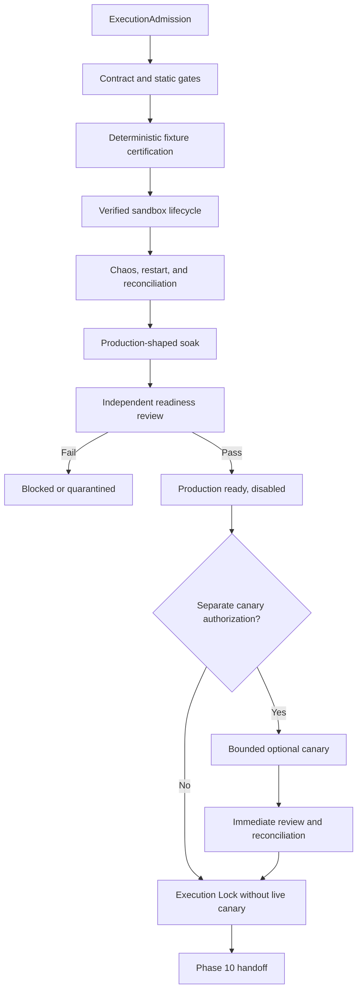

# Phase 9, Book 5 — Execution Operations and Lock

> **Purpose:** Certify the complete execution stack under fixture/sandbox faults and sustained load, govern any separately authorized canary, seal evidence, and hand bounded capabilities to Portfolio Forge  
> **Input:** Books 1–4 contracts, adapters, lifecycle/reconciliation, risk, emergency controls, and unresolved limitations  
> **Output:** `AdapterCertificationReport`, `ExecutionLockManifest`, production-readiness evidence, and nonallocating `PortfolioExecutionHandoff`  
> **Previous:** [Book 4 — Pre-Trade Risk and Emergency Controls](book-4-pretrade-risk-emergency-controls.md)  
> **Next:** Phase 10 — Portfolio Forge

---

## 1. Success Statement

OCE can repeatedly certify, operate, pause, recover, reconcile, replay, restore, and roll back the production-shaped execution stack; every selected adapter survives contract, sandbox, chaos, and soak gates; live routing remains disabled unless MAD/governance supplies an exact optional canary authorization; and the final Execution Lock proves capabilities and limitations without creating standing trading or aggregate capital authority.

---

## 2. Applicable Anchors

- **A0:** Human Strategic Authority
- **A1:** One Orchestration Spine
- **A2:** Evidence Before Narrative
- **A4:** StrategySpec Is Truth
- **A6:** Nautilus Is the Canonical Trading Model
- **A7:** OrderIntent Is the Execution Boundary
- **A8:** Promotion Is State-Based
- **A9:** Separate Research From Approval
- **A10:** Observable and Reconstructable
- **A11:** Repair Before Expansion
- **A12:** Cheap Models Use Tools, Not Memory
- **A13:** Local-First Heavy Compute
- **A14:** No Unofficial Production Broker Dependency
- **A15:** Live Autonomy Is Earned
- **F9:** Strategies request; adapters execute; governance authorizes

---

## 3. Certification Topology



---

## 4. Work Packages

### 4.1 ExecutionCertificationJob

```yaml
execution_certification_job_id: content-id
execution_admission_ref: artifact-ref
execution_policy_ref: policy-ref
selected_adapter_refs: []
capability_profile_refs: []
account_binding_refs: []
intent_and_permit_contract_refs: []
fixture_plan_ref: artifact-ref
sandbox_plan_ref: artifact-ref
chaos_plan_ref: artifact-ref
soak_plan_ref: artifact-ref
risk_and_emergency_policy_refs: []
resource_budget_ref: policy-ref
independent_review_ref: actor-ref
idempotency_key: string
correlation_id: typed-id
```

OCE schedules certification and operational actions. Its software `ExecutionTask` does not become an `OrderIntent`, permit, venue command, or provider event.

### 4.2 Job graph

```text
proposed
admission_verified
contracts_running
fixtures_running
sandbox_running
chaos_running
soak_running
reconciliation_review
risk_emergency_review
production_readiness_review
production_ready_disabled
canary_pending_external_authority
canary_running
canary_safe_hold
canary_review
locked
handed_off
blocked
quarantined
invalidated
```

Every transition requires guards, durable event, actor/capability, checkpoint, and rollback/containment plan.

### 4.3 Certification ladder

Each selected adapter/version/environment/account class passes:

1. provenance, license, dependency, and official-interface evidence;
2. contract/schema and static forbidden-import checks;
3. deterministic translation fixtures;
4. mock/provider error and lifecycle fixtures;
5. verified sandbox end-to-end actions;
6. disconnect, timeout, restart, duplicate, partial, amend/cancel, and reconciliation chaos;
7. asset-specific risk/emergency drills;
8. production-shaped sustained soak;
9. independent evidence review;
10. production-disabled verification.

No aggregate pass hides a failed adapter/capability cell.

### 4.4 AdapterCertificationReport

```yaml
adapter_certification_report_id: content-id
adapter_id: typed-id
adapter_version: immutable-version
source_provenance_ref: artifact-ref
official_interface_evidence_ref: artifact-ref
venue_id: canonical-id
environment_class: fixture|sandbox|production_disabled
account_class: typed-value
capability_profile_ref: artifact-ref
certified_capabilities: []
rejected_or_untested_capabilities: []
contract_results: {}
fixture_results: {}
sandbox_results: {}
chaos_results: {}
soak_results: {}
lifecycle_and_reconciliation_results: {}
risk_and_emergency_results: {}
security_and_credential_results: {}
operational_slos: {}
known_limitations: []
disposition: certified|conditionally_certified|blocked|quarantined
review_refs: []
valid_until: timestamp
```

Certification granularity is capability-specific. Passing spot market orders does not certify futures, stops, options, combos, margin, or production.

### 4.5 Fixture suite

Deterministic fixtures cover:

- every canonical order type/TIF/trigger in declared scope;
- tick/lot/contract/currency rounding;
- submit, accept, reject, partial, fill, amend, cancel, expire;
- delayed/duplicate/out-of-order provider events;
- provider errors and unknown codes;
- group/contingency behavior;
- options combo/group and external exercise/assignment;
- crypto position/product modes;
- FX lots/hedging/netting/stops;
- equity sessions/short/corporate actions;
- account/cash/fee/margin snapshots;
- emergency actions and recovery.

Fixtures pin provider-schema/API version and raw redacted payload hashes.

### 4.6 Sandbox end-to-end certification

For each capability cell:

1. verify sandbox endpoint/account/permissions;
2. establish clean baseline snapshots;
3. issue a fixture-derived qualified intent;
4. run deterministic pre-trade;
5. issue and consume one permit;
6. translate and submit;
7. observe full provider lifecycle;
8. amend/cancel where applicable;
9. reconcile orders, fills, positions, cash, fees, and margin;
10. return to a declared terminal/holding state;
11. verify no production endpoint/credential/network fallback.

Sandbox limitations are recorded. A broker simulator’s favorable fills are not proof of production fill quality.

### 4.7 Chaos campaign

Inject at controlled boundaries:

- duplicate intent/permit/route/job delivery;
- process death before and after permit consumption;
- timeout before/during/after send;
- delayed, duplicate, reordered, and contradictory events;
- partial fill during amend/cancel;
- adapter/gateway/stream disconnect;
- provider rate limit and maintenance;
- stale reference/market/session data;
- account/environment/capability identity drift;
- corrupted checkpoint/event cursor/snapshot;
- internal-versus-provider reconciliation mismatch;
- external/manual trade or position change;
- loss/margin/limit breach;
- incomplete options leg/group;
- emergency-control failure and recovery denial;
- storage, queue, worker, or model-service outage.

Every scenario pins injection point, expected state path, evidence, containment, cleanup, and no-duplicate assertions.

### 4.8 Production-shaped soak

Run:

- realistic selected adapter/account count;
- bounded concurrent strategies/actions;
- actual gateway, permit, state, event, reconciliation, risk, emergency, and observability components;
- realistic market/session calendars and provider limits;
- full log/metric/artifact rotation;
- repeated restart/reconnect and reconciliation cycles;
- no debug bypass or relaxed threshold;
- deterministic LLM outage while safety paths continue;
- final clean terminal window.

Record event/action/fill rates, queue lag, ack/fill latency, CPU, memory, storage, network, descriptors, provider limits, state/reconciliation latency, and incident/control response.

### 4.9 Operational observability

Expose:

- current certification/job/lifecycle state;
- exact intent, permit, route, adapter, account-binding, and capability IDs;
- provider/client/venue/trade IDs in redacted stable form;
- pre-trade rules and denial reasons;
- open/uncertain actions and residual exposure;
- order/group/position/cash/fee/margin reconciliation;
- adapter health, event cursor, reconnect, and rate-limit state;
- emergency-control latch and actions;
- environment and production-disabled state;
- optional canary envelope consumption;
- artifact/ledger/report/lock lineage.

Alerts are actionable and deduplicated. A green process heartbeat cannot mask stale execution events or unreconciled exposure.

### 4.10 ProductionReadinessProposal

```yaml
production_readiness_proposal_id: content-id
execution_admission_ref: artifact-ref
adapter_certification_refs: []
qualified_scope: {}
production_endpoint_identity_refs: []
required_account_class_and_permissions: {}
required_capital_envelope: absent
required_human_approvals: []
operational_slos: {}
incident_and_emergency_evidence_refs: []
known_limitations: []
open_questions: []
production_code_status: disabled
live_authorization: false
capital_allocation: none
```

The proposal records what would be needed. It cannot bind an account, load production credentials, issue a permit, or allocate capital.

### 4.11 Optional LiveCanaryAuthorization

This artifact is external input created only after explicit MAD/governance approval:

```yaml
live_canary_authorization_id: immutable-id
execution_lock_candidate_ref: artifact-ref
approved_strategy_ref: artifact-ref
account_binding_ref: artifact-ref
adapter_and_capability_ref: artifact-ref
allowed_instruments: []
allowed_actions_and_order_types: []
maximum_order_quantity: {}
maximum_order_notional: money
maximum_position_notional: money
maximum_total_loss: money
maximum_order_count: integer
maximum_duration: duration
allowed_session_window: {}
price_and_slippage_constraints: {}
emergency_action_scope: {}
not_before: timestamp
expires_at: timestamp
human_approval_refs: []
single_use_campaign: true
automatic_extension: false
```

An agent cannot create, infer, extend, renew, or broaden it. Absence means live canary is impossible and Phase 9 may still lock as sandbox-certified/production-ready-disabled.

### 4.12 Canary operation

If separately authorized:

1. reverify every lock, adapter, capability, account, credential, environment, and control;
2. start from fully reconciled baseline;
3. enforce canary envelope independently at gateway and risk engine;
4. allow only enumerated actions;
5. monitor every lifecycle event synchronously/deterministically;
6. stop on first declared breach or authority exhaustion;
7. reconcile after every event/action and at completion;
8. expire all canary authority;
9. enter safe hold;
10. complete independent review before any future proposal.

The canary is a finite experiment, not production rollout or evidence of profitability.

### 4.13 Replay and reproducibility

Replay immutable:

- intent/permit/translation/command hashes;
- fixture or captured provider event stream;
- snapshots and queries;
- policies, capabilities, bindings, versions, and calendars;
- risk decisions;
- lifecycle and reconciliation events;
- emergency triggers/actions;
- job and authority events.

Reproduce IDs, state transitions, reports, reconciliation classifications, and control actions. Captured live/sandbox replay is labeled replay, not a second independent observation.

### 4.14 Backup and restore

Back up all nonsecret:

- upstream locks/admission/policies;
- adapter provenance, versions, profiles, bindings, and certifications;
- intent/permit/route/event ledgers;
- translation and redacted command evidence;
- execution reports and state snapshots;
- order/position/cash/fee/margin reconciliation;
- permission, envelope, risk, incident, and emergency evidence;
- fixtures, chaos, soak, readiness, optional canary, and review artifacts;
- lock and Phase 10 handoff candidates.

Restore into clean isolation, verify hashes/schema, reconstruct state, and remain stopped/production-disabled until separately admitted.

### 4.15 Release and rollback

Each adapter/runtime release has:

- immutable source/dependency/image identity;
- schema and capability compatibility;
- database/event migration plan;
- sandbox recertification set;
- staged deployment plan;
- rollback version and trigger;
- in-flight action compatibility;
- emergency and reconciliation readiness.

Rollback cannot resurrect consumed permits, lose in-flight orders, or change account/environment.

### 4.16 Invalidation

Material changes include:

- upstream Strategy/Validation/Simulation Lock or scope;
- intent/group/amend/cancel/permit contract;
- adapter source/version/dependency/local diff;
- provider/broker API/schema/documentation;
- venue/account/environment/permission/credential;
- instrument/symbology/precision/reference behavior;
- lifecycle/idempotency/reconciliation/report semantics;
- risk/permission/limit/emergency policy;
- options contract/group/assignment/legging behavior;
- runtime/state/network/isolation infrastructure;
- certification fixture, chaos, soak, SLO, or review criteria.

The invalidation graph identifies exact adapter/capability cells and books/tests to rerun.

### 4.17 ExecutionLockManifest

```yaml
phase: 9
lock_id: immutable-id
created_at: timestamp
commit_sha: git-sha
strategy_validation_simulation_lock_refs: []
execution_admission_ref: artifact-ref
execution_policy_hash: content-hash
intent_group_lifecycle_contract_hashes: {}
pretrade_and_permit_contract_hashes: {}
selected_adapter_source_and_version_refs: []
official_interface_evidence_refs: []
venue_capability_profile_refs: []
account_binding_certificate_refs: []
credential_readiness_ref: artifact-ref
adapter_certification_refs: []
fixture_sandbox_chaos_soak_refs: []
execution_event_chain_roots: {}
execution_report_refs: []
state_and_reconciliation_refs: []
risk_permission_and_envelope_refs: []
emergency_control_and_recovery_refs: []
production_readiness_proposal_ref: artifact-ref
optional_live_canary_authorization_ref: optional-external-artifact-ref
optional_live_canary_evidence_refs: []
backup_restore_and_rollback_refs: []
known_limitations_and_blockers: []
certified_scope: {}
disposition: sandbox_certified|production_ready_not_authorized|bounded_canary_completed|blocked|quarantined
production_routing_state: disabled
approved_phase10_contract_version: semver
prohibited_authorities: []
approvals: []
```

For a completed optional canary, `production_routing_state` still returns to `disabled` when the finite authorization expires.

### 4.18 PortfolioExecutionHandoff

```yaml
portfolio_execution_handoff_id: content-id
execution_lock_ref: artifact-ref
certified_adapter_and_capability_refs: []
qualified_strategy_scope: {}
account_class_and_environment_constraints: []
instrument_and_asset_constraints: []
supported_order_and_group_semantics: []
execution_cost_latency_fill_evidence: {}
liquidity_and_capacity_observations: {}
position_cash_fee_margin_models: {}
reconciliation_tolerances_and_slos: {}
hard_per_action_and_account_limits: {}
emergency_control_capabilities: []
known_limitations_and_blockers: []
optional_canary_evidence_refs: []
requested_phase10_review: true
aggregate_capital_allocation: none
cross_strategy_netting_authority: false
live_authorization: false
```

Phase 10 must treat each capability/account/venue cell separately and independently design aggregate exposure/capital rules.

### 4.19 Final independent review

Verify:

1. every Book 1–5 deliverable/test;
2. exact upstream and adapter identities;
3. official API/external FX script boundary;
4. complete capability-by-capability certification;
5. lifecycle/idempotency/network/restart evidence;
6. order/position/cash/fee/margin reconciliation;
7. asset/options group semantics;
8. permissions, risk, emergency, and recovery;
9. production remains disabled absent external authorization;
10. canary, if any, stayed inside finite authority and expired;
11. lock hashes, limitations, and invalidation;
12. Phase 10 handoff contains no aggregate allocation or live authority.

---

## 5. Target Layout

```text
execution_forge/
  certification/
    job.py
    graph.py
    fixtures.py
    sandbox.py
    chaos.py
    soak.py
    report.py
  operations/
    observability.py
    alerts.py
    resources.py
    replay.py
    backup_restore.py
    release.py
    rollback.py
  canary/
    proposal.py
    authorization.py
    runner.py
    review.py
  lock/
    manifest.py
    verify.py
    invalidation.py
  handoff/
    portfolio_execution_handoff.py
    phase10_adapter.py
```

---

## 6. Deliverables

- OCE `ExecutionCertificationJob` and guarded lifecycle.
- Capability-granular certification ladder.
- `AdapterCertificationReport`.
- Deterministic fixture suite.
- Verified sandbox end-to-end suite.
- Execution chaos/fault campaign.
- Production-shaped sustained soak and clean terminal window.
- Operational dashboards, metrics, SLOs, and alerts.
- Nonauthorizing `ProductionReadinessProposal`.
- External-only optional `LiveCanaryAuthorization` contract and finite runner.
- Replay/reproducibility report.
- Independent backup/restore and rollback drills.
- Material-change invalidation graph.
- `ExecutionLockManifest` builder/verifier.
- Nonallocating `PortfolioExecutionHandoff`.
- Independent final-review checklist.

---

## 7. Required Tests

### P9-JOB-001 — Deterministic Certification Job

Fixed admission, policy, adapters, capability cells, environments, and plans produce one job identity.

### P9-JOB-002 — Idempotent Start

Repeated start with one idempotency key creates one logical certification run.

### P9-JOB-003 — Guarded State

Illegal transition fails and emits typed audit evidence.

### P9-JOB-004 — Process/Job Separation

Process exit/restart cannot mark certification passed, failed, locked, or handed off.

### P9-JOB-005 — Adapter Cell Isolation

One adapter/capability failure cannot be hidden by or corrupt another cell.

### P9-JOB-006 — Resume Prerequisites

Resume requires contract, state, account, capability, reconciliation, risk, and emergency gates.

### P9-JOB-007 — OCE Task Separation

Certification `ExecutionTask` cannot become a market intent, permit, or venue command.

### P9-CERT-001 — Complete Certification Ladder

No adapter/capability certifies without provenance, contract, fixture, sandbox, chaos, soak, and independent review evidence required by policy.

### P9-CERT-002 — Capability Granularity

Passing one product/order feature cannot certify untested features.

### P9-CERT-003 — Environment Granularity

Fixture/sandbox evidence cannot be labeled production execution evidence.

### P9-CERT-004 — Account-Class Granularity

Cash, margin, futures, options-level, hedge/netting, and other account classes certify separately.

### P9-CERT-005 — Known Limitations

Unsupported, untested, flaky, or provider-dependent behavior remains explicit.

### P9-CERT-006 — Expiry

Expired certification blocks permits/routes until recertified.

### P9-CERT-007 — Version Pin

Adapter/provider/dependency version change invalidates affected certification.

### P9-CERT-008 — Independent Review

The adapter author cannot be the only certification approver.

### P9-CERT-009 — Blocked FX Truth

Unavailable actual FX script produces a blocked FX cell, not a missing row or MT5 substitute.

### P9-CERT-010 — Official Interface

Production-ready disposition requires official documented API or inspected operator-owned external script evidence.

### P9-SBX-001 — Sandbox Identity

Every sandbox run positively verifies endpoint, account class, permissions, and no production fallback.

### P9-SBX-002 — Full Order Lifecycle

Sandbox submit, accept/reject, partial/fill, amend, cancel, expiry, and reports reconcile.

### P9-SBX-003 — Client Order Idempotency

Repeated delivery/timeout/restart creates at most one sandbox venue order.

### P9-SBX-004 — Account Reconciliation

Orders, fills, positions, cash, fees, settlement, margin, and groups reconcile at completion.

### P9-SBX-005 — Asset-Specific Paths

Every declared crypto/FX/equity/options capability runs its relevant sandbox tests.

### P9-SBX-006 — Group/Combo Lifecycle

Options group/member fills, fees, cancellation, residual exposure, and assignment/expiry evidence preserve.

### P9-SBX-007 — No Fill-Quality Overclaim

Favorable sandbox fills are labeled simulator evidence, not production-quality proof.

### P9-SBX-008 — Production Network Denial

Sandbox runtime cannot reach production endpoints or use production credentials.

### P9-CHA-001 — Duplicate Delivery

Duplicate job, intent, permit, route, and provider event delivery produces one effect.

### P9-CHA-002 — Network Partition

Before/during/after-send partitions enter the correct local failure or uncertainty path without duplicate.

### P9-CHA-003 — Partial Fill Race

Partial fill during amend/cancel preserves exposure and reconciliation.

### P9-CHA-004 — Restart with In-Flight State

Restart restores open, partial, uncertain, amend/cancel, position, and consumed-permit state.

### P9-CHA-005 — Identity Drift

Account/environment/capability/credential drift blocks and contains.

### P9-CHA-006 — External State Change

Manual trade, assignment, liquidation, fee, or provider correction is classified and reconciled.

### P9-CHA-007 — Emergency Failure

Failed/partial emergency action preserves uncertainty, escalates, and cannot report flat.

### P9-CHA-008 — Resource/Model Failure

Storage/queue/worker/model-service failure contains safely; deterministic route/risk/control never waits on an LLM.

### P9-SOK-001 — Production-Shaped Stack

Soak uses final gateway, adapter, permit, lifecycle, state, risk, reconciliation, emergency, and observability components.

### P9-SOK-002 — Required Duration and Load

Soak cannot complete before declared eligible sessions, duration, action/event counts, and fault cycles.

### P9-SOK-003 — No Relaxed Policy

No debug bypass, mock state store, relaxed threshold, or reduced control set appears in scored soak.

### P9-SOK-004 — Provider Limits and Backpressure

Declared concurrency/load respects provider limits and safely handles backpressure.

### P9-SOK-005 — Clean Terminal Window

Final period has healthy adapters, no new incidents, resolved uncertainty, and clean reconciliation.

### P9-SOK-006 — Resource Bound

CPU, memory, storage, queue, network, logs, and costs remain inside policy.

### P9-SOK-007 — LLM Outage

Model outage does not affect deterministic execution safety, state, reconciliation, or emergency controls.

### P9-CAN-001 — Separate Canary Authorization

Live canary cannot start without an exact unexpired external MAD/governance authorization.

### P9-CAN-002 — Canary Not Required

Phase 9 may lock production-ready-disabled without live capital or canary evidence.

### P9-CAN-003 — Exact Scope

Canary strategy, account, adapter, capability, instruments, actions, session, and environment match authorization.

### P9-CAN-004 — Hard Quantity/Notional/Loss

Independent controls enforce per-order, position, total-loss, count, and duration bounds.

### P9-CAN-005 — No Automatic Extension

Canary cannot renew, broaden, repeat, or become standing allocation automatically.

### P9-CAN-006 — Exhausted Authority

Count, loss, duration, or expiry exhaustion blocks new actions immediately.

### P9-CAN-007 — Event-Level Reconciliation

Canary reconciles after every material lifecycle/account event.

### P9-CAN-008 — First-Breach Stop

Declared breach triggers emergency block/containment and independent review.

### P9-CAN-009 — Return to Disabled

Completion or stop expires authority and returns production routing to disabled.

### P9-CAN-010 — No Profitability Claim

Canary evidence is operational execution evidence and cannot requalify strategy alpha.

### P9-OBS-001 — Action Lineage

Operator can trace intent, pre-trade, permit, route, provider, report, reconciliation, and control state.

### P9-OBS-002 — Uncertainty Dashboard

Open/uncertain actions and residual exposure are prominent and cannot be hidden by aggregate health.

### P9-OBS-003 — Adapter Progress Health

Process liveness without event cursor/reconciliation progress is unhealthy.

### P9-OBS-004 — Alert Deduplication

Continuing fault produces one correlated incident/alert stream without losing events.

### P9-OBS-005 — Environment Visibility

Fixture/sandbox/production-disabled/canary states are explicit on every route/account view.

### P9-OBS-006 — Secret Redaction

Logs, metrics, traces, alerts, reports, and dashboards expose no credentials or sensitive raw account data.

### P9-RPY-001 — Deterministic Fixture Replay

Same evidence/versions reproduce IDs, transitions, reports, reconciliations, risk decisions, and controls.

### P9-RPY-002 — Delayed Ack Replay

Captured timeout/delayed acknowledgment reproduces uncertainty and no duplicate.

### P9-RPY-003 — Group/Options Replay

Partial combo, leg imbalance, assignment, and emergency response reproduce.

### P9-RPY-004 — Evidence Mutation

Changed command/event/snapshot/policy/version changes identity or fails verification.

### P9-RPY-005 — Captured Observation Label

Replay is never counted as another independent sandbox/live observation.

### P9-RPY-006 — Correction Replay

Original error, correction authority/event, and post-correction state reproduce.

### P9-BKP-001 — Independent Restore

Clean environment restores all nonsecret artifacts, event roots, snapshots, and terminal state.

### P9-BKP-002 — Restore Stays Disabled

Restored runtime cannot route or load production credentials without fresh admission/authorization.

### P9-BKP-003 — Missing Component

Missing permit, route, event, snapshot, risk, reconciliation, or control evidence fails restore verification.

### P9-BKP-004 — Schema Compatibility

Incompatible event/contract/state version cannot partially restore silently.

### P9-BKP-005 — Secret Exclusion

Backup contains secret references and redacted evidence only.

### P9-INV-001 — Upstream Change

Changed Strategy, Validation, or Simulation Lock invalidates affected execution scope.

### P9-INV-002 — Adapter/API Change

Adapter/dependency/provider API/schema/version change invalidates its capability cells.

### P9-INV-003 — Account/Environment Change

Venue, account class, permission, endpoint, credential, or environment change requires new binding/certification.

### P9-INV-004 — Contract/Lifecycle Change

Intent, permit, translation, lifecycle, report, idempotency, or reconciliation semantic change reruns affected books.

### P9-INV-005 — Risk/Emergency Change

Permission, envelope, rule, trigger, emergency action, or recovery change invalidates relevant evidence.

### P9-INV-006 — Options Behavior Change

Contract, combo, legging, exercise, assignment, expiry, or buying-power change reruns options cells.

### P9-INV-007 — No Configuration Disguise

Agent cannot preserve certification by labeling a semantic change as configuration-only.

### P9-LCK-001 — Execution Lock Completeness

Lock contains all upstream, contract, adapter, capability, account, lifecycle, reconciliation, risk, control, certification, limitation, and review evidence.

### P9-LCK-002 — Hash Verification

Mutation or absence of locked critical artifact fails verification.

### P9-LCK-003 — Certified Scope Intersection

Locked scope is the intersection of upstream qualified scope and successfully certified capability cells.

### P9-LCK-004 — Critical Gate

Unresolved critical incident, material mismatch, failed emergency/restore, missing official interface, or incomplete certification prevents ready disposition.

### P9-LCK-005 — Production Disabled

Lock verification proves production routing disabled unless a finite active canary authorization exists.

### P9-LCK-006 — Optional Canary Separation

Missing canary does not weaken readiness lock; completed canary evidence does not preserve authority.

### P9-LCK-007 — Known Blockers

Missing FX script, untested venues/features, account limitations, and model/provider gaps remain explicit.

### P9-LCK-008 — Lock Invalidation

Material post-lock change invalidates the lock before further use.

### P9-HOF-001 — Phase 10 Capital Boundary

Handoff provides certified capabilities and hard limits but no aggregate capital allocation or live authorization.

### P9-HOF-002 — Adapter Capability Cells

Phase 10 receives exact venue/asset/account/environment/order/group support and limitations.

### P9-HOF-003 — Execution Quality Evidence

Phase 10 receives latency, slippage, fill, rejection, fee, liquidity, and capacity observations with environment labels.

### P9-HOF-004 — Reconciliation Model

Phase 10 receives position/cash/fee/margin state models, tolerances, and SLOs.

### P9-HOF-005 — Emergency Capabilities

Phase 10 receives independently tested block/cancel/reduce/hold behavior and limitations.

### P9-HOF-006 — Blocked Adapter Truth

Unavailable/uncertified asset or venue remains blocked and cannot disappear from the handoff.

### P9-HOF-007 — Phase 10 Independent Admission

Portfolio Forge independently verifies locks, capability evidence, limits, and authority before allocation design.

### P9-AUT-100 — Execution Lock Is Not Standing Live Authority

No certification, readiness proposal, canary result, lock, or handoff can create a reusable live permit, account activation, or aggregate capital allocation.

---

## 8. Failure Modes

- Adapter certification averages across unsupported capabilities.
- Sandbox success is called production fill proof.
- Soak uses mocks or relaxed controls.
- Production credential is loaded “for readiness.”
- Agent generates its own small canary authorization.
- Canary automatically repeats after success.
- Optional canary becomes required to finish Phase 9.
- Restore resumes routing.
- Rollback revives consumed permits or loses in-flight state.
- Missing FX adapter disappears from the lock.
- Execution Lock is treated as capital approval.
- Phase 10 receives netted cash/exposure or an implicit broker choice.

---

## 9. Exit Gate

Phase 9 is complete only when every selected adapter/capability cell passes provenance, contract, fixture, verified sandbox, chaos, soak, lifecycle, reconciliation, risk, emergency, restore, and independent-review gates; blocked capabilities remain explicit; production remains disabled unless a finite external canary authorization is active; any canary returns to disabled and reconciled state; the Execution Lock verifies; and Phase 10 receives bounded execution evidence without aggregate capital or live authority.

Formally:

```text
Phase9Complete =
    Books1Through5Passed
    AND SelectedAdapterCellsCertified
    AND SandboxAndChaosPassed
    AND LifecycleExactlyOnceInEffect
    AND ReconciliationClean
    AND RiskAndEmergencyControlsPassed
    AND ProductionDisabledWithoutExternalAuthority
    AND OptionalCanaryClosedAndAuthorityExpired
    AND BackupRestoreRollbackPassed
    AND ExecutionLockVerified
    AND Phase10HandoffHasNoAggregateAllocation
```

---

## 10. Handoff

Portfolio Forge receives the verified `ExecutionLockManifest`, `PortfolioExecutionHandoff`, adapter certification reports, capability/account/environment constraints, execution-quality evidence, lifecycle and reconciliation contracts, hard per-action/account limits, emergency behavior, blocked capabilities, and known limitations.

Phase 10 independently defines strategy conflict resolution, aggregate exposures, concentration, liquidity/capacity limits, portfolio drawdown/loss controls, and capital envelopes. Any requested adapter capability, account class, execution semantic, or strategy scope outside the Execution Lock returns through the applicable earlier FORGE phase and invalidates affected evidence.
