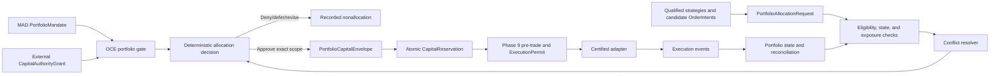
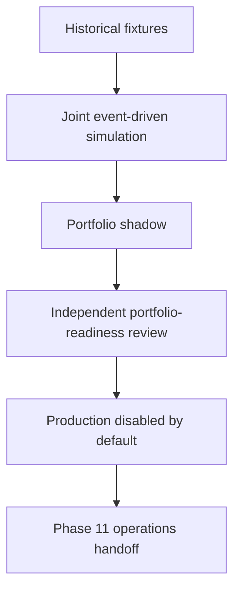
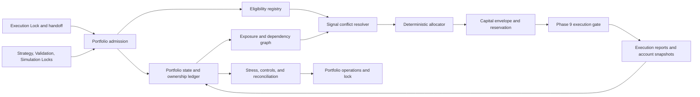
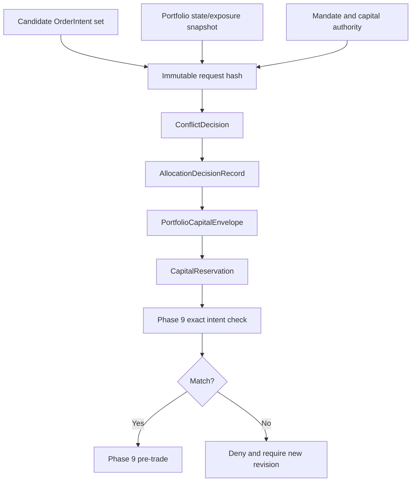

# Phase 10 — Portfolio Forge

> **Status:** Build-ready planning package  
> **Prerequisite:** Verified Phase 9 `ExecutionLockManifest`, bounded `PortfolioExecutionHandoff`, and valid Strategy/Validation/Simulation Locks  
> **Produces:** Certified portfolio allocator, aggregate risk evidence, `PortfolioLockManifest`, and a nonauthorizing Phase 11 operations handoff  
> **Anchor:** **F10 — A qualified strategy earns eligibility, not unlimited capital.**

---

## 1. Idea

Coordinate qualified strategies as one capital system instead of treating each profitable backtest, signal, account, or venue as an independent claim on money.

```text
ExecutionLockManifest
→ PortfolioAdmission
→ PortfolioMandate
→ eligible strategy/action set
→ reconciled portfolio state
→ exposure and dependency graph
→ signal-conflict decision
→ deterministic allocation decision
→ expiring PortfolioCapitalEnvelope
→ atomic CapitalReservation
→ Phase 9 pre-trade and one-use ExecutionPermit
→ execution events and portfolio reconciliation
→ stress, throttle, suspension, and recovery proof
→ Portfolio Lock
→ Phase 11 sovereign-operations handoff
```

A qualified strategy is eligible to request portfolio capital. It does not own a permanent weight, account, venue, order quantity, or right to trade.

---

## 2. Reality at Entry

The workspace contains portfolio ingredients, but no canonical aggregate capital authority:

| Current seam | Repository evidence | Phase 10 treatment |
|---|---|---|
| Phase 9 handoff | `PortfolioExecutionHandoff` explicitly carries zero aggregate allocation and no live authority | Canonical execution-capability input; Portfolio Forge must independently admit every cell |
| Nautilus portfolio | Local v1.227.0 tree provides position, PnL, margin, multi-account, multi-currency, and exposure state | Candidate canonical account/position substrate after the Phase 9 source/version classification; not an allocator or capital authority |
| Nautilus risk engine | Local configuration includes order-rate and per-order notional checks and can expose a risk bypass | Reuse approved deterministic primitives, but Phase 10 adds aggregate limits; every bypass is forbidden in certified paths |
| Portfolio snapshots | Rust runtime supports periodic portfolio snapshots while the local Python runtime documents a current snapshot-cadence limitation | Runtime-specific capability must be declared; no design may assume equivalent snapshot behavior |
| Quant Lab Goal 6 | `quant-lab/GOALS.md` requires a three-pair basket, while `quant-lab/STATUS.md` records it as not started | Useful target and fixture source only; not evidence of a portfolio allocation |
| Existing basket weights | Research findings contain proposed percentages derived from results that also record bugs, small samples, and losing strategies | Quarantined hypotheses until every component is admitted through current FORGE Locks |
| Manual portfolio claims | Extracted manuals contain correlation notes, Monte Carlo claims, and allocation examples | Research input only; every statistic must be reproduced from versioned point-in-time evidence |
| Helper metrics | `utils/metrics.py` calculates basic return, volatility, Sharpe, Sortino, drawdown, and Calmar values | Noncanonical helper until formulas, units, sampling, degenerate cases, and test coverage meet Phase 7/10 contracts |
| OCE EconomicsEngine | `oce/backend/economics_engine.py` allocates entropy/compute budgets | Operational-resource accounting only; it must never be interpreted as financial capital allocation |

The workspace does **not** yet contain a canonical:

- Portfolio admission or mandate;
- financial-capital authority grant;
- strategy eligibility cell;
- aggregate portfolio state and ownership ledger;
- asset/currency/issuer/sector/factor/venue/account exposure graph;
- point-in-time dependency and tail-overlap model;
- signal-conflict resolver;
- deterministic capital-envelope allocator;
- capital reservation ledger;
- liquidity/capacity and concentration engine;
- portfolio drawdown/loss controller;
- joint multi-strategy stress harness;
- strategy throttle/suspension workflow;
- portfolio-versus-execution/broker reconciliation;
- portfolio certification report;
- Portfolio Lock.

Existing numbers are evidence candidates, not weights.

---

## 3. Canonical Decisions

All `A*` identifiers use the exact names and meanings from [`GLX_FORGE_MASTER_BLUEPRINT.md`](../../GLX_FORGE_MASTER_BLUEPRINT.md).

| Decision | Lock |
|---|---|
| Orchestration | OCE remains the sole portfolio-control and authority spine |
| Human authority | MAD defines the total capital mandate, prohibited exposures, autonomy, and any production grant |
| Strategy eligibility | Requires current Strategy, Validation, Simulation, and Execution Locks |
| Portfolio request | Immutable `PortfolioAllocationRequest` referencing unchanged candidate `OrderIntent` objects |
| Intent changes | Deny, defer, or require a new intent revision; never silently resize or rewrite an existing intent |
| Portfolio truth | Append-only ownership, capital, exposure, decision, and reconciliation ledgers |
| Position substrate | Approved Nautilus/account state plus Phase 9 execution evidence |
| Dependency model | Point-in-time, horizon-aware, regime/tail-aware, uncertainty-labeled; Pearson correlation alone is insufficient |
| Conflict resolution | Deterministic frozen policy; no LLM in the capital path |
| Capital allocator | Hard constraints and reserves dominate any optimization objective |
| Capital output | Exact, expiring, revocable `PortfolioCapitalEnvelope` with atomic reservations |
| Execution boundary | Portfolio Forge never issues `ExecutionPermit` or calls an adapter; Phase 9 remains mandatory |
| Netting | Economic netting may inform risk, but strategy ownership and venue/account cash remain explicit |
| Uncertainty | Missing price, FX conversion, ownership, correlation, liquidity, or reconciliation evidence blocks new risk |
| Stress | Historical, hypothetical, and generated scenarios remain distinguishable and reproducible |
| Suspension | Blocks new risk while preserving ownership and management of open/uncertain exposure |
| Environments | `historical_fixture`, `joint_simulation`, `portfolio_shadow`, and `production_disabled_by_default` |
| Phase completion | Joint simulation, stress, chaos, and shadow evidence suffice; live capital is not required |
| Phase 11 boundary | Phase 10 proves capital logic; Phase 11 productizes continuous operations and operator control |

---

## 4. Authority Topology



Envelope issuance is valid only when:

```text
CanIssuePortfolioEnvelope =
    PortfolioAdmissionValid
    AND UpstreamLocksValid
    AND StrategyEligibilityExact
    AND PortfolioMandateValid
    AND EnvironmentAuthorityValid
    AND PortfolioStateFreshAndReconciled
    AND OwnershipComplete
    AND ExposureAndDependencyEvidenceValid
    AND SignalConflictsResolved
    AND HardLimitsAndReservesPass
    AND LiquidityAndCapacityPass
    AND StressAndDrawdownHeadroomPass
    AND AllocationDecisionDeterministic
    AND NoBlockingIncidentOrSuspension
```

Capital consumption additionally requires:

```text
CanConsumeCapital =
    PortfolioCapitalEnvelopeValid
    AND CapitalReservationAtomicAndUnused
    AND ReservationIntentHashMatches
    AND Phase9CanRoute
```

Portfolio approval never substitutes for Phase 9 execution authority.

---

## 5. Portfolio Environments



### `historical_fixture`

No external route. Versioned strategy decisions, returns, fills, prices, corporate actions, rates, and venue states prove exposure, dependency, conflict, allocation, and stress behavior.

### `joint_simulation`

All strategies share one synthetic capital ledger and canonical event clock. The harness preserves overlapping orders, capacity competition, margin, cross-currency valuation, and path-dependent controls.

### `portfolio_shadow`

Current qualified signals and Phase 9 observations feed a counterfactual portfolio allocator, but the shadow output cannot create an order, capital reservation against real funds, or broker action.

### `production_disabled_by_default`

Production integration code may be certified statically, but no production `CapitalAuthorityGrant`, portfolio envelope, Phase 9 permit, or live route is created during Phase 10 completion.

---

## 6. Admission and Completion

Phase 10 admission requires:

```text
execution_lock_valid
AND portfolio_execution_handoff_valid
AND all_referenced_upstream_locks_valid
AND requested_strategy_cells_exact
AND execution_capabilities_and_blockers_explicit
AND ownership_and_account_model_defined
AND portfolio_valuation_data_available
AND mandate_and_limit_policy_frozen
AND dependency_and_stress_methodology_frozen
AND independent_reviewer_assigned
```

Phase 10 completes when:

```text
all_five_books_pass
AND every_eligible_strategy_cell_is_lock_backed
AND aggregate_state_and_ownership_reconcile
AND exposure_dependency_and_conflict_tests_pass
AND capital_conservation_and_reservation_tests_pass
AND liquidity_capacity_and_concentration_tests_pass
AND joint_stress_drawdown_and_suspension_tests_pass
AND phase9_execution_and_broker_state_reconcile
AND production_capital_remains_disabled
AND portfolio_lock_verifies
AND phase11_handoff_contains_no_standing_live_authority
```

---

## 7. Book Sequence

| Book | Document | Builds | Exit |
|---:|---|---|---|
| 1 | [Portfolio Contracts and Capital Authority](book-1-portfolio-contracts-capital-authority.md) | Admission, mandate, eligibility, requests, authority grants, state and capital contracts | No strategy or agent can create financial authority or bypass exact lock scope |
| 2 | [Exposure, Dependency, and Conflict Fabric](book-2-exposure-dependency-conflicts.md) | Ownership, valuation, exposures, correlations, shared failure modes, conflict decisions | Hidden overlap and opposing actions are explicit, point-in-time, and policy-resolved |
| 3 | [Capital Envelopes and Allocation](book-3-capital-envelopes-allocation.md) | Constraint hierarchy, deterministic allocator, reserves, liquidity/capacity, reservations, rebalance | Every unit of capital/risk is bounded, conserved, and causally allocated |
| 4 | [Stress, Drawdown, and Portfolio Controls](book-4-stress-drawdown-controls.md) | Scenario engine, portfolio loss/drawdown limits, throttle, suspension, Phase 9 control requests | Portfolio risk remains bounded under shock and open exposure is never orphaned |
| 5 | [Portfolio Operations and Lock](book-5-portfolio-operations-lock.md) | Joint simulation, shadow, chaos/soak, reconciliation, replay, certification, Portfolio Lock | Complete portfolio logic is reproducible, production-disabled, and ready for Phase 11 |

Books execute in order. Later optimizers cannot weaken earlier authority, ownership, valuation, or hard-limit contracts.

---

## 8. Architecture





---

## 9. Core Artifacts

| Artifact | Purpose |
|---|---|
| `PortfolioAdmission` | Verifies the Phase 9 handoff, upstream Locks, scope, dependencies, and reviewers |
| `PortfolioPolicy` | Freezes valuation, exposure, conflict, allocation, stress, control, and certification rules |
| `PortfolioMandate` | Human-approved portfolio objectives, prohibitions, aggregate limits, reserves, and autonomy |
| `CapitalAuthorityGrant` | External environment-specific proof that a bounded capital base may be allocated |
| `StrategyEligibilityCell` | Exact strategy/version/environment/instrument/account eligibility and limitations |
| `PortfolioAllocationRequest` | Immutable set of candidate intents and requested risk/capital semantics |
| `PortfolioStateSnapshot` | Point-in-time cash, margin, orders, positions, PnL, ownership, and uncertainty |
| `ExposureLedgerSnapshot` | Gross/net exposure across asset, currency, issuer, sector, factor, venue, account, and strategy |
| `DependencyGraph` | Horizon/regime/tail-aware statistical and structural dependencies with uncertainty |
| `SignalConflictSet` | Exact overlapping/opposing candidate and existing actions |
| `ConflictDecision` | Deterministic approve/deny/defer/revision result under frozen policy |
| `AllocationDecisionRecord` | Full constraint inputs, solver/objective, outputs, denials, and diagnostics |
| `PortfolioCapitalEnvelope` | Expiring exact capital/risk scope available to one strategy/action set |
| `CapitalReservation` | Atomic claim against an envelope bound to exact intent hashes |
| `PortfolioControlIntent` | Typed throttle, suspend, block, cancel, or reduce request routed through Phase 9 |
| `PortfolioStressReport` | Reproducible scenario paths, losses, breaches, controls, and residual uncertainty |
| `PortfolioReconciliationSnapshot` | Portfolio ledger versus Phase 9, Nautilus, account, and venue evidence |
| `PortfolioCertificationReport` | Joint simulation, shadow, stress, chaos, soak, and limitation evidence |
| `PortfolioLockManifest` | Immutable Phase 10 completion proof |
| `SovereignOperationsHandoff` | Phase 11 views, controls, SLOs, blockers, and nonauthority requirements |

---

## 10. Canonical Allocation Boundary

```yaml
portfolio_allocation_request_id: content-id
schema_version: semver
portfolio_admission_ref: artifact-ref
portfolio_mandate_ref: artifact-ref
capital_authority_ref: artifact-ref
strategy_eligibility_refs: []
candidate_order_intent_refs: []
requested_capital_and_risk: {}
decision_market_cursor: cursor
portfolio_state_ref: artifact-ref
exposure_snapshot_ref: artifact-ref
dependency_graph_ref: artifact-ref
conflict_policy_ref: policy-ref
allocation_policy_ref: policy-ref
created_at: timestamp
valid_until: timestamp
idempotency_key: string
```

Allowed outcomes:

```text
approve_exact
deny
defer_until_state
require_new_intent_revision
```

Forbidden outcomes include mutating an existing intent, inventing an account, silently netting strategy ownership, adding an unqualified strategy, issuing a Phase 9 permit, calling an adapter, loading live credentials, or creating a production capital grant.

---

## 11. Exposure Preservation Matrix

| Dimension | Required portfolio treatment |
|---|---|
| Strategy | Preserve independent owner, lock/version, signal, PnL, open order, and capital lineage |
| Instrument | Canonical identity, multiplier, settlement, contract version, and nonlinear payoff |
| Currency | Decompose base/quote/settlement/collateral and use point-in-time conversion with missing-rate blocks |
| Issuer/underlying | Aggregate shares, options, ETFs, ADRs, futures, and synthetic exposure without losing instrument detail |
| Sector/industry | Point-in-time classification; historical constituents and classifications may not leak |
| Factor/macro | Versioned factor definitions, loadings, uncertainty, and horizon |
| Venue/account | Cash, collateral, margin, buying power, permissions, and transferability remain separate |
| Direction | Track gross long, gross short, and net; a small net cannot hide large gross leverage |
| Optionality | Delta, gamma, vega, theta, assignment, exercise, expiry, and stress payoff where in scope |
| Liquidity | Participation, spread, depth, impact, liquidation horizon, and capacity uncertainty |
| Dependency | Linear, nonlinear, tail, regime, event, model-lineage, and shared-data failure modes |

Portfolio-wide does not mean destructive aggregation. Every aggregate must drill back to immutable components.

---

## 12. Target Layout

```text
portfolio_forge/
  contracts/
    admission.py
    policy.py
    mandate.py
    authority.py
    eligibility.py
    allocation_request.py
  state/
    portfolio_snapshot.py
    ownership_ledger.py
    valuation.py
  exposure/
    ledger.py
    taxonomy.py
    dependency.py
    correlation.py
    overlap.py
  conflicts/
    detector.py
    resolver.py
  allocation/
    constraints.py
    objective.py
    allocator.py
    decision.py
    envelope.py
    reservation.py
  liquidity/
  stress/
  controls/
  reconciliation/
  certification/
  operations/
  lock/
  handoff/
```

The implementation path is selected from the approved Reality Lock. Agents may not patch the vendored Nautilus tree casually, reuse OCE entropy budgets as trading capital, or introduce a parallel portfolio supervisor.

---

## 13. Critical Test Matrix

| Test | Proof | Book |
|---|---|---:|
| P10-ADM-001 | Valid Execution Lock and zero-allocation handoff admit once | 1 |
| P10-MND-001 | Portfolio mandate is exact, bounded, approved, and immutable | 1 |
| P10-AUT-001 | Eligibility or allocation request cannot create capital authority | 1 |
| P10-EXP-001 | Gross/net multi-dimensional exposure reconciles to components | 2 |
| P10-COR-001 | Correlation/dependency evidence is point-in-time and uncertainty-labeled | 2 |
| P10-CNF-001 | Opposing and overlapping signals resolve deterministically | 2 |
| P10-OWN-001 | Economic netting cannot erase strategy ownership | 2 |
| P10-ALR-001 | Hard constraints dominate every allocator objective | 3 |
| P10-ENV-001 | Capital envelope is exact, expiring, revocable, and nonexecuting | 3 |
| P10-RSV-001 | Concurrent reservations cannot double-allocate capital | 3 |
| P10-LIQ-001 | Reduced liquidity/capacity lowers or denies allocation | 3 |
| P10-STR-001 | Gap, volatility, correlation, liquidity, and venue shocks reproduce | 4 |
| P10-DRW-001 | Portfolio drawdown/loss breach blocks exposure increase | 4 |
| P10-SUS-001 | Strategy suspension preserves management of open exposure | 4 |
| P10-CTL-001 | Portfolio control actions must traverse Phase 9 authority | 4 |
| P10-SIM-001 | Joint simulation shares one clock, capital ledger, and capacity | 5 |
| P10-REC-001 | Portfolio ownership/capital/exposure reconcile to execution and broker state | 5 |
| P10-LCK-001 | Portfolio Lock verifies every selected strategy/capability cell and control | 5 |
| P10-HOF-001 | Phase 11 receives complete operating requirements without live authority | 5 |
| P10-AUT-100 | Portfolio Lock is readiness evidence, not standing capital or trading permission | 5 |

---

## 14. Phase Invariants

1. OCE is the sole portfolio-control spine.
2. OCE entropy/compute budgets are never financial capital.
3. Only a valid Phase 9 Execution Lock and handoff may admit.
4. Every strategy cell has current Strategy, Validation, Simulation, and Execution Lock lineage.
5. A qualified strategy earns eligibility only.
6. An allocation request is not capital authority.
7. An allocation proposal is not an allocation decision.
8. Production capital authority originates only from MAD/governance.
9. Portfolio mandate, authority grant, allocation decision, envelope, reservation, and execution permit remain distinct.
10. Portfolio Forge never issues a Phase 9 `ExecutionPermit`.
11. Portfolio Forge never calls a broker or adapter.
12. Existing `OrderIntent` objects are immutable.
13. Changed quantity or semantics require a new intent revision and reevaluation.
14. Every capital envelope binds exact strategy, account, environment, instruments/actions, limits, and time.
15. Every capital reservation binds exact intent hashes.
16. Reservations are atomic and exactly-once in effect.
17. No capital or risk budget is double-counted across strategies, accounts, or venues.
18. Hard reserves, prohibitions, and limits dominate optimization.
19. Solver failure, infeasibility, or timeout cannot relax constraints.
20. LLM/model output is absent from conflict, allocation, reservation, limit, reconciliation, and control paths.
21. Portfolio state is point-in-time, append-only in evidence, and reconstructable.
22. Unknown ownership blocks new exposure.
23. Account and venue cash/collateral are not assumed transferable.
24. Gross and net exposure are both retained.
25. Net exposure cannot hide gross leverage or opposing strategy ownership.
26. Cross-currency aggregation requires fresh point-in-time conversion.
27. Missing prices or conversion rates never default to zero or one.
28. Sector, issuer, constituent, factor, and contract mappings are versioned.
29. Correlation alone never proves independence, diversification, or causality.
30. Dependency estimates declare horizon, sample, regime, method, uncertainty, and staleness.
31. Shared instruments, data, timing, logic, exit, and failure modes contribute to overlap.
32. Conflicting signals resolve by frozen policy, not model preference.
33. Strategy conflict cannot be hidden by broker-account netting.
34. Capacity is shared across concurrent strategies and orders.
35. Liquidity evidence is uncertainty-bounded and stressable.
36. Turnover, fees, spread, impact, financing, borrow, and margin affect allocation.
37. Options and nonlinear instruments require scenario risk beyond delta.
38. Open, pending, uncertain, assigned, exercised, and settling exposure contribute to risk.
39. Drawdown uses realized and unrealized PnL plus fees/financing under a frozen high-water policy.
40. Pending cancels and control requests do not release exposure.
41. Suspension blocks new risk but preserves ownership and close/reduce management.
42. Portfolio controls create typed Phase 9 requests; they do not bypass execution governance.
43. Unknown exposure is never reported as flat.
44. Historical, hypothetical, and generated stress evidence remain labeled separately.
45. Joint simulation uses one event clock and one conserved capital ledger.
46. Portfolio shadow cannot route or reserve real capital.
47. Production remains disabled through Phase 10 completion.
48. Material strategy, data, mapping, account, venue, policy, model, or runtime changes invalidate affected evidence.
49. Phase 11 independently admits the Portfolio Lock and handoff.
50. Portfolio Lock proves readiness; it does not compel or authorize live trading.

---

## 15. Agent Extension Contract

An agent extending Phase 10 must:

1. read this blueprint, the active book, Phase 9 handoff, and every referenced Lock;
2. restate A0, A7, and F10;
3. declare strategy/version, asset, instrument, account, venue, environment, and requested capital scope;
4. distinguish eligibility, authority, decision, envelope, reservation, and execution permit;
5. preserve immutable intent and strategy ownership;
6. use point-in-time valuation, taxonomy, dependency, and liquidity inputs;
7. keep deterministic capital and control paths outside model judgment;
8. add invariant, joint-simulation, stress, concurrency, restart, and reconciliation tests;
9. record uncertainty, infeasibility, rejected strategies, and blocked execution cells;
10. hand only bounded operating requirements to Phase 11.

The agent must pause when an upstream Lock is invalid, ownership is incomplete, an existing intent would need mutation, a production authority appears without MAD approval, state cannot reconcile, price/FX conversion is missing, dependency/capacity evidence is stale, the allocator is infeasible, a strategy is suspended with unmanaged exposure, or Phase 9 cannot enforce the resulting envelope.

---

## 16. Completion Definition

Phase 10 is complete only when:

- admission verifies the exact Phase 9 handoff and all strategy cells;
- portfolio mandate and authority contracts cannot create implicit live capital;
- ownership, valuation, cash, margin, orders, positions, and PnL reconcile;
- exposures drill from portfolio totals to immutable strategy/action components;
- point-in-time dependency, tail overlap, shared failure, and conflict logic pass;
- deterministic allocation preserves hard limits, reserves, conservation, and exact intent scope;
- liquidity/capacity reduction, concurrent reservation, and rebalance tests pass;
- options/nonlinear, currency, sector, factor, venue, and account limits pass where in scope;
- gap, volatility, liquidity, correlation, margin, and venue-outage stress campaigns pass;
- drawdown, throttle, suspension, and recovery preserve open exposure;
- every cancel/reduce/block request traverses Phase 9 governance;
- joint simulation, shadow, chaos, soak, replay, restore, and reconciliation complete;
- production capital and routing remain disabled;
- the Portfolio Lock verifies;
- Phase 11 receives no implicit live authorization.

---

## 17. Handoff to Phase 11

Sovereign Operations receives:

- immutable Strategy, Validation, Simulation, Execution, and Portfolio Locks;
- certified strategy/asset/account/venue eligibility cells;
- portfolio mandate, authority, state, exposure, dependency, conflict, allocation, envelope, and reservation contract versions;
- dashboards and drill-down requirements for capital, risk, ownership, and uncertainty;
- deterministic approval, denial, throttle, suspension, recovery, and escalation workflows;
- joint-simulation, shadow, stress, chaos, soak, and reconciliation evidence;
- portfolio/execution/broker SLOs and alert thresholds;
- blocked strategies, capabilities, accounts, venues, and known limitations;
- invalidation, rollback, backup, restore, and replay rules;
- a `SovereignOperationsHandoff` with production authority absent.

Phase 11 owns the continuously operating command center, human approval queue, autonomy controls, incident center, drift/decay monitoring, lifecycle automation, permissions, and deployment operations. It may not reinterpret Portfolio Lock readiness as permission to activate capital or trading.
