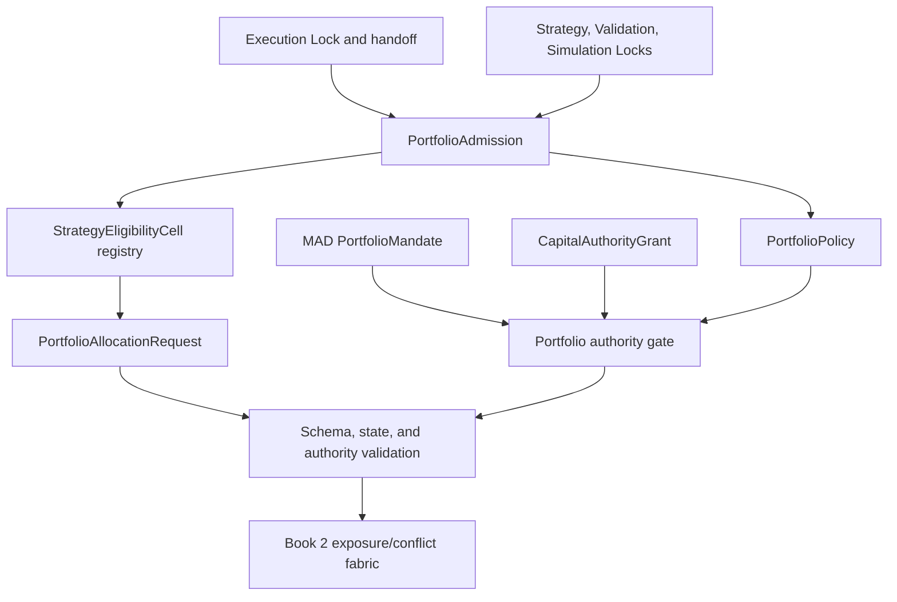

# Phase 10, Book 1 — Portfolio Contracts and Capital Authority

> **Purpose:** Admit exact Execution Lock scope, define the portfolio language, and make financial-capital authority impossible to infer from strategy qualification or configuration  
> **Input:** Phase 9 `ExecutionLockManifest`, `PortfolioExecutionHandoff`, and valid Strategy/Validation/Simulation Locks  
> **Output:** `PortfolioAdmission`, `PortfolioPolicy`, `PortfolioMandate`, authority/eligibility/request/state contracts, and capital-event lineage  
> **Previous:** Phase 9 — Execution Forge  
> **Next:** [Book 2 — Exposure, Dependency, and Conflict Fabric](book-2-exposure-dependency-conflicts.md)

---

## 1. Success Statement

Every portfolio candidate is backed by exact current FORGE Locks; every capital objective, prohibition, reserve, limit, account, environment, and autonomy boundary is explicit; synthetic and real authority cannot be confused; and no strategy, agent, optimizer, OCE resource budget, configuration value, or favorable statistic can manufacture a financial-capital right.

---

## 2. Applicable Anchors

- **A0:** Human Strategic Authority
- **A1:** One Orchestration Spine
- **A2:** Evidence Before Narrative
- **A3:** Point-in-Time Data
- **A4:** StrategySpec Is Truth
- **A6:** Nautilus Is the Canonical Trading Model
- **A7:** OrderIntent Is the Execution Boundary
- **A8:** Promotion Is State-Based
- **A9:** Separate Research From Approval
- **A10:** Observable and Reconstructable
- **A11:** Repair Before Expansion
- **A12:** Cheap Models Use Tools, Not Memory
- **A15:** Live Autonomy Is Earned
- **F9:** Strategies request; adapters execute; governance authorizes
- **F10:** A qualified strategy earns eligibility, not unlimited capital

---

## 3. Contract and Authority Topology



---

## 4. Work Packages

### 4.1 Portfolio admission

Verify:

- Strategy, Validation, Simulation, and Execution Lock identities/hashes;
- Phase 9 certified execution capabilities, account classes, environments, hard limits, and blockers;
- exact strategy versions and permitted instruments/sessions;
- canonical intent, execution report, ownership, and reconciliation interfaces;
- requested portfolio dimensions and aggregation currency;
- point-in-time valuation, reference, taxonomy, FX-rate, liquidity, and dependency inputs;
- portfolio mandate owner and capital authority owner;
- independent reviewer and separation of proposer/approver;
- no unresolved critical incident, unknown exposure, or invalidated upstream evidence;
- no implicit weight, account, venue, production grant, or live route.

```yaml
portfolio_admission_id: content-id
execution_lock_ref: artifact-ref
portfolio_execution_handoff_ref: artifact-ref
strategy_lock_refs: []
validation_lock_refs: []
simulation_lock_refs: []
qualified_strategy_cells_requested: []
certified_execution_cells_requested: []
valuation_and_reference_dependencies: {}
dependency_resolution: {}
requested_environment: historical_fixture|joint_simulation|portfolio_shadow|production_disabled_by_default
review_policy_ref: policy-ref
status: proposed|admitted|rejected|blocked
blocking_reasons: []
approvals: []
```

Admission creates no mandate, authority grant, capital base, weight, envelope, reservation, execution permit, order, or route.

### 4.2 PortfolioPolicy

```yaml
portfolio_policy_id: content-id
admission_ref: artifact-ref
allowed_environments: [historical_fixture, joint_simulation, portfolio_shadow, production_disabled_by_default]
contract_versions: {}
eligibility_policy_ref: policy-ref
state_and_ownership_policy_ref: policy-ref
valuation_policy_ref: policy-ref
exposure_policy_ref: policy-ref
dependency_policy_ref: policy-ref
conflict_policy_ref: policy-ref
allocation_policy_ref: policy-ref
capital_reservation_policy_ref: policy-ref
liquidity_capacity_policy_ref: policy-ref
stress_policy_ref: policy-ref
drawdown_and_control_policy_ref: policy-ref
reconciliation_policy_ref: policy-ref
certification_policy_ref: policy-ref
prohibited_strategies_or_exposures: []
```

Policies freeze before portfolio evidence is computed. Any semantic policy change invalidates affected decisions, simulations, and certification.

### 4.3 PortfolioMandate

The mandate is the human-approved strategic boundary:

```yaml
portfolio_mandate_id: immutable-id
mandate_version: semver
owner: MAD
objectives_ranked: []
base_reporting_currency: canonical-currency
allowed_environments: []
allowed_strategy_eligibility_refs: []
allowed_asset_classes: []
allowed_instruments_or_universes: []
allowed_accounts_and_venues: []
prohibited_exposures_and_actions: []
minimum_cash_or_collateral_reserve: {}
maximum_gross_exposure: {}
maximum_net_exposure: {}
maximum_leverage_and_margin: {}
maximum_asset_sector_factor_currency_venue_concentration: {}
maximum_portfolio_loss_and_drawdown: {}
liquidity_and_capacity_requirements: {}
strategy_throttle_and_suspension_policy_ref: policy-ref
allocation_objective_hierarchy_ref: policy-ref
autonomy_level: typed-level
valid_from: timestamp
expires_at: timestamp
approval_refs: []
revocation_state: active|revoked|expired
```

The mandate defines what may be optimized. It does not prove funds exist, create an account binding, assign a weight, reserve capital, or authorize a trade.

### 4.4 CapitalAuthorityGrant

```yaml
capital_authority_grant_id: immutable-id
portfolio_mandate_ref: artifact-ref
authority_class: synthetic_fixture|synthetic_simulation|shadow_counterfactual|production_external
real_capital: boolean
environment: historical_fixture|joint_simulation|portfolio_shadow|production
authorized_capital_base: {}
approved_account_binding_refs: []
approved_asset_and_instrument_scope: []
maximum_aggregate_commitment: {}
maximum_loss_and_drawdown: {}
minimum_unallocated_reserve: {}
allowed_allocation_actions: []
not_before: timestamp
expires_at: timestamp
issued_by_capability: typed-capability
human_approval_refs: []
single_campaign_or_epoch_scope: {}
revocation_state: active|revoked|expired
```

Rules:

- fixture/simulation grants are explicitly synthetic;
- shadow authority is counterfactual and cannot reserve real funds;
- `production_external` is accepted only as external MAD/governance input;
- Phase 10 code and agents cannot create, sign, infer, renew, broaden, or substitute a production grant;
- the grant does not fund an account or authorize execution;
- authority expires and can be revoked independently of portfolio state.

### 4.5 StrategyEligibilityCell

```yaml
strategy_eligibility_cell_id: content-id
portfolio_admission_ref: artifact-ref
strategy_spec_and_build_lock_ref: artifact-ref
validation_lock_ref: artifact-ref
simulation_lock_ref: artifact-ref
execution_lock_ref: artifact-ref
strategy_version: immutable-version
permitted_environment: typed-value
permitted_instruments_sessions_horizons: {}
permitted_parameter_baseline_or_ranges: {}
certified_execution_cell_refs: []
validated_performance_and_uncertainty_refs: []
drawdown_tail_and_break_even_refs: []
capacity_and_liquidity_evidence_refs: []
known_dependencies_and_limitations: []
ownership_model: typed-value
status: eligible|throttled|suspended|expired|revoked|blocked
valid_from: timestamp
expires_at: timestamp
```

Eligibility is an intersection:

```text
EligibleScope =
    StrategyLockScope
    INTERSECT ValidationQualifiedScope
    INTERSECT SimulationQualifiedScope
    INTERSECT ExecutionCertifiedScope
    INTERSECT PortfolioMandateScope
```

Anything outside the intersection is blocked or returned to the earlier FORGE phase.

### 4.6 PortfolioAllocationRequest

```yaml
portfolio_allocation_request_id: content-id
schema_version: semver
portfolio_admission_ref: artifact-ref
portfolio_policy_ref: policy-ref
portfolio_mandate_ref: artifact-ref
capital_authority_grant_ref: artifact-ref
allocation_epoch_id: typed-id
strategy_eligibility_refs: []
candidate_order_intent_refs: []
candidate_order_intent_hashes: []
requested_capital_and_risk: {}
requested_horizon: {}
decision_market_cursor: cursor
portfolio_state_ref: artifact-ref
created_at: timestamp
valid_until: timestamp
idempotency_key: string
```

The request contains no provider payload, credential, raw account ID, mutable strategy code, or permission to alter its referenced intents. Candidate ordering is canonicalized before hashing.

Allowed Book 2/3 outcomes:

- `approve_exact`;
- `deny`;
- `defer_until_state`;
- `require_new_intent_revision`.

There is no in-place “approve with changed quantity” outcome.

### 4.7 PortfolioStateSnapshot

```yaml
portfolio_state_snapshot_id: content-id
portfolio_admission_ref: artifact-ref
as_of_time: timestamp
as_of_market_cursor: cursor
as_of_execution_event_roots: {}
account_binding_refs: []
cash_and_settlement_refs: []
margin_collateral_and_buying_power_refs: []
open_order_and_uncertainty_refs: []
position_and_lot_refs: []
fees_financing_borrow_and_funding_refs: []
realized_and_unrealized_pnl_refs: []
option_exercise_assignment_expiry_refs: []
capital_envelope_and_reservation_refs: []
strategy_ownership_ledger_ref: artifact-ref
unpriceable_or_unconvertible_items: []
reconciliation_refs: []
emergency_and_suspension_states: []
state_hash: content-hash
```

Stale, internally inconsistent, unreconciled, unpriceable, or ownership-incomplete state cannot support new risk.

### 4.8 Strategy ownership ledger

Every economic effect retains:

```yaml
strategy_ownership_record:
  ownership_record_id: content-id
  strategy_eligibility_ref: artifact-ref
  strategy_instance_id: typed-id
  allocation_epoch_id: typed-id
  capital_envelope_ref: artifact-ref
  capital_reservation_ref: artifact-ref
  order_intent_ref: artifact-ref
  execution_report_refs: []
  account_binding_ref: artifact-ref
  instrument_id: canonical-id
  owned_quantity_or_share: {}
  cash_margin_fee_and_pnl_effect_refs: []
  lifecycle_state: typed-value
  previous_record_hash: optional-content-hash
```

The broker may net positions at an account, but the portfolio ledger cannot infer that one strategy owns another strategy's offsetting quantity. Ambiguous ownership triggers hold.

### 4.9 Authority and state event chain

```text
portfolio.admission.proposed
→ portfolio.admission.approved
→ portfolio.mandate.verified
→ portfolio.capital_authority.verified
→ portfolio.strategy_eligibility.verified
→ portfolio.allocation_request.recorded
→ portfolio.state.snapshot_recorded
→ portfolio.request.ready_for_exposure_review
```

Denied, blocked, expired, revoked, invalidated, uncertain, and reconciled branches are first-class events.

### 4.10 Environment and configuration boundary

Configuration may select local service addresses, artifact references, and approved policy versions. It cannot:

- create or change a mandate;
- set `real_capital=true`;
- select an unapproved account or venue;
- turn synthetic/shadow authority into production authority;
- add an eligible strategy;
- widen an instrument, action, loss, leverage, or concentration bound;
- set or restore a capital envelope/reservation;
- activate a Phase 9 permit or adapter;
- ignore an upstream invalidation;
- reinterpret an OCE entropy budget as money.

Values such as `LIVE=true`, `CAPITAL=10000`, `PORTFOLIO_ENABLED=true`, or `RISK_BYPASS=true` are never sufficient authority.

### 4.11 OCE and Nautilus vocabulary boundaries

- OCE `EconomicsEngine.allocate_budget()` allocates operational entropy/compute units, not dollars, collateral, risk, or buying power.
- OCE governance proposals can carry an approval workflow, but financial-capital actions require the exact Phase 10 artifact family and MAD authority.
- Nautilus `Portfolio` is canonical for approved account/position/PnL behavior, not for strategy eligibility or human capital authority.
- Nautilus risk-engine bypass modes are forbidden in every Phase 10-certified execution path.

### 4.12 Contract versioning and migrations

Each contract has:

- semantic version and schema hash;
- canonical serialization;
- decimal, currency, timestamp, and identifier rules;
- unknown-field and unknown-enum policy;
- compatibility matrix;
- migration function where permitted;
- invalidation scope;
- golden fixtures.

Unknown or lossy migrations fail closed. Historical artifacts retain their original schema and transformation evidence.

---

## 5. Target Layout

```text
portfolio_forge/
  contracts/
    admission.py
    policy.py
    mandate.py
    capital_authority.py
    eligibility.py
    allocation_request.py
    portfolio_state.py
    ownership.py
  authority/
    verifier.py
    events.py
    revocation.py
  state/
    snapshot.py
    freshness.py
    registry.py
  security/
    environment_guard.py
    config_guard.py
  migrations/
```

---

## 6. Deliverables

- Phase 9-to-10 admission adapter and blocker registry.
- Immutable `PortfolioPolicy`.
- Human-owned `PortfolioMandate`.
- Synthetic/shadow/external `CapitalAuthorityGrant` contract and verifier.
- Exact `StrategyEligibilityCell` registry.
- Immutable multi-intent `PortfolioAllocationRequest`.
- Freshness-bounded `PortfolioStateSnapshot`.
- Append-only strategy ownership ledger.
- Portfolio authority/state event chain.
- Environment/configuration and financial-resource vocabulary guards.
- Schema compatibility, canonical serialization, migrations, and golden fixtures.
- Static dependency rules preventing Phase 10 from issuing Phase 9 permits or importing adapters.

---

## 7. Required Tests

### P10-ADM-001 — Valid Portfolio Admission

A valid Execution Lock, zero-allocation handoff, exact upstream Locks, dependencies, and reviewers produce one admitted record.

### P10-ADM-002 — Invalid Execution Lock

Missing, failed, expired, hash-mismatched, or invalidated Execution Lock rejects admission.

### P10-ADM-003 — Upstream Lock Drift

Changed Strategy, Validation, or Simulation scope blocks the affected strategy cell.

### P10-ADM-004 — Implicit Allocation in Handoff

A Phase 9 handoff containing a weight, account choice, capital allocation, or live authority is rejected.

### P10-ADM-005 — Unresolved Execution Blocker

Requested strategy exposure through a blocked adapter/capability remains blocked and visible.

### P10-ADM-006 — Critical Incident or Unknown Exposure

Unresolved critical incident, unknown order/position, or failed reconciliation blocks admission.

### P10-ADM-007 — Idempotent Admission

Repeated identical admission creates one record; a material input change creates a new identity.

### P10-CNT-001 — Canonical Serialization

Equivalent contract inputs serialize and hash identically across supported runtimes.

### P10-CNT-002 — Unknown Schema Version

Unknown versions fail closed without best-effort interpretation.

### P10-CNT-003 — Required Field Failure

Missing authority, environment, scope, unit, currency, time, or lineage fields reject.

### P10-CNT-004 — Decimal and Currency Precision

Serialization preserves declared decimal scale and canonical currency identity without binary-float drift.

### P10-CNT-005 — Lossy Migration

A migration that drops authority, ownership, limit, or uncertainty semantics is prohibited.

### P10-MND-001 — Exact Portfolio Mandate

Mandate is immutable, approved, expiring, and exact across objectives, scope, prohibitions, reserves, limits, and autonomy.

### P10-MND-002 — Mandate Is Not Funds

A valid mandate without a matching authority grant cannot issue a capital envelope.

### P10-MND-003 — Ranked Objectives

Objectives have deterministic priority; expected return cannot outrank a hard limit or reserve.

### P10-MND-004 — Prohibition Dominance

No optimization score can admit a prohibited strategy, asset, instrument, venue, account, or action.

### P10-MND-005 — Reserve Floor

Mandate must define an explicit reserve policy; absence cannot default to zero.

### P10-MND-006 — Base Currency

Reporting currency is explicit and cannot silently change portfolio valuation.

### P10-MND-007 — Mandate Expiry

Expired or revoked mandate blocks new requests while preserving management of existing exposure.

### P10-MND-008 — Unauthorized Amendment

Agent/runtime cannot widen a mandate or lower a hard limit.

### P10-MND-009 — Conflicting Mandates

Multiple active mandates for the same authority scope block until governance resolves priority.

### P10-MND-010 — Human Capital Boundary

Any capital or autonomy expansion requires recorded MAD/governance approval.

### P10-GRT-001 — Synthetic Authority Label

Fixture/simulation grant is positively labeled synthetic and cannot reach production integration.

### P10-GRT-002 — Shadow Counterfactual

Shadow grant cannot create a real reservation, execution envelope, or order.

### P10-GRT-003 — Production External Origin

Production grant created by Phase 10 code, an agent, a strategy, or configuration is rejected.

### P10-GRT-004 — Exact Account Scope

Grant applies only to listed account bindings and cannot choose another account.

### P10-GRT-005 — Exact Environment Scope

Environment mismatch fails; no fallback from fixture/simulation/shadow to production exists.

### P10-GRT-006 — Capital Base and Reserve

Authorized base, maximum commitment, loss bounds, and minimum reserve are finite and coherent.

### P10-GRT-007 — Grant Expiry and Revocation

Expired/revoked grant blocks new envelopes immediately without erasing open ownership.

### P10-GRT-008 — No Automatic Renewal

Grant cannot renew, broaden, repeat, or convert from synthetic to real automatically.

### P10-GRT-009 — Grant Is Not Execution

Valid production grant alone cannot issue an ExecutionPermit or call an adapter.

### P10-GRT-010 — Forged Approval

Missing, malformed, self-signed, or unknown human approval references fail closed.

### P10-ELG-001 — Exact Lock Intersection

Eligibility equals the strict intersection of all current upstream qualified/certified scopes.

### P10-ELG-002 — Failed Strategy

Rejected, quarantined, unvalidated, suspicious, or bug-affected strategy cannot become eligible from a favorable narrative.

### P10-ELG-003 — Strategy Version Drift

Code/spec/version change expires the affected eligibility cell.

### P10-ELG-004 — Instrument and Session Scope

Eligibility cannot expand from a tested pair/session/horizon to another by similarity.

### P10-ELG-005 — Blocked FX Truth

If the actual FX execution cell is blocked, FX strategies remain visible but ineligible for executable allocation.

### P10-ELG-006 — Capability Granularity

Market-order certification cannot imply limits, shorts, leverage, options, combos, or another venue capability.

### P10-ELG-007 — Eligibility Expiry

Expired/revoked cell blocks new requests while retaining historical lineage.

### P10-ELG-008 — Throttled and Suspended State

Eligibility state distinguishes reduced eligibility, no-new-risk suspension, and permanent revocation.

### P10-ELG-009 — No Permanent Weight

Eligibility contains no default portfolio weight or standing capital claim.

### P10-ELG-010 — Independent Review

Strategy builder/researcher cannot be the sole eligibility reviewer.

### P10-REQ-001 — Immutable Allocation Request

Request and referenced candidate intent hashes cannot change after recording.

### P10-REQ-002 — Stable Request Identity

Same canonical candidate set and state inputs produce the same request identity.

### P10-REQ-003 — Candidate Order Determinism

Permuting input order does not change canonical request hash.

### P10-REQ-004 — Intent Mutation Rejection

Request cannot rewrite quantity, instrument, side, position effect, price, TIF, or account of an existing intent.

### P10-REQ-005 — Expired Intent or Request

Expired candidate intent or request cannot proceed.

### P10-REQ-006 — Mixed Eligibility

One ineligible candidate blocks or is explicitly partitioned before decision; it cannot disappear silently.

### P10-REQ-007 — Stale State Reference

Request bound to a superseded material portfolio state must be rebuilt and reevaluated.

### P10-REQ-008 — Provider Field Isolation

Request contains no broker payload, raw credential, or mutable adapter command.

### P10-STA-001 — Complete Portfolio State

Snapshot includes cash, settlement, margin, orders, uncertainty, positions, fees, financing, PnL, options lifecycle, envelopes, reservations, and ownership.

### P10-STA-002 — Point-in-Time Cursor

Every component is at or before the declared cursor with no future event leakage.

### P10-STA-003 — Freshness Bound

Stale price, FX rate, account, margin, order, position, or ownership input blocks new risk.

### P10-STA-004 — Missing Price

Unpriceable instrument is recorded and cannot default to zero exposure.

### P10-STA-005 — Missing FX Conversion

Failed currency conversion is explicit and cannot default to 1.0.

### P10-STA-006 — Account Separation

Cash, collateral, buying power, and settlement remain account/venue specific.

### P10-STA-007 — State Hash

Any material state component change changes snapshot identity.

### P10-STA-008 — Snapshot Reconstruction

Snapshot reproduces from immutable execution, account, ownership, envelope, and reservation events.

### P10-AUT-001 — Eligibility Is Not Capital Authority

Eligibility, favorable metrics, allocation request, or Portfolio Admission cannot create a capital authority grant.

### P10-AUT-002 — Request Is Not Decision

Valid allocation request cannot create an envelope or reservation before Books 2/3 pass.

### P10-AUT-003 — Portfolio Authority Is Not Execution Authority

Mandate, grant, decision, envelope, or reservation cannot issue a Phase 9 permit.

### P10-AUT-004 — No Direct Adapter Path

Portfolio contracts and services cannot import or acquire execution-adapter submission methods.

### P10-AUT-005 — OCE Entropy Budget Separation

OCE operational-resource allocation cannot populate any financial-capital field.

### P10-AUT-006 — Nautilus Portfolio Separation

Nautilus position/PnL state cannot self-approve strategy eligibility or capital.

### P10-AUT-007 — No Config Authority

Environment/config values cannot create mandate, grant, eligible strategy, envelope, reservation, or live route.

### P10-AUT-008 — No Model Authority

LLM output may explain/propose but cannot sign or mutate any capital-bearing artifact.

### P10-AUT-009 — Unknown Authority

Unknown actor, capability, signature, or approval type fails closed and emits evidence.

### P10-AUT-010 — Open Exposure Survives Revocation

Authority revocation blocks new risk without deleting ownership or preventing separately authorized reduce/close management.

### P10-CFG-001 — Environment Isolation

Fixture, simulation, shadow, and production-disabled configurations cannot cross-load authority or accounts.

### P10-CFG-002 — Live Toggle Rejection

`LIVE=true`, `CAPITAL`, `PORTFOLIO_ENABLED`, or equivalent flags cannot activate real capital.

### P10-CFG-003 — Risk Bypass Prohibition

Any Nautilus or custom risk-bypass mode blocks certification.

### P10-CFG-004 — Secret Exclusion

Credentials and raw account identifiers never enter portfolio contracts, events, snapshots, logs, or Locks.

### P10-CFG-005 — Resource Vocabulary Type Safety

Entropy, token, compute, queue, and worker budgets cannot deserialize as money, risk, collateral, or buying power.

---

## 8. Failure Modes

- A strategy marked “winner” receives a default weight.
- Quant Lab Goal 6 prose becomes a portfolio mandate.
- A suspicious or bug-affected result is admitted by high win rate.
- `Portfolio` or `RiskEngine` presence is mistaken for a GLX allocator.
- OCE entropy budget values become financial capital.
- A config variable creates a production grant.
- Shadow mode reserves real funds.
- Eligibility silently expands to another pair, session, account, or order type.
- Request mutates an immutable OrderIntent to fit the budget.
- Account-level broker netting deletes strategy ownership.
- Missing FX conversion prices exposure at 1.0.
- Revocation erases open positions instead of blocking new risk.

---

## 9. Exit Gate

Book 1 is complete only when exact upstream scope admits, the portfolio language is immutable and versioned, mandate and capital authority remain human-owned and distinct, eligibility is a strict Lock intersection with no weight, allocation requests preserve unchanged intents, state/ownership is complete and point-in-time, configuration cannot activate capital, and no route exists from any Phase 10 artifact to an execution adapter.

---

## 10. Handoff

Book 2 receives the admitted strategy/capability cells, frozen Portfolio Policy and Mandate, verified environment authority, immutable allocation requests, point-in-time portfolio state, ownership records, canonical valuation dependencies, authority events, and every explicit blocker or uncertainty that must shape exposure, dependency, and conflict analysis.
