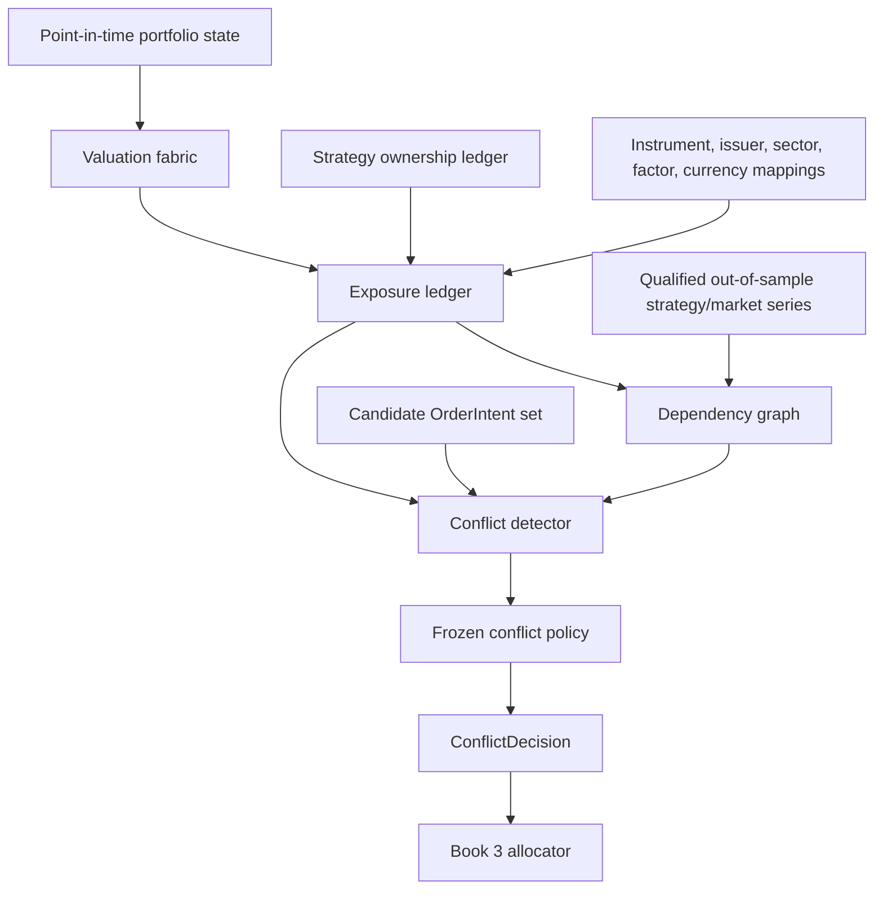

# Phase 10, Book 2 — Exposure, Dependency, and Conflict Fabric

> **Purpose:** Reconstruct every portfolio exposure and dependency without destructive netting, then resolve simultaneous strategy conflicts through frozen deterministic policy  
> **Input:** Book 1 admission, mandate, eligibility, authority, allocation requests, portfolio state, ownership, and valuation dependencies  
> **Output:** Canonical valuation/exposure snapshots, dependency graph, overlap evidence, conflict sets, and `ConflictDecision` records  
> **Previous:** [Book 1 — Portfolio Contracts and Capital Authority](book-1-portfolio-contracts-capital-authority.md)  
> **Next:** [Book 3 — Capital Envelopes and Allocation](book-3-capital-envelopes-allocation.md)

---

## 1. Success Statement

Every portfolio total drills to exact strategy, intent, execution, instrument, account, venue, currency, issuer, sector, factor, and optionality components; statistical and structural dependence is point-in-time and uncertainty-labeled; gross leverage cannot disappear inside a small net; and every overlapping or opposing action is approved, denied, deferred, or returned for revision by reproducible policy rather than model preference.

---

## 2. Applicable Anchors

- **A0:** Human Strategic Authority
- **A1:** One Orchestration Spine
- **A2:** Evidence Before Narrative
- **A3:** Point-in-Time Data
- **A4:** StrategySpec Is Truth
- **A6:** Nautilus Is the Canonical Trading Model
- **A7:** OrderIntent Is the Execution Boundary
- **A9:** Separate Research From Approval
- **A10:** Observable and Reconstructable
- **A11:** Repair Before Expansion
- **A12:** Cheap Models Use Tools, Not Memory
- **A15:** Live Autonomy Is Earned
- **F10:** A qualified strategy earns eligibility, not unlimited capital

---

## 3. Exposure and Conflict Topology



---

## 4. Work Packages

### 4.1 Portfolio valuation policy

Freeze:

- reporting currency and aggregation hierarchy;
- price type by asset, position direction, account, and environment;
- mark, bid/ask, last, and bar-close fallback rules;
- cross-currency conversion source, side, cursor, and staleness;
- derivative multiplier, deliverable, settlement, and contract version;
- accrued fees, financing, funding, borrow, dividends, and settlement;
- missing-price/conversion behavior;
- conservative liquidation and stress valuation;
- realized/unrealized and gross/net conventions.

No value may silently fall back to zero, par, mid, or 1.0 merely to complete an aggregate.

### 4.2 PortfolioValuationSnapshot

```yaml
portfolio_valuation_snapshot_id: content-id
portfolio_state_ref: artifact-ref
valuation_policy_ref: policy-ref
as_of_time: timestamp
market_and_reference_cursor: cursor
reporting_currency: canonical-currency
instrument_valuations: []
cash_and_settlement_valuations: []
margin_collateral_and_buying_power: []
fx_conversion_paths: []
fees_financing_funding_borrow_and_dividends: []
missing_or_stale_prices: []
missing_or_stale_conversion_paths: []
conservative_adjustments: []
total_equity_by_account_and_currency: {}
valuation_uncertainty: {}
state_hash: content-hash
```

The snapshot preserves native-currency values and conversion paths even when a reporting-currency total is available.

### 4.3 Exposure taxonomy

Every exposure declares:

- strategy and strategy instance;
- order/position/contingency/group ownership;
- instrument and economic underlying;
- asset and instrument class;
- base, quote, settlement, collateral, and reporting currencies;
- issuer, parent issuer, country, sector, industry, and exchange;
- factor and macro sensitivities;
- venue and account;
- direction and position effect;
- gross, net, delta-equivalent, margin, and scenario-loss measures;
- liquidity bucket and liquidation horizon;
- time horizon, session, and expiry;
- confidence, source, cursor, and staleness.

Different measures are never summed without compatible units and semantics.

### 4.4 ExposureComponent

```yaml
exposure_component_id: content-id
portfolio_state_ref: artifact-ref
strategy_eligibility_ref: artifact-ref
ownership_record_refs: []
order_intent_and_execution_refs: []
instrument_id: canonical-id
economic_underlying_refs: []
account_binding_ref: artifact-ref
venue_id: canonical-id
exposure_type: cash|spot|forward|future|option|swap|cfd|other
native_quantity_and_unit: {}
gross_long_value: money
gross_short_value: money
net_value: money
margin_or_collateral: money
currency_leg_exposures: {}
issuer_sector_industry_country_exposures: {}
factor_and_macro_exposures: {}
option_greeks_and_scenarios: {}
liquidity_and_capacity_refs: []
valuation_ref: artifact-ref
uncertainty: {}
```

### 4.5 ExposureLedgerSnapshot

```yaml
exposure_ledger_snapshot_id: content-id
portfolio_valuation_ref: artifact-ref
component_refs: []
by_strategy: {}
by_instrument_and_underlying: {}
by_asset_class: {}
by_currency: {}
by_issuer_sector_industry_country: {}
by_factor_and_macro_driver: {}
by_venue_and_account: {}
by_liquidity_bucket_and_horizon: {}
gross_exposure: {}
net_exposure: {}
leverage_and_margin: {}
nonlinear_scenario_exposure: {}
unclassified_or_uncertain_components: []
aggregation_proofs: []
snapshot_hash: content-hash
```

Every aggregate includes component IDs and a conservation proof. Unclassified material exposure blocks new risk.

### 4.6 Currency and synthetic exposure

Examples:

- long EUR/USD creates long EUR and short USD economic legs;
- an equity option creates underlying, volatility, rate, dividend, and nonlinear expiry exposure;
- an ETF contributes both legal-instrument exposure and point-in-time constituent/sector/factor look-through where available;
- a crypto perpetual creates underlying, quote/collateral, funding, liquidation, and venue exposure;
- a CFD creates underlying economic exposure plus broker/counterparty and financing exposure.

Look-through and legal-instrument exposure coexist; one does not overwrite the other.

### 4.7 Point-in-time entity and factor mapping

Mappings include:

- instrument-to-underlying and deliverable;
- issuer/parent/country;
- sector/industry classification version;
- ETF/index constituents and weights effective at the cursor;
- option/future contract and multiplier version;
- factor definition, estimation window, loading, uncertainty, and effective time;
- macro driver mapping and thesis source where used.

Current mappings cannot backfill history. Unknown historical membership remains unknown.

### 4.8 Options and nonlinear exposure

For each option/group:

- contract identity and multiplier;
- underlying and deliverable;
- long/short and open/close effect;
- delta, gamma, vega, theta, rho where supported;
- net and per-leg Greeks;
- expiry, exercise, assignment, settlement, and pin-risk windows;
- volatility surface/skew snapshot;
- discrete price/volatility/time/liquidity scenarios;
- native combo versus legged state;
- maximum loss only when structurally defined and executable.

Delta-equivalent exposure alone cannot certify options concentration or loss.

### 4.9 Ownership and netting model

Maintain three views:

1. provider/account legal state;
2. economic portfolio aggregate;
3. strategy ownership subledger.

Broker netting, portfolio-margin offsets, and economic hedges may reduce some risk measures, but they cannot:

- erase gross exposure;
- transfer ownership;
- make cash/collateral transferable;
- hide two strategies trading against each other;
- release capital before execution/cancel confirmation;
- claim a hedge is reliable without basis, liquidity, and stress evidence.

### 4.10 Qualified dependency inputs

Dependency estimation may use only:

- lock-backed out-of-sample strategy returns/PnL and exposure series;
- canonical execution/simulation results with declared net costs;
- point-in-time market, factor, liquidity, and event data;
- aligned clocks/calendars and explicit missing/flat-period handling;
- immutable method, window, horizon, regime, and currency conversion.

In-sample optimizer results, manual claims, bug-affected runs, and selectively surviving strategies cannot populate a production dependency graph.

### 4.11 DependencyEstimate

```yaml
dependency_estimate_id: content-id
left_entity_ref: strategy|instrument|factor|venue|other
right_entity_ref: strategy|instrument|factor|venue|other
dependency_type: linear|rank|tail|drawdown|loss_coincidence|exposure_overlap|structural|event|lineage
method: typed-method
horizon_and_sampling: {}
estimation_window: {}
data_and_cursor_refs: []
currency_and_cost_basis: {}
effective_sample_size: decimal
estimate: decimal
confidence_or_uncertainty: {}
regime_condition: optional-record
tail_definition: optional-record
staleness_limit: duration
limitations: []
```

No estimate is accepted without uncertainty and minimum effective-sample policy.

### 4.12 DependencyGraph

Edges include:

- return/loss/drawdown dependence;
- shared instrument, issuer, sector, currency, factor, or macro event;
- overlapping trade/session/holding windows;
- shared StrategySpec building block or model lineage;
- shared data/provider/reference dependency;
- shared venue, broker, account, collateral, or counterparty;
- shared stop, target, exit, or liquidity channel;
- common operational failure mode.

```yaml
dependency_graph_id: content-id
portfolio_admission_ref: artifact-ref
as_of_cursor: cursor
node_refs: []
estimate_refs: []
structural_edge_refs: []
regime_and_tail_layers: []
clusters: []
unresolved_dependencies: []
methodology_hash: content-hash
graph_hash: content-hash
```

Correlation near zero does not remove structural edges.

### 4.13 Horizon, regime, and tail layers

Compute separately where policy requires:

- signal-event overlap;
- intraday and holding-period returns;
- daily/weekly PnL;
- rolling windows;
- high/low volatility;
- trending/ranging or strategy-declared regimes;
- loss-only and drawdown co-occurrence;
- gap/event days;
- liquidity-stressed windows.

A single full-sample matrix cannot certify diversification across all horizons.

### 4.14 SignalConflictSet

Detect candidate and existing conflicts:

```yaml
signal_conflict_set_id: content-id
allocation_request_ref: artifact-ref
candidate_intent_refs: []
existing_order_position_and_control_refs: []
direct_instrument_conflicts: []
underlying_and_synthetic_conflicts: []
capital_margin_and_capacity_conflicts: []
sector_factor_currency_and_venue_conflicts: []
timing_contingency_and_exit_conflicts: []
self_trade_or_wash_risk: []
ownership_and_account_netting_conflicts: []
dependency_and_tail_cluster_conflicts: []
uncertain_conflicts: []
```

Examples:

- two strategies increase the same instrument/underlying beyond a limit;
- opposite orders would self-trade or churn inside one account;
- a “hedge” consumes the same stressed liquidity/collateral;
- option and underlying signals offset delta but increase gamma/vega;
- multiple strategies rely on the same event, stop level, or venue;
- a new open conflicts with a suspension/reduce/close action.

### 4.15 Conflict policy

Policy order:

1. legal/prohibited and environment constraints;
2. emergency, reduce-only, suspension, and open-exposure management;
3. ownership and self-trade prevention;
4. hard aggregate exposure/concentration/margin/capital limits;
5. execution capability, session, and liquidity/capacity;
6. dependency/tail cluster limits;
7. mandate-defined strategy priority and stable tie-break;
8. defer or require new intent revision.

Risk-reducing actions receive priority only when worst-path analysis proves they cannot create a new prohibited or larger exposure.

### 4.16 ConflictDecision

```yaml
conflict_decision_id: content-id
signal_conflict_set_ref: artifact-ref
policy_ref: policy-ref
policy_version: semver
candidate_results: []
aggregate_result: approve_exact|deny|defer_until_state|require_new_intent_revision
approved_unchanged_intent_refs: []
denied_intent_refs: []
deferred_intent_refs: []
revision_requirements: []
rule_results: []
unresolved_conflicts: []
decision_time: timestamp
valid_until: timestamp
```

The decision cannot create replacement intents, cross orders internally, aggregate multiple intents into an untraceable net order, or decide capital quantity. Book 3 allocates only among unchanged approved candidates.

### 4.17 Cross-account and cross-venue truth

Each account/venue is valued and reconciled independently before aggregation. The portfolio view:

- retains native currency and collateral;
- disallows implicit transfers;
- distinguishes hedgeable economic exposure from available operational offset;
- keeps counterparty/venue concentration;
- records settlement and withdrawal constraints;
- does not reroute a conflict to another venue automatically.

---

## 5. Target Layout

```text
portfolio_forge/
  valuation/
    policy.py
    prices.py
    fx_conversion.py
    snapshot.py
  exposure/
    component.py
    ledger.py
    currency.py
    issuer_sector.py
    factors.py
    options.py
    aggregation.py
  ownership/
    ledger.py
    netting.py
  dependency/
    inputs.py
    estimators.py
    structural.py
    regimes.py
    tails.py
    graph.py
  conflicts/
    detector.py
    policy.py
    resolver.py
    decision.py
```

---

## 6. Deliverables

- Frozen valuation policy and `PortfolioValuationSnapshot`.
- Canonical exposure taxonomy and `ExposureComponent`.
- Reconstructable `ExposureLedgerSnapshot`.
- Point-in-time currency, issuer, sector, constituent, factor, and contract mappings.
- Options/nonlinear exposure and scenario layer.
- Three-view provider/economic/strategy ownership model.
- Qualified dependency-input adapter.
- Uncertainty-aware `DependencyEstimate`.
- Multi-layer `DependencyGraph`.
- Horizon/regime/tail dependency reports.
- `SignalConflictSet` detector.
- Frozen conflict priority policy.
- Immutable `ConflictDecision`.
- Cross-account/venue aggregation and nontransferability rules.

---

## 7. Required Tests

### P10-VAL-001 — Deterministic Valuation

Same state, cursor, policy, prices, conversions, and contract data produce the same valuation.

### P10-VAL-002 — Side-Appropriate Pricing

Long, short, close, and stressed liquidation values use declared conservative price sides.

### P10-VAL-003 — Missing Price

Missing price creates an unpriceable component and blocks new risk rather than valuing at zero.

### P10-VAL-004 — Missing FX Path

Missing or stale conversion path blocks affected aggregate and cannot default to 1.0.

### P10-VAL-005 — Native Currency Preservation

Reporting-currency conversion does not erase native currency, rate path, timestamp, or source.

### P10-VAL-006 — Fees and Financing

Fees, commissions, borrow, funding, financing, dividends, and settlement effects enter valuation once.

### P10-VAL-007 — Contract Multiplier

Future, option, CFD, and other contract multipliers/version identities apply exactly.

### P10-VAL-008 — Price Fallback Policy

Fallback order is explicit, tested, and cannot cross its staleness/environment boundary.

### P10-VAL-009 — Valuation Cursor

Future price, rate, classification, corporate-action, or constituent data cannot leak.

### P10-VAL-010 — Runtime Capability Difference

Rust/Python portfolio snapshot behavior is declared and tests cannot assume unsupported cadence parity.

### P10-EXP-001 — Reconstructable Gross and Net Exposure

Every gross/net aggregate reconciles exactly to immutable exposure components without hiding opposing ownership.

### P10-EXP-002 — Multi-Dimensional Drill-Down

Portfolio totals drill to strategy, intent, instrument, underlying, asset, currency, issuer, sector, factor, venue, and account.

### P10-EXP-003 — Gross Leverage Preservation

Equal long/short notionals may net economically but retain gross leverage, margin, fees, and ownership.

### P10-EXP-004 — FX Currency Decomposition

FX/CFD positions decompose base, quote, settlement, financing, broker, and collateral exposure correctly.

### P10-EXP-005 — ETF and Index Look-Through

Legal instrument and point-in-time constituent exposure coexist without double counting.

### P10-EXP-006 — Options Nonlinearity

Delta-neutral positions retain gamma, vega, expiry, assignment, and scenario exposure.

### P10-EXP-007 — Crypto Collateral and Venue

Spot/perpetual/future exposure preserves underlying, quote, collateral, funding, liquidation, and venue risk.

### P10-EXP-008 — Pending and Uncertain Orders

Accepted, partial, pending, contingent, and uncertain quantities contribute to worst-path exposure.

### P10-EXP-009 — Settlement and Corporate Action

Pending settlement, exercise, assignment, dividend, split, merger, and adjusted-contract effects remain explicit.

### P10-EXP-010 — Unclassified Component

Material unclassified exposure blocks new risk and cannot enter an “other” bucket without limit treatment.

### P10-EXP-011 — Unit Compatibility

Incompatible money, quantity, delta, margin, and scenario-loss measures cannot be summed.

### P10-EXP-012 — Aggregation Conservation

Component addition/removal changes every affected aggregate exactly once.

### P10-OWN-001 — Economic Netting Preserves Ownership

Economic or broker netting cannot erase strategy ownership, intent lineage, capital reservation, PnL, or fees.

### P10-OWN-002 — Ambiguous Ownership

Unclaimed external/manual quantity enters hold instead of being assigned to the nearest strategy.

### P10-OWN-003 — Partial Fill Ownership

Partial fills allocate only their executed quantity and actual cash/margin/fee effects.

### P10-OWN-004 — Shared Position Account

Multiple strategy contributions to one net account position retain independent subledger shares.

### P10-OWN-005 — Close Allocation

Close/reduce fills use declared lot/ownership policy and cannot steal another strategy's position.

### P10-OWN-006 — Assignment and Exercise Ownership

External option lifecycle effects link to the originating strategy/group or remain explicitly unclaimed.

### P10-OWN-007 — Ownership Replay

Ownership reconstructs from envelopes, reservations, intents, fills, corrections, and external events.

### P10-OWN-008 — Ownership Correction

Material correction is append-only, independently approved, and reconciled.

### P10-COR-001 — Point-in-Time Dependency Evidence

Every correlation/dependency estimate declares cursor, window, horizon, sample, method, uncertainty, regime, and staleness.

### P10-COR-002 — Qualified Series Only

In-sample, bug-affected, suspicious, unvalidated, or manually claimed returns are rejected.

### P10-COR-003 — No Future Survivorship

Current winning strategies, constituents, sectors, or factor loadings cannot rewrite historical dependency inputs.

### P10-COR-004 — Calendar Alignment

Mixed sessions/time zones align without forward-filling future returns or dropping loss periods selectively.

### P10-COR-005 — Flat-Period Policy

Zero-return and no-position periods follow an explicit policy and cannot inflate diversification.

### P10-COR-006 — Effective Sample

Overlapping trades and serial dependence reduce effective sample size under frozen rules.

### P10-COR-007 — Confidence and Instability

Wide/unstable estimates remain uncertain and cannot be treated as exact limits.

### P10-COR-008 — Horizon Separation

Intraday, holding-period, daily, and rolling dependencies remain separately labeled.

### P10-COR-009 — Regime Dependence

Full-sample low correlation cannot hide high dependence in a declared stress regime.

### P10-COR-010 — Tail Dependence

Loss/drawdown co-occurrence and tail dependence are tested separately from linear correlation.

### P10-COR-011 — Currency and Cost Basis

Series use declared reporting currency, fees, financing, and capital/exposure normalization.

### P10-COR-012 — Stale Estimate

Estimate beyond its validity/staleness bound blocks affected new allocation.

### P10-DEP-001 — Structural Edge Without Correlation

Shared instrument, logic, data, venue, collateral, timing, or exit creates a dependency edge even when return correlation is near zero.

### P10-DEP-002 — Strategy Lineage Overlap

Strategies sharing StrategySpec blocks, parameters, data features, or model ancestry expose that relationship.

### P10-DEP-003 — Shared Failure Mode

Common provider, reference mapping, venue, adapter, account, or operational dependency is represented.

### P10-DEP-004 — Underlying and Synthetic Link

Options, ETF, future, CFD, ADR, pair, and underlying relationships join the graph without losing legal instruments.

### P10-DEP-005 — Cluster Determinism

Same graph/method inputs produce the same clusters and identifiers.

### P10-DEP-006 — Unresolved Dependency

Unknown material edge is recorded and blocks allocation that requires diversification credit.

### P10-DEP-007 — Graph Invalidation

Data, mapping, strategy, method, window, or regime-policy change invalidates affected graph layers.

### P10-DEP-008 — No Causality Claim

Statistical association is not labeled causal without separate causal evidence.

### P10-DEP-009 — Diversification Haircut

Uncertain or unstable dependence can reduce diversification credit but cannot improve it.

### P10-DEP-010 — Graph Replay

Graph and clusters reproduce from immutable nodes, estimates, mappings, and structural edges.

### P10-OVL-001 — Simultaneous Exposure Overlap

Concurrent holding windows and pending orders contribute to overlap.

### P10-OVL-002 — Shared Liquidity Channel

Strategies competing for the same depth/session/exit capacity are linked.

### P10-OVL-003 — Shared Stop or Target

Common exit levels/timing contribute to crowding and gap/slippage stress.

### P10-OVL-004 — Same Macro Event

Distinct instruments responding to one event retain event-cluster exposure.

### P10-OVL-005 — Opposite Does Not Mean Diversified

Opposite directions sharing basis/liquidity/venue failure cannot receive automatic diversification credit.

### P10-OVL-006 — Nonoverlapping Horizon

No simultaneous exposure may reduce capital overlap only under declared timing and handoff proof.

### P10-OVL-007 — Capacity Sharing

Overlapping candidate and existing orders share one capacity pool.

### P10-OVL-008 — Uncertainty Dominance

Unknown overlap is bounded conservatively or blocks; it cannot default to independent.

### P10-CNF-001 — Deterministic Signal Conflict Resolution

Same request, state, graph, and frozen policy produce the same approve/deny/defer/revision outcomes.

### P10-CNF-002 — Direct Opposing Orders

Opposing same-account intents trigger ownership/self-trade review and cannot blindly route both.

### P10-CNF-003 — Same-Direction Concentration

Multiple aligned signals cannot bypass aggregate limits through separate strategy identities.

### P10-CNF-004 — Synthetic Conflict

Different instruments with the same underlying or factor exposure enter one conflict set.

### P10-CNF-005 — Open Versus Close

New exposure cannot defeat a valid suspension/reduce/close control; any priority remains worst-path safe.

### P10-CNF-006 — Stable Tie-Break

Equal-priority conflict resolves by a frozen deterministic key, never processing order or model preference.

### P10-CNF-007 — No Silent Resize

Conflict resolver cannot alter quantity; reduced scope requires a new immutable intent revision.

### P10-CNF-008 — No Internal Crossing

Resolver cannot create an ungoverned internal cross or opaque net order.

### P10-CNF-009 — Deferred State

Deferred intent remains nonrouting and expires/rechecks against fresh state.

### P10-CNF-010 — Partial Candidate Denial

Denied members remain visible with reasons; approved members retain original hashes.

### P10-CNF-011 — LLM Independence

Model outage, latency, or opinion cannot alter conflict outcome.

### P10-CNF-012 — Conflict Decision Expiry

Material state, graph, price, eligibility, or mandate change expires the decision.

### P10-XVR-001 — Account-First Reconciliation

Each account/venue exposure and valuation reconciles before cross-portfolio aggregation.

### P10-XVR-002 — No Implicit Transfer

Cash, collateral, margin, settlement, or borrow cannot transfer across accounts/venues by aggregation.

### P10-XVR-003 — Counterparty Concentration

Economically offset exposure still retains venue/broker/counterparty concentration.

### P10-XVR-004 — Conversion Failure Isolation

One failed account-currency conversion cannot contaminate or silently omit another account.

### P10-XVR-005 — No Conflict Reroute

Denied/blocked conflict cannot automatically choose another account or venue.

### P10-XVR-006 — Settlement Mismatch

Different settlement calendars and finality remain explicit in aggregate availability.

### P10-XVR-007 — Cross-Venue Replay

Aggregated view reproduces from account-specific valuations, ownership, and mappings.

---

## 8. Failure Modes

- Pearson correlation is the complete dependency model.
- Current ETF constituents or sector labels backfill history.
- Flat/no-trade periods are removed only from weak strategies.
- A small net hides large gross leverage and margin.
- Long EUR/USD is stored only as “FX long.”
- Delta-neutral options are labeled riskless.
- Broker netting merges two strategies into one owner.
- Unclaimed manual trades are assigned by instrument similarity.
- Opposite orders are both routed and churn the same account.
- Conflict resolver resizes an immutable intent.
- An LLM chooses the “better” strategy.
- Missing correlation, price, mapping, or FX conversion becomes diversification credit.

---

## 9. Exit Gate

Book 2 is complete only when valuation is point-in-time and conservative, all portfolio aggregates reconcile to immutable components, strategy ownership survives broker/economic netting, currency/issuer/sector/factor/options/venue exposures are explicit, dependency includes statistical and structural layers with uncertainty, and every candidate conflict receives a deterministic nonmutating decision that preserves blocked and unresolved truth.

---

## 10. Handoff

Book 3 receives unchanged conflict-approved candidate intents, Portfolio Mandate and authority, fresh state/valuation/exposure snapshots, strategy ownership, dependency graph and cluster limits, exact conflict decisions, account/venue availability, capacity-sharing relationships, and every uncertainty or unresolved edge that must constrain capital allocation.
