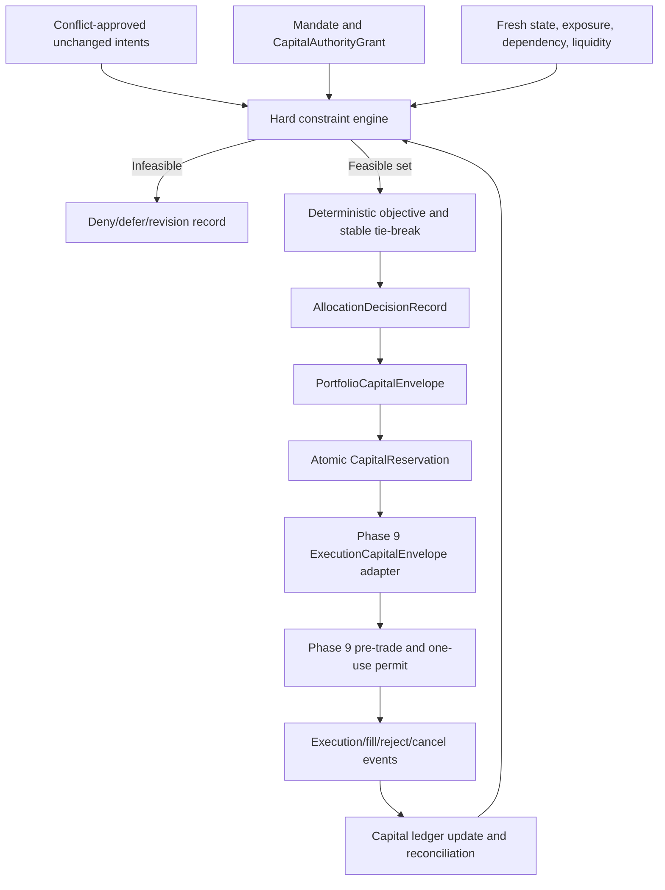

# Phase 10, Book 3 — Capital Envelopes and Allocation

> **Purpose:** Allocate bounded portfolio capital through a deterministic hard-constraint hierarchy, conserve every reservation, and expose only expiring nonexecuting envelopes to Phase 9  
> **Input:** Book 2 approved unchanged intents, state/valuation/exposure/dependency/conflict evidence, Book 1 mandate, authority, and eligibility  
> **Output:** Allocation engine, `AllocationDecisionRecord`, `PortfolioCapitalEnvelope`, reservation ledger, liquidity/capacity evidence, and Phase 9 envelope adapter  
> **Previous:** [Book 2 — Exposure, Dependency, and Conflict Fabric](book-2-exposure-dependency-conflicts.md)  
> **Next:** [Book 4 — Stress, Drawdown, and Portfolio Controls](book-4-stress-drawdown-controls.md)

---

## 1. Success Statement

No strategy consumes financial capital unless a reproducible allocation decision proves exact mandate/authority/eligibility, fresh reconciled state, sufficient reserves, compatible aggregate exposure, margin, liquidity, capacity, dependency, and stress headroom; every envelope and reservation is finite and reconstructable; concurrent requests cannot double-spend; and allocation can never mutate an intent or bypass Phase 9.

---

## 2. Applicable Anchors

- **A0:** Human Strategic Authority
- **A1:** One Orchestration Spine
- **A2:** Evidence Before Narrative
- **A3:** Point-in-Time Data
- **A4:** StrategySpec Is Truth
- **A6:** Nautilus Is the Canonical Trading Model
- **A7:** OrderIntent Is the Execution Boundary
- **A8:** Promotion Is State-Based
- **A9:** Separate Research From Approval
- **A10:** Observable and Reconstructable
- **A11:** Repair Before Expansion
- **A12:** Cheap Models Use Tools, Not Memory
- **A15:** Live Autonomy Is Earned
- **F10:** A qualified strategy earns eligibility, not unlimited capital

---

## 3. Allocation Topology



---

## 4. Work Packages

### 4.1 AllocationInputSnapshot

```yaml
allocation_input_snapshot_id: content-id
portfolio_allocation_request_ref: artifact-ref
portfolio_mandate_ref: artifact-ref
capital_authority_grant_ref: artifact-ref
strategy_eligibility_refs: []
conflict_decision_ref: artifact-ref
portfolio_state_ref: artifact-ref
portfolio_valuation_ref: artifact-ref
exposure_ledger_ref: artifact-ref
dependency_graph_ref: artifact-ref
liquidity_capacity_snapshot_ref: artifact-ref
stress_and_drawdown_state_refs: []
active_envelope_and_reservation_refs: []
rule_and_objective_versions: {}
as_of_time: timestamp
valid_until: timestamp
input_hash: content-hash
```

Any material input change creates a new snapshot and invalidates a not-yet-reserved decision.

### 4.2 Capital and risk accounting taxonomy

Track separately:

- verified equity;
- settled available cash;
- unsettled/restricted cash;
- collateral and margin posted;
- provider buying power;
- protected reserve;
- uncertainty and loss buffer;
- active capital commitments;
- pending capital reservations;
- available capital;
- gross/net notional;
- scenario/tail risk budget;
- strategy loss/drawdown budget;
- liquidity/capacity budget.

Buying power, leverage, gross notional, and risk budget are not cash and cannot be substituted for one another.

### 4.3 Capital conservation

Within one account/currency basis:

```text
VerifiedEquity =
    ProtectedReserve
    + UnavailableOrSettlingCapital
    + CommittedCapital
    + ReservedCapital
    + AvailableCapital
```

And for each declared risk-budget dimension:

```text
AuthorizedRiskBudget =
    HeldRiskBuffer
    + UsedRisk
    + ReservedRisk
    + AvailableRisk
```

All terms are nonnegative, point-in-time, and component-reconciled. Cross-currency totals exist only with valid conversion paths. Exposure limits remain separate inequalities; they are not falsely forced into cash conservation.

### 4.4 Constraint hierarchy

Evaluate in this order:

```text
schema, lineage, and unchanged intent hash
→ mandate, capital authority, eligibility, environment
→ portfolio state, ownership, valuation, reconciliation
→ protected reserve and capital conservation
→ account cash, settlement, collateral, margin, buying power
→ gross/net leverage and concentration
→ loss, drawdown, suspension, emergency state
→ conflict and dependency-cluster limits
→ instrument/session/venue/account execution capability
→ liquidity, participation, capacity, turnover, and liquidation horizon
→ stress headroom and uncertainty haircuts
→ feasible exact candidate set
→ deterministic objective
```

No lower layer can waive or soften a higher layer.

### 4.5 Allocation rule result

```yaml
portfolio_allocation_rule_result:
  rule_id: stable-id
  rule_version: semver
  candidate_or_portfolio_scope: {}
  input_refs: []
  observed_value: {}
  limit_or_authority_ref: artifact-ref
  result: pass|deny|indeterminate
  reason: typed-reason
```

`indeterminate` denies new risk. Complete rule evidence is retained even when an earlier rule denies, where evaluation remains safe.

### 4.6 Deterministic objective

The objective runs only over the feasible exact candidate set. A mandate may rank:

- preserve reserve and stress headroom;
- minimize concentration and dependency-cluster risk;
- minimize expected cost, impact, and turnover;
- improve diversification under conservative uncertainty haircuts;
- allocate toward lock-backed net expectancy/quality lower bounds;
- preserve stable prior allocations where still valid.

Requirements:

- objective terms, units, normalization, direction, and weights are frozen;
- expected performance uses declared uncertainty and cannot be a promise;
- no objective reward can offset a hard-limit violation;
- solver, version, tolerances, seed, and stable tie-break are pinned;
- the same inputs produce the same result;
- an interpretable feasible baseline is always compared;
- agents/LLMs may propose objective changes only outside an active decision window.

### 4.7 Feasible baseline and optimizer separation

At minimum compare:

- zero-new-risk baseline;
- current valid allocation;
- mandate-defined equal-risk/equal-budget baseline where feasible;
- candidate optimizer output.

The optimizer is optional. If it fails, no baseline automatically receives authority. Only a fresh baseline that independently passes every constraint may be selected by frozen fallback policy.

### 4.8 AllocationDecisionRecord

```yaml
allocation_decision_record_id: content-id
allocation_input_snapshot_ref: artifact-ref
allocation_policy_ref: policy-ref
constraint_rule_results: []
feasible_candidate_sets: []
objective_definition_ref: artifact-ref
solver_identity_and_version: {}
solver_tolerances_and_seed: {}
baseline_results: []
selected_unchanged_intent_refs: []
denied_or_deferred_intent_refs: []
revision_requirements: []
capital_and_risk_assignments: []
reserve_and_headroom_after: {}
concentration_and_dependency_after: {}
liquidity_capacity_and_cost_after: {}
stress_headroom_after: {}
result: approved|denied|deferred|revision_required|infeasible|indeterminate
diagnostics: {}
decided_at: timestamp
valid_until: timestamp
decision_hash: content-hash
```

An approved decision selects exact unchanged intents and bounded assignments. It does not create an order or execution permit.

### 4.9 PortfolioCapitalEnvelope

```yaml
portfolio_capital_envelope_id: content-id
allocation_decision_ref: artifact-ref
portfolio_mandate_ref: artifact-ref
capital_authority_grant_ref: artifact-ref
allocation_epoch_id: typed-id
strategy_eligibility_ref: artifact-ref
environment: historical_fixture|joint_simulation|portfolio_shadow|production
account_binding_refs: []
allowed_instruments_and_actions: []
approved_candidate_intent_refs: []
maximum_capital_commitment: {}
maximum_order_and_position_quantity: {}
maximum_gross_net_and_leverage: {}
maximum_margin_and_collateral: {}
maximum_loss_and_drawdown: {}
maximum_concentrations: {}
maximum_order_count_and_turnover: {}
liquidity_capacity_and_cost_bounds: {}
stress_headroom_requirements: {}
not_before: timestamp
expires_at: timestamp
revocation_state: active|revoked|expired
```

The envelope is:

- narrower than or equal to mandate, authority, eligibility, and Phase 9 hard limits;
- short-lived and allocation-epoch-specific;
- nontransferable between strategies/accounts/environments;
- nonexecuting;
- unusable without an exact capital reservation;
- invalidated by material state or policy change.

### 4.10 CapitalReservation

```yaml
capital_reservation_id: content-id
portfolio_capital_envelope_ref: artifact-ref
candidate_order_intent_ref: artifact-ref
candidate_order_intent_hash: content-hash
strategy_ownership_ref: artifact-ref
account_binding_ref: artifact-ref
reserved_capital: {}
reserved_margin_and_collateral: {}
reserved_gross_net_and_scenario_risk: {}
reserved_liquidity_capacity: {}
reservation_nonce: opaque-id
reserved_at: timestamp
expires_at: timestamp
state: pending|committed|partially_released|released|expired|revoked|uncertain
```

Reservation is atomic and durable before Phase 9 permit issuance. Duplicate or concurrent requests for the same available balance serialize through one ledger.

### 4.11 Reservation lifecycle

```text
available
→ pending reservation
→ committed on Phase 9 route reservation
→ adjusted on reject/partial/fill/amend/cancel/expiry/correction
→ released only on confirmed evidence
→ reconciled
```

Rules:

- timeout, disconnect, or uncertain submission does not release;
- pending cancel does not release;
- partial fill releases only proven unused remainder under policy;
- fees, slippage, margin, and currency changes update actual commitment;
- expired envelope cannot revive a committed open position, but blocks new reservations;
- corrections are append-only.

### 4.12 LiquidityCapacitySnapshot

```yaml
liquidity_capacity_snapshot_id: content-id
as_of_time: timestamp
market_and_reference_cursor: cursor
instrument_venue_session_cells: []
spread_depth_and_volume_refs: []
quote_and_trade_quality: {}
participation_limits: {}
impact_model_refs: []
maximum_order_and_daily_capacity: {}
liquidation_horizon_estimates: {}
existing_and_candidate_demand: {}
options_group_and_leg_capacity: {}
borrow_locate_and_short_capacity: {}
provider_rate_and_order_limits: {}
stress_haircuts: {}
uncertainty_and_staleness: {}
```

Capacity is shared across all strategies using the same instrument/underlying/venue/session/liquidity channel.

### 4.13 Liquidity and cost controls

Account for:

- spread and depth by side;
- expected market impact and uncertainty;
- order type and urgency;
- participation rate;
- existing/open/candidate orders;
- venue/provider rate and order limits;
- options combo and weakest-leg liquidity;
- equity locate/borrow and auction/extended-hour state;
- FX spread/rollover/session;
- crypto maintenance/funding/liquidation state;
- liquidation horizon under stress;
- fees, commissions, financing, funding, borrow, and slippage.

A passive limit does not imply free capacity or guaranteed fill.

### 4.14 Capacity aggregation

Capacity is not allocated independently per strategy. For every shared pool:

```text
RemainingCapacity =
    ConservativeCapacity
    - ExecutedDemand
    - OpenOrderDemand
    - UncertainDemand
    - ActiveReservationDemand
```

If negative or indeterminate, new exposure is denied and containment begins.

### 4.15 Rebalance and reallocation

A rebalance is a new typed portfolio request, not an in-place weight mutation. It declares:

- trigger and objective;
- current versus target envelopes;
- exact intents needed, each independently generated and reviewed;
- turnover, spread, impact, taxes if applicable, financing, and settlement;
- transition exposure and capacity;
- sequence/atomicity;
- abort and recovery;
- ownership and PnL continuity.

Do not assume all legs execute together or that reductions fund increases before confirmation.

### 4.16 Solver failure, infeasibility, and stability

Handle separately:

- infeasible hard constraints;
- numerical failure;
- timeout/resource exhaustion;
- multiple optima;
- unstable/sensitive solution;
- stale inputs during solve;
- objective/constraint version mismatch.

Outcomes are `denied`, `deferred`, `revision_required`, `indeterminate`, or a frozen independently valid safer fallback. No constraint is relaxed automatically.

### 4.17 Phase 9 envelope adapter

The adapter maps a valid envelope/reservation into the Phase 9 `ExecutionCapitalEnvelope` input:

```yaml
phase9_capital_envelope_adapter_record:
  portfolio_capital_envelope_ref: artifact-ref
  capital_reservation_ref: artifact-ref
  order_intent_ref: artifact-ref
  phase9_execution_capital_envelope_ref: artifact-ref
  account_binding_ref: artifact-ref
  environment_identity: verified-id
  exact_scope_hash: content-hash
  created_at: timestamp
```

It cannot:

- issue a Phase 9 pre-trade pass or permit;
- choose an adapter/venue outside the envelope;
- change the intent;
- treat allocation as execution approval;
- bypass Phase 9 account, permission, lifecycle, risk, or emergency controls.

### 4.18 Idempotency and concurrency

Stable identities exist for:

- allocation request and epoch;
- input snapshot;
- conflict and allocation decision;
- envelope;
- reservation;
- Phase 9 adapter record;
- commitment/release/reconciliation effect.

Exactly-once effects are built over at-least-once jobs/events. Conflicting duplicate payloads quarantine instead of deduplicating away.

---

## 5. Target Layout

```text
portfolio_forge/
  allocation/
    input_snapshot.py
    accounting.py
    constraints.py
    rules.py
    objective.py
    baselines.py
    solver.py
    decision.py
    envelope.py
    reservation.py
    rebalance.py
  liquidity/
    snapshot.py
    capacity.py
    costs.py
    impact.py
  integration/
    phase9_capital_envelope.py
  ledger/
    capital.py
    risk_budget.py
    reservations.py
```

---

## 6. Deliverables

- Immutable `AllocationInputSnapshot`.
- Typed capital, collateral, buying-power, exposure, and risk-budget accounting.
- Capital/risk conservation ledgers and proofs.
- Ordered hard-constraint engine with complete rule evidence.
- Frozen deterministic objective and interpretable baselines.
- Pinned solver, stability diagnostics, and no-relaxation failure policy.
- `AllocationDecisionRecord`.
- Expiring/revocable `PortfolioCapitalEnvelope`.
- Atomic `CapitalReservation` and lifecycle.
- `LiquidityCapacitySnapshot`.
- Shared liquidity/capacity and execution-cost engine.
- Typed rebalance/reallocation workflow.
- Exact Phase 9 execution-capital-envelope adapter.
- Allocation/reservation idempotency and concurrency controls.

---

## 7. Required Tests

### P10-ALR-001 — Hard Constraints Dominate Objective

No expected-return, diversification, cost, or stability reward can select a hard-limit violation.

### P10-ALR-002 — Deterministic Allocation

Same canonical inputs, solver, tolerances, seed, and policy produce the same decision and hash.

### P10-ALR-003 — Exact Candidate Selection

Allocator selects unchanged intent refs or rejects/defers/requires revision; it cannot alter quantity or semantics.

### P10-ALR-004 — Complete Rule Evidence

Every decision records rule version, inputs, observed values, authority/limits, result, and reason.

### P10-ALR-005 — Indeterminate Denies

Missing, stale, conflicting, or unreconciled required input yields no new envelope.

### P10-ALR-006 — Objective Version

Objective/normalization/weight change invalidates affected decisions and simulations.

### P10-ALR-007 — Stable Tie-Break

Multiple equal optima resolve through a frozen key, not solver iteration or request arrival order.

### P10-ALR-008 — Baseline Comparison

Selected optimizer result is compared against zero-new-risk, current, and declared feasible baselines.

### P10-ALR-009 — Uncertainty Penalty

Wider performance/dependency/liquidity uncertainty cannot improve allocation.

### P10-ALR-010 — Constraint Order

Lower-priority rules cannot run as a waiver for failed authority, reserve, reconciliation, or hard limits.

### P10-ALR-011 — State Change During Decision

Material price, order, position, margin, authority, eligibility, control, or policy change expires decision.

### P10-ALR-012 — LLM Independence

Model output, outage, latency, or preference cannot alter allocation result.

### P10-CAP-001 — Capital Conservation

Verified equity equals protected, unavailable, committed, reserved, and available components within tolerance.

### P10-CAP-002 — Risk-Budget Conservation

Used, reserved, held, and available risk reconcile to each authorized risk budget.

### P10-CAP-003 — Buying Power Is Not Cash

Provider leverage/buying power cannot populate settled cash or protected reserve.

### P10-CAP-004 — Cross-Currency Conservation

Aggregation requires valid conversion; native ledgers remain conserved independently.

### P10-CAP-005 — Account Capital Separation

Unavailable cash/collateral in one account cannot fund another without confirmed transfer evidence.

### P10-CAP-006 — Fees and Slippage

Actual costs reduce equity/available capital exactly once.

### P10-CAP-007 — PnL Update

Realized/unrealized PnL updates the correct strategy/account and portfolio capital state under frozen valuation.

### P10-CAP-008 — Protected Reserve

Reservation cannot consume reserve or uncertainty buffer.

### P10-CAP-009 — Negative Component

Negative available/reserved/committed component triggers incident; it is not balanced silently.

### P10-CAP-010 — Conservation Replay

Capital state reproduces from authority, envelopes, reservations, execution, costs, PnL, transfers, and corrections.

### P10-ENV-001 — Exact Expiring Capital Envelope

Envelope is mandate/authority/eligibility/decision-bounded, short-lived, revocable, and nonexecuting.

### P10-ENV-002 — Strategy Binding

Envelope cannot transfer to another strategy or instance.

### P10-ENV-003 — Account and Environment Binding

Envelope cannot cross account binding or fixture/simulation/shadow/production class.

### P10-ENV-004 — Instrument and Action Binding

Unlisted instrument, action, order type, or candidate intent rejects.

### P10-ENV-005 — Limit Intersection

Envelope limits equal the strict minimum/intersection of mandate, grant, eligibility, Phase 9, state, and decision limits.

### P10-ENV-006 — Envelope Is Not Permit

Valid envelope cannot reach an adapter without Phase 9 pre-trade and one-use ExecutionPermit.

### P10-ENV-007 — Envelope Expiry

Expired envelope blocks new reservations while preserving management of committed exposure.

### P10-ENV-008 — Envelope Revocation

Revocation blocks new risk and triggers review without erasing ownership or confirmed commitments.

### P10-ENV-009 — No Automatic Renewal

Envelope cannot renew, broaden, or repeat automatically after success.

### P10-ENV-010 — State Invalidation

Material state, mapping, price, dependency, liquidity, control, or policy change invalidates uncommitted envelope scope.

### P10-ENV-011 — Shadow Noncapital

Shadow envelope cannot reserve real funds or map to a production Phase 9 envelope.

### P10-ENV-012 — No Standing Weight

Envelope cannot become a permanent strategy weight or capital entitlement.

### P10-RSV-001 — Atomic No-Double Allocation

Concurrent reservations serialize so total pending/committed capital and risk never exceed available scope.

### P10-RSV-002 — Exact Intent Hash

Reservation fails if candidate intent hash differs by any material field.

### P10-RSV-003 — One Reservation Effect

Duplicate job/message delivery creates one reservation effect.

### P10-RSV-004 — Timeout Does Not Release

Submission uncertainty keeps reservation committed/uncertain until reconciliation.

### P10-RSV-005 — Pending Cancel Does Not Release

Capital and exposure remain reserved until remaining quantity is confirmed terminal.

### P10-RSV-006 — Partial Fill Adjustment

Only proven unused remainder releases; filled quantity and actual costs remain committed.

### P10-RSV-007 — Reject and Verified Absence

Release requires typed provider/reconciliation evidence, not one empty query.

### P10-RSV-008 — Amend Reservation

Amend requires recalculated exact reservation; it cannot exceed envelope or use stale quantity.

### P10-RSV-009 — Reservation Expiry

Expired pending reservation follows uncertainty/reconciliation policy and cannot disappear.

### P10-RSV-010 — Process Restart

Restart restores reservations and blocks new allocation until open/uncertain state reconciles.

### P10-RSV-011 — Conflicting Duplicate

Same reservation ID with a different payload quarantines and blocks.

### P10-RSV-012 — Reservation Replay

Lifecycle and capital effects reproduce exactly from immutable events.

### P10-LIQ-001 — Liquidity/Capacity Reduction

Lower depth/volume, wider spread, higher impact, or reduced capacity lowers allocation or denies exact candidates.

### P10-LIQ-002 — Shared Capacity Pool

All strategy orders sharing instrument/underlying/venue/session consume one conservative capacity pool.

### P10-LIQ-003 — Existing Demand

Filled, open, partial, uncertain, and reserved demand reduces remaining capacity.

### P10-LIQ-004 — Passive Order Fallacy

Limit/post-only intent still consumes order, queue, participation, adverse-selection, and uncertain-fill capacity.

### P10-LIQ-005 — Options Weakest Leg

Combo/legged capacity respects the least-liquid leg, ratios, and interim exposure.

### P10-LIQ-006 — Short and Borrow Capacity

Locate/borrow availability, fee, recall, and restriction constrain short allocation.

### P10-LIQ-007 — Session and Venue State

Halt, auction, maintenance, rollover, funding, degraded venue, or market close changes capacity.

### P10-LIQ-008 — Liquidation Horizon

Allocation must remain inside mandate liquidation horizon under base and stress assumptions.

### P10-LIQ-009 — Stale Liquidity

Stale/low-quality liquidity evidence blocks capacity credit.

### P10-LIQ-010 — Capacity Conservation

Conservative capacity minus executed/open/uncertain/reserved demand equals reproducible remaining capacity.

### P10-RBL-001 — Typed Rebalance

Rebalance creates a new request/decision/envelope/reservation chain.

### P10-RBL-002 — Transition Exposure

Temporary gross, net, margin, and concentration during sequence stay within bounds.

### P10-RBL-003 — Reduction Before Increase

Unconfirmed reductions cannot fund increases.

### P10-RBL-004 — Turnover and Cost

Fees, spread, impact, financing, settlement, and applicable tax constraints enter rebalance decision.

### P10-RBL-005 — Partial Rebalance

Partial fills preserve current ownership and trigger fresh state/decision before continuation.

### P10-RBL-006 — Abort and Recovery

Declared abort path contains residual exposure through Book 4/Phase 9 controls.

### P10-RBL-007 — No Weight Mutation

Target-weight change cannot edit an active envelope or OrderIntent in place.

### P10-RBL-008 — Rebalance Idempotency

Retry/restart cannot execute the transition twice.

### P10-SOL-001 — Infeasible Portfolio

Hard-constraint infeasibility returns no allocation and exact conflict set.

### P10-SOL-002 — Numerical Failure

Solver error cannot relax constraints or emit partial unverified weights.

### P10-SOL-003 — Timeout

Timeout returns denied/deferred/indeterminate or a separately valid frozen fallback.

### P10-SOL-004 — Multiple Optima

Stable deterministic tie-break chooses the same result.

### P10-SOL-005 — Sensitive Solution

Unstable solution fails robustness policy or receives conservative haircut; it cannot be overclaimed.

### P10-SOL-006 — Stale Prior Allocation

Prior allocation cannot be reused after authority, state, price, exposure, dependency, liquidity, or policy invalidation.

### P10-SOL-007 — Version Pin

Solver/library/version/tolerance change invalidates affected evidence.

### P10-SOL-008 — Resource Exhaustion

Compute failure defaults to no new risk without blocking separately authorized open-exposure management.

### P10-P9I-001 — Exact Phase 9 Mapping

Phase 9 envelope adapter preserves strategy, intent, account, environment, quantity, capital, risk, and validity scope exactly.

### P10-P9I-002 — Phase 9 Independent Pre-Trade

Portfolio approval cannot force Phase 9 to pass a rejected permission, price, size, margin, or state check.

### P10-P9I-003 — No Permit Issuance

Phase 10 adapter cannot create, consume, restore, or renew an ExecutionPermit.

### P10-P9I-004 — No Adapter Selection

Phase 10 cannot route around the execution cell selected/certified under exact policy.

### P10-P9I-005 — Phase 9 Hard-Limit Dominance

Tighter Phase 9 per-action/account limit constrains the portfolio envelope.

### P10-P9I-006 — Intent Mismatch

Hash mismatch denies and requires new portfolio review; no translation approximation occurs.

### P10-P9I-007 — Execution Feedback

Reject, partial, fill, cancel, expiry, uncertainty, correction, fee, and margin events update the capital ledger.

### P10-P9I-008 — Blocked Execution Cell

Allocator cannot assign executable capital through a blocked adapter/account/capability.

### P10-AUT-020 — Allocation Decision Is Not Trade Approval

Approved decision/envelope/reservation remains nonrouting without Phase 9 authority.

### P10-AUT-021 — No Optimizer Authority

Solver, agent, notebook, or research weight cannot create mandate or capital grant.

### P10-AUT-022 — No Constraint Self-Relaxation

Allocator cannot change limits, reserves, objective hierarchy, or uncertainty policy to make a candidate feasible.

### P10-AUT-023 — No Capital From Performance Claim

High win rate, Sharpe, expectancy, or manual portfolio claim cannot create or enlarge an envelope.

### P10-AUT-024 — Production Disabled

Phase 10 certification can emit synthetic/shadow envelopes only; production issuance remains unavailable.

---

## 8. Failure Modes

- Buying power is counted as settled cash.
- Each strategy gets the full venue capacity independently.
- The optimizer softens reserve or concentration constraints.
- A “best weight” mutates current OrderIntent quantities.
- Timeout releases capital and another strategy spends it.
- Pending cancels fund a rebalance.
- An options combo uses the liquid leg as group capacity.
- Prior weights survive a material dependency/liquidity change.
- Solver failure returns partially computed weights.
- Portfolio envelope is treated as an ExecutionPermit.
- Shadow envelope maps to a live Phase 9 account.
- OCE resource allocator is reused for financial capital.

---

## 9. Exit Gate

Book 3 is complete only when the allocator operates over fresh exact candidates, hard constraints/reserves dominate deterministic objectives, capital and risk budgets conserve, envelopes are expiring/nontransferable/nonexecuting, reservations are atomic and uncertainty-safe, capacity is shared and stressable, rebalance transitions preserve exposure, failures never relax policy, and Phase 9 independently verifies every reserved intent before execution.

---

## 10. Handoff

Book 4 receives current allocation decisions, envelopes, reservations, capital/risk conservation state, exact ownership, exposure/dependency/conflict evidence, liquidity/capacity and liquidation horizons, Phase 9 execution feedback, reserve/headroom, solver uncertainty, and every condition that must trigger portfolio limits, stress, throttle, suspension, containment, or recovery.
