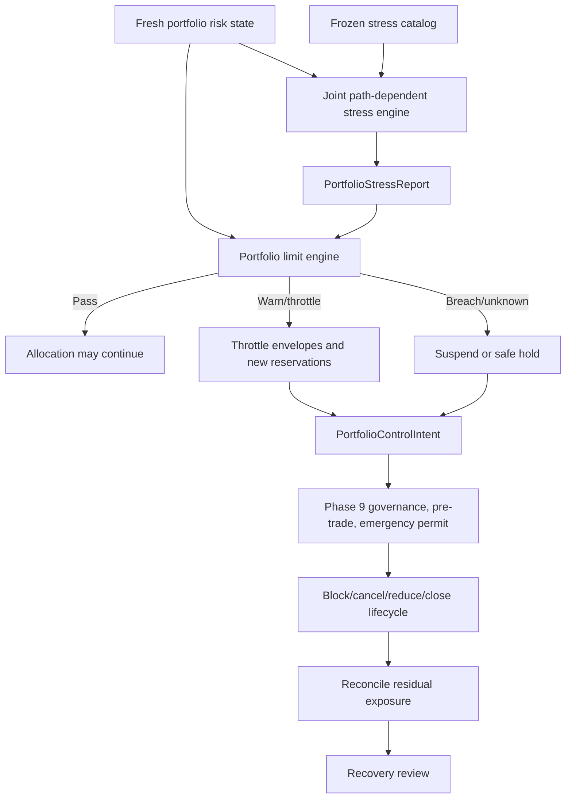

# Phase 10, Book 4 — Stress, Drawdown, and Portfolio Controls

> **Purpose:** Prove aggregate exposure remains bounded under path-dependent shocks and contain breaches through deterministic throttling, suspension, and Phase 9-governed control actions  
> **Input:** Book 3 allocation/capital/reservation state, Book 2 exposures/dependencies/conflicts, Phase 9 execution feedback, and Book 1 authority  
> **Output:** Portfolio limit engine, stress reports, drawdown state, throttle/suspension fabric, `PortfolioControlIntent`, and recovery evidence  
> **Previous:** [Book 3 — Capital Envelopes and Allocation](book-3-capital-envelopes-allocation.md)  
> **Next:** [Book 5 — Portfolio Operations and Lock](book-5-portfolio-operations-lock.md)

---

## 1. Success Statement

Every portfolio limit and stress path is deterministic, versioned, point-in-time, and conservative under uncertainty; aggregate loss, drawdown, margin, liquidity, dependency, and venue shocks block new risk before capital is consumed; throttling and suspension cannot orphan existing orders or positions; and every cancel, reduce, or close request remains bounded, observable, and independently executed through Phase 9.

---

## 2. Applicable Anchors

- **A0:** Human Strategic Authority
- **A1:** One Orchestration Spine
- **A2:** Evidence Before Narrative
- **A3:** Point-in-Time Data
- **A4:** StrategySpec Is Truth
- **A6:** Nautilus Is the Canonical Trading Model
- **A7:** OrderIntent Is the Execution Boundary
- **A8:** Promotion Is State-Based
- **A9:** Separate Research From Approval
- **A10:** Observable and Reconstructable
- **A11:** Repair Before Expansion
- **A12:** Cheap Models Use Tools, Not Memory
- **A15:** Live Autonomy Is Earned
- **F10:** A qualified strategy earns eligibility, not unlimited capital

---

## 3. Stress and Control Topology



---

## 4. Work Packages

### 4.1 Portfolio limit hierarchy

Limits apply at:

- total portfolio;
- strategy and strategy cluster;
- account and venue;
- asset and instrument class;
- instrument and economic underlying;
- issuer, country, sector, and industry;
- currency and collateral;
- factor and macro driver;
- direction/gross/net/leverage;
- options Greek and scenario;
- liquidity bucket and liquidation horizon;
- intraday, daily, rolling, and peak-to-trough loss/drawdown.

The strictest applicable limit wins. Missing hierarchy level never means unlimited.

### 4.2 PortfolioRiskSnapshot

```yaml
portfolio_risk_snapshot_id: content-id
portfolio_state_ref: artifact-ref
portfolio_valuation_ref: artifact-ref
exposure_ledger_ref: artifact-ref
dependency_graph_ref: artifact-ref
allocation_envelope_and_reservation_refs: []
liquidity_capacity_ref: artifact-ref
execution_uncertainty_refs: []
open_control_and_incident_refs: []
loss_and_drawdown_state_ref: artifact-ref
limit_policy_ref: policy-ref
as_of_time: timestamp
valid_until: timestamp
risk_state_hash: content-hash
```

Stale, unreconciled, unpriced, conversion-missing, ownership-unknown, or control-incomplete state yields `indeterminate` and blocks new risk.

### 4.3 Portfolio limit result

```yaml
portfolio_limit_result:
  limit_id: stable-id
  limit_version: semver
  scope: {}
  measure: typed-measure
  observed_base: {}
  observed_stress: {}
  limit_ref: artifact-ref
  headroom: {}
  result: pass|warn|throttle|breach|indeterminate
  required_control: none|block_new|revoke_uncommitted|suspend|reduce_only|safe_hold
  reason: typed-reason
```

Limits use worst relevant current/pending/uncertain/stress path. A favorable net or hedge cannot replace gross, basis, liquidity, or scenario checks.

### 4.4 StressScenarioSpec

```yaml
stress_scenario_spec_id: content-id
scenario_class: historical|hypothetical|generated_fixture
name: string
source_and_rationale_refs: []
effective_market_window: optional-record
initial_state_ref: artifact-ref
path_steps: []
price_rate_volatility_and_correlation_shocks: {}
spread_depth_impact_and_capacity_shocks: {}
margin_collateral_borrow_and_funding_shocks: {}
venue_account_provider_and_data_faults: {}
session_halt_settlement_and_corporate_action_events: {}
options_expiry_exercise_assignment_and_surface_shocks: {}
execution_delay_partial_fill_reject_and_uncertainty: {}
recovery_assumptions: {}
severity_and_acceptance_policy_ref: policy-ref
random_seed: optional-integer
```

Historical replay, hypothetical design, and generated fixtures remain separate. An LLM may draft a proposed hypothetical scenario, but deterministic validation and independent approval are required before it enters a certification catalog.

### 4.5 Stress catalog

At minimum cover:

- overnight/weekend gap;
- volatility jump and skew/surface shift;
- correlation/dependency convergence toward one during loss;
- basis/hedge breakdown;
- spread widening, depth collapse, and impact increase;
- capacity and participation reduction;
- venue/broker/API outage;
- market halt, auction, or maintenance;
- delayed acknowledgment, reject, partial fill, and cancel race;
- FX conversion/rate staleness;
- margin increase, collateral haircut, and buying-power withdrawal;
- borrow recall/short restriction;
- crypto depeg, funding shock, liquidation/ADL, and venue concentration;
- FX rollover, gap, leverage/stop-out change, and terminal outage;
- equity corporate action, halt, LULD, and settlement constraint;
- options volatility, gamma, expiry, assignment, exercise, pin, and incomplete leg;
- clustered strategy loss and common-model/data failure.

### 4.6 Joint path-dependent stress engine

The engine:

1. starts from an immutable reconciled risk snapshot;
2. applies scenario steps on one event clock;
3. revalues all cash, orders, positions, margin, options, and currencies;
4. simulates execution delays, partials, rejects, and capacity competition;
5. updates ownership, capital, reservations, and liquidity after every step;
6. triggers limits and control policies at the correct causal time;
7. preserves path-dependent drawdown, margin calls, assignments, and settlement;
8. reports residual and uncertain exposure at every terminal state.

Static end-point shocks cannot replace path tests where controls or margin depend on sequence.

### 4.7 PortfolioStressReport

```yaml
portfolio_stress_report_id: content-id
risk_snapshot_ref: artifact-ref
scenario_spec_ref: artifact-ref
engine_and_version: {}
policy_refs: []
path_event_refs: []
valuation_and_exposure_paths: []
capital_margin_and_liquidity_paths: []
strategy_and_cluster_loss_paths: []
portfolio_loss_and_drawdown_path: {}
limit_breaches: []
control_triggers_and_actions: []
execution_and_reconciliation_outcomes: []
residual_and_uncertain_exposure: []
result: pass|conditional|fail|indeterminate
limitations: []
report_hash: content-hash
```

Passing means the declared mandate/acceptance rules survive. It is not a prediction that future loss cannot exceed the scenario.

### 4.8 Dependency and correlation shock

Stress:

- cross-strategy return/loss correlation;
- tail dependence;
- common-factor beta;
- shared exit/liquidity crowding;
- hedge ratio/basis;
- common data, venue, account, or model outage.

Diversification credit can collapse under stress. Correlation is clipped/transformed only by frozen valid mathematics, never to make the portfolio pass.

### 4.9 Liquidity, capacity, and venue outage

Model:

- no new route to failed venue;
- delayed/unknown open orders;
- venue-specific cash/collateral trapped;
- remaining-venue capacity reduced by migration demand;
- no automatic reroute outside Phase 9/portfolio authority;
- wider spread/impact and longer liquidation horizon;
- partial fills and residual legs;
- provider rate-limit/query degradation;
- settlement/funding/borrow effects during outage.

An offset at an unavailable venue does not protect operationally available exposure.

### 4.10 Margin, collateral, and conversion shock

Apply:

- initial/maintenance margin increases;
- collateral haircuts or depeg;
- leverage/buying-power reduction;
- conversion spread/rate move and missing FX path;
- financing/funding/borrow increase;
- settlement delay and cash lock;
- stop-out/liquidation thresholds;
- gap before control action can execute.

Missing margin or conversion evidence is a fail/indeterminate, not zero impact.

### 4.11 Options and nonlinear stress

Include:

- discrete underlying gaps;
- implied volatility level/skew/term changes;
- gamma acceleration near expiry;
- assignment/exercise and pin outcomes;
- multiplier/deliverable changes;
- combo partial/legging paths;
- early exercise and dividend effects where applicable;
- liquidity/quote disappearance;
- margin treatment of broken spreads;
- overnight/weekend jump before hedge execution.

“Defined risk” applies only when all legs, contract identities, ownership, and executable lifecycle remain proven.

### 4.12 Drawdown policy

Freeze:

- equity and PnL definition;
- realized/unrealized/fees/financing/funding/borrow treatment;
- reporting currency and conversion;
- high-water mark and external cash-flow adjustment;
- intraday/daily/rolling/lifetime windows;
- reset calendar/time zone and whether reset is allowed;
- strategy, cluster, account, and portfolio hierarchy;
- warn/throttle/suspend/breach thresholds;
- uncertainty and stale-price treatment;
- recovery and new-high rules.

A deposit, transfer, calendar reset, or mark-source change cannot hide economic drawdown.

### 4.13 PortfolioDrawdownState

```yaml
portfolio_drawdown_state_id: content-id
valuation_policy_ref: policy-ref
drawdown_policy_ref: policy-ref
as_of_time: timestamp
adjusted_high_water_marks: {}
current_equity_and_pnl: {}
external_cash_flow_adjustments: []
intraday_daily_rolling_and_lifetime_drawdowns: {}
strategy_cluster_account_and_portfolio_drawdowns: {}
uncertain_valuation_haircuts: {}
threshold_states: []
active_controls: []
state_hash: content-hash
```

### 4.14 Throttle and suspension states

```text
eligible
→ active
→ throttled
→ suspended_no_new_risk
→ reduce_only
→ safe_hold
→ recovery_pending
→ active | suspended | revoked
```

State transitions are guarded and evented. Strategy suspension:

- revokes or reduces uncommitted envelopes;
- blocks new exposure-increasing reservations;
- preserves all ownership records;
- continues valuation, reconciliation, alerts, and management;
- permits only separately authorized cancel/reduce/close actions;
- cannot declare positions flat or retired while exposure/uncertainty remains.

### 4.15 PortfolioControlState

```yaml
portfolio_control_state_id: content-id
scope: portfolio|cluster|strategy|account|venue|asset|instrument
state: armed|warning|throttled|suspended|reduce_only|safe_hold|recovery_pending|reset
trigger_type: automatic_policy|human
trigger_ref: artifact-ref
blocked_allocation_actions: []
revoked_or_reduced_envelope_refs: []
open_order_position_and_uncertainty_refs: []
required_phase9_action_refs: []
residual_exposure: []
incident_ref: typed-id
reconciliation_ref: optional-artifact-ref
reset_approval_refs: []
state_hash: content-hash
```

Safe hold means new risk is blocked and current exposure is known within policy. It does not necessarily mean flat.

### 4.16 PortfolioControlIntent

```yaml
portfolio_control_intent_id: content-id
portfolio_control_state_ref: artifact-ref
control_action: block_new|revoke_uncommitted|cancel|reduce|close|hold
scope: {}
strategy_ownership_refs: []
order_and_position_refs: []
account_binding_refs: []
instrument_refs: []
maximum_quantity_and_notional: {}
price_slippage_and_time_constraints: {}
priority_and_sequence: {}
phase9_required_authority: typed-value
created_at: timestamp
valid_until: timestamp
idempotency_key: string
```

`block_new` and envelope revocation can latch internally. Any broker-facing cancel/reduce/close becomes an exact Phase 9 action with its own pre-trade/emergency permit and lifecycle.

### 4.17 Orphan protection

Every open/pending/uncertain position or order must have:

- canonical account/instrument identity;
- strategy ownership or explicit external/unclaimed classification;
- current valuation/exposure;
- management policy and responsible control scope;
- permitted cancel/reduce/close paths;
- required Phase 9 capability;
- failure/uncertainty plan;
- terminal and reconciliation criteria.

Suspension, mandate/grant expiry, strategy revocation, process restart, or Phase 10 Lock completion cannot remove management responsibility.

### 4.18 Automatic portfolio triggers

At minimum:

- mandate/grant/Lock invalidation;
- capital/risk conservation failure;
- unknown ownership or external position;
- unpriceable material exposure or conversion failure;
- hard exposure/concentration/leverage/margin breach;
- loss/drawdown threshold;
- dependency/tail cluster breach;
- liquidity/capacity collapse;
- venue/account/provider outage or identity drift;
- duplicate reservation/order or execution reconciliation mismatch;
- options naked/imbalanced/assignment risk outside policy;
- control-path failure;
- repeated critical incidents.

### 4.19 Recovery

Recovery requires:

- trigger/root cause resolved or bounded;
- mandate, authority, eligibility, and Phase 9 capabilities reverified;
- capital/envelope/reservation and ownership ledgers reconciled;
- orders, positions, cash, settlement, fees, margin, and external activity reconciled;
- prices, FX paths, mappings, dependency, liquidity, and capacity refreshed;
- required corrective scenario and control drills pass;
- residual exposure inside explicit hold policy;
- independent approval for material/critical breach;
- staged restricted resume with a new observation window.

Restart, deposit, new high-water mark, or favorable market move does not clear a control latch automatically.

---

## 5. Target Layout

```text
portfolio_forge/
  risk/
    snapshot.py
    limits.py
    hierarchy.py
    results.py
  stress/
    scenario.py
    catalog.py
    engine.py
    valuation.py
    execution_faults.py
    report.py
    assets/
      crypto.py
      fx.py
      equities.py
      options.py
  drawdown/
    policy.py
    state.py
  controls/
    state.py
    triggers.py
    throttle.py
    suspension.py
    intent.py
    orphan_protection.py
    recovery.py
```

---

## 6. Deliverables

- Hierarchical deterministic portfolio-limit engine.
- Freshness-bounded `PortfolioRiskSnapshot`.
- Versioned `StressScenarioSpec` and reviewed scenario catalog.
- Joint path-dependent portfolio stress engine.
- `PortfolioStressReport`.
- Correlation/dependency, liquidity, venue, margin, conversion, and asset-specific shock packs.
- Frozen drawdown policy and durable `PortfolioDrawdownState`.
- Guarded throttle/suspension/reduce-only/safe-hold state machine.
- `PortfolioControlState`.
- Nonexecuting `PortfolioControlIntent`.
- Phase 9 control-action adapter and lifecycle requirements.
- Open-exposure orphan-protection registry.
- Automatic triggers and independently approved recovery workflow.

---

## 7. Required Tests

### P10-LIM-001 — Strictest Limit Wins

Portfolio/cluster/strategy/account/venue/asset/instrument/issuer/sector/factor/currency limits intersect and the tightest applicable bound enforces.

### P10-LIM-002 — Missing Limit Is Not Unlimited

Absent required hierarchy level yields indeterminate/block according to policy.

### P10-LIM-003 — Gross and Net Limits

Small net cannot pass while gross leverage exceeds its separate limit.

### P10-LIM-004 — Pending and Uncertain Exposure

Open, partial, contingent, cancel-pending, assignment-pending, and submission-uncertain paths enter worst-case limits.

### P10-LIM-005 — Currency and Collateral Limits

Base/quote/settlement/collateral exposure and conversion uncertainty enforce.

### P10-LIM-006 — Issuer/Sector/Factor Concentration

Direct and look-through exposures aggregate under point-in-time mappings.

### P10-LIM-007 — Venue and Account Concentration

Economic hedges do not erase counterparty, collateral, or operational concentration.

### P10-LIM-008 — Options Scenario Limits

Greek and discrete scenario limits enforce independently of delta/net notional.

### P10-LIM-009 — Liquidity Horizon Limit

Position and candidate liquidation horizon remain within mandate under stress.

### P10-LIM-010 — Stress Headroom

Current pass cannot allocate if required scenario headroom fails.

### P10-LIM-011 — Indeterminate Denies

Missing/stale/conflicting risk input creates no new envelope/reservation.

### P10-LIM-012 — Limit Policy Immutability

Agent/runtime cannot widen a limit or change units/window during a decision or breach.

### P10-STR-001 — Reproducible Core Shock Set

Gap, volatility, dependency, liquidity, capacity, margin, conversion, and venue-outage scenarios replay exactly.

### P10-STR-002 — Historical Label

Historical scenario uses exact contemporaneous point-in-time data and is not altered to fit current holdings.

### P10-STR-003 — Hypothetical Label

Hypothetical severity/rationale is explicit and cannot be called observed history.

### P10-STR-004 — Generated Fixture Label

Seeded generated path remains fixture evidence, not a forecast or independent observation.

### P10-STR-005 — Path Dependence

Different shock ordering produces the appropriately different margin, drawdown, control, and residual outcomes.

### P10-STR-006 — Execution Friction

Delay, reject, partial fill, cancel race, spread, impact, and capacity competition enter scenario outcomes.

### P10-STR-007 — Correlation Convergence

Loss/tail dependence can rise toward declared stress levels without mathematical invalidity.

### P10-STR-008 — Hedge Breakdown

Basis and operational-availability shocks remove unsupported hedge credit.

### P10-STR-009 — Missing Stress Input

Unpriceable option, missing FX path, unknown margin, or missing ownership yields fail/indeterminate.

### P10-STR-010 — Control Timing

Limit/control triggers occur at the causal step, not retroactively at scenario end.

### P10-STR-011 — Capital and Ownership Path

Every scenario event updates capital, reservations, ownership, exposure, and PnL exactly once.

### P10-STR-012 — External Cash Flow

Deposit/withdrawal/transfer is separated from trading PnL and does not erase stress loss.

### P10-STR-013 — Scenario Catalog Freeze

Certification scenario definitions cannot be changed after observing failure without new version/evidence.

### P10-STR-014 — Acceptance Policy

Pass/conditional/fail follows frozen mandate thresholds and does not average away one critical scenario.

### P10-STR-015 — No Future Guarantee

Stress report contains limitations and cannot claim maximum possible future loss unless structurally proven.

### P10-DRW-001 — Drawdown Breach Blocks Exposure Increase

Portfolio loss/drawdown threshold triggers declared throttle/suspension before any new risk reservation.

### P10-DRW-002 — Realized and Unrealized Basis

Drawdown includes realized/unrealized PnL plus fees, financing, funding, and borrow under policy.

### P10-DRW-003 — High-Water Adjustment

External cash flow adjusts high water without converting deposits into performance.

### P10-DRW-004 — Reset Policy

Calendar/session reset cannot hide rolling/lifetime drawdown.

### P10-DRW-005 — Currency Conversion

Drawdown conversion is point-in-time; missing rate blocks rather than defaults.

### P10-DRW-006 — Uncertain Valuation

Unknown/stale exposure receives conservative haircut or indeterminate state.

### P10-DRW-007 — Hierarchical Drawdown

Strategy/cluster/account loss can throttle even when total portfolio remains below its limit.

### P10-DRW-008 — Intraday Gap

Gap through threshold triggers on first observable state without pretending the limit guaranteed fill.

### P10-DRW-009 — PnL Correction

Provider/account correction updates drawdown append-only and may retroactively trigger review, not delete history.

### P10-DRW-010 — Deposit Does Not Reset

Deposit/capital grant change cannot clear a breach automatically.

### P10-DRW-011 — New Peak Does Not Clear Control

Favorable PnL alone cannot reset a latched material/critical suspension.

### P10-DRW-012 — Drawdown Replay

All windows and thresholds reproduce from immutable valuations, cash flows, costs, and policy.

### P10-SUS-001 — Suspension Preserves Open-Exposure Management

Suspension blocks new risk while ownership, valuation, reconciliation, cancel, reduce, and close responsibilities continue.

### P10-SUS-002 — Uncommitted Envelope Revocation

Suspension revokes/reduces uncommitted scope without erasing committed positions/reservations.

### P10-SUS-003 — Pending Orders

Suspension cannot assume open/cancel-pending orders are terminal.

### P10-SUS-004 — Reduce-Only Boundary

Only worst-path nonincreasing actions enter reduce-only state.

### P10-SUS-005 — Cluster Suspension

Shared failure/dependency cluster can suspend all affected strategies under declared policy.

### P10-SUS-006 — Account/Venue Suspension

Failed account/venue blocks its new routes while preserving trapped state and no implicit reroute.

### P10-SUS-007 — Strategy Revocation

Revoked strategy retains historical and open ownership until terminal/reconciled.

### P10-SUS-008 — Process Restart

Restart restores suspension/control latch before allocator starts.

### P10-SUS-009 — Safe Hold Is Not Flat

Safe hold reports residual and uncertain exposure explicitly.

### P10-SUS-010 — No Automatic Resume

Timer, market recovery, restart, deposit, or new high cannot auto-resume material/critical suspension.

### P10-SUS-011 — Independent Recovery Approval

Required reviewer/authority approves recovery only after evidence passes.

### P10-SUS-012 — Suspension Replay

State transitions, triggers, envelope effects, Phase 9 requests, and residual exposure reproduce.

### P10-CTL-001 — Phase 9-Governed Portfolio Controls

Every broker-facing cancel/reduce/close action requires exact Phase 9 intent, pre-trade/emergency authority, lifecycle, and reconciliation.

### P10-CTL-002 — Block-New Latch

Internal block can latch immediately and denies new allocation/reservation without broker access.

### P10-CTL-003 — Exact Control Scope

Control intent binds strategy ownership, orders, positions, accounts, instruments, maximum quantity/notional, prices, time, and sequence.

### P10-CTL-004 — No Generic Flatten

Unbounded `flatten_all` or arbitrary market-order capability is prohibited.

### P10-CTL-005 — Control Intent Is Not Execution

Valid PortfolioControlIntent alone cannot call an adapter.

### P10-CTL-006 — Control Failure

Reject, partial, timeout, disconnect, or price gap preserves residual/uncertain exposure and escalates.

### P10-CTL-007 — Idempotent Control

Retry/message duplication creates one logical control action and no duplicate venue effect.

### P10-CTL-008 — Ownership-Safe Close

Close/reduce cannot consume another strategy's ownership without explicit portfolio policy and reconciliation.

### P10-CTL-009 — Control Priority

Risk-reducing control outranks new opens only when worst-path analysis shows no new prohibited exposure.

### P10-CTL-010 — Control Expiry

Expired control intent cannot execute; state re-evaluates current residual risk.

### P10-CTL-011 — Account/Venue Capability

Control path must be certified for the exact account/venue/order/action semantics.

### P10-CTL-012 — Unknown Terminal State

Control cannot claim success or flat without provider and portfolio reconciliation evidence.

### P10-OPT-001 — Underlying Gap and Volatility

Option portfolio revalues under combined underlying and volatility-surface shocks.

### P10-OPT-002 — Gamma Near Expiry

Near-expiry nonlinear loss cannot be approximated only from current delta.

### P10-OPT-003 — Assignment and Exercise

Assigned/exercised underlying, cash, settlement, margin, and ownership effects enter stress.

### P10-OPT-004 — Broken Spread

Missing/rejected/partial leg removes unsupported defined-risk and margin credit.

### P10-OPT-005 — Pin Risk

Expiry around strike evaluates plausible exercise/assignment outcomes.

### P10-OPT-006 — Surface Missing

Missing/stale volatility surface yields indeterminate rather than zero vega/gamma risk.

### P10-OPT-007 — Adjusted Contract

Corporate-action deliverable/multiplier version applies throughout stress.

### P10-OPT-008 — Combo Liquidity

Stress uses native-combo/leg capacity and executable sequence, not midpoint fantasy.

### P10-OUT-001 — Venue Outage

Failed venue blocks new routes while open/uncertain orders, cash, collateral, and positions remain visible.

### P10-OUT-002 — No Automatic Reroute

Outage cannot move orders/capital to another venue/account without new portfolio and Phase 9 decisions.

### P10-OUT-003 — Trapped Collateral

Venue-specific funds remain unavailable to other accounts.

### P10-OUT-004 — Query and Stream Failure

Lost event/query capability raises uncertainty and prevents false terminal state.

### P10-OUT-005 — Margin Increase

Higher margin/collateral haircut updates headroom and triggers controls.

### P10-OUT-006 — Borrow Recall

Short locate/borrow recall enters capacity, cost, control, and residual exposure.

### P10-OUT-007 — Crypto Depeg/Liquidation

Collateral depeg, funding, liquidation, and ADL paths affect capital and venue exposure.

### P10-OUT-008 — FX Rollover/Terminal

Rollover spread/financing plus actual-script/terminal outage follows certified FX boundary.

### P10-OUT-009 — Equity Halt/Settlement

Halt/LULD/auction/settlement delay prevents impossible liquidation assumptions.

### P10-OUT-010 — Prolonged Outage

Escalation and safe hold remain bounded when outage exceeds recovery SLO.

### P10-RCV-001 — Root Cause Resolved

Recovery cannot start while trigger/root cause remains unbounded.

### P10-RCV-002 — Complete Reconciliation

Capital, reservations, ownership, orders, positions, cash, fees, margin, external activity, and controls reconcile.

### P10-RCV-003 — Fresh Risk Inputs

Prices, rates, mappings, dependencies, liquidity, capacity, margin, and account identity reverify.

### P10-RCV-004 — Corrective Scenario

Failed scenario/control path passes corrected regression and drill.

### P10-RCV-005 — Residual Hold Policy

Any residual/uncertain exposure remains inside explicit approved hold bounds.

### P10-RCV-006 — Staged Resume

Recovery starts restricted with new envelopes, observation window, and no revived authority.

### P10-RCV-007 — Approval Separation

Triggering strategy/agent cannot solely approve material recovery.

### P10-RCV-008 — Recovery Invalidation

Material change during recovery returns to safe hold and new review.

### P10-AUT-040 — Control Cannot Create Capital

Throttle/suspension/control/recovery cannot issue a new capital grant or expand an envelope.

### P10-AUT-041 — Stress Cannot Self-Approve

Scenario generator/engine cannot change mandate acceptance or approve its own evidence.

### P10-AUT-042 — No Model on Safety Path

LLM outage or output cannot change limit, drawdown, trigger, suspension, control, or recovery result.

### P10-AUT-043 — Open Exposure Duty

Mandate/grant/eligibility expiry does not remove duty to observe and safely manage existing exposure.

### P10-AUT-044 — Production Remains Disabled

Stress/control certification uses fixture/simulation/shadow paths and cannot activate live capital.

### P10-AUT-045 — Human Override Preserved

MAD can impose a stricter block or suspension with recorded scope/reason; no agent can disable that boundary.

---

## 8. Failure Modes

- Full-sample correlation is used during a correlation crisis.
- Static end-state stress ignores margin/control timing.
- A hedge at an unavailable venue is counted as executable protection.
- Missing option surface becomes zero volatility risk.
- Deposit resets drawdown.
- Pending cancels release risk.
- Suspension deletes strategy ownership.
- Safe hold is reported as flat.
- `flatten_all()` bypasses portfolio and Phase 9 authority.
- A failed close is marked successful because the request was sent.
- Restart clears suspension.
- A favorable generated scenario becomes a forecast.

---

## 9. Exit Gate

Book 4 is complete only when hierarchical limits and joint path-dependent stress reproduce, uncertainty blocks new risk, drawdown cannot be hidden by accounting/reset choices, liquidity/dependency/margin/venue/options shocks trigger correct controls, suspension preserves ownership and open-exposure duty, every broker-facing containment action traverses Phase 9, and recovery requires complete reconciliation, corrected evidence, and independent approval.

---

## 10. Handoff

Book 5 receives frozen portfolio limits and scenarios, current risk/drawdown/control states, stress reports, open/residual/uncertain exposure, throttle/suspension/recovery evidence, Phase 9 control-action outcomes, capital and ownership reconciliation requirements, and every critical failure that must block portfolio certification or Portfolio Lock.
