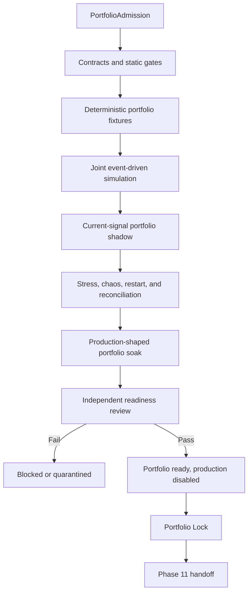

# Phase 10, Book 5 — Portfolio Operations and Lock

> **Purpose:** Certify the complete portfolio system under joint simulation, current-signal shadow, faults, sustained load, reconciliation, and recovery, then seal a production-disabled Portfolio Lock  
> **Input:** Books 1–4 contracts, state, exposure/dependency/conflicts, allocation/reservations, stress, drawdown, controls, and limitations  
> **Output:** `PortfolioCertificationReport`, `PortfolioLockManifest`, operations-readiness evidence, and nonauthorizing `SovereignOperationsHandoff`  
> **Previous:** [Book 4 — Stress, Drawdown, and Portfolio Controls](book-4-stress-drawdown-controls.md)  
> **Next:** Phase 11 — Sovereign Operations

---

## 1. Success Statement

OCE can repeatedly admit, simulate, shadow, allocate, reserve, reconcile, stress, throttle, suspend, recover, replay, restore, and roll back the complete portfolio stack; every selected strategy/execution cell survives joint capital, overlap, capacity, shock, and state-consistency gates; all blocked cells remain explicit; production capital and routing remain absent; and the Portfolio Lock proves readiness without creating standing allocation or live permission.

---

## 2. Applicable Anchors

- **A0:** Human Strategic Authority
- **A1:** One Orchestration Spine
- **A2:** Evidence Before Narrative
- **A3:** Point-in-Time Data
- **A4:** StrategySpec Is Truth
- **A5:** Fast Tests Reject; Canonical Tests Qualify
- **A6:** Nautilus Is the Canonical Trading Model
- **A7:** OrderIntent Is the Execution Boundary
- **A8:** Promotion Is State-Based
- **A9:** Separate Research From Approval
- **A10:** Observable and Reconstructable
- **A11:** Repair Before Expansion
- **A12:** Cheap Models Use Tools, Not Memory
- **A13:** Local-First Heavy Compute
- **A14:** No Unofficial Production Broker Dependency
- **A15:** Live Autonomy Is Earned
- **F10:** A qualified strategy earns eligibility, not unlimited capital

---

## 3. Certification Topology



---

## 4. Work Packages

### 4.1 PortfolioCertificationJob

```yaml
portfolio_certification_job_id: content-id
portfolio_admission_ref: artifact-ref
portfolio_policy_ref: policy-ref
portfolio_mandate_ref: artifact-ref
synthetic_or_shadow_authority_ref: artifact-ref
strategy_eligibility_refs: []
execution_lock_and_cell_refs: []
fixture_plan_ref: artifact-ref
joint_simulation_plan_ref: artifact-ref
shadow_plan_ref: artifact-ref
stress_and_chaos_plan_ref: artifact-ref
soak_plan_ref: artifact-ref
reconciliation_plan_ref: artifact-ref
resource_budget_ref: policy-ref
independent_review_ref: actor-ref
idempotency_key: string
correlation_id: typed-id
```

OCE schedules the job. An OCE software task, resource allocation, or job state is never a financial-capital decision, PortfolioCapitalEnvelope, Phase 9 permit, or broker command.

### 4.2 Job graph

```text
proposed
admission_verified
contracts_running
fixtures_running
joint_simulation_running
portfolio_shadow_running
stress_chaos_running
soak_running
reconciliation_review
independent_review
production_ready_disabled
locked
handed_off
blocked
quarantined
invalidated
```

Every transition requires guards, immutable event, actor/capability, checkpoint, resource bound, and failure/containment path.

### 4.3 Certification ladder

Each selected strategy/version/execution-capability/environment cell passes:

1. exact upstream Lock and eligibility evidence;
2. contract/schema and forbidden-import checks;
3. valuation, ownership, exposure, dependency, conflict, allocation, reservation, limit, and control fixtures;
4. deterministic multi-strategy joint simulation;
5. current-signal portfolio shadow where required;
6. stress, dependency, liquidity, venue, options, margin, and drawdown campaigns;
7. duplicate, concurrency, process death, restart, corruption, and recovery chaos;
8. portfolio-versus-Phase 9/account/broker reconciliation;
9. production-shaped sustained soak;
10. replay and independent backup/restore;
11. independent evidence review;
12. production-capital/routing-disabled verification.

No aggregate score hides a failed strategy, account, venue, asset, capability, scenario, or ownership cell.

### 4.4 PortfolioCertificationReport

```yaml
portfolio_certification_report_id: content-id
portfolio_admission_ref: artifact-ref
portfolio_policy_and_mandate_refs: []
authority_class: synthetic_fixture|synthetic_simulation|shadow_counterfactual
strategy_eligibility_refs: []
execution_cell_refs: []
contract_and_static_results: {}
fixture_results: {}
joint_simulation_results: {}
shadow_results: {}
stress_and_chaos_results: {}
soak_results: {}
allocation_and_reservation_results: {}
capital_ownership_and_reconciliation_results: {}
drawdown_and_control_results: {}
security_and_authority_results: {}
operational_slos: {}
rejected_or_untested_cells: []
known_limitations: []
disposition: certified|conditionally_certified|blocked|quarantined
review_refs: []
valid_until: timestamp
```

Conditional certification never grants capital. Every condition has an owner, blocker, expiry, and exact excluded scope.

### 4.5 Deterministic portfolio fixtures

Fixtures cover:

- one strategy, multiple strategies, and no-strategy states;
- same/opposite/synthetic signals;
- multi-account, venue, currency, asset, and instrument exposure;
- cash/margin/options/crypto/FX/equity valuation;
- missing price, FX rate, mapping, ownership, dependency, and liquidity;
- hard/soft-limit boundary values;
- feasible, infeasible, multiple-optimum, unstable, and solver-failure allocation;
- reservation concurrency and execution uncertainty;
- partial fills, rejects, cancels, assignments, corrections, and external activity;
- drawdown, throttle, suspension, control, and recovery;
- every required stress scenario and blocked execution cell.

Golden fixtures pin all schema, policy, mapping, engine, solver, calendar, and seed versions.

### 4.6 Joint event-driven portfolio simulation

Joint simulation is not a sum of separately generated equity curves. It uses:

- one canonical event clock and point-in-time data cursor;
- one synthetic capital authority and conserved capital ledger;
- all selected strategy instances at their real decision times;
- shared account/venue cash, collateral, margin, buying power, and settlement;
- shared instrument/underlying liquidity and capacity;
- simultaneous conflict resolution and allocation;
- exact PortfolioCapitalEnvelope and reservation lifecycles;
- canonical Phase 9 order lifecycle/execution-cost behavior;
- strategy ownership and broker/account netting views;
- continuous exposure, dependency, stress, drawdown, and controls;
- cross-asset sessions, calendars, expiries, corporate actions, funding, and rollover.

Precomputed strategy return series may serve as a cheap rejection fixture, but cannot certify the portfolio path.

### 4.7 Portfolio shadow

Shadow:

1. reads current lock-backed strategy decisions and eligible candidate intents;
2. captures current market/reference/account observations at their real cursors;
3. produces counterfactual conflicts, allocations, envelopes, reservations, controls, and reports;
4. compares expected availability/cost/capacity with Phase 9 observations where available;
5. creates no real reservation, ExecutionPermit, order, account mutation, or route;
6. labels missing opportunities and counterfactual fills honestly;
7. reconciles its own internal shadow state;
8. expires every shadow artifact.

Shadow success measures system stability and decision consistency, not realized live profitability.

### 4.8 Chaos campaign

Inject at controlled causal boundaries:

- duplicate allocation request, decision, envelope, reservation, event, and job delivery;
- concurrent strategies racing for the last capital/capacity unit;
- process death before/after decision, reservation, Phase 9 handoff, and release;
- stale or conflicting price, FX rate, taxonomy, dependency, liquidity, margin, or account state;
- corrupted ownership/capital/reservation ledger or checkpoint;
- solver timeout, infeasibility, multiple optimum, and version drift;
- Phase 9 reject, partial fill, delayed acknowledgment, cancel race, and restart;
- venue/account/provider/data outage;
- external/manual order/position/cash change;
- correlation/tail convergence and liquidity collapse;
- options assignment/expiry/broken spread;
- drawdown/limit breach and control-path failure;
- OCE worker, queue, storage, database, or model-service outage.

Every injection declares expected state, invariant, alert, containment, cleanup, and no-duplicate proof.

### 4.9 Production-shaped portfolio soak

Run:

- realistic eligible-strategy and concurrent-signal count;
- all selected assets, sessions, accounts, venues, and execution-capability cells;
- actual OCE job/event/state services;
- actual portfolio contracts, allocator, reservation ledger, stress, controls, and reconciliation;
- realistic market/reference update rates and provider constraints;
- full artifact/log/metric/checkpoint rotation;
- repeated restart/recovery/replay cycles;
- deterministic LLM outage;
- no risk bypass, debug shortcut, relaxed limit, unlimited capacity, or production authority;
- final clean reconciled terminal/holding window.

Record request/decision/reservation/event rates, state lag, solver latency, reconciliation latency, resource use, storage growth, alert/control latency, and SLO breaches.

### 4.10 Portfolio reconciliation

Compare:

1. mandate and active synthetic/shadow authority;
2. envelopes and reservation ledger;
3. strategy ownership ledger;
4. expected and actual Phase 9 action/execution reports;
5. Nautilus portfolio/account state;
6. broker/venue orders, fills, positions, cash, settlement, fees, collateral, and margin;
7. valuation/exposure aggregates;
8. drawdown/control state.

```yaml
portfolio_reconciliation_snapshot_id: content-id
as_of_time: timestamp
portfolio_state_and_ledger_hashes: {}
phase9_execution_state_hashes: {}
nautilus_state_hashes: {}
account_and_venue_state_hashes: {}
capital_and_reservation_differences: []
ownership_and_position_differences: []
order_and_fill_differences: []
cash_fee_settlement_margin_differences: []
valuation_and_exposure_differences: []
drawdown_and_control_differences: []
external_or_unclaimed_activity: []
classification: match|explainable|unexplained_material|critical
required_action: continue|warn|pause|suspend|safe_hold|incident
evidence_refs: []
```

Provider/account net positions may match while strategy ownership is wrong; that is not a clean reconciliation.

### 4.11 Reconciliation cadence and correction

Reconcile:

- before every job/admission;
- at startup/restart/reconnect;
- after allocation, reservation, and every Phase 9 event;
- on price/FX/mapping/account/control change;
- fixed bounded intervals;
- session/day/expiry/settlement boundaries;
- before/after stress/control/recovery;
- before Lock.

Corrections preserve before/after state, source evidence, typed transformation, independent authority where material, and incident/invalidation lineage. No source silently overwrites another.

### 4.12 Operational observability

Expose:

- admission/job/certification/Lock state;
- current mandate and authority class;
- eligibility cells and blockers;
- capital conservation and reserves;
- active envelopes/reservations and utilization;
- ownership by strategy/order/position;
- gross/net exposures by every taxonomy dimension;
- dependency graph, clusters, uncertainty, and staleness;
- conflict sets/decisions;
- allocation constraints/objective/decision diagnostics;
- liquidity/capacity and execution-cost headroom;
- stress/drawdown/limit/control state;
- portfolio/Phase 9/Nautilus/broker reconciliation;
- environment and production-disabled state;
- artifact/event/decision/Lock lineage.

Alerts are deduplicated, severity-ranked, actionable, and linked to exact evidence. A healthy process cannot mask stale or unreconciled portfolio state.

### 4.13 Decision replay and reproducibility

Replay immutable:

- upstream Locks/admission/policies/mandate/synthetic authority;
- strategy eligibility and candidate intents;
- market/reference/account/execution cursors;
- valuation, ownership, exposure, dependency, and conflict artifacts;
- allocator/solver versions, inputs, decisions, envelopes, and reservations;
- Phase 9 events and account snapshots;
- stress, drawdown, limits, controls, incidents, and corrections;
- job and authority events.

Reproduce every ID, decision, capital state, exposure, control, report, reconciliation classification, and terminal state.

### 4.14 Backup and restore

Back up every nonsecret:

- upstream Locks, admission, policies, mandate, and synthetic/shadow authority;
- eligibility, state, valuation, ownership, and exposure ledgers;
- dependency estimates/graphs and conflict decisions;
- allocation inputs/decisions, envelopes, reservations, and capital ledger;
- liquidity/capacity, stress, drawdown, limits, controls, incidents, and recovery;
- Phase 9 integration evidence and reconciliation;
- fixtures, simulations, shadow, chaos, soak, reports, reviews, Lock, and handoff.

Restore into isolated production-disabled mode, verify hashes/schema, replay to reconstructed state, reconcile, and remain stopped until independently admitted.

### 4.15 Release and rollback

Every release records:

- source/dependency/image identity;
- contract/schema and state compatibility;
- valuation/mapping/method/solver/policy versions;
- database/event-ledger migrations;
- fixture/joint-simulation/stress/chaos regression set;
- staged deployment and rollback trigger;
- in-flight decision/envelope/reservation compatibility;
- ownership/capital/control/reconciliation safety.

Rollback cannot revive expired/revoked authority, envelopes, or reservations; lose open exposure; change account/environment; or roll state behind immutable execution evidence.

### 4.16 Invalidation graph

Material changes include:

- any upstream Lock, strategy, or qualified scope;
- Phase 9 intent/permit/report/adapter/capability/account/environment;
- mandate, authority, eligibility, or autonomy;
- portfolio state, ownership, valuation, currency, taxonomy, constituent, factor, or contract mapping;
- dependency method/window/regime/tail policy;
- conflict or allocation rule/objective/solver;
- capital accounting, envelope, reservation, liquidity, capacity, or cost;
- stress scenario/engine/acceptance;
- drawdown, limit, control, suspension, or recovery;
- runtime, database, queue, network, observability, backup, or review criteria.

The graph identifies exact strategy/execution cells, decisions, books, and tests to rerun. Configuration-only appearance cannot hide semantic change.

### 4.17 PortfolioOperationsReadinessProposal

```yaml
portfolio_operations_readiness_proposal_id: content-id
portfolio_admission_ref: artifact-ref
portfolio_certification_refs: []
certified_scope: {}
required_operator_roles_and_permissions: []
required_approval_queue_and_views: []
required_incident_and_control_surfaces: []
operational_slos_and_alerts: {}
deployment_backup_restore_and_rollback_refs: []
known_limitations_and_blockers: []
production_capital_grant: absent
standing_capital_allocation: none
live_authorization: false
production_routing_state: disabled
```

The proposal states what Phase 11 must productize. It cannot create users, roles, capital, accounts, envelopes, permits, or routes.

### 4.18 PortfolioLockManifest

```yaml
phase: 10
lock_id: immutable-id
created_at: timestamp
commit_sha: git-sha
strategy_validation_simulation_execution_lock_refs: []
portfolio_admission_ref: artifact-ref
portfolio_policy_and_mandate_hashes: {}
authority_class: synthetic_or_shadow_only
strategy_eligibility_refs: []
state_valuation_ownership_exposure_refs: []
dependency_graph_and_conflict_refs: []
allocation_decision_envelope_reservation_refs: []
capital_conservation_and_liquidity_capacity_refs: []
stress_drawdown_limit_and_control_refs: []
phase9_integration_and_reconciliation_refs: []
fixture_joint_simulation_shadow_chaos_soak_refs: []
portfolio_certification_refs: []
replay_backup_restore_rollback_refs: []
operations_readiness_proposal_ref: artifact-ref
known_limitations_and_blockers: []
certified_scope: {}
disposition: joint_simulation_certified|portfolio_shadow_certified|production_ready_not_authorized|blocked|quarantined
production_capital_grant_ref: null
standing_capital_allocation: none
production_routing_state: disabled
approved_phase11_contract_version: semver
prohibited_authorities: []
approvals: []
```

The Lock contains no reusable production envelope or reservation.

### 4.19 SovereignOperationsHandoff

```yaml
sovereign_operations_handoff_id: content-id
portfolio_lock_ref: artifact-ref
certified_strategy_and_execution_cell_refs: []
contract_and_schema_versions: {}
required_command_center_views: []
required_human_approval_and_denial_flows: []
required_role_permission_and_tenant_boundaries: []
portfolio_state_capital_exposure_and_ownership_views: []
allocation_conflict_stress_and_control_views: []
incident_recovery_and_global_kill_requirements: []
drift_decay_and_invalidation_requirements: []
operational_slos_alerts_and_resource_budgets: {}
deployment_backup_restore_rollback_requirements: {}
known_limitations_and_blockers: []
requested_phase11_review: true
production_capital_grant: absent
standing_capital_allocation: none
live_authorization: false
production_routing_state: disabled
```

Phase 11 must independently admit the handoff and design continuously operating permissions/control surfaces.

### 4.20 Final independent review

Verify:

1. every Book 1–5 deliverable/test;
2. exact upstream Lock, strategy, account, venue, and environment identities;
3. authority/eligibility/request/decision/envelope/reservation/permit separation;
4. valuation, ownership, gross/net exposure, and dependency truth;
5. deterministic conflict/allocation and capital conservation;
6. liquidity/capacity, stress, drawdown, suspension, orphan protection, and recovery;
7. joint simulation and shadow nonrouting;
8. Phase 9/Nautilus/account/broker reconciliation;
9. chaos, soak, replay, restore, and rollback;
10. blocked cells and limitations remain visible;
11. production capital and routing remain absent/disabled;
12. Phase 11 handoff creates no standing authority.

---

## 5. Target Layout

```text
portfolio_forge/
  certification/
    job.py
    graph.py
    fixtures.py
    joint_simulation.py
    shadow.py
    chaos.py
    soak.py
    report.py
  reconciliation/
    engine.py
    snapshot.py
    corrections.py
  operations/
    observability.py
    alerts.py
    resources.py
    replay.py
    backup_restore.py
    release.py
    rollback.py
  lock/
    manifest.py
    verify.py
    invalidation.py
  handoff/
    readiness_proposal.py
    sovereign_operations_handoff.py
    phase11_adapter.py
```

---

## 6. Deliverables

- OCE `PortfolioCertificationJob` and guarded lifecycle.
- Cell-granular certification ladder.
- `PortfolioCertificationReport`.
- Deterministic portfolio fixture suite.
- True joint event-driven multi-strategy simulation.
- Current-signal nonrouting portfolio shadow.
- Portfolio chaos/fault campaign.
- Production-shaped sustained soak and clean terminal window.
- Capital/ownership/exposure/Phase 9/Nautilus/broker reconciliation.
- Operational dashboard, metric, SLO, and alert contracts.
- Deterministic decision replay.
- Independent backup/restore and release/rollback drills.
- Material-change invalidation graph.
- Nonauthorizing `PortfolioOperationsReadinessProposal`.
- `PortfolioLockManifest` builder/verifier.
- Nonauthorizing `SovereignOperationsHandoff`.
- Independent final-review checklist.

---

## 7. Required Tests

### P10-JOB-001 — Deterministic Certification Job

Same inputs and idempotency key create one job with the same graph.

### P10-JOB-002 — Guarded Transitions

Every job transition requires declared evidence, actor/capability, checkpoint, and failure path.

### P10-JOB-003 — Invalid State Jump

Job cannot skip contracts, joint simulation, stress/chaos, reconciliation, or review.

### P10-JOB-004 — Resume Prerequisites

Restart resumes only after Lock/authority/state/capital/ownership/control reconciliation.

### P10-JOB-005 — Cell Isolation

Failed strategy/account/venue/capability cell cannot corrupt or certify another cell.

### P10-JOB-006 — Resource Budget

Job stays within bounded compute, memory, storage, queue, and wall-time limits.

### P10-JOB-007 — OCE Resource Separation

Operational job/resource budget cannot become financial capital.

### P10-JOB-008 — No Production Authority

Certification job accepts only synthetic/simulation/shadow authority.

### P10-CERT-001 — Complete Certification Ladder

Every selected cell passes all required contracts, fixtures, joint simulation, shadow, stress, chaos, soak, reconciliation, restore, and review gates.

### P10-CERT-002 — Cell Granularity

Aggregate pass cannot hide failed strategy, instrument, account, venue, capability, scenario, or environment.

### P10-CERT-003 — Upstream Lock Verification

Certification verifies current exact upstream Lock hashes and scope.

### P10-CERT-004 — Rejected/Untested Truth

Rejected, blocked, quarantined, and untested cells remain explicit.

### P10-CERT-005 — Known Limitations

Every conditional/known limitation has owner, scope, impact, blocker, and expiry.

### P10-CERT-006 — Version Pin

Contracts, methods, mappings, solver, engine, runtime, calendars, and seeds are pinned.

### P10-CERT-007 — Independent Review

Builders/strategy agents/allocator cannot be sole certification approvers.

### P10-CERT-008 — Risk Bypass Denial

Nautilus/custom bypass, debug shortcut, relaxed limit, or unlimited capacity blocks.

### P10-CERT-009 — Production Disabled Evidence

No production grant, credential, envelope, reservation, permit, endpoint, or route is available.

### P10-CERT-010 — Expiry

Certification expires on time or material invalidation.

### P10-CERT-011 — Conditional Is Not Capital

Conditional certification cannot issue any production allocation.

### P10-CERT-012 — Quant Lab Claims Are Not Certification

Goal, status, notebook, manual, or optimizer result cannot substitute for current Lock-backed evidence.

### P10-SIM-001 — One Clock and Capital Ledger

Joint simulation processes every strategy on one event clock with one conserved shared capital/capacity state.

### P10-SIM-002 — Not Summed Equity Curves

Independent strategy PnL aggregation cannot pass as canonical joint simulation.

### P10-SIM-003 — Simultaneous Conflict

Same-cursor candidate intents enter one conflict/allocation epoch.

### P10-SIM-004 — Shared Capacity

Concurrent strategies compete for one instrument/venue/session capacity pool.

### P10-SIM-005 — Shared Margin and Settlement

Account collateral, buying power, cash, and settlement update jointly.

### P10-SIM-006 — Exact Phase 9 Lifecycle

Submit/reject/partial/fill/amend/cancel/expiry/uncertainty/correction behavior follows certified Phase 9 semantics.

### P10-SIM-007 — Multi-Asset Calendars

FX, crypto, equity, and options sessions, rollover, funding, expiry, assignment, and settlement align causally.

### P10-SIM-008 — Point-in-Time Inputs

No future strategy, price, constituent, mapping, rate, or liquidity data leaks.

### P10-SIM-009 — Drawdown and Controls

Joint losses trigger portfolio limits/control state at the correct event.

### P10-SIM-010 — Strategy Suspension

Suspending one strategy blocks new risk without orphaning or deleting its open exposure.

### P10-SIM-011 — Reproducibility

Same seed/inputs produce identical decisions, state, events, reports, and Lock candidates.

### P10-SIM-012 — Different Seed Stability

Stochastic fixtures meet frozen distributional/stability rules without cherry-picked seed.

### P10-SHD-001 — Shadow Nonrouting

Shadow cannot create a real reservation, Phase 9 permit, order, credential use, or account mutation.

### P10-SHD-002 — Current Cursor

Shadow decisions use only data/state available at each actual decision time.

### P10-SHD-003 — Counterfactual Label

Unexecuted allocation/fill/PnL is labeled counterfactual, not observed.

### P10-SHD-004 — No Favorable Fill Assumption

Missing real execution cannot be filled at midpoint or best future price.

### P10-SHD-005 — Stability Observation

Required window measures state, decision, resource, alert, and reconciliation behavior.

### P10-SHD-006 — Shadow Expiry

All shadow envelopes/reservations expire and cannot enter production.

### P10-SHD-007 — Phase 9 Observation Comparison

Where execution observations exist, costs/capacity/latency compare without claiming identical routing.

### P10-SHD-008 — Model Outage

Shadow capital/safety paths remain deterministic during LLM outage.

### P10-REC-001 — Portfolio-to-Execution/Broker Reconciliation

Capital, reservations, ownership, orders, fills, positions, cash, fees, settlement, collateral, margin, valuation, exposure, and controls reconcile across Portfolio Forge, Phase 9, Nautilus, and account/venue evidence.

### P10-REC-002 — Net Position Is Insufficient

Matching broker net position with wrong strategy ownership, orders, fees, or reservations is not clean.

### P10-REC-003 — Capital Reservation Difference

Missing/duplicate/overreleased reservation triggers pause/incident.

### P10-REC-004 — Ownership Difference

Unclaimed or misattributed quantity enters hold and remains visible.

### P10-REC-005 — Cash and Margin Difference

Cash, settlement, fee, collateral, buying-power, or margin mismatch cannot be balanced silently.

### P10-REC-006 — External Manual Activity

External order/trade/position/cash change is classified and not assigned automatically.

### P10-REC-007 — Options Lifecycle

Exercise, assignment, expiry, broken combo, and adjusted contract reconcile to ownership/capital.

### P10-REC-008 — Venue/Account Separation

One account's match cannot hide another account's mismatch.

### P10-REC-009 — Scheduled and Event Reconciliation

Startup, fixed interval, lifecycle, boundary, stress, control, and shutdown cadences run.

### P10-REC-010 — No Silent Winner

Internal, Nautilus, Phase 9, or provider state cannot overwrite another source silently.

### P10-REC-011 — Material Mismatch Gate

Unexplained material/critical mismatch blocks new allocation and Lock.

### P10-REC-012 — Correction Lineage

Correction preserves pre/post state, source, authority, incident, and replay.

### P10-REC-013 — Restart Reconciliation

Restart restores ledgers/controls and reconciles before new jobs or reservations.

### P10-REC-014 — Cross-Currency Reconciliation

Native currencies and point-in-time conversion paths reconcile independently and in reporting currency.

### P10-REC-015 — Reconciliation Replay

Same evidence reproduces classification and required action.

### P10-CHA-001 — Duplicate Delivery

Duplicate jobs/requests/decisions/envelopes/reservations/events produce exactly-once effects.

### P10-CHA-002 — Last-Unit Race

Concurrent strategies cannot both reserve the final capital/risk/capacity unit.

### P10-CHA-003 — Process Death

Death before/after reservation or Phase 9 handoff recovers without duplicate allocation or route.

### P10-CHA-004 — Corrupt Ledger

Capital/ownership/reservation corruption fails verification and blocks.

### P10-CHA-005 — Stale Dependency/Liquidity

Stale graph/capacity input invalidates decision rather than reusing favorable evidence.

### P10-CHA-006 — Solver Failure

Timeout/error/infeasibility cannot emit unverified capital.

### P10-CHA-007 — Phase 9 Uncertainty

Delayed ack/partial/cancel race keeps capital/exposure reserved and reconciles.

### P10-CHA-008 — External State Change

Manual activity/account drift triggers ownership and portfolio hold.

### P10-CHA-009 — Control Failure

Failed suspend/cancel/reduce/close preserves residual risk and escalation.

### P10-CHA-010 — Infrastructure/Model Outage

Queue/storage/database/worker/model outage blocks new risk while deterministic safety/recovery persists.

### P10-SOK-001 — Production-Shaped Stack

Soak uses actual selected portfolio components and policies without production authority.

### P10-SOK-002 — Required Duration and Load

Mandate-defined duration, concurrency, signal/event rate, and state size complete.

### P10-SOK-003 — No Relaxed Controls

Soak cannot use mock allocator, unlimited capacity, bypass, or looser limit.

### P10-SOK-004 — Resource Bound

CPU, memory, storage, network, descriptors, queue lag, and artifact growth remain inside budget.

### P10-SOK-005 — Progress Health

Fresh events, decisions, reconciliation, and controls—not heartbeat alone—prove health.

### P10-SOK-006 — Restart Cycles

Repeated restart/recovery preserves capital, ownership, reservations, and controls.

### P10-SOK-007 — LLM Outage

Portfolio capital/safety operation remains deterministic without models.

### P10-SOK-008 — Clean Terminal Window

Final required window has reconciled state and no unresolved critical incident.

### P10-OBS-001 — Capital and Ownership Lineage

Every aggregate drills to mandate/authority/decision/envelope/reservation/intent/execution/owner.

### P10-OBS-002 — Exposure and Dependency Views

Gross/net and all dimensions, graph clusters, uncertainty, and staleness are visible.

### P10-OBS-003 — Conflict and Allocation Diagnostics

Rules, feasibility, objective, baselines, denials, revisions, and headroom are visible.

### P10-OBS-004 — Reservation Utilization

Available/reserved/committed/released/uncertain state is visible by strategy/account/currency.

### P10-OBS-005 — Stress/Drawdown/Control Views

Scenario paths, breaches, residual exposure, suspension, and recovery are visible.

### P10-OBS-006 — Reconciliation Health

Source differences and current required action are visible; green process cannot mask mismatch.

### P10-OBS-007 — Alert Deduplication

Repeated same root cause produces one actionable incident with updated evidence.

### P10-OBS-008 — Secret and Authority Redaction

No credential/raw account/approval secret enters dashboard, alert, log, report, or Lock.

### P10-RPY-001 — Deterministic Decision Replay

Allocation and conflict decisions reproduce from exact inputs and versions.

### P10-RPY-002 — Reservation Replay

Concurrency, uncertainty, release, and correction effects reproduce.

### P10-RPY-003 — Joint Simulation Replay

Event ordering, portfolio state, controls, and reports reproduce.

### P10-RPY-004 — Stress Replay

Scenario path and every breach/control outcome reproduce.

### P10-RPY-005 — Captured Shadow Label

Replaying captured shadow remains replay, not a second independent observation.

### P10-RPY-006 — Evidence Mutation

Any artifact/event mutation breaks hash verification.

### P10-RPY-007 — Version Mismatch

Unknown contract/engine/solver/mapping version blocks exact replay.

### P10-RPY-008 — Correction Replay

Original and corrected state reconstruct with full lineage.

### P10-BKP-001 — Independent Restore

Clean isolated restore reconstructs all nonsecret state from backup.

### P10-BKP-002 — Hash and Schema Verification

Missing, corrupt, or incompatible component blocks restore.

### P10-BKP-003 — Restore Stays Disabled

Restore cannot resume production capital or routing.

### P10-BKP-004 — Authority Nonrevival

Expired/revoked mandate/grant/envelope/reservation remains inactive after restore.

### P10-BKP-005 — Open Exposure Truth

Restore retains open/uncertain ownership and required management state.

### P10-BKP-006 — Secret Exclusion

Backup/Lock/handoff contain references and redacted metadata, not secret values.

### P10-BKP-007 — Recovery Drill

Restore, replay, reconcile, control-state verification, and independent review meet RTO/RPO.

### P10-INV-001 — Upstream Lock Change

Changed Strategy/Validation/Simulation/Execution Lock invalidates exact dependent cells.

### P10-INV-002 — Mandate/Authority Change

Scope, limit, reserve, autonomy, account, environment, or expiry change invalidates dependent decisions.

### P10-INV-003 — Valuation/Mapping Change

Price, FX, taxonomy, constituent, factor, contract, or corporate-action semantic change invalidates.

### P10-INV-004 — Dependency/Conflict Change

Method/window/regime/tail/structural edge or resolver change invalidates affected evidence.

### P10-INV-005 — Allocator Change

Constraint/objective/solver/tolerance/envelope/reservation change invalidates.

### P10-INV-006 — Liquidity/Capacity Change

Model/source/participation/impact/liquidation-horizon change invalidates.

### P10-INV-007 — Stress/Control Change

Scenario/engine/acceptance/drawdown/limit/suspension/recovery change invalidates.

### P10-INV-008 — Runtime/State Change

Database/event/queue/network/isolation/reconciliation behavior change invalidates.

### P10-INV-009 — No Configuration Disguise

Semantic change cannot be labeled nonmaterial because it was made through config.

### P10-INV-010 — Targeted Rerun

Invalidation graph identifies exact affected books/tests/cells and blocks use until rerun.

### P10-LCK-001 — Portfolio Lock Completeness

Lock references every required scope, contract, authority class, state, evidence, report, limitation, review, and handoff.

### P10-LCK-002 — Hash Verification

Every Lock reference and event-chain root verifies.

### P10-LCK-003 — Certified Scope Intersection

Lock scope cannot exceed any upstream Lock, eligibility, execution capability, mandate, or certification.

### P10-LCK-004 — Critical Gate

One failed authority, conservation, ownership, stress, suspension, reconciliation, restore, or review gate blocks passing disposition.

### P10-LCK-005 — Blocked Cell Truth

Unavailable/uncertified strategy, FX script, account, venue, capability, or scenario remains visible.

### P10-LCK-006 — Production Capital Absent

Lock has no production grant, envelope, reservation, permit, or route.

### P10-LCK-007 — Standing Allocation Absent

Lock contains no permanent weights or reusable capital claims.

### P10-LCK-008 — Independent Verification

Verifier reconstructs Lock without trusting human-readable narrative.

### P10-LCK-009 — Invalidation

Material change marks exact Lock scope invalid and prevents Phase 11 admission.

### P10-LCK-010 — No Profitability Guarantee

Portfolio Lock certifies mechanics/bounds/evidence, not future return or maximum loss.

### P10-HOF-001 — Phase 11 Nonauthorizing Handoff

Handoff contains operating requirements and certified evidence with production capital/routing absent.

### P10-HOF-002 — Complete Operator Views

Handoff specifies capital, ownership, exposure, dependency, conflict, allocation, stress, control, incident, and reconciliation views.

### P10-HOF-003 — Human Approval Queue

Every capital/autonomy/deployment expansion identifies required human approval/denial surface.

### P10-HOF-004 — Role and Permission Requirements

Handoff defines least-privilege operator/approver/auditor responsibilities without creating users.

### P10-HOF-005 — Global and Scoped Controls

Phase 11 receives tested block/throttle/suspend/cancel/reduce/hold behavior and limitations.

### P10-HOF-006 — Drift and Invalidation

Handoff carries exact strategy/performance/dependency/liquidity/capability drift triggers.

### P10-HOF-007 — Operational SLOs

State freshness, decision, reservation, reconciliation, alert, control, RTO/RPO, and resource SLOs are explicit.

### P10-HOF-008 — Deployment and Rollback

Handoff carries production-disabled deployment, backup, restore, migration, rollback, and no-authority-revival requirements.

### P10-HOF-009 — Known Blockers

Blocked/conditional/unknown scope cannot disappear from Phase 11 input.

### P10-HOF-010 — Phase 11 Independent Admission

Sovereign Operations independently verifies Locks, scope, evidence, authority absence, and operator requirements.

### P10-AUT-100 — Portfolio Lock Is Not Standing Capital or Trading Authority

No certification, shadow result, readiness proposal, Portfolio Lock, or Phase 11 handoff can create a production grant, reusable allocation, Phase 9 permit, account activation, or live route.

---

## 8. Failure Modes

- Joint portfolio test sums isolated equity curves.
- Shadow output reserves real capital.
- Certification averages across failed cells.
- Matching broker net position hides wrong strategy ownership.
- Soak uses unlimited capacity or bypassed limits.
- Restore resumes allocation.
- Rollback revives expired authority or loses open exposure.
- Quant Lab/manual weights enter the Lock as certified allocation.
- Missing FX adapter/blocked strategy disappears.
- Portfolio Lock is treated as capital approval.
- Phase 11 receives a live toggle or standing weights.
- A process heartbeat is called portfolio health while reconciliation is stale.

---

## 9. Exit Gate

Phase 10 is complete only when every selected strategy/execution cell passes exact Lock admission, portfolio contracts, valuation/ownership/exposure/dependency/conflict fixtures, deterministic allocation and reservation, true joint simulation, shadow nonrouting, stress/chaos/soak, drawdown/control/orphan protection, Phase 9/Nautilus/account/broker reconciliation, replay, restore, rollback, and independent review; blocked scope remains explicit; production capital/routing remain absent; the Portfolio Lock verifies; and Phase 11 receives complete operating requirements without standing capital or trading authority.

Formally:

```text
Phase10Complete =
    Books1Through5Passed
    AND SelectedStrategyExecutionCellsCertified
    AND JointSimulationAndShadowPassed
    AND CapitalOwnershipExposureReconciled
    AND AllocationReservationInvariantsPassed
    AND StressDrawdownAndControlsPassed
    AND ChaosSoakReplayRestorePassed
    AND ProductionCapitalAndRoutingAbsent
    AND PortfolioLockVerified
    AND Phase11HandoffNonauthorizing
```

---

## 10. Handoff

Sovereign Operations receives the verified `PortfolioLockManifest`, `SovereignOperationsHandoff`, certification reports, exact strategy/execution cells, portfolio contracts and state models, command-center view requirements, human approvals, role/permission boundaries, SLOs/alerts, incident/global-control behavior, drift/invalidation rules, deployment/restore/rollback procedures, blocked scope, and known limitations.

Phase 11 independently builds the continuously operating GLX command center and lifecycle controls. Any request to add strategy scope, execution capability, capital authority, account/venue, portfolio objective, or risk bound outside the Portfolio Lock returns through the applicable earlier FORGE phase and invalidates affected evidence.
