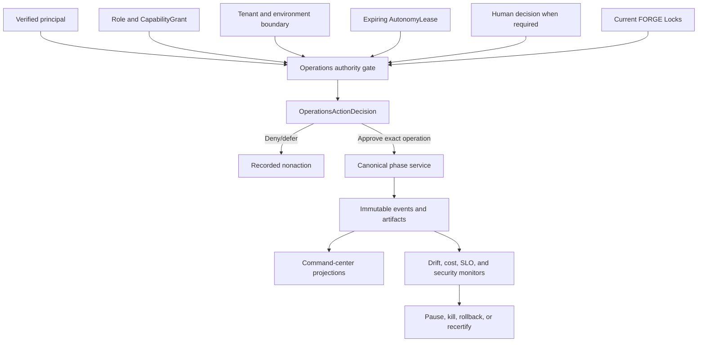
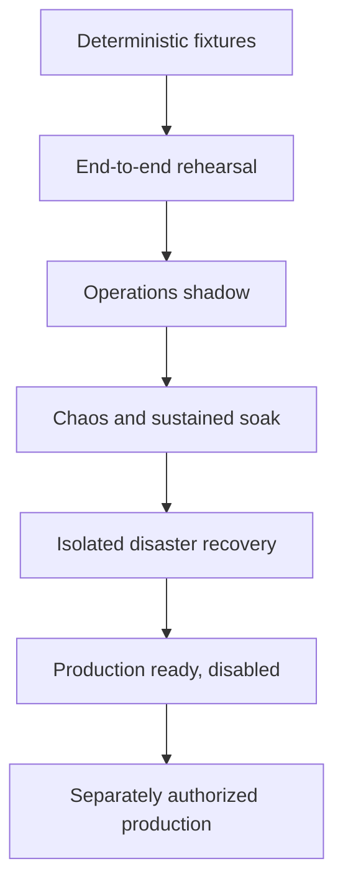
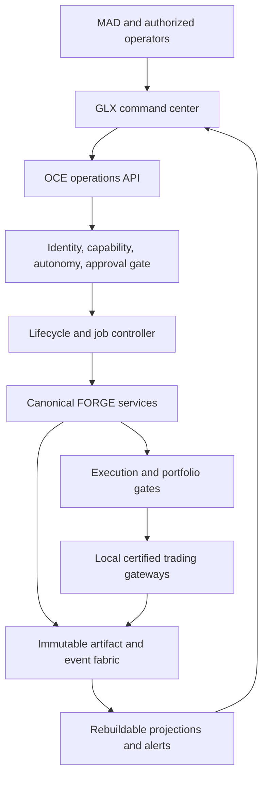
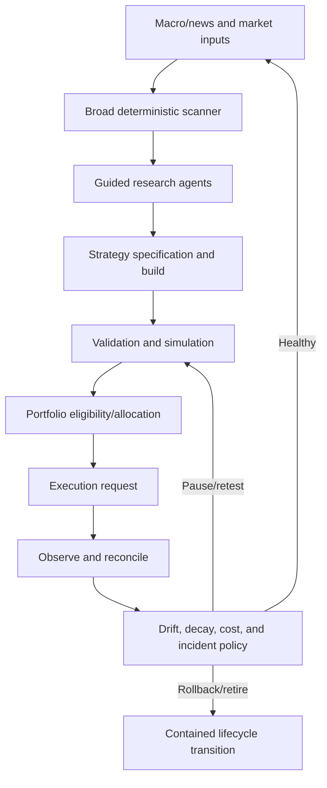
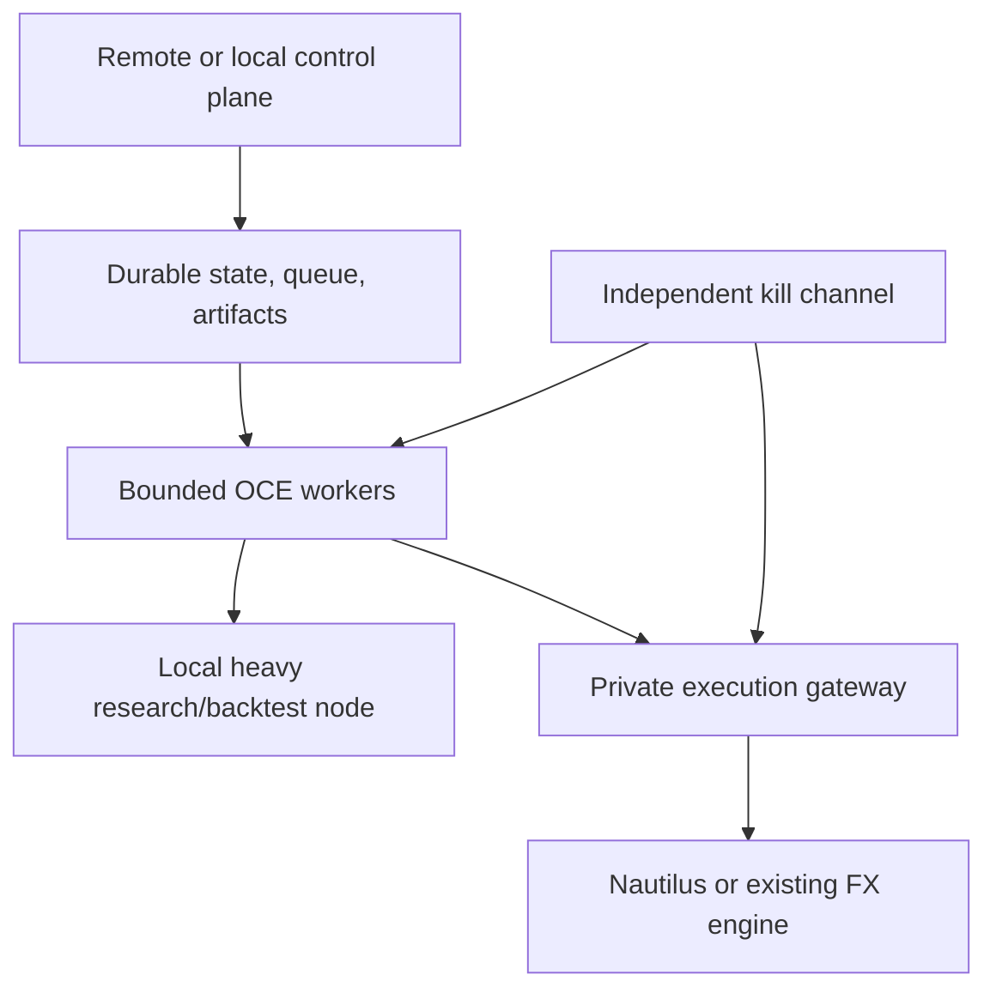

# Phase 11 — Sovereign Operations Forge

> **Status:** Build-ready planning package  
> **Prerequisite:** Verified Phase 10 `PortfolioLockManifest`, valid Locks from Phases 0–10, and a nonauthorizing `SovereignOperationsHandoff`  
> **Produces:** Continuously operable GLX control plane, bounded-autonomy evidence, `SovereignOperationsLockManifest`, and `GLXForgeCompletionManifest`  
> **Anchor:** **F11 — Autonomy is valid only while control, evidence, and reconstruction remain intact.**

---

## 1. Idea

Productize the entire macro-news-to-market-action loop as one continuously operating application without converting agents, dashboards, schedules, configuration, or prior certification into authority.

```text
current Locks from Phases 0–10
→ SovereignOperationsAdmission
→ authenticated principal and tenant boundary
→ role and exact capability grants
→ action-risk classification
→ expiring AutonomyLease
→ command-center state projection
→ lifecycle trigger or human request
→ approval/denial gate when required
→ exact upstream FORGE service
→ immutable action and evidence lineage
→ drift, decay, cost, security, and SLO monitoring
→ scoped pause/kill/rollback/recovery
→ full idea-to-retirement rehearsal
→ Sovereign Operations Lock
→ human-controlled operating system
```

The system may continuously observe, scan, research, test, propose, reconcile, and contain within exact earned scope. It may not continuously expand its own scope.

---

## 2. Reality at Entry

The workspace contains a substantial OCE prototype and all preceding FORGE planning packages, but it does not yet contain a certified operating product:

| Current seam | Repository evidence | Phase 11 treatment |
|---|---|---|
| OCE control plane | `oce/backend/main.py` exposes 63 FastAPI route decorators plus registered API routers | Reuse only after authenticated, capability-checked, idempotent operation contracts replace route presence as authority |
| Command center | Next.js command-center, execution, and observability pages exist | Treat as UI prototype; rebuild views as nonauthoritative projections of immutable FORGE state |
| Agent rooms | `command_center.py` stores agents, rooms, DMs, and caller-supplied sender labels in JSON | Development fixture only; identity cannot originate from a request body and JSON files are not a concurrent authority store |
| OCE primitives | Event fabric, tracing, metrics, alerts, execution queue, drift detector, self-healing, governance, consensus, and economics modules exist | Candidate primitives behind Phase 11 contracts; none is automatically canonical for trading operations |
| Governance | Proposal, approval, override, and boundary concepts exist | Replace arbitrary actor strings and count-only approvals with authenticated identities, separation of duties, exact hashes, expiry, and capability checks |
| Self-healing | OCE can recommend/apply retry, timeout, queue, and worker changes | Restrict to preapproved reversible operations; it cannot widen authority, spend, capital, retries, or trading risk |
| Health | `/health` returns a shallow process-level response | Replace with dependency, freshness, reconciliation, control-path, and evidence health; a heartbeat is not system health |
| Persistence | OCE uses a mixture of process memory, JSON files, and SQLite databases | Valid for local fixtures only; certify durable transactional state, concurrency, backup, migration, and replay per deployment profile |
| Authentication and tenancy | No canonical API authentication, session, RBAC/ABAC, or tenant isolation is wired into OCE routes | Phase 11 admission blocker for any remote or distributed mode |
| Secret posture | Credential-shaped values are present across workspace scripts/configuration/history locations | Inventory without disclosure, revoke/rotate, remove from active source, protect history, and pass automated secret scanning before deployment |
| Frontend runtime | API and WebSocket clients default to localhost and silently reconnect/drop malformed messages | Define authenticated transport, bounded backoff, cursor resume, visible stale/degraded state, and event validation |
| Packaging | OCE has broad backend version ranges, no OCE lockfile, no OCE deployment manifest, and shares the root quant environment | Create an isolated, pinned, minimal control-plane runtime and test image |
| Deployment | No canonical OCE Docker/Podman Compose, CI/CD, migration, or remote deployment profile exists | Certify local single-operator first; remote control-plane and distributed modes require separate gates |
| Test inventory | Approximately 397 OCE test functions are visible in source | Existing inventory is evidence only; current pass evidence must come from a reproducible isolated OCE environment |
| Documentation | `oce/README.md`, root status files, and implemented source disagree on current phase/maturity | Reconcile documentation and generate status from verified manifests, not manually optimistic labels |
| Trading authority | Phase 10 hands off zero production capital, no standing allocation, and disabled routing | Preserve exactly; Phase 11 cannot reinterpret product readiness as live permission |

The workspace does **not** yet contain a canonical:

- Sovereign Operations admission;
- authenticated principal, service identity, session, role, or capability model;
- tenant boundary or certified single-operator mode;
- action-risk taxonomy;
- autonomy policy and expiring autonomy lease;
- hash-bound human approval and denial queue;
- immutable operations action request/decision;
- cross-FORGE command-center projection;
- complete final-trade-to-source lineage graph;
- full idea-to-retirement lifecycle controller;
- trading/data/model/operations drift and decay registry;
- model-utility and real API-cost ledger;
- scoped/global independent kill plane;
- degraded-operation matrix;
- security baseline, secret-rotation evidence, SBOM, or dependency gate;
- isolated OCE runtime and deployment profile;
- disaster-recovery proof;
- Sovereign Operations Lock;
- final FORGE completion manifest.

Existing endpoints are implementation candidates, not permission.

---

## 3. Canonical Decisions

All `A*` identifiers use the exact names and meanings from [`GLX_FORGE_MASTER_BLUEPRINT.md`](../../GLX_FORGE_MASTER_BLUEPRINT.md).

The binding Phase 11 anchor set is **A0** human strategic authority, **A1** one orchestration spine, **A10** observable and reconstructable operation, **A15** earned live autonomy, and **F11** bounded sovereign operation. Every other affected master and phase anchor remains active.

| Decision | Lock |
|---|---|
| Orchestration | OCE remains the sole operations/lifecycle spine |
| Human authority | MAD remains strategic authority, capital source, autonomy boundary owner, and critical reset authority |
| Operations admission | Requires valid, current, hash-verified Locks from every affected FORGE phase |
| Identity | Comes from verified authentication/service identity, never a request field, room label, agent claim, or model output |
| Authorization | Roles are not capabilities; exact least-privilege capabilities intersect role, tenant, environment, resource, time, and upstream Lock scope |
| Autonomy | Per action class and scope; leased, expiring, revocable, observable, and never global by persona |
| Highest level | No unrestricted autonomy level exists |
| Human approvals | Immutable, exact-action/hash-bound, actor-bound, expiring, nontransferable, and separation-of-duties checked |
| User interface | A projection and request surface only; it cannot approve itself or manufacture state |
| Agent messaging | A coordination surface and evidence source only; chat text never becomes a command without typed parsing and authority verification |
| Models | Propose, classify, summarize, or explain; never authenticate, authorize, approve, reset kills, allocate capital, or route |
| Lifecycle | OCE drives the state machine but every phase-specific decision remains owned by its canonical FORGE service |
| Trading | Phase 10 capital envelope/reservation and Phase 9 one-use permit remain mandatory |
| Self-healing | Limited to explicitly preapproved reversible actions with bounded blast radius |
| Drift/decay | Material drift pauses or invalidates affected scope before new risk; favorable recent results cannot auto-clear |
| Cost | Operational entropy, model/API dollars, and trading capital remain separate ledgers and authorities |
| State | Append-only events/artifacts are truth; dashboards and caches are rebuildable projections |
| Storage | JSON/in-memory/SQLite may support fixtures; certified profiles declare transaction/concurrency limitations |
| Initial tenancy | `local_single_operator` is the first admissible production-shaped profile |
| Multi-tenancy | A separate certification cell requiring data, memory, secret, queue, artifact, log, model, and trading isolation |
| Network | Broker/exchange adapters are never exposed directly to the public control plane |
| Kill path | Independent, authenticated, latched, observable, and available without the normal agent/model path |
| Deployment | Local-first and cheap-control-plane profiles; heavy tests and trading gateways may remain on the operator machine |
| Phase completion | End-to-end rehearsal, shadow, chaos, soak, security, and DR suffice; live capital is not required |
| Final Lock | Readiness evidence only; contains no capital grant, standing allocation, live lease, or reusable permit |

---

## 4. Authority Topology



An operation may begin only when:

```text
CanBeginOperation =
    SovereignOperationsAdmissionValid
    AND PrincipalAuthenticated
    AND SessionAndServiceIdentityValid
    AND TenantBoundaryExact
    AND RoleCapabilityExact
    AND ActionRiskClassKnown
    AND AutonomyLeaseValidForExactAction
    AND RequiredHumanDecisionValid
    AND UpstreamLocksCurrent
    AND WorkflowStateAllowsAction
    AND EnvironmentAndResourceScopeExact
    AND CostAndOperationalBudgetsPass
    AND DependenciesFreshAndHealthy
    AND NoBlockingIncidentKillOrDrift
```

A trade-related operation additionally requires:

```text
CanReachBroker =
    CanBeginOperation
    AND PortfolioCapitalEnvelopeValid
    AND CapitalReservationValid
    AND Phase9ExecutionPermitValidAndUnused
    AND CertifiedAdapterAndAccountCellValid
```

Sovereign Operations never issues the Phase 10 capital artifacts or Phase 9 permit.

---

## 5. Bounded Autonomy Model

Autonomy is an action matrix, not a label placed on an agent:

| Level | Meaning | Allowed examples | Never implied |
|---:|---|---|---|
| `L0_OBSERVE` | Read and report | Health, state, evidence, alerts, dashboards | Create tasks, modify state, spend, trade |
| `L1_PROPOSE` | Draft typed proposals | Research question, scanner hypothesis, strategy change, incident recommendation | Approval or execution |
| `L2_REVERSIBLE_OPERATE` | Execute preapproved reversible internal work | Refresh data, rerun test, rebuild projection, bounded retry | Promotion, external write, capital use |
| `L3_GOVERNED_WORKFLOW` | Advance exact nontrading workflow states under policy | Run scanner/research/backtest/validation jobs, pause invalid scope | Self-approval, widening scope, production route |
| `L4_BOUNDED_PRODUCTION` | Coordinate exact production actions under external grants | Submit already-approved workflow request into Phase 10/9 gates | Standing trading right or unrestricted action |

Every level is further restricted by:

```text
EffectiveAutonomy =
    Level
    INTERSECT ActionClass
    INTERSECT CapabilityGrant
    INTERSECT Tenant
    INTERSECT Environment
    INTERSECT ResourceBudget
    INTERSECT UpstreamLockScope
    INTERSECT TimeWindow
    INTERSECT IncidentAndDriftState
```

There is no `L5_UNRESTRICTED`.

---

## 6. Operating Environments



### `deterministic_fixture`

Frozen actors, Locks, events, decisions, failures, and time prove every contract, role, approval, lifecycle, cost, drift, kill, and recovery transition.

### `end_to_end_rehearsal`

Runs macro/news ingestion through scan, research, StrategySpec, validation, simulation, portfolio, execution shadow, monitoring, pause/rollback, and retirement on one causal event graph.

### `operations_shadow`

Consumes current observations and produces counterfactual operational actions without external state mutation, real capital reservation, execution permit, or route.

### `disaster_recovery_isolated`

Restores backups into a network- and authority-isolated environment, reconstructs state, reconciles, and remains disabled.

### `production_ready_disabled`

Uses the production-shaped stack with production credentials absent/revoked, capital absent, routing disabled, and kill paths exercised.

### `production_authorized`

Supported only after Phase 11 completion and a separate exact external authority package. It is never created merely by deploying the app.

---

## 7. Admission and Completion

Phase 11 admission requires:

```text
all_required_phase_locks_valid
AND portfolio_lock_and_handoff_valid
AND requested_operating_scope_exact
AND blocked_and_conditional_scope_preserved
AND identity_and_tenant_mode_selected
AND action_risk_and_autonomy_policy_frozen
AND deployment_profile_selected
AND secret_inventory_and_rotation_plan_owned
AND backup_recovery_and_security_review_owned
AND independent_reviewer_assigned
AND production_authority_absent_at_admission
```

Phase 11 completes when:

```text
all_five_books_pass
AND identity_role_capability_and_tenant_tests_pass
AND autonomy_and_human_approval_invariants_pass
AND command_center_reconstructs_canonical_state
AND full_trade_to_source_lineage_replays
AND idea_to_retirement_rehearsal_passes
AND drift_decay_cost_and_model_utility_controls_pass
AND kill_incident_degraded_mode_and_recovery_pass
AND security_secret_dependency_and_tenant_gates_pass
AND sustained_soak_and_disaster_restore_pass
AND production_capital_authority_and_routing_remain_absent
AND sovereign_operations_lock_verifies
AND forge_completion_manifest_verifies
```

---

## 8. Book Sequence

| Book | Document | Builds | Exit |
|---:|---|---|---|
| 1 | [Operations Contracts, Identity, and Authority](book-1-operations-contracts-identity-authority.md) | Admission, principals, roles, capabilities, tenancy, autonomy leases, human decisions | No actor, agent, UI, or configuration can manufacture identity or authority |
| 2 | [Command Center, Approvals, and Lineage](book-2-command-center-approvals-lineage.md) | Cross-FORGE views, action requests, approval queue, evidence graph, final-trade lineage | Every displayed state and requested action drills to canonical evidence and authority |
| 3 | [Lifecycle, Drift, Utility, and Cost](book-3-lifecycle-drift-utility-cost.md) | Idea-to-retirement controller, schedulers, drift/decay, model utility, operational/API budgets | Continuous work pauses, rolls back, or retires before evidence or budgets become invalid |
| 4 | [Incidents, Security, and Recovery](book-4-incidents-security-recovery.md) | Scoped/global kill, degraded modes, secret/supply-chain security, deployment, backup, DR | Failure cannot silently expand authority, lose open exposure, or prevent independent containment |
| 5 | [Sovereign Operations Lock](book-5-sovereign-operations-lock.md) | Full rehearsal, shadow, chaos, soak, audit reconstruction, security review, final Locks | The complete system operates continuously within explicit bounds and remains reconstructable |

---

## 9. System Architecture

### 9.1 Control and evidence planes



### 9.2 Continuous operating loop



### 9.3 Cheap deployment profile



The remote control plane never exposes broker credentials or adapter ports publicly. Heavy backtests may burst locally; always-on services remain small and pinned.

---

## 10. Core Artifacts

| Artifact | Purpose |
|---|---|
| `SovereignOperationsAdmission` | Exact Phase 0–10 Lock, deployment, tenant, reviewer, and blocker admission |
| `PrincipalIdentity` | Authenticated human, agent, service, or emergency principal |
| `RoleDefinition` | Named responsibility bundle without implicit authority |
| `CapabilityGrant` | Exact actions/resources/tenant/environment/time granted to a principal |
| `TenantBoundary` | Certified single-operator or distributed isolation contract |
| `ActionRiskClassification` | Deterministic risk/approval/containment class |
| `AutonomyPolicy` | Maximum allowed level and required human gates by action |
| `AutonomyLease` | Expiring, revocable, exact operating authority intersection |
| `HumanApprovalRequest` | Immutable proposed action and evidence package |
| `HumanDecisionRecord` | Approve/deny/defer decision bound to exact request/hash |
| `OperationsActionRequest` | Typed request from UI, schedule, agent, incident, or lifecycle trigger |
| `OperationsActionDecision` | Deterministic authority and policy result |
| `CommandCenterProjection` | Rebuildable current-state view with cursor/freshness |
| `ActionLineageGraph` | Source-to-decision-to-action-to-outcome evidence graph |
| `LifecycleRun` | Exact idea-to-retirement state and job lineage |
| `DriftDecayReport` | Data, strategy, execution, portfolio, model, and operational validity |
| `ModelUtilityRecord` | Versioned model quality, abstention, failure, latency, and cost evidence |
| `OperationalCostLedger` | Compute, API/model dollar, storage/network, and budget effects |
| `IncidentRecord` | Severity, scope, ownership, evidence, controls, and recovery |
| `KillLatchState` | Independent scoped/global kill state and acknowledgments |
| `DeploymentManifest` | Source, images, configs, migrations, SBOM, environment, and rollback |
| `RecoveryAuthorization` | Independent permission to leave safe hold after reconciliation |
| `SovereignOperationsLockManifest` | Certified continuous-operations scope without standing authority |
| `GLXForgeCompletionManifest` | Aggregate verified Locks, limitations, runbooks, and final status |

---

## 11. Action and Approval Boundary

```yaml
operations_action_request_id: content-id
principal_identity_ref: artifact-ref
tenant_boundary_ref: artifact-ref
session_ref: artifact-ref
source_type: human_ui|schedule|agent|service|incident|recovery
requested_action: typed-action
target_phase_and_service: typed-target
exact_resource_and_artifact_refs: []
requested_environment: typed-environment
requested_autonomy_level: typed-level
action_risk_classification_ref: artifact-ref
upstream_lock_refs: []
evidence_cursor: cursor
idempotency_key: opaque-string
created_at: timestamp
valid_until: timestamp
```

Allowed decision outcomes:

- `approve_exact`;
- `deny`;
- `defer_until_state`;
- `require_human_decision`;
- `require_new_request_revision`;
- `quarantine`.

The decision may not rewrite an action, elevate a level, substitute an actor, infer an approval, add capital, or bypass a phase gate.

---

## 12. Deployment Profiles

| Profile | Purpose | Durable state | External routes | Certification rule |
|---|---|---|---|---|
| `local_single_operator` | Cheapest canonical first profile | Local transactional DB/object store with tested backup | Disabled or separately gated local gateways | May complete Phase 11 |
| `local_distributed_workers` | Local control plane with bounded worker containers | Durable queue plus artifact/state stores | Disabled by default | Requires worker identity and replay |
| `remote_shadow_control_plane` | Cheap hosted UI/API/queue for continuous monitoring | Managed durable stores and encrypted backups | Trading routes disabled | Requires auth, TLS, secret manager, DR |
| `hybrid_private_execution` | Remote control plane with private local gateway | Split state with reconciled cursors | Outbound authenticated gateway only | Separate network and outage certification |
| `distributed_multi_tenant` | Product offered to multiple isolated users | Tenant-partitioned everything | Per-tenant certified gateways only | Blocked until full isolation tests pass |

Railway or another inexpensive host may run the remote shadow control plane. It is not suitable merely because the service starts; persistence, workers, authentication, backups, and degraded connectivity must pass first.

---

## 13. Target Layout

```text
sovereign_operations/
  contracts/
    admission.py
    identity.py
    roles.py
    capabilities.py
    tenancy.py
    autonomy.py
    approvals.py
    actions.py
  authority/
    authenticator.py
    authorizer.py
    risk_classifier.py
    lease_verifier.py
    separation_of_duties.py
  command_center/
    projections/
    approvals/
    lineage/
    controls/
    api/
    ui/
  lifecycle/
    state_machine.py
    scheduler.py
    jobs.py
    invalidation.py
    retirement.py
  monitoring/
    drift.py
    decay.py
    model_utility.py
    costs.py
    slos.py
  incidents/
    registry.py
    kill_latch.py
    containment.py
    recovery.py
  security/
    secrets.py
    tenants.py
    supply_chain.py
    audit.py
  deployment/
    images/
    compose/
    migrations/
    backup/
    restore/
    rollback/
  certification/
    fixtures/
    rehearsals/
    chaos/
    soak/
    security_review/
  lock/
  completion/
```

Implementation follows the approved Reality Lock. Agents may not rename OCE into a second orchestrator, place trading authority in the UI, expose adapters publicly, or treat existing prototype endpoints as certified.

---

## 14. Critical Test Matrix

| Test | Proof | Book |
|---|---|---:|
| P11-ADM-001 | Valid Phase 0–10 Locks admit exact operating scope once | 1 |
| P11-IDN-001 | Request-body actor labels cannot authenticate a principal | 1 |
| P11-CAP-001 | Capabilities are least-privilege and exact-scope | 1 |
| P11-AUT-001 | Autonomy is action-scoped, leased, expiring, and revocable | 1 |
| P11-APR-001 | Human approval is bound to exact action, evidence, actor, and expiry | 1 |
| P11-CMD-001 | UI request cannot bypass backend authority or phase ownership | 2 |
| P11-PRJ-001 | Command-center state rebuilds from immutable evidence | 2 |
| P11-LIN-001 | Final trade reconstructs to original market/source evidence | 2 |
| P11-QUE-001 | Approval queue preserves approve, deny, defer, and expiry truth | 2 |
| P11-LIF-001 | Complete macro/news-to-retirement lifecycle rehearses causally | 3 |
| P11-DRF-001 | Material drift blocks affected new risk before stale evidence is used | 3 |
| P11-DCY-001 | Expired evidence cannot remain qualified through silence | 3 |
| P11-CST-001 | Model/API dollar, compute, and trading-capital budgets never mix | 3 |
| P11-PAU-001 | Pause preserves open-exposure ownership and management | 3 |
| P11-KIL-001 | Global kill is independent, latched, scoped, and reconstructable | 4 |
| P11-DEG-001 | Model/provider/control-plane outage degrades without authority expansion | 4 |
| P11-SEC-001 | Embedded-secret gate blocks remote deployment and records rotation | 4 |
| P11-DRR-001 | Isolated restore reconstructs and remains disabled | 4 |
| P11-TNT-001 | Cross-tenant data, memory, artifact, secret, and action access is impossible | 4 |
| P11-E2E-001 | Full idea-to-retirement rehearsal covers every FORGE phase | 5 |
| P11-AUD-001 | Audit replay reproduces state, authority, decisions, and final outcome | 5 |
| P11-SOK-001 | Long-running production-shaped soak preserves SLOs and invariants | 5 |
| P11-LCK-001 | Sovereign Operations Lock verifies exact certified scope | 5 |
| P11-FIN-001 | Final FORGE manifest aggregates all Locks without creating authority | 5 |
| P11-AUT-100 | No Lock, deployment, UI, or agent can create unrestricted autonomy | 5 |

---

## 15. Phase Invariants

1. MAD remains the strategic and critical authority anchor.
2. OCE remains the sole operations orchestration spine.
3. Phase 11 never reimplements phase-specific truth in a parallel service.
4. Every operation resolves an authenticated principal.
5. Caller-supplied actor names are untrusted data.
6. Human, agent, service, emergency, and external identities remain distinct.
7. Roles describe responsibilities; capabilities authorize exact actions.
8. Capability grants are least-privilege, tenant-bound, environment-bound, time-bound, and revocable.
9. No capability grants another capability unless explicitly authorized by human governance.
10. Autonomy is scoped per action class, not inherited by agent identity.
11. Every autonomy lease expires.
12. No unrestricted autonomy level exists.
13. A model cannot approve its own or another model's action.
14. A proposer cannot satisfy required independent approval.
15. Human approvals bind exact request, hash, scope, evidence cursor, actor, and expiry.
16. Human denial cannot be converted into approval by retry, rewording, or agent consensus.
17. The command center is nonauthoritative.
18. Every displayed state declares source, cursor, freshness, environment, and blocker state.
19. Unknown, stale, blocked, conditional, and invalidated states remain visible.
20. Optimistic UI state cannot become canonical success.
21. Agent room or chat text is not an executable command.
22. Every action is typed, idempotent, causally linked, and reconstructable.
23. Schedules and news triggers may initiate work but cannot promote scope.
24. Models handle judgment; deterministic code handles routing, permissions, retries, state, and limits.
25. Cheap/free model degradation cannot remove deterministic controls.
26. Model/provider fallback must stay inside model, cost, privacy, and task scope.
27. Operational entropy units are not API dollars.
28. API/model dollars are not trading capital.
29. Trading capital remains governed by Phase 10.
30. Broker access remains governed by Phase 9.
31. Phase 11 never issues a capital envelope, reservation, or execution permit.
32. Drift and decay apply independently to data, strategy, execution, portfolio, models, operations, and security.
33. Material drift pauses or invalidates affected scope before exposure increases.
34. Favorable performance cannot auto-clear drift, incidents, or kills.
35. Retirement never erases lineage or open-exposure management duty.
36. Self-healing cannot increase autonomy, capital, external spend, retries, or blast radius beyond prior policy.
37. Every automated repair is bounded, reversible, observed, and independently rate-limited.
38. Kill controls remain available during model, queue, UI, or normal-control failure.
39. Kill state is latched until explicit recovery authorization.
40. Global kill does not mean blindly flatten under unknown conditions.
41. Every broker-facing containment action traverses Phase 10 and Phase 9 authority where applicable.
42. Safe hold is not reported as flat.
43. Process health cannot mask stale evidence or failed reconciliation.
44. Secrets never appear in artifacts, logs, prompts, dashboards, test fixtures, or source.
45. Credential rotation/revocation evidence is required after any suspected exposure.
46. Remote deployment is blocked while embedded-secret findings remain unresolved.
47. Dependencies, images, and artifacts are pinned, scanned, and provenance-recorded.
48. JSON files and process memory are never assumed safe for concurrent production authority.
49. Every deployment profile declares persistence, concurrency, network, secret, and recovery guarantees.
50. Public control planes never expose broker/exchange adapters directly.
51. A disconnected remote control plane cannot create new risk.
52. Single-operator and multi-tenant modes certify separately.
53. Tenant boundaries cover data, memory, queues, caches, artifacts, logs, metrics, models, secrets, and trading accounts.
54. Backup and restore never revive expired or revoked authority.
55. Restored systems remain production-disabled until reconciliation and independent recovery approval.
56. Every semantic change has an invalidation graph and rollback plan.
57. The full idea-to-retirement path rehearses both approval and denial branches.
58. A passing aggregate cannot hide a failed phase, role, tenant, asset, account, provider, or incident cell.
59. Phase completion requires production capital and routing to remain absent.
60. Sovereign Operations Lock and GLX completion evidence never authorize live trading.

---

## 16. Agent Extension Contract

An agent extending Phase 11 must:

1. read this blueprint, the active book, the Phase 10 handoff, and every affected Lock;
2. restate A0, A1, A15, and F11;
3. declare principal, role, tenant, environment, action class, requested capability, and autonomy level;
4. distinguish UI request, action decision, human decision, phase artifact, capital authority, and execution permit;
5. preserve immutable evidence and exact phase ownership;
6. use deterministic code for identity, authorization, routing, limits, retries, state, and kill logic;
7. add role/denial, replay, drift, outage, kill, security, recovery, and cost tests;
8. preserve blocked, unknown, expired, denied, and retired scope;
9. keep secrets and direct identifiers out of prompts, logs, artifacts, and UI;
10. return any scope expansion through the applicable earlier FORGE phase.

The agent must pause when identity is unresolved, a capability is missing, a lease is expired, a required human decision is absent, an upstream Lock is invalid, state is stale, a secret is exposed, a tenant boundary is uncertain, cost would exceed grant, a kill is latched, open exposure is unmanaged, or the requested action would widen authority.

---

## 17. Completion Definition

Phase 11 is complete only when:

- every Phase 0–10 Lock and blocker is independently admitted;
- authentication, roles, capabilities, tenancy, and autonomy leases enforce exact authority;
- human approval and denial paths are immutable, time-bounded, and separation-of-duties safe;
- command-center projections reconstruct from canonical artifacts/events;
- every final action drills to original evidence, policy, actor, and phase decision;
- the macro/news → stock/market scan → guided research → strategy → backtest → validation → simulation → portfolio → execution-shadow workflow rehearses;
- scheduling, retries, concurrency, model outage, and provider outage degrade safely;
- data, strategy, execution, portfolio, model, operational, and security drift trigger correct lifecycle controls;
- model utility and compute/API/spend budgets enforce;
- strategy pause, rollback, and retirement preserve open-exposure duty;
- scoped/global kill paths work independently of normal control flow;
- embedded credentials are revoked/rotated and secret scans pass;
- dependencies, images, SBOM, tenant isolation, and network boundaries pass review;
- backup, isolated restore, reconciliation, and disaster recovery pass;
- production-shaped chaos and sustained soak pass SLOs;
- production capital and routing remain disabled;
- `SovereignOperationsLockManifest` verifies;
- `GLXForgeCompletionManifest` verifies without standing authority.

---

## 18. Final FORGE Handoff

When Phase 11 locks, FORGE construction closes and governed operations begin.

MAD receives:

- immutable Locks from Phases 0–11;
- the exact certified deployment/tenant/environment cells;
- command-center views and human approval queue;
- role, capability, autonomy, and separation-of-duties policies;
- complete source-to-action lineage;
- lifecycle, drift, decay, pause, rollback, and retirement rules;
- model-utility and cost-accounting evidence;
- incident, kill, security, backup, restore, and disaster-recovery runbooks;
- blocked capabilities, known limitations, and invalidation graph;
- a production-ready-disabled `GLXForgeCompletionManifest`.

Any later strategy, data source, model, broker, account, asset, tenant, autonomy, capital, permission, or deployment expansion returns through the earliest affected FORGE phase. Continuous operation does not end governance; it makes governance continuous.
