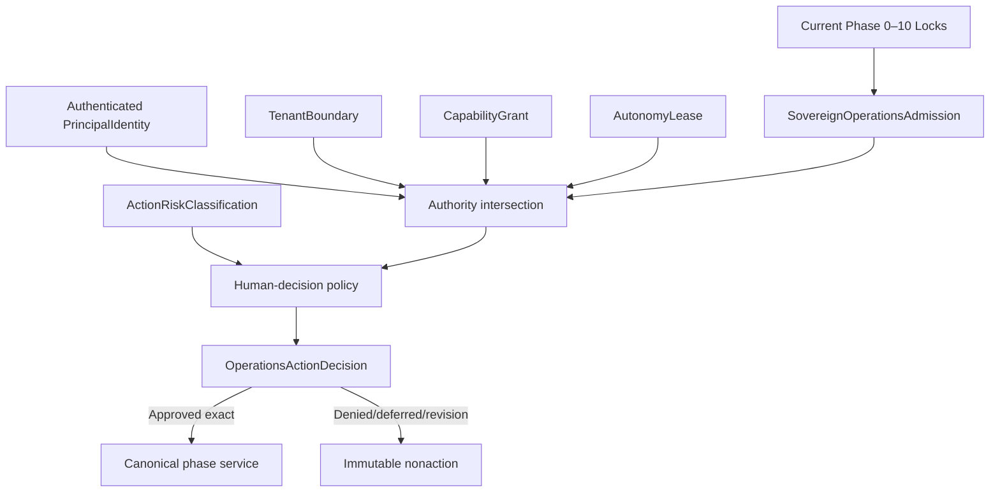

# Phase 11, Book 1 — Operations Contracts, Identity, and Authority

> **Purpose:** Admit exact Phase 0–10 scope and make identity, tenancy, capabilities, autonomy, and human decisions explicit before any continuous operation exists  
> **Input:** Verified `PortfolioLockManifest`, `SovereignOperationsHandoff`, all affected upstream Locks, and the Phase 11 deployment/tenant proposal  
> **Output:** `SovereignOperationsAdmission`, identity/RBAC/tenant contracts, `AutonomyPolicy`, `AutonomyLease`, and immutable human decision records  
> **Previous:** [Phase 10 — Portfolio Forge](../phase-10-portfolio-forge/README.md)  
> **Next:** [Book 2 — Command Center, Approvals, and Lineage](book-2-command-center-approvals-lineage.md)

---

## 1. Success Statement

Every human, agent, service, worker, scheduler, emergency controller, and external integration has a verified identity and exact least-privilege capability intersection; every autonomous action is covered by a short-lived lease; every required human approval or denial binds the exact request and evidence; and no room label, request field, model output, role name, configuration toggle, prior Lock, or deployed UI can manufacture authority.

---

## 2. Applicable Anchors

- **A0:** Human Strategic Authority
- **A1:** One Orchestration Spine
- **A2:** Evidence Before Narrative
- **A3:** Point-in-Time Data
- **A4:** StrategySpec Is Truth
- **A6:** Nautilus Is the Canonical Trading Model
- **A7:** OrderIntent Is the Execution Boundary
- **A8:** Promotion Is State-Based
- **A9:** Separate Research From Approval
- **A10:** Observable and Reconstructable
- **A11:** Repair Before Expansion
- **A12:** Cheap Models Use Tools, Not Memory
- **A14:** No Unofficial Production Broker Dependency
- **A15:** Live Autonomy Is Earned
- **F10:** A qualified strategy earns eligibility, not unlimited capital
- **F11:** Autonomy is valid only while control, evidence, and reconstruction remain intact

---

## 3. Identity and Authority Topology



---

## 4. Work Packages

### 4.1 Sovereign Operations admission

Admission verifies:

- exact identities and hashes of all affected Phase 0–10 Locks;
- Phase 10 certified/blocked strategy, asset, account, venue, and environment cells;
- absence of standing production capital, allocations, permits, routes, or autonomy;
- requested deployment and tenancy profile;
- OCE source/dependency/runtime identity;
- identity-provider, session, service-account, and emergency-channel design;
- action-risk, role, capability, autonomy, approval, denial, and separation policies;
- secret inventory/rotation owner without secret values in the artifact;
- storage, queue, artifact, network, backup, restore, and rollback dependencies;
- independent reviewer and human strategic owner;
- every unresolved blocker, limitation, incident, and unknown state.

```yaml
sovereign_operations_admission_id: content-id
phase_lock_refs:
  phase_0_through_9: []
  portfolio_lock_ref: artifact-ref
sovereign_operations_handoff_ref: artifact-ref
requested_operating_scope: {}
requested_deployment_profile: local_single_operator|local_distributed_workers|remote_shadow_control_plane|hybrid_private_execution|distributed_multi_tenant
requested_tenant_mode: single_operator|multi_tenant
requested_environments: []
identity_and_session_policy_ref: policy-ref
role_and_capability_policy_ref: policy-ref
autonomy_and_approval_policy_ref: policy-ref
security_and_secret_remediation_ref: artifact-ref
storage_queue_and_recovery_dependencies: {}
known_blockers_and_limitations: []
review_policy_ref: policy-ref
status: proposed|admitted|rejected|blocked|quarantined
approvals: []
```

Admission creates no user, role, capability, autonomy lease, capital, account activation, permit, route, or deployment.

### 4.2 PrincipalIdentity

```yaml
principal_identity_id: immutable-id
principal_type: human|agent|service|worker|scheduler|emergency_controller|external_integration
subject_id: provider-stable-pseudonymous-id
identity_provider_ref: artifact-ref
authentication_strength: typed-level
tenant_boundary_ref: artifact-ref
human_owner_ref: optional-artifact-ref
service_workload_identity_ref: optional-artifact-ref
allowed_session_classes: []
status: active|suspended|revoked|expired|quarantined
created_at: timestamp
expires_at: optional-timestamp
revocation_refs: []
```

Rules:

- `sender`, `actor`, `mad`, `admin`, `agent_id`, room membership, display name, email text, model claim, and API payload fields are not authentication;
- a human and an agent controlled by that human remain separate principals;
- every service/worker uses its own workload identity;
- shared credentials are forbidden in certified distributed profiles;
- identity lookup is tenant-scoped and immutable in audit history;
- pseudonymous IDs appear in ordinary artifacts; direct contact details remain outside agent/model payloads.

### 4.3 AuthenticationSession

```yaml
authentication_session_id: opaque-id
principal_identity_ref: artifact-ref
tenant_boundary_ref: artifact-ref
session_class: interactive|service|worker|scheduler|emergency
authentication_factors: []
issued_at: timestamp
last_reauthenticated_at: timestamp
expires_at: timestamp
network_and_device_context_hash: content-hash
csrf_or_replay_protection_ref: artifact-ref
revocation_state: active|revoked|expired|compromised
```

Interactive and service sessions have separate lifetime, rotation, and reauthentication rules. A WebSocket, background job, or reconnect must reprove session validity and resume from an acknowledged cursor.

### 4.4 TenantBoundary

```yaml
tenant_boundary_id: immutable-id
mode: single_operator|multi_tenant
tenant_id: stable-pseudonymous-id
owner_principal_ref: artifact-ref
allowed_identity_provider_refs: []
data_namespace: typed-namespace
memory_namespace: typed-namespace
queue_namespace: typed-namespace
artifact_namespace: typed-namespace
log_metric_and_trace_namespace: typed-namespace
secret_namespace: typed-namespace
model_and_provider_policy_ref: policy-ref
trading_account_binding_refs: []
cross_tenant_operations: prohibited
status: active|suspended|revoked
```

`single_operator` is still a tenant boundary: it prevents accidental future mixing and makes migration explicit. `multi_tenant` remains blocked until Book 4 isolation certification passes.

### 4.5 RoleDefinition

Roles group responsibilities but do not directly authorize:

```yaml
role_definition_id: content-id
role_name: operator|researcher|reviewer|risk_approver|deployment_admin|security_admin|incident_commander|auditor|read_only
tenant_boundary_ref: artifact-ref
responsibility_description: string
eligible_principal_types: []
incompatible_role_refs: []
maximum_action_risk_class: typed-class
required_training_or_attestation_refs: []
valid_from: timestamp
expires_at: optional-timestamp
```

An `admin`, `owner`, or `MAD` display name has no meaning unless a verified principal holds exact capability grants.

### 4.6 CapabilityGrant

```yaml
capability_grant_id: immutable-id
principal_identity_ref: artifact-ref
role_definition_refs: []
tenant_boundary_ref: artifact-ref
allowed_actions: []
allowed_resource_refs_or_patterns: []
allowed_phase_service_refs: []
allowed_environments: []
maximum_action_risk_class: typed-class
model_provider_and_data_scope: {}
operational_and_api_cost_bounds: {}
may_delegate: false
not_before: timestamp
expires_at: timestamp
issued_by_principal_ref: artifact-ref
human_approval_refs: []
revocation_state: active|revoked|expired
```

A capability:

- is deny-by-default;
- does not imply every action associated with a role;
- does not transitively inherit another capability;
- cannot create trading capital, account permission, Phase 10 envelope, or Phase 9 permit;
- cannot be broadened by wildcard, fallback, tenant omission, or configuration;
- is reverified at execution time, not only when the request entered a queue.

### 4.7 Authority intersection

```text
EffectiveCapability =
    PrincipalIdentity
    INTERSECT AuthenticationSession
    INTERSECT TenantBoundary
    INTERSECT ActiveCapabilityGrants
    INTERSECT ActionRiskClassification
    INTERSECT AutonomyLease
    INTERSECT RequiredHumanDecision
    INTERSECT UpstreamLockScope
    INTERSECT WorkflowState
    INTERSECT Environment
    INTERSECT OperationalAndCostBudgets
    INTERSECT IncidentDriftAndKillState
```

An empty or indeterminate intersection denies.

### 4.8 ActionRiskClassification

```yaml
action_risk_classification_id: content-id
action_type: typed-action
target_phase_and_service: typed-target
resource_and_tenant_scope: {}
external_side_effect: none|reversible_internal|external_nontrading|capital_affecting|broker_affecting|security_or_authority_mutation|emergency_containment
reversibility: reversible|compensatable|irreversible|indeterminate
maximum_blast_radius: {}
required_autonomy_level: typed-level
required_human_roles: []
required_approval_count: integer
separation_of_duties_policy_ref: policy-ref
required_kill_and_rollback_paths: []
classification_policy_ref: policy-ref
```

Classification is deterministic and frozen. Models may recommend a class but cannot set or lower it.

### 4.9 AutonomyPolicy

The policy maps exact action classes to:

- maximum autonomy level;
- eligible principal/service types;
- required capabilities and current Locks;
- human-approval and separation rules;
- tenant, environment, provider, data, account, asset, and cost scope;
- preconditions, freshness, SLO, drift, incident, and kill state;
- maximum concurrency, retries, duration, and blast radius;
- evidence and observability requirements;
- pause, compensation, rollback, and recovery paths.

No policy includes an unrestricted level.

### 4.10 AutonomyLease

```yaml
autonomy_lease_id: immutable-id
principal_identity_ref: artifact-ref
tenant_boundary_ref: artifact-ref
capability_grant_refs: []
autonomy_policy_ref: policy-ref
maximum_level: L0_OBSERVE|L1_PROPOSE|L2_REVERSIBLE_OPERATE|L3_GOVERNED_WORKFLOW|L4_BOUNDED_PRODUCTION
allowed_action_classes: []
allowed_phase_and_resource_scope: {}
allowed_environments: []
operational_and_api_cost_bounds: {}
maximum_concurrency_retries_and_duration: {}
required_human_decision_policy_ref: policy-ref
upstream_lock_refs: []
not_before: timestamp
expires_at: timestamp
revocation_state: active|revoked|expired
issued_by_principal_ref: artifact-ref
approval_refs: []
```

Rules:

- every lease expires and is checked at action start and before every material side effect;
- queued work does not preserve an expired lease;
- renewal is a new decision, not an extension by heartbeat;
- a lease cannot delegate, broaden, or create its underlying capability;
- Book 5 certification contains no live `L4_BOUNDED_PRODUCTION` lease.

### 4.11 HumanApprovalRequest

```yaml
human_approval_request_id: content-id
operations_action_request_ref: artifact-ref
request_hash: content-hash
principal_identity_ref: artifact-ref
tenant_boundary_ref: artifact-ref
action_risk_classification_ref: artifact-ref
exact_action_and_resource_scope: {}
upstream_lock_and_evidence_refs: []
evidence_cursor: cursor
expected_effects_and_failure_modes: []
cost_cap: {}
rollback_and_kill_refs: []
required_approver_roles: []
required_independent_approvals: integer
created_at: timestamp
expires_at: timestamp
status: pending|approved|denied|deferred|expired|superseded|quarantined
```

The request cannot be edited. Material revision creates a new identity and invalidates collected approvals.

### 4.12 HumanDecisionRecord

```yaml
human_decision_record_id: immutable-id
human_approval_request_ref: artifact-ref
request_hash: content-hash
approver_principal_ref: artifact-ref
approver_session_ref: artifact-ref
approver_role_and_capability_refs: []
decision: approve|deny|defer|request_revision
reason_code: typed-reason
comment_ref: optional-artifact-ref
decided_at: timestamp
valid_until: timestamp
decision_signature_or_attestation_ref: artifact-ref
```

Decision rules:

- the approver must be authenticated at decision time;
- principal, role, capability, tenant, evidence, and request hash must match;
- duplicate approval by one principal counts once;
- required independent roles cannot collapse into one identity;
- denial closes the exact request;
- deferral states the missing evidence or future condition;
- approval expires and is single-request, not reusable permission.

### 4.13 Separation of duties

At minimum:

- agent/model proposer cannot approve;
- strategy/research proposer cannot independently validate/promo-approve the same material change;
- deployment author cannot be sole production/deployment approver;
- capability-grant requester cannot grant itself;
- security-secret remediator cannot be sole verifier;
- incident actor cannot be sole critical recovery approver;
- capital/trading grants remain external to Phase 11;
- audit reviewer is read-only for reviewed records.

Local single-operator mode may require one human to wear multiple responsibility roles, but the system must preserve explicit sequential attestations, strong reauthentication, delay/second-channel requirements for critical actions, and visible reduced separation. It cannot pretend one click is independent dual control.

### 4.14 Denial, expiry, revocation, and queue races

- A denied request cannot be retried unchanged under a new ID to evade the denial.
- A revised request links the denial and explains the material change.
- Expired approval, capability, session, Lock, or lease denies at side-effect time.
- Revocation races serialize against the action ledger.
- A queued request is reauthorized after dequeue.
- Partial effects enter compensation/incident flow; they are not labeled denied-with-no-effect.
- Unknown authorization state quarantines.

### 4.15 Emergency identities

Emergency controls use:

- dedicated strongly authenticated principals;
- minimal actions: block new, latch kill, revoke leases, request cancel/reduce/close, isolate service;
- an independent path from ordinary UI/model/worker operation;
- tamper-evident audit;
- no ability to create capital, broaden scope, clear a kill, delete evidence, or self-approve recovery.

### 4.16 Configuration boundary

Environment variables/configuration may locate identity providers, databases, queues, artifact stores, and secret references. They cannot:

- authenticate a caller by string;
- assign a role or capability;
- set an autonomy level or bypass;
- auto-approve a human decision;
- disable separation of duties;
- create a tenant/account binding;
- turn shadow into production;
- clear a kill/incident/drift latch;
- restore expired authority;
- expose secret values to logs or clients.

Values such as `ADMIN=true`, `AUTONOMY=MAX`, `LIVE=true`, `APPROVED=true`, or `KILL=false` are never authority.

### 4.17 Contract versioning and migrations

Every authority contract has:

- semantic version, schema hash, and canonical serialization;
- unknown-field/enum policy;
- timestamp, duration, identity, tenant, and resource rules;
- compatibility matrix and migration;
- retained original bytes and migration evidence;
- exact invalidation scope;
- golden fixtures across supported runtimes.

Lossy or authority-broadening migrations fail closed.

---

## 5. Target Layout

```text
sovereign_operations/
  contracts/
    admission.py
    identity.py
    sessions.py
    tenants.py
    roles.py
    capabilities.py
    risk_classification.py
    autonomy.py
    approvals.py
  authority/
    authenticator.py
    authorizer.py
    intersection.py
    lease_verifier.py
    separation_of_duties.py
    revocation.py
  security/
    csrf_replay.py
    workload_identity.py
    emergency_identity.py
    config_guard.py
  migrations/
```

---

## 6. Deliverables

- Phase 10-to-11 admission adapter and blocker registry.
- Immutable `SovereignOperationsAdmission`.
- Authenticated `PrincipalIdentity` and `AuthenticationSession`.
- Certified single-operator/multi-tenant `TenantBoundary`.
- Immutable `RoleDefinition`.
- Exact least-privilege `CapabilityGrant`.
- Deterministic `ActionRiskClassification`.
- Frozen `AutonomyPolicy`.
- Expiring and revocable `AutonomyLease`.
- Immutable `HumanApprovalRequest`.
- Authenticated `HumanDecisionRecord`.
- Separation-of-duties matrix.
- Denial, expiry, revocation, and queue-race protocol.
- Emergency-identity contract.
- Configuration/authority guard.
- Versioned schemas, migrations, canonical serialization, and golden fixtures.

---

## 7. Required Tests

### P11-ADM-001 — Exact Lock Admission

Valid current Phase 0–10 Locks, the nonauthorizing handoff, exact deployment/tenant scope, blockers, and reviewers create one admitted record.

### P11-ADM-002 — Invalid Upstream Lock

Missing, failed, expired, hash-mismatched, or invalidated affected Lock blocks admission.

### P11-ADM-003 — Hidden Blocked Scope

Any strategy, adapter, account, venue, asset, tenant, or limitation omitted from the handoff blocks admission.

### P11-ADM-004 — Implicit Live Authority

Admission input containing standing capital, allocation, permit, route, account activation, or autonomy is rejected.

### P11-ADM-005 — Deployment Profile Exactness

Admission binds exact storage, queue, network, secret, runtime, tenant, and recovery guarantees.

### P11-ADM-006 — Unresolved Security Finding

Unowned embedded-secret, authentication, critical dependency, or remote-exposure finding blocks affected deployment.

### P11-ADM-007 — Documentation/Runtime Drift

Contradictory source, manifest, dependency, or maturity claims remain blockers until reconciled.

### P11-ADM-008 — Idempotent Admission

Identical inputs create one admission; material change creates a new identity and invalidates affected review.

### P11-IDN-001 — Request Actor Is Not Identity

Changing `sender`, `actor`, `mad`, `admin`, agent label, or display name never changes authenticated principal.

### P11-IDN-002 — Principal-Type Separation

Human, agent, service, worker, scheduler, emergency, and external identities cannot substitute for one another.

### P11-IDN-003 — Stable Provider Subject

Display-name or email change does not change stable principal identity or audit lineage.

### P11-IDN-004 — Unknown Identity

Unknown, ambiguous, disabled, expired, or revoked identity denies every nonpublic operation.

### P11-IDN-005 — Agent Human Impersonation

An agent claiming to speak for MAD cannot exercise a human-only capability.

### P11-IDN-006 — Shared Service Credential

Shared worker/service credentials block distributed-profile certification.

### P11-IDN-007 — Identity Tenant Binding

A valid identity from another tenant cannot cross the target tenant boundary.

### P11-IDN-008 — Identity Audit Immutability

Identity deactivation preserves historical principal references and decisions.

### P11-IDN-009 — Pseudonymous Artifacts

Ordinary artifacts use stable pseudonymous references and exclude direct contact identifiers.

### P11-IDN-010 — Emergency Principal Separation

Emergency identity cannot inherit normal operator, security-admin, capital, or deployment actions.

### P11-IDN-011 — Identity Provider Outage

Cached identity cannot create new high-risk actions when provider validity is indeterminate.

### P11-IDN-012 — Authentication Strength

Action risk above the configured threshold requires declared stronger authentication and reauthentication.

### P11-RBAC-001 — Role Is Not Capability

Possessing a role name without exact active grants authorizes nothing.

### P11-RBAC-002 — Deny by Default

An action absent from all active grants is denied.

### P11-RBAC-003 — Role/Principal Compatibility

A service or agent cannot receive a human-only role.

### P11-RBAC-004 — Incompatible Roles

Configured incompatible proposer/approver or operator/auditor roles cannot be active in the prohibited combination.

### P11-RBAC-005 — Maximum Risk Class

A role cannot operate above its declared maximum risk class.

### P11-RBAC-006 — Role Expiry

Expired role eligibility removes derived capability at the next check.

### P11-RBAC-007 — Wildcard Rejection

Unbounded action, resource, tenant, environment, or service wildcard blocks a certified grant.

### P11-RBAC-008 — Cross-Environment Isolation

Fixture/shadow capabilities cannot be used in production.

### P11-RBAC-009 — Phase Ownership

An operations role cannot perform the canonical decision owned by another FORGE phase.

### P11-RBAC-010 — Read-Only Integrity

Read-only/auditor roles cannot mutate state through alternate API, WebSocket, queue, or replay paths.

### P11-RBAC-011 — Role Update Invalidation

Material role-definition change invalidates affected grants, leases, sessions, and pending approvals.

### P11-RBAC-012 — Role Enumeration Privacy

A principal can enumerate only role metadata permitted within its tenant and responsibility.

### P11-TEN-001 — Single-Operator Is Explicit

Local single-operator mode still emits an exact tenant boundary and namespace.

### P11-TEN-002 — Tenant Required

Missing tenant identity denies every protected artifact, memory, queue, action, and secret request.

### P11-TEN-003 — Tenant Binding Immutable

An artifact/action cannot be moved to another tenant by request mutation.

### P11-TEN-004 — Account Binding

Trading account refs cannot cross the tenant boundary or infer a tenant from account text.

### P11-TEN-005 — Tenant Mode Upgrade

Changing single-operator to multi-tenant requires new admission and Book 4 certification.

### P11-TEN-006 — Tenant Suspension

Suspension blocks new work while preserving state, evidence, and open-exposure management.

### P11-TEN-007 — Cross-Tenant Operation Prohibited

No ordinary role, agent, worker, schedule, model, or admin action may operate across tenants.

### P11-TEN-008 — Tenant Deletion Safety

Deletion cannot erase regulated/audit evidence or unmanaged trading exposure.

### P11-TEN-009 — Tenant Backup Scope

Backup and restore preserve tenant namespace and cannot merge identities.

### P11-TEN-010 — Tenant Metrics Privacy

Metrics and traces cannot disclose another tenant's strategy, account, prompts, costs, or actions.

### P11-CAP-001 — Exact Least Privilege

Capability allows only the declared action, phase service, resource, tenant, environment, risk class, and time.

### P11-CAP-002 — Capability Cannot Create Capability

Grant use cannot issue, renew, delegate, or broaden another grant unless an exact human-governed grant-management capability exists.

### P11-CAP-003 — No Transitive Privilege

Calling an allowed service cannot inherit that service's unrelated capabilities.

### P11-CAP-004 — Execution-Time Recheck

Capability is reverified immediately before every material side effect.

### P11-CAP-005 — Revocation Race

Revocation serializes before a not-yet-committed side effect and records any partial effect.

### P11-CAP-006 — Expiry While Queued

Queued work with an expired grant is denied rather than grandfathered.

### P11-CAP-007 — Cost Bound

Capability cannot exceed declared compute, provider, or API-dollar bounds.

### P11-CAP-008 — Model/Data Scope

Capability cannot switch to an unapproved model, provider, source, region, or privacy class.

### P11-CAP-009 — Phase 10 Boundary

No Phase 11 capability can create capital authority, envelope, reservation, or standing allocation.

### P11-CAP-010 — Phase 9 Boundary

No Phase 11 capability can create or reuse an `ExecutionPermit` or bypass adapter certification.

### P11-CAP-011 — Config Cannot Grant

Environment/configuration values cannot create or widen a capability.

### P11-CAP-012 — Capability Audit Replay

Grant issue, use, denial, expiry, and revocation replay to the same effective authority.

### P11-AUT-001 — Action-Scoped Lease

Autonomy lease binds exact principal, tenant, action class, phase/resource, environment, Locks, budget, and time.

### P11-AUT-002 — No Unrestricted Level

Unknown, numerically higher, wildcard, `MAX`, or unrestricted autonomy level is rejected.

### P11-AUT-003 — Level Monotonicity

A lower level cannot perform an action classified for a higher level.

### P11-AUT-004 — Level Does Not Override Capability

An `L4_BOUNDED_PRODUCTION` lease without the exact capability authorizes nothing.

### P11-AUT-005 — Lease Expiry

Expired lease blocks queued and new material effects even when the process remains alive.

### P11-AUT-006 — Lease Revocation

Revocation blocks new actions and preserves causal evidence and open-work containment.

### P11-AUT-007 — No Heartbeat Renewal

Process/agent heartbeat cannot renew or extend autonomy.

### P11-AUT-008 — No Self-Issuance

Agent, model, scheduler, service, or lease holder cannot issue or approve its own lease.

### P11-AUT-009 — Action-Class Escalation

An operation becoming less reversible or more externally consequential requires reclassification and a new decision.

### P11-AUT-010 — Incident/Drift Intersection

Active blocking incident, kill, drift, or stale evidence reduces effective autonomy before new work.

### P11-AUT-011 — Model Outage

Model outage cannot increase autonomy or bypass required judgment/approval.

### P11-AUT-012 — Lease Renewal

Renewal creates a new immutable lease after current evidence and authority review.

### P11-AUT-013 — Production Certification Absence

Phase 11 certification artifacts contain no active production `L4` lease.

### P11-AUT-014 — Scope Expansion

New strategy, asset, account, tenant, provider, model, or deployment scope returns through admission and affected FORGE phases.

### P11-AUT-015 — Deterministic Authorization

Same authenticated inputs, policies, Locks, and state produce the same authority result without LLM participation.

### P11-APR-001 — Exact Hash-Bound Approval

Human approval binds exact request hash, action, resource, tenant, evidence cursor, actor, and expiry.

### P11-APR-002 — Authenticated Approver

Caller-supplied approver fields cannot satisfy approval.

### P11-APR-003 — Approver Capability

An authenticated human without the required active approver capability cannot decide.

### P11-APR-004 — Separation of Duties

Proposer identity cannot satisfy an independent approval requirement.

### P11-APR-005 — Duplicate Approver

Repeated approval by one principal counts once.

### P11-APR-006 — Material Revision

Changed action, scope, evidence, cost, risk class, rollback, or expiry invalidates prior approvals.

### P11-APR-007 — Approval Expiry

Expired approval cannot authorize a later queue dequeue or side effect.

### P11-APR-008 — Denial Is Terminal

Denied exact request cannot execute or be resubmitted unchanged under another ID.

### P11-APR-009 — Denial Revision Lineage

A revised request links the denial and identifies the material correction.

### P11-APR-010 — Deferral Condition

Deferred request remains inactive until the exact recorded state/evidence condition becomes true and is rechecked.

### P11-APR-011 — Request Revision Outcome

Human `request_revision` creates no edited action or partial approval.

### P11-APR-012 — Approval Is Not Phase Decision

Human operational approval cannot substitute for Strategy, Validation, Simulation, Portfolio, or Execution decisions.

### P11-APR-013 — Decision Privacy

Approval artifacts exclude secrets and unnecessary direct personal identifiers.

### P11-APR-014 — Concurrent Decision Race

Approve/deny/revoke/expire races serialize to one effective result with full event lineage.

### P11-APR-015 — Human Decision Replay

Replay reproduces decision validity, separation checks, expiry, and resulting non/action.

### P11-SES-001 — Session Expiry

Expired interactive, service, worker, scheduler, or emergency session denies protected requests.

### P11-SES-002 — Session Revocation

Revoked session disconnects authenticated streams and blocks queued side effects.

### P11-SES-003 — WebSocket Authentication

WebSocket connect and cursor resume require current session and tenant proof.

### P11-SES-004 — Replay/CSRF Protection

Captured interactive request cannot be replayed to duplicate or alter an effect.

### P11-SES-005 — Service Rotation

Workload credential rotation preserves service identity lineage and invalidates old sessions.

### P11-SES-006 — Network/Device Change

Material session-context change triggers policy-defined reauthentication before high-risk action.

### P11-SES-007 — Secret Redaction

Sessions, tokens, factors, and credential values never enter logs, traces, prompts, artifacts, or client errors.

### P11-SES-008 — Configuration Is Not Session

Static environment/API-key presence cannot authenticate an interactive human or satisfy an approval.

---

## 8. Failure Modes

- Command-center `sender="mad"` is accepted as human identity.
- An `admin` role implicitly gains every endpoint.
- One shared worker key spans agents and tenants.
- A WebSocket stays authorized after session or lease expiry.
- Agent room text is interpreted as a signed command.
- An agent approves its own strategy/deployment proposal.
- Approval survives an action, evidence, or cost change.
- Denied request is cloned with a new ID and executed.
- `AUTONOMY=MAX` creates a standing operating right.
- A production lease is embedded in the final Lock.
- OCE governance boundary strings replace FORGE authority.
- Configuration or model output creates a capability.

---

## 9. Exit Gate

Book 1 is complete only when exact Phase 0–10 scope admits, every principal/session/tenant resolves, roles and capabilities are deny-by-default and least-privilege, action risk is deterministic, autonomy is leased and expiring with no unrestricted level, human decisions are exact and separation-safe, denial/revocation races fail closed, emergency identities are minimal, and configuration or prototype endpoint conventions cannot create authority.

---

## 10. Handoff

Book 2 receives the admitted deployment/tenant scope, authenticated principal/session model, roles, capabilities, risk classifications, autonomy policies/leases, human approval and denial contracts, separation rules, current Lock/blocker registry, and every authority event needed to build nonauthoritative command-center projections and complete lineage.
