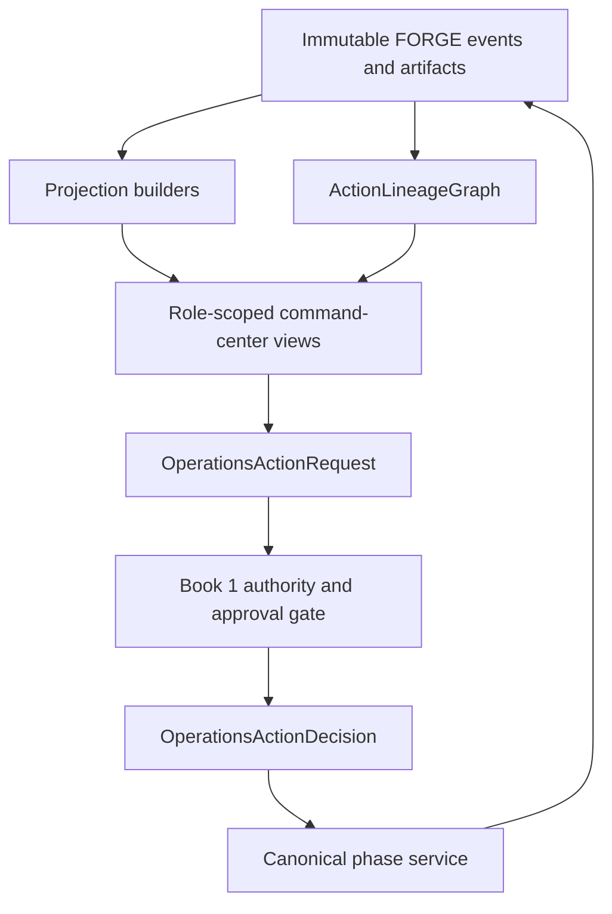

# Phase 11, Book 2 — Command Center, Approvals, and Lineage

> **Purpose:** Turn the complete FORGE system into one honest operator surface whose views are rebuildable, whose actions are typed, and whose final outcomes reconstruct to original evidence  
> **Input:** Book 1 admission, principals, tenants, capabilities, autonomy leases, human-decision contracts, and all current Phase 0–10 artifacts/events  
> **Output:** Cross-FORGE projections, action/approval queues, control views, `ActionLineageGraph`, and source-to-trade reconstruction  
> **Previous:** [Book 1 — Operations Contracts, Identity, and Authority](book-1-operations-contracts-identity-authority.md)  
> **Next:** [Book 3 — Lifecycle, Drift, Utility, and Cost](book-3-lifecycle-drift-utility-cost.md)

---

## 1. Success Statement

MAD can see the entire operating system from macro/news evidence through scanners, research, strategy build, validation, simulation, portfolio state, execution, incidents, costs, and retirement; every value declares freshness and scope; every button creates a typed request rather than direct authority; every approve/deny path is exact; and every final trade or nontrade reconstructs to the source evidence, policies, agents, human decisions, Locks, capital artifacts, permit, execution events, and reconciliation.

---

## 2. Applicable Anchors

- **A0:** Human Strategic Authority
- **A1:** One Orchestration Spine
- **A2:** Evidence Before Narrative
- **A3:** Point-in-Time Data
- **A4:** StrategySpec Is Truth
- **A5:** Fast Tests Reject; Canonical Tests Qualify
- **A7:** OrderIntent Is the Execution Boundary
- **A8:** Promotion Is State-Based
- **A9:** Separate Research From Approval
- **A10:** Observable and Reconstructable
- **A11:** Repair Before Expansion
- **A12:** Cheap Models Use Tools, Not Memory
- **A15:** Live Autonomy Is Earned
- **F11:** Autonomy is valid only while control, evidence, and reconstruction remain intact

---

## 3. Command-Center Topology



---

## 4. Work Packages

### 4.1 Projection rule

The UI never reads a convenient mutable object and calls it truth. Every view is derived from:

- immutable artifacts and event-log roots;
- exact environment, tenant, principal-view scope, and phase cell;
- point-in-time market/reference/account cursors;
- projection schema/code version;
- source completeness and reconciliation state;
- last successful build and bounded staleness;
- invalidation, incident, drift, kill, and blocked scope.

Projection rebuild must produce the same state from the same roots.

### 4.2 CommandCenterProjection

```yaml
command_center_projection_id: content-id
projection_type: typed-view
tenant_boundary_ref: artifact-ref
viewer_capability_scope_hash: content-hash
environment: typed-environment
source_event_roots: {}
source_artifact_refs: []
market_reference_and_account_cursors: {}
projection_builder_identity_and_version: {}
as_of_time: timestamp
valid_until: timestamp
freshness_state: fresh|aging|stale|unknown
completeness_state: complete|partial|blocked|unknown
reconciliation_state: matched|explainable|unexplained|not_applicable
blocking_and_invalidated_scope: []
projection_payload_ref: artifact-ref
projection_hash: content-hash
```

Unknown or stale data remains visibly unknown/stale. The UI cannot replace it with zero, flat, healthy, no-news, no-position, or no-incident.

### 4.3 View registry

The command center has bounded role-scoped views:

| View | Required truth |
|---|---|
| System | Deployments, dependencies, cursors, SLOs, incidents, kills, drift, security, costs |
| Macro/news | Source, publication/effective time, event/catalyst, revisions, entities, sectors/themes, confidence, contradiction |
| Scanner | Universe/version, deterministic filters, candidates, rejects, point-in-time fields, capacity |
| Research | Questions, user guidelines, evidence graph, claims, counterevidence, unresolved facts, candidate play |
| Strategy | `StrategySpec`, code/build hash, parameters, owner, exact qualified scope, blockers |
| Validation | datasets, folds, costs, robustness, uncertainty, rejected cells, Lock/expiry |
| Simulation | joint scenarios, execution realism, incidents, shadow comparison, promotion state |
| Execution | intent, pre-trade, permit, adapter/account/venue, order lifecycle, uncertainty, reconciliation |
| Portfolio | capital authority class, envelopes/reservations, ownership, exposure, conflicts, limits, drawdown |
| Approvals | pending/approved/denied/deferred/expired requests and separation requirements |
| Lifecycle | active runs, jobs, phase states, drift/decay, pause/rollback/retirement |
| Incidents | severity, scope, evidence, controls, owner, residual exposure, recovery gates |
| Audit/lineage | source-to-action graph, actor/capability/approval, transformations, outcomes |

Every view offers drill-down to canonical artifacts, not prose-only summaries.

### 4.4 OperationsActionRequest

Requests may originate from:

- authenticated human UI;
- frozen schedule;
- deterministic monitor/trigger;
- bounded agent proposal;
- service event;
- incident/kill controller;
- recovery workflow.

```yaml
operations_action_request_id: content-id
source_principal_or_service_ref: artifact-ref
source_session_or_workload_identity_ref: artifact-ref
tenant_boundary_ref: artifact-ref
source_type: human_ui|schedule|monitor|agent|service|incident|recovery
requested_action: typed-action
target_phase_service_and_resource: {}
input_artifact_refs: []
input_event_roots: {}
input_cursors: {}
requested_environment: typed-environment
requested_autonomy_level: typed-level
expected_effects: []
known_failure_and_compensation_paths: []
requested_operational_and_api_budget: {}
idempotency_key: opaque-string
created_at: timestamp
valid_until: timestamp
request_hash: content-hash
```

The request contains no raw secret, unverified actor name, browser-derived authority, provider payload capable of bypassing canonical adapters, or mutable embedded phase artifact.

### 4.5 OperationsActionDecision

```yaml
operations_action_decision_id: content-id
operations_action_request_ref: artifact-ref
request_hash: content-hash
authority_input_refs: []
upstream_lock_refs: []
workflow_and_projection_state_refs: []
action_risk_classification_ref: artifact-ref
rule_results: []
human_decision_refs: []
result: approve_exact|deny|defer_until_state|require_human_decision|require_new_request_revision|quarantine
approved_exact_action_scope: {}
reason_codes: []
decided_at: timestamp
valid_until: timestamp
decision_hash: content-hash
```

Approval creates permission to invoke one exact canonical phase operation. It does not guarantee that the phase operation passes.

### 4.6 Human approval queue

The queue is a projection over immutable requests and decisions. Each card shows:

- exact requested action and risk class;
- proposer principal and source;
- tenant/environment/scope;
- current upstream Locks and evidence cursor;
- expected effects, costs, failure modes, rollback, and kill path;
- required approver roles and unmet separation;
- timeout/expiry;
- contradictions, blockers, unknowns, and changed-since-proposal diff;
- approve, deny, defer, or request-revision controls.

No bulk approval is allowed across materially different actions. Approval buttons reauthenticate and submit an exact decision; they do not mutate queue state directly.

### 4.7 Denial and revision UX

Denial:

- is first-class and visible throughout lineage;
- records a typed reason without requiring sensitive free text;
- closes the exact request;
- prevents unchanged clone/retry;
- may create a separately authorized remediation task;
- never becomes a negative model-training label without privacy/quality policy.

Revision creates a new request and shows the exact diff.

### 4.8 Cross-FORGE status vocabulary

Use a common status envelope:

```yaml
status_envelope:
  object_ref: artifact-ref
  phase: integer
  cell_scope: {}
  environment: typed-environment
  state: proposed|running|passed|failed|blocked|conditional|paused|killed|invalidated|expired|retired|unknown
  source_event_root: content-hash
  as_of_time: timestamp
  valid_until: timestamp
  blockers: []
  next_permitted_actions: []
  authority_required: []
```

The UI may translate labels visually but cannot average or collapse semantically different states.

### 4.9 ActionLineageGraph

```yaml
action_lineage_graph_id: content-id
tenant_boundary_ref: artifact-ref
root_source_refs: []
nodes:
  - node_id: content-id
    node_type: source|dataset|feature|candidate|research_claim|strategy_spec|build|validation|simulation|portfolio|intent|approval|permit|execution|reconciliation|incident|retirement
    artifact_ref: artifact-ref
    phase: integer
    environment: typed-environment
    event_time: timestamp
    knowledge_time: timestamp
edges:
  - edge_id: content-id
    parent_node_id: content-id
    child_node_id: content-id
    transformation_type: typed-transformation
    actor_or_service_ref: artifact-ref
    code_policy_and_model_refs: []
    input_cursor: cursor
graph_roots: []
graph_tips: []
completeness: complete|partial|blocked|unknown
missing_edges: []
graph_hash: content-hash
```

Edges are causal claims backed by artifacts. Timestamp proximity, matching ticker, or model narrative cannot infer an edge.

### 4.10 Final trade reconstruction

For every routed order/fill/position/PnL effect, reconstruct:

1. broker/venue execution and account reconciliation;
2. Phase 9 intent, pre-trade evidence, one-use permit, adapter, and lifecycle;
3. Phase 10 strategy ownership, conflict, allocation, envelope, reservation, exposure, and control state;
4. Simulation/Validation/Strategy Locks and exact qualified cells;
5. `StrategySpec`, build, source code, parameters, data, costs, and test evidence;
6. scanner candidate and deterministic screen version;
7. research questions, user-specific guidelines, claims, counterevidence, and cited sources;
8. macro/news/market event with publication/effective/knowledge time;
9. every human/agent/service identity, capability, lease, decision, and model/tool version;
10. later drift, incident, pause, rollback, retirement, and outcome.

A manually initiated trade is labeled external/manual and still reconciles; the system may not invent upstream research lineage.

### 4.11 Research-to-play presentation

The research view separates:

- sourced fact;
- extracted entity/theme/sector relation;
- deterministic scanner match;
- agent hypothesis;
- user-guideline evaluation;
- counterevidence;
- unresolved/contradictory evidence;
- candidate instrument/strategy;
- current market setup/entry idea;
- exact status: research only, spec proposed, qualified, portfolio eligible, blocked, or externally executable.

An entry idea is not an order intent. A stock of interest is not a portfolio allocation.

### 4.12 Event transport and cursoring

Every API/stream event includes:

- event ID and schema version;
- tenant/environment;
- authenticated producer/workload identity;
- sequence/cursor and causal parent;
- event time, ingestion time, and knowledge time;
- payload hash and classification;
- redaction policy;
- retry/idempotency identity.

WebSocket/SSE clients:

- authenticate and tenant-bind;
- validate schema;
- acknowledge cursors;
- resume without gaps/duplicates;
- use bounded exponential backoff with jitter;
- surface disconnected/stale state;
- quarantine malformed or cross-tenant events rather than silently dropping.

### 4.13 Commands and controls

Control surfaces include:

- block new workflow work;
- pause scanner/research/strategy/tenant/phase cell;
- revoke uncommitted autonomy lease;
- request Phase 10 throttle/suspension;
- request Phase 9 cancel/reduce/close;
- latch scoped/global kill;
- open incident;
- request rollback/retest/retirement;
- request recovery review.

Each control creates a typed request and shows pending, acknowledged, effective, failed, uncertain, and reconciled states separately.

### 4.14 Agent rooms and messaging

Rooms remain useful for:

- bounded collaboration;
- task/context handoff;
- evidence/request discussion;
- reviewer questions;
- incident coordination.

They are not:

- identity providers;
- authoritative queues;
- approval stores;
- phase state machines;
- secret channels;
- execution transports.

Messages link to typed artifacts. Any command-like text must be parsed into a proposed request, validated, shown back, and separately authorized.

### 4.15 Observability and operator cognition

Expose:

- health of source dependencies, not just process heartbeats;
- event lag and projection freshness;
- request/decision/approval queue latency;
- model/tool/job latency, failure, abstention, and cost;
- cross-phase blockers and invalidation;
- active incidents/kills and residual exposure;
- reconciliation state and unknowns;
- audit/lineage completeness;
- resource and storage growth.

Alerting is deduplicated, severity-ranked, role-routed, and linked to an exact remediation/control path. The system must minimize alert fatigue without hiding repeated root causes.

### 4.16 Accessibility and resilient UI behavior

The operator surface:

- supports keyboard and readable status semantics;
- never encodes critical state only by color;
- confirms irreversible/high-risk requests with exact scope;
- renders partial/stale data honestly;
- prevents double-submit;
- remains usable in narrow/low-bandwidth/local contexts;
- provides a read-only degraded view when mutation APIs are unavailable;
- redacts secrets and direct sensitive identifiers.

---

## 5. Target Layout

```text
sovereign_operations/
  command_center/
    projections/
      builder.py
      registry.py
      freshness.py
      reconciliation.py
    actions/
      request.py
      decision.py
      idempotency.py
    approvals/
      queue.py
      diff.py
      decisions.py
    lineage/
      graph.py
      builder.py
      final_trade.py
      completeness.py
    transport/
      api.py
      events.py
      cursor.py
      websocket.py
    controls/
      requests.py
      state.py
    ui/
      system/
      macro-news/
      scanner/
      research/
      strategy/
      validation/
      simulation/
      execution/
      portfolio/
      approvals/
      lifecycle/
      incidents/
      audit/
```

---

## 6. Deliverables

- Deterministic `CommandCenterProjection` builder and registry.
- Cross-FORGE view contracts and common status envelope.
- Immutable `OperationsActionRequest`.
- Deterministic `OperationsActionDecision`.
- Human approval/denial/defer/revision queue.
- Changed-since-proposal diff.
- Immutable `ActionLineageGraph`.
- Final trade/nontrade reconstruction.
- Macro/news-to-research-to-play evidence presentation.
- Authenticated event schema, cursor, replay, and stream protocol.
- Typed scoped/global control request surfaces.
- Agent-room/artifact linkage without command authority.
- Observability, freshness, reconciliation, and alert views.
- Accessible, secret-redacted, resilient UI behavior.

---

## 7. Required Tests

### P11-PRJ-001 — Deterministic Projection Rebuild

Same event roots, artifacts, cursors, builder version, tenant, and viewer scope produce the same projection/hash.

### P11-PRJ-002 — Projection Is Nonauthoritative

Editing browser/local/cache projection state cannot change canonical state or authority.

### P11-PRJ-003 — Stale State Visible

Expired freshness marks the view stale and blocks actions that require fresh state.

### P11-PRJ-004 — Unknown Is Not Zero

Missing source, price, position, incident, queue, or reconciliation data renders unknown rather than zero/flat/healthy.

### P11-PRJ-005 — Partial Projection

Partial source coverage lists exact missing components and cannot present complete status.

### P11-PRJ-006 — Reconciliation State

Unexplained material differences remain visible and block affected actions.

### P11-PRJ-007 — Tenant-Scoped Projection

Projection includes only artifacts/events permitted to the viewer inside one tenant.

### P11-PRJ-008 — Role-Scoped Detail

Read-only, research, risk, security, and deployment roles receive only permitted fields/actions.

### P11-PRJ-009 — Environment Separation

Fixture, rehearsal, shadow, recovery, and production views cannot merge unlabeled state.

### P11-PRJ-010 — Invalidation Propagation

Upstream invalidation updates every affected projection and removes invalid next actions.

### P11-PRJ-011 — Builder Change

Projection semantic change creates a new version and invalidates affected snapshots/tests.

### P11-PRJ-012 — Optimistic UI Rejection

Pending client state never becomes success until canonical events confirm and reconcile it.

### P11-CMD-001 — Backend Authority Is Mandatory

No UI/API/stream/queue route can bypass Book 1 identity, capability, lease, Lock, and approval checks.

### P11-CMD-002 — Typed Request Only

Button, keyboard shortcut, URL, chat command, or schedule creates one typed request rather than direct mutation.

### P11-CMD-003 — Idempotent Command

Double-click, retry, reconnect, and duplicate event produce one effective request/effect.

### P11-CMD-004 — Exact Target

Action binds exact phase service, resource, tenant, environment, and artifact inputs.

### P11-CMD-005 — Request Expiry

Expired command cannot execute after queue delay or reconnect.

### P11-CMD-006 — Changed State Before Action

Material cursor, Lock, capability, kill, cost, or target change forces redecision.

### P11-CMD-007 — Phase Service May Still Deny

Operational approval cannot force a canonical phase service to pass.

### P11-CMD-008 — No Embedded Provider Payload

Request cannot smuggle raw broker/provider action past canonical adapters.

### P11-CMD-009 — Action Risk Class

Every command resolves deterministic risk class before authority evaluation.

### P11-CMD-010 — Partial Effect

Partially applied action records exact effects and enters compensation/incident flow.

### P11-CMD-011 — Command Privacy

Requests exclude secrets and unnecessary direct personal/account identifiers.

### P11-CMD-012 — Command Replay

Replay reproduces request, decision, invocation, effect, denial, and terminal state.

### P11-QUE-001 — Complete Decision States

Approval queue preserves pending, approved, denied, deferred, expired, superseded, and quarantined states.

### P11-QUE-002 — Changed-Since-Proposal Diff

Material evidence, scope, risk, cost, or authority change appears before decision.

### P11-QUE-003 — No Bulk Material Approval

Materially different actions cannot share one approval.

### P11-QUE-004 — Approver Reauthentication

High-risk decision requires current strong approver session at submission.

### P11-QUE-005 — Separation Display

Queue shows proposer, prior approvers, required independent roles, and remaining approvals.

### P11-QUE-006 — Duplicate Decision

Duplicate submit produces one human decision record.

### P11-QUE-007 — Denial Persistence

Denied request remains visible and blocks unchanged clone/retry.

### P11-QUE-008 — Deferral Condition

Deferred card names exact missing state and cannot auto-approve when it appears.

### P11-QUE-009 — Expiry

Expired request/approval leaves the queue inactive and requires a new current request.

### P11-QUE-010 — Revision Diff

Revised request links the original decision and shows material changes.

### P11-QUE-011 — Queue Rebuild

Queue reconstructs from immutable requests/decisions rather than mutable card state.

### P11-QUE-012 — Approval Is Not Execution

Approved card shows canonical phase invocation pending/failed/denied separately from approval.

### P11-LIN-001 — Final Trade to Original Evidence

Every routed trade reconstructs through permit, portfolio, simulation, validation, strategy, research, scanner, and source evidence.

### P11-LIN-002 — Nontrade Lineage

Denied, deferred, expired, blocked, and no-trade decisions retain complete causal evidence.

### P11-LIN-003 — Human/Agent/Service Attribution

Every lineage edge names the authenticated actor/service and exact capability/lease/decision.

### P11-LIN-004 — Point-in-Time Lineage

Event, ingestion, knowledge, and decision times prevent future evidence from appearing causal.

### P11-LIN-005 — Transformation Identity

Each source-to-child edge records code, policy, model, tool, input cursor, and transformation type.

### P11-LIN-006 — No Ticker-Proximity Inference

Matching ticker, timestamp, room discussion, or model narrative cannot invent lineage.

### P11-LIN-007 — Manual/External Action

Manual broker activity remains external/unclaimed and is never assigned fictional strategy/research lineage.

### P11-LIN-008 — Graph Completeness

Missing required node/edge marks lineage partial/blocked and lists the gap.

### P11-LIN-009 — Cross-Tenant Graph Isolation

Lineage traversal cannot cross a tenant boundary.

### P11-LIN-010 — Graph Immutability

Later correction appends superseding evidence without rewriting original graph history.

### P11-LIN-011 — Phase Lock Drift

Changed upstream Lock invalidates affected graph tips and displayed qualification.

### P11-LIN-012 — Outcome Reconciliation

Execution, position, cash, fee, PnL, and retirement outcomes reconcile to lineage tips.

### P11-LIN-013 — Source Revision

Revised/retracted macro/news/source evidence creates explicit revision edges and affected invalidation.

### P11-LIN-014 — Model Version

Research/model result records exact provider/model/prompt/tool versions or is excluded from certified lineage.

### P11-LIN-015 — Lineage Replay

From roots and transformations, replay reproduces graph identities, decisions, and terminal result.

### P11-UIX-001 — Critical State Not Color-Only

Blocked, killed, stale, unknown, approved, and failed states remain distinguishable without color.

### P11-UIX-002 — Secret Redaction

No UI, toast, error, trace, URL, clipboard, or downloaded artifact reveals secret values.

### P11-UIX-003 — Direct Identifier Minimization

Views use pseudonymous references and reveal direct identity/account details only to exact permitted roles.

### P11-UIX-004 — Double-Submit Protection

UI disables/reconciles duplicate command submission without hiding backend idempotency.

### P11-UIX-005 — Irreversible Confirmation

High-risk request confirmation displays exact tenant, environment, target, effects, and expiry.

### P11-UIX-006 — Read-Only Degraded Mode

When mutation APIs fail, the UI remains visibly read-only and does not queue hidden browser actions.

### P11-UIX-007 — Low-Bandwidth Recovery

Cursor resume reconstructs state without assuming missed events succeeded.

### P11-UIX-008 — Accessible Approval

Approval/denial controls are keyboard accessible, labeled, and resistant to accidental activation.

### P11-UIX-009 — Partial Rendering

One failed view component cannot make unrelated state appear healthy or complete.

### P11-UIX-010 — Current Environment Banner

Every control view persistently displays tenant and environment.

### P11-UIX-011 — External Link Safety

Source/evidence links cannot inject commands, credentials, or cross-tenant navigation.

### P11-UIX-012 — Client Version Drift

Unsupported/stale client schema becomes read-only and prompts upgrade instead of guessing fields.

### P11-OBS-001 — Dependency Health

Health includes data, model, queue, state, artifact, identity, Phase 9/10, and reconciliation dependencies.

### P11-OBS-002 — Heartbeat Is Insufficient

A live process with stale evidence, failed queue, or broken kill path is unhealthy.

### P11-OBS-003 — Projection Lag

Event-to-projection lag is measured against declared SLO and visible by view.

### P11-OBS-004 — Approval Latency

Pending human decisions expose age/expiry without auto-escalating authority.

### P11-OBS-005 — Unknown Exposure Alert

Unknown/open/uncertain trading exposure produces critical actionable visibility.

### P11-OBS-006 — Alert Deduplication

Repeated symptom alerts group by root cause while preserving occurrence count/evidence.

### P11-OBS-007 — Role Routing

Alerts route only to authorized responsible roles and protect tenant/privacy boundaries.

### P11-OBS-008 — Control Acknowledgment

Requested, acknowledged, effective, failed, uncertain, and reconciled control states remain separate.

### P11-OBS-009 — Resource Growth

Queue, event, artifact, log, memory, and projection growth remain bounded and observable.

### P11-OBS-010 — Observability Replay

Metrics/alerts/traces link to immutable events and reproduce incident chronology.

### P11-EVT-001 — Authenticated Producer

Every protected event resolves a valid workload identity, tenant, and permitted event type.

### P11-EVT-002 — Schema Validation

Unknown/malformed event is quarantined and visible rather than silently dropped.

### P11-EVT-003 — Cursor Resume

Reconnect resumes from acknowledged cursor without loss or duplicate effect.

### P11-EVT-004 — Event Idempotency

Duplicate delivery creates one effective state transition.

### P11-EVT-005 — Causal Parent

Every derived event links its causal parent/root.

### P11-EVT-006 — Cross-Tenant Event

Producer cannot publish into another tenant namespace.

### P11-EVT-007 — Redaction Policy

Secret/sensitive fields are rejected or redacted before persistence and fanout.

### P11-EVT-008 — Bounded Backoff

Reconnect uses bounded exponential backoff/jitter and cannot create retry storms.

### P11-EVT-009 — Out-of-Order Event

Out-of-order delivery preserves event truth and rebuilds deterministic projection by cursor/causality.

### P11-EVT-010 — Transport Outage

Transport outage blocks new authority-dependent actions and surfaces stale state.

### P11-AGT-001 — Room Label Is Not Identity

Agent room participant/sender label cannot authenticate or authorize an action.

### P11-AGT-002 — Chat Is Not Command

Command-like message creates at most a proposed typed request requiring normal authority.

### P11-AGT-003 — No Secrets in Rooms

Room/DM content rejects or redacts secret-shaped material and points to approved secret references.

### P11-AGT-004 — Artifact-Linked Handoff

Agent handoff references exact artifacts/cursors rather than relying on prose memory.

### P11-AGT-005 — Stale Agent Status

Heartbeat age changes visible status but cannot prove task, evidence, or system health.

### P11-AGT-006 — Agent Capability Drift

Agent registry capability text cannot override canonical grants.

### P11-AGT-007 — Room Deletion

Deleting a collaboration room cannot erase audit, approval, action, or lineage evidence.

### P11-AGT-008 — Message Replay

Duplicate/replayed agent message cannot duplicate a request or side effect.

---

## 8. Failure Modes

- Dashboard cache is called canonical state.
- Green heartbeat hides stale reconciliation.
- UI button directly invokes broker/adapter code.
- Approval card mutates itself to approved.
- Bulk approval crosses tenants or action classes.
- Denied request disappears from the operator view.
- Agent room message acts as a signed command.
- Malformed WebSocket payload is silently ignored.
- Final trade links to a ticker-matched article with no causal edge.
- Manual broker position is assigned to the nearest strategy.
- Unknown value renders as zero/flat.
- Entry idea is displayed as an executable order.

---

## 9. Exit Gate

Book 2 is complete only when every command-center view deterministically rebuilds from immutable tenant-scoped evidence, stale/unknown/blocked truth stays visible, actions and human decisions remain typed and backend-authorized, approvals cannot substitute for phase decisions, transport is authenticated/replay-safe, coordination chat has no command authority, and every final trade/nontrade reconstructs completely to source, actors, policies, Locks, capital, permit, execution, and reconciliation.

---

## 10. Handoff

Book 3 receives authenticated action requests/decisions, current command-center projections, approval/denial events, the complete lineage graph, macro/news/scanner/research/strategy/validation/simulation/portfolio/execution states, event cursors, resource/SLO observations, and every blocker/unknown needed to run the governed idea-to-retirement lifecycle and detect drift, decay, model utility, and cost breaches.
