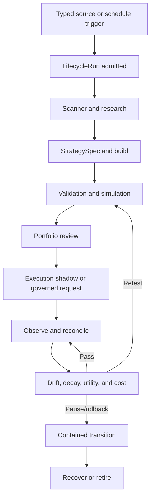

# Phase 11, Book 3 — Lifecycle, Drift, Utility, and Cost

> **Purpose:** Run the entire idea-to-retirement workflow continuously while automatically containing stale evidence, degraded models, invalid strategy scope, provider failure, and exhausted operational/API budgets  
> **Input:** Book 2 action/approval contracts, projections, lineage, current FORGE artifacts, event cursors, and Book 1 authority state  
> **Output:** Governed lifecycle controller, job/scheduler fabric, drift/decay reports, model-utility records, cost ledgers, and pause/rollback/retirement evidence  
> **Previous:** [Book 2 — Command Center, Approvals, and Lineage](book-2-command-center-approvals-lineage.md)  
> **Next:** [Book 4 — Incidents, Security, and Recovery](book-4-incidents-security-recovery.md)

---

## 1. Success Statement

OCE can continuously initiate and coordinate macro/news ingestion, deterministic scanning, guided agent research, strategy specification/build, backtest/validation, simulation, portfolio review, execution shadow or separately authorized production submission, reconciliation, monitoring, pause, rollback, recertification, and retirement; no scheduler or agent can skip a phase gate; material drift or decay blocks affected new risk; model/provider degradation reduces scope; and compute, API dollars, and trading capital remain separately bounded and reconstructable.

---

## 2. Applicable Anchors

- **A0:** Human Strategic Authority
- **A1:** One Orchestration Spine
- **A2:** Evidence Before Narrative
- **A3:** Point-in-Time Data
- **A4:** StrategySpec Is Truth
- **A5:** Fast Tests Reject; Canonical Tests Qualify
- **A6:** Nautilus Is the Canonical Trading Model
- **A7:** OrderIntent Is the Execution Boundary
- **A8:** Promotion Is State-Based
- **A9:** Separate Research From Approval
- **A10:** Observable and Reconstructable
- **A11:** Repair Before Expansion
- **A12:** Cheap Models Use Tools, Not Memory
- **A13:** Local-First Heavy Compute
- **A15:** Live Autonomy Is Earned
- **F11:** Autonomy is valid only while control, evidence, and reconstruction remain intact

---

## 3. Lifecycle Topology



---

## 4. Work Packages

### 4.1 Lifecycle scope

The lifecycle controller coordinates but does not replace:

- Phase 3 point-in-time data certification;
- Phase 4 intelligence evidence/claim contracts;
- Phase 5 broad scanner and candidate ranking;
- Phase 6 `StrategySpec` and build parity;
- Phase 7 validation/robustness qualification;
- Phase 8 joint simulation/promotion;
- Phase 9 intent/permit/execution lifecycle;
- Phase 10 portfolio eligibility/allocation/risk.

Each transition invokes the canonical phase service with exact artifacts and records its result. OCE cannot convert a failed result into a passed state.

### 4.2 LifecycleRun

```yaml
lifecycle_run_id: content-id
tenant_boundary_ref: artifact-ref
operations_admission_ref: artifact-ref
trigger_ref: artifact-ref
trigger_type: macro_news|market_event|schedule|scanner_change|human_request|drift|incident|recovery
root_source_and_cursor_refs: []
requested_goal_and_scope: {}
allowed_phase_path: []
workflow_definition_ref: artifact-ref
principal_capability_and_lease_refs: []
operational_and_api_budget_refs: []
current_state: typed-state
current_phase_and_cell: {}
job_refs: []
artifact_refs: []
blocking_and_invalidated_scope: []
started_at: timestamp
valid_until: timestamp
terminal_state: optional-typed-state
```

One run has one root trigger and causal graph. Related triggers may be deduplicated/clustered but preserve source identities.

### 4.3 Lifecycle state machine

```text
proposed
→ admitted
→ source_verified
→ scanning
→ research
→ strategy_spec_proposed
→ strategy_build
→ validation
→ simulation
→ portfolio_review
→ execution_shadow | governed_production_request
→ observing
→ paused | recertification_required | rollback_pending
→ recovered | retired
```

Every state also permits `blocked`, `denied`, `failed`, `quarantined`, `expired`, `killed`, and `invalidated`. There is no direct jump from news/research/scanner to executable trade.

### 4.4 LifecycleTransitionRecord

```yaml
lifecycle_transition_record_id: content-id
lifecycle_run_ref: artifact-ref
from_state: typed-state
to_state: typed-state
trigger_event_ref: artifact-ref
operations_action_decision_ref: artifact-ref
canonical_phase_result_ref: artifact-ref
input_artifact_refs: []
output_artifact_refs: []
upstream_lock_refs: []
principal_service_capability_and_lease_refs: []
policy_and_code_versions: {}
transition_time: timestamp
transition_hash: content-hash
```

Transitions are append-only, guarded, idempotent, and replayable.

### 4.5 Triggers and deduplication

Triggers may include:

- new/revised/retracted macro release or news;
- meaningful market regime/volatility/liquidity event;
- scheduled universe scan;
- data/reference/corporate-action update;
- strategy evidence expiry;
- validation/simulation/portfolio/execution drift;
- model/provider/runtime update;
- human request;
- incident/recovery action.

Trigger policy defines source trust, novelty, materiality, deduplication, cooldown, affected instruments/themes, maximum workflow fanout, and cost budget. A headline cannot directly spawn an order.

### 4.6 OperationsJob

```yaml
operations_job_id: content-id
lifecycle_run_ref: artifact-ref
job_type: typed-job
target_phase_service_ref: artifact-ref
input_artifact_refs: []
input_cursors: {}
tenant_and_environment: {}
principal_or_workload_identity_ref: artifact-ref
capability_and_autonomy_lease_refs: []
resource_class: control|light_model|data_io|heavy_research|backtest|simulation|external_api
resource_and_cost_reservation_refs: []
priority: typed-priority
timeout_retries_and_backoff: {}
idempotency_key: opaque-string
parent_and_dependency_job_refs: []
state: proposed|queued|running|succeeded|failed|cancelled|timed_out|uncertain|quarantined
created_at: timestamp
valid_until: timestamp
```

Jobs are small, independently retryable, and persist inputs/outputs. Exactly-once effects sit over at-least-once delivery.

### 4.7 Job graph and scheduler

The scheduler:

- uses a durable queue and leases;
- validates authority/evidence after dequeue;
- enforces dependency completion and exact phase path;
- separates control work from heavy/disposable compute;
- limits per-tenant, per-workflow, per-provider, per-model, and global concurrency;
- respects market calendars, source schedules, rate limits, quiet windows, and incidents;
- applies bounded jitter/backoff;
- prevents fanout storms;
- checkpoints long work;
- cancels/suspends descendants when roots invalidate;
- records queue, start, heartbeat, progress, completion, timeout, and uncertainty.

A heartbeat proves only liveness, not progress, correctness, or authority.

### 4.8 Agent work contract

Agents:

- receive exact role, question, input artifacts, tool/model policy, token/time/cost budget, output schema, and success criteria;
- cannot spawn recursively beyond policy;
- cannot change their system authority or capability;
- emit claims/evidence/uncertainty in canonical schemas;
- use tools for facts/calculation and models for bounded judgment;
- return partial/abstain/blocked honestly;
- never write directly to phase approval, portfolio capital, or broker state.

Free/cheap OpenRouter models are acceptable for low-speed research and summarization when their observed utility meets the exact task threshold.

### 4.9 Drift taxonomy

Monitor separately:

1. source/data availability, latency, revisions, gaps, adjustments, mappings, and distributions;
2. macro/news extraction/entity/theme/sector relevance and contradiction;
3. scanner candidate volume, rank stability, false-positive proxies, and universe change;
4. strategy feature/signal/holding-period/performance distributions;
5. market regime, volatility, liquidity, correlation, capacity, and crowding;
6. validation metrics, robustness margins, uncertainty, and break-even;
7. simulation/live-shadow parity, execution costs, fills, rejects, latency, and lifecycle;
8. portfolio exposure, dependency, drawdown, liquidity, and reconciliation;
9. model/provider quality, abstention, tool use, hallucination/error, latency, rate limit, and availability;
10. operations queue, storage, memory, event lag, error rate, SLO, configuration, dependency, and security posture.

One dimension cannot average away another.

### 4.10 DriftDecayReport

```yaml
drift_decay_report_id: content-id
tenant_and_environment: {}
scope: {}
baseline_artifact_refs: []
current_observation_refs: []
as_of_time: timestamp
measurement_window: {}
method_and_threshold_policy_refs: []
data_drift: {}
research_and_scanner_drift: {}
strategy_and_market_drift: {}
validation_and_simulation_drift: {}
execution_and_portfolio_drift: {}
model_and_provider_drift: {}
operational_and_security_drift: {}
evidence_age_and_expiry: {}
uncertainty_and_missingness: {}
severity: none|watch|material|critical|indeterminate
required_lifecycle_action: continue|observe|throttle|pause|retest|recertify|rollback|retire|kill
affected_lock_and_cell_refs: []
report_hash: content-hash
```

Drift detection uses point-in-time baselines and enough sample/evidence. Low sample becomes uncertainty, not “no drift.”

### 4.11 Evidence decay

Every material artifact declares:

- time/market/event validity basis;
- maximum age;
- refresh trigger;
- invalidating upstream changes;
- owner;
- current status;
- next required test.

Decay covers not only strategy performance but also sources, mappings, data quality, model versions, prompts/tools, execution adapters, costs, liquidity/capacity, portfolio relationships, identity providers, dependencies, deployment images, runbooks, and recovery evidence.

Silence does not renew validity.

### 4.12 Automated response matrix

| Severity | New work | Existing work | Trading exposure | Required response |
|---|---|---|---|---|
| `none` | Continue inside lease | Continue | Normal governed management | Observe |
| `watch` | Continue with limits | Add evidence | No automatic increase | Shorter review window |
| `material` | Block affected promotion/new risk | Finish safe checkpoints | Preserve manage/close capability | Pause and retest |
| `critical` | Stop affected scope | Cancel/suspend safe jobs | Invoke typed containment | Incident/kill/rollback |
| `indeterminate` | Deny affected new work | Hold/checkpoint | No new risk; reconcile | Evidence repair |

An automated response cannot raise limits or widen scope.

### 4.13 Pause

Pause:

- stops new affected jobs and exposure-increasing requests;
- revokes uncommitted leases/resources where safe;
- checkpoints/reconciles in-flight work;
- preserves artifacts, identity, ownership, and state;
- preserves Phase 9/10-authorized management of open/uncertain exposure;
- creates exact retest/recovery requirements;
- remains latched until policy/human recovery.

Pause is not deletion, flat, retirement, or proof of safety.

### 4.14 Rollback

Rollback declares:

- target source/code/model/policy/schema/deployment/artifact version;
- state/data compatibility;
- in-flight jobs/actions/envelopes/permits;
- migrations and compensation;
- open trading exposure;
- invalidation graph;
- verification/reconciliation;
- forward-fix conditions.

Rollback cannot roll immutable event/trade history backward, revive expired authority, or silently restore previously invalid strategy scope.

### 4.15 Retest and recertification

Material changes route to the earliest affected FORGE phase:

| Change | Earliest return |
|---|---:|
| source/timestamp/mapping/adjustment | 3 |
| intelligence claim/extraction/research evidence | 4 |
| universe/screen/rank method | 5 |
| strategy semantics/code/parameters | 6 |
| validation method/data/cost/robustness | 7 |
| execution simulation/promotion behavior | 8 |
| intent/adapter/account/venue/permission | 9 |
| capital/dependency/allocation/portfolio limits | 10 |
| identity/role/autonomy/UI/lifecycle/deployment | 11 |

Downstream Locks remain invalid until rebuilt.

### 4.16 Retirement

```yaml
strategy_retirement_record_id: content-id
strategy_and_lock_refs: []
tenant_and_environment: {}
reason: typed-reason
trigger_drift_incident_or_human_ref: artifact-ref
new_work_state: blocked
open_order_position_and_uncertainty_refs: []
phase9_and_portfolio_management_plan_refs: []
data_artifact_and_lineage_retention: {}
replacement_or_successor_refs: []
retired_at: timestamp
approved_by_refs: []
terminal_reconciliation_ref: artifact-ref
```

Retirement blocks new strategy work but does not erase history or abandon positions/orders/settlement.

### 4.17 ModelUtilityRecord

```yaml
model_utility_record_id: content-id
provider_and_model_identity: {}
model_artifact_or_endpoint_version: string
task_class: typed-task
tenant_and_privacy_scope: {}
prompt_tool_and_output_schema_versions: {}
evaluation_dataset_ref: artifact-ref
accuracy_precision_recall_or_rubric: {}
abstention_and_invalid_output_rates: {}
source_grounding_and_tool_use: {}
latency_and_availability: {}
input_output_token_usage: {}
api_dollar_cost: {}
failure_and_outage_modes: []
minimum_acceptance_policy_ref: policy-ref
disposition: allowed|restricted|shadow_only|blocked|retired
valid_until: timestamp
```

Utility is task-specific. A model useful for summarization may remain blocked for entity resolution or research claims.

### 4.18 Model/provider routing

Routing is deterministic over:

- approved task class and privacy;
- allowed providers/models;
- utility disposition/current validity;
- context/token limits;
- latency/SLO;
- current rate-limit/availability;
- API-dollar budget;
- data residency/terms;
- fallback policy.

Provider/model outage yields fallback, queue, abstain, or block as declared. It never silently changes privacy, cost, model quality requirement, or authority.

### 4.19 OperationalCostLedger

```yaml
operational_cost_record_id: content-id
tenant_boundary_ref: artifact-ref
lifecycle_run_and_job_refs: []
cost_class: compute_unit|model_api_dollar|data_api_dollar|storage|network|hosted_service|human_review
provider_and_resource_identity: {}
quantity: decimal
unit: typed-unit
unit_price_and_currency: {}
estimated_or_actual: estimated|actual
budget_grant_ref: artifact-ref
reserved_amount: {}
actual_amount: {}
timestamp: timestamp
evidence_ref: artifact-ref
```

Distinct ledgers:

```text
OperationalEntropyBudget != APIDollarBudget != TradingCapitalAuthority
```

OCE `EconomicsEngine` values may become one operational-compute input only after units and enforcement are certified. They can never represent account equity or trading capital.

### 4.20 CostBudgetGrant

```yaml
cost_budget_grant_id: immutable-id
tenant_boundary_ref: artifact-ref
cost_classes: []
provider_model_data_and_host_scope: {}
maximum_amounts_by_window: {}
reservation_policy_ref: policy-ref
alert_and_hard_stop_thresholds: {}
allowed_fallbacks: []
not_before: timestamp
expires_at: timestamp
issued_by_principal_ref: artifact-ref
approval_refs: []
revocation_state: active|revoked|expired
```

Increasing spend requires a new grant/approval. Free-provider quota exhaustion is an outage, not permission to spend.

### 4.21 Utility economics

Measure, by task and workflow:

```text
UsefulYield =
    AcceptedEvidenceBackedOutputs
    / (ModelAPIDollars + ComputeUnits + HumanReviewTime + RetryAndRepairCost)
```

Also track:

- cost per screened instrument;
- cost per evidence-backed research dossier;
- cost per accepted `StrategySpec`;
- cost per rejected idea;
- cost per validated/simulated cell;
- cost per safe lifecycle decision;
- utility versus deterministic baseline;
- marginal utility of stronger models.

Profit is not attributed to a model without causal, risk-adjusted, out-of-sample evidence.

### 4.22 Resource and runtime isolation

Create a minimal pinned OCE environment separate from the root quant/ML stack:

- API/control dependencies;
- worker dependencies by resource class;
- frontend lockfile;
- exact Python/Node versions;
- reproducible test images;
- optional heavy quant image;
- per-job CPU/memory/disk/time/network limits;
- local-heavy-compute runner;
- no GPU/CUDA stack for ordinary control-plane tests.

Control-plane continuity must not depend on installing every backtesting/ML library.

---

## 5. Target Layout

```text
sovereign_operations/
  lifecycle/
    run.py
    state_machine.py
    transitions.py
    triggers.py
    scheduler.py
    jobs.py
    dependency_graph.py
    pause.py
    rollback.py
    recertification.py
    retirement.py
  monitoring/
    drift/
      taxonomy.py
      baselines.py
      detector.py
      report.py
    decay/
      registry.py
      expiry.py
    models/
      utility.py
      router.py
      outage.py
    costs/
      grants.py
      reservations.py
      ledger.py
      economics.py
  runtime/
    control/
    workers/
    heavy_quant/
```

---

## 6. Deliverables

- Immutable `LifecycleRun` and `LifecycleTransitionRecord`.
- Guarded macro/news-to-retirement state machine.
- Trigger materiality, deduplication, cooldown, and fanout policy.
- Durable `OperationsJob` contract and scheduler.
- Bounded agent work contract.
- Full drift taxonomy and `DriftDecayReport`.
- Evidence-expiry registry.
- Automated response matrix.
- Pause, rollback, retest, recertification, and retirement protocols.
- Immutable `StrategyRetirementRecord`.
- Task-specific `ModelUtilityRecord`.
- Deterministic model/provider router and outage policy.
- Separate operational-compute/API-dollar/trading-capital vocabulary.
- `OperationalCostLedger` and `CostBudgetGrant`.
- Utility-economics reports.
- Isolated pinned OCE/control/worker/heavy-quant runtime profiles.

---

## 7. Required Tests

### P11-LIF-001 — Full Causal Lifecycle

Macro/news trigger can traverse scanner, research, strategy, validation, simulation, portfolio, execution shadow, observation, pause/retest, and retirement through exact phase gates.

### P11-LIF-002 — No News-to-Trade Jump

Source, scanner candidate, research play, or model recommendation cannot jump directly to portfolio/execution.

### P11-LIF-003 — Guarded Transition

Every state transition requires exact current inputs, decision, canonical phase result, and authority.

### P11-LIF-004 — Failed Phase Gate

Failed/blocked phase result prevents downstream progression and remains visible.

### P11-LIF-005 — Denial Branch

Human or canonical phase denial produces a terminal/nonaction branch with complete lineage.

### P11-LIF-006 — Trigger Revision/Retraction

Revised/retracted source invalidates affected descendants and stops unsafe progression.

### P11-LIF-007 — Duplicate Trigger

Duplicate/syndicated trigger deduplicates workflow effects while preserving all source evidence.

### P11-LIF-008 — Related Trigger Cluster

Clustered events retain separate identities and cannot falsely amplify confidence.

### P11-LIF-009 — Workflow Expiry

Expired run cannot resume without fresh admission/evidence.

### P11-LIF-010 — Phase Ownership

Lifecycle controller records but cannot rewrite a canonical phase decision.

### P11-LIF-011 — Manual External Action

Manual action reconciles as external and does not fabricate a lifecycle.

### P11-LIF-012 — Multi-Asset Cell Separation

Equity, options, crypto, and FX paths remain exact to certified data/execution/portfolio cells.

### P11-LIF-013 — Blocked FX Capability

Blocked FX adapter/execution scope remains blocked throughout lifecycle views/jobs.

### P11-LIF-014 — Lifecycle Replay

Replay reproduces state transitions, jobs, artifacts, decisions, blockers, and terminal state.

### P11-LIF-015 — Lifecycle Invalidation

Material workflow/schema/policy change identifies exact runs/tests/Locks to rerun.

### P11-JOB-001 — Durable Queue

Queued jobs survive process restart without duplicate effective work.

### P11-JOB-002 — Dequeue Reauthorization

Job rechecks identity, capability, lease, Locks, evidence, incident, and budgets after dequeue.

### P11-JOB-003 — Dependency Ordering

Job cannot run before all exact dependency outputs pass.

### P11-JOB-004 — Idempotent Effect

At-least-once delivery produces exactly-once durable effect.

### P11-JOB-005 — Bounded Retry

Retry count, backoff, jitter, timeout, and error class follow frozen policy.

### P11-JOB-006 — No Retry of Unsafe Unknown

Unknown external side effect enters reconciliation/incident rather than automatic retry.

### P11-JOB-007 — Control/Heavy Isolation

Heavy backtest/model job exhaustion cannot starve kill, approval, reconciliation, or control work.

### P11-JOB-008 — Fanout Limit

One trigger cannot exceed workflow/tenant/provider/global fanout caps.

### P11-JOB-009 — Progress Is Not Heartbeat

Heartbeat-only worker with no bounded progress becomes stalled/unhealthy.

### P11-JOB-010 — Descendant Cancellation

Root invalidation safely cancels/checkpoints descendants and records partial work.

### P11-JOB-011 — Resource Limit

CPU, memory, disk, duration, network, token, and cost caps enforce by job class.

### P11-JOB-012 — Worker Identity

Job result from wrong/expired workload identity is quarantined.

### P11-DRF-001 — Material Drift Blocks New Risk

Material affected drift pauses promotion/allocation/exposure increase before stale evidence is consumed.

### P11-DRF-002 — Drift Dimensions Separate

Good performance cannot average away data, execution, portfolio, model, operational, or security drift.

### P11-DRF-003 — Point-in-Time Baseline

Drift baseline contains only information available at the measurement cursor.

### P11-DRF-004 — Insufficient Sample

Low sample becomes uncertainty/watch/indeterminate rather than no drift.

### P11-DRF-005 — Data/Mapping Drift

Source gaps, revisions, adjustments, mappings, or distributions trigger exact affected invalidation.

### P11-DRF-006 — Research/Scanner Drift

Extraction quality, contradiction, candidate volume, or rank instability can pause affected workflow.

### P11-DRF-007 — Strategy/Regime Drift

Signal/performance/regime shift routes to validation/simulation instead of automatic parameter change.

### P11-DRF-008 — Execution Drift

Slippage, fill, reject, latency, or lifecycle drift affects executable scope and portfolio capacity.

### P11-DRF-009 — Portfolio Drift

Dependency, exposure, drawdown, liquidity, or reconciliation drift invokes Phase 10 controls.

### P11-DRF-010 — Model Drift

Quality, grounding, abstention, invalid output, latency, or availability drift restricts model task scope.

### P11-DRF-011 — Operations Drift

Queue, storage, event lag, error, dependency, or configuration drift triggers bounded operations response.

### P11-DRF-012 — Security Drift

New secret/dependency/permission/network finding blocks affected deployment/action.

### P11-DRF-013 — Favorable Outcome Cannot Clear

Recent profit/success cannot automatically clear material drift.

### P11-DRF-014 — Drift Response Replay

Same report/policy reproduces continue/watch/pause/retest/rollback/retire/kill response.

### P11-DRF-015 — Threshold Change

Material threshold/method change invalidates affected reports, actions, and certification.

### P11-DCY-001 — Evidence Expiry

Expired artifact cannot remain qualified through silence, heartbeat, or favorable performance.

### P11-DCY-002 — Refresh Trigger

Required refresh creates a new artifact and does not mutate prior evidence.

### P11-DCY-003 — Source/Mapping Decay

Stale source/taxonomy/constituent/contract mapping blocks affected downstream use.

### P11-DCY-004 — Strategy/Validation Decay

Expired strategy/validation evidence removes eligibility until recertified.

### P11-DCY-005 — Execution/Portfolio Decay

Expired adapter, permission, cost, liquidity, dependency, or stress evidence blocks affected live path.

### P11-DCY-006 — Model Utility Decay

Expired model evaluation restricts model to untrusted/shadow use.

### P11-DCY-007 — Security/Recovery Decay

Expired secret rotation, dependency scan, backup, restore, or runbook drill blocks affected deployment.

### P11-DCY-008 — Owner and Next Test

Every decayed artifact identifies owner, affected scope, and next required test.

### P11-DCY-009 — Selective Invalidation

Decay invalidates exact dependent cells without erasing unrelated certified scope.

### P11-DCY-010 — Decay Replay

Artifact age/policy/cursor replay yields the same validity state.

### P11-MOD-001 — Task-Specific Utility

Model allowed for one task cannot automatically serve another task class.

### P11-MOD-002 — Deterministic Baseline

Model utility is compared with a deterministic/no-model baseline where applicable.

### P11-MOD-003 — Grounding and Tool Use

Research utility measures source grounding, tool correctness, uncertainty, and invalid outputs.

### P11-MOD-004 — Abstention Credit

Correct abstention is distinguished from failure and fabricated completion.

### P11-MOD-005 — Model Version Pin

Provider alias/version drift invalidates affected utility record.

### P11-MOD-006 — Privacy Scope

Router cannot send data to a provider/model outside approved privacy/tenant scope.

### P11-MOD-007 — Outage Fallback

Fallback stays inside task quality, privacy, cost, and model allowlist or blocks/queues.

### P11-MOD-008 — Free Quota Exhaustion

Free-model quota/rate-limit exhaustion cannot silently incur paid spend.

### P11-MOD-009 — Model Cannot Authorize

Model output has no effect on identity, capability, approval, lease, capital, permit, or kill reset.

### P11-MOD-010 — Model Retirement

Retired model remains in historical lineage but cannot receive new jobs.

### P11-CST-001 — Budget Vocabulary Separation

Operational entropy, API/model dollars, and trading capital are distinct units, ledgers, and authorities.

### P11-CST-002 — Hard Cost Cap

Reserved plus actual provider spend cannot exceed exact active grant/window.

### P11-CST-003 — Atomic Cost Reservation

Concurrent jobs cannot double-spend remaining API/provider budget.

### P11-CST-004 — Actual Cost Reconciliation

Estimated reservation reconciles to provider invoice/usage evidence and releases only proven remainder.

### P11-CST-005 — Grant Expiry/Revocation

Expired/revoked cost grant blocks queued/new spend.

### P11-CST-006 — No Automatic Spend Increase

Model/provider outage or backlog cannot raise dollar budget without new human grant.

### P11-CST-007 — Per-Tenant Isolation

One tenant cannot consume or view another tenant's budget.

### P11-CST-008 — Utility Per Outcome

Cost reports distinguish useful accepted evidence from retries, rejects, failures, and repair.

### P11-CST-009 — Free Model Is Not Zero Cost

Free API price still records latency, quota, compute, failure, review, and repair cost.

### P11-CST-010 — OCE Economics Boundary

OCE entropy allocation cannot map to account equity, buying power, risk, or capital.

### P11-CST-011 — Cost Ledger Replay

Reservations, usage, invoices, releases, and window totals replay exactly.

### P11-CST-012 — Cost Policy Change

Provider price/unit/budget-method change invalidates affected estimates and routing decisions.

### P11-PAU-001 — Pause Preserves Exposure Duty

Strategy/workflow pause blocks new risk while preserving ownership, reconciliation, and permitted management of open/uncertain exposure.

### P11-PAU-002 — Pause Is Latched

Restart, heartbeat, favorable result, or schedule cannot clear pause.

### P11-PAU-003 — In-Flight Checkpoint

Pause checkpoints/cancels safe jobs and records uncertain external effects.

### P11-PAU-004 — Scoped Pause

Affected strategy/phase/tenant/provider cell pauses without hiding unrelated scope or expanding it.

### P11-PAU-005 — Lease/Resource Revocation

Pause revokes uncommitted leases/reservations where safe and preserves committed evidence.

### P11-PAU-006 — Retest Requirements

Pause records exact root cause, affected Locks, required tests, and recovery owner.

### P11-PAU-007 — Pause UI Truth

Paused/holding/open-exposure states are not displayed as retired or flat.

### P11-PAU-008 — Phase 9/10 Control Path

Trading containment requests still traverse portfolio/execution authority.

### P11-PAU-009 — Pause Race

Pause and new job/action race serializes with no post-pause unauthorized effect.

### P11-PAU-010 — Pause Replay

Replay reproduces trigger, scope, lease effects, jobs, exposure duty, and recovery gate.

### P11-RTR-001 — Earliest-Phase Return

Material change routes to the earliest affected FORGE phase and invalidates descendants.

### P11-RTR-002 — No In-Place Semantic Mutation

Retest/recertification creates new versioned artifacts rather than editing passed evidence.

### P11-RTR-003 — Rollback Compatibility

Rollback verifies schema/state/data/job/authority compatibility before apply.

### P11-RTR-004 — Immutable History

Rollback cannot delete or rewind immutable event/trade/decision history.

### P11-RTR-005 — No Authority Revival

Rollback/restore cannot revive expired/revoked capabilities, leases, capital, permits, or routes.

### P11-RTR-006 — Retirement Blocks New Work

Retired strategy cannot receive new scan promotion, allocation, or order intent.

### P11-RTR-007 — Retirement Preserves Lineage

All strategy data, evidence, decisions, outcomes, and reasons remain reconstructable.

### P11-RTR-008 — Retirement Manages Open Exposure

Open orders/positions/settlement retain explicit Phase 9/10 management plan to terminal reconciliation.

### P11-RTR-009 — Successor Is New Scope

Replacement/successor strategy receives independent spec, tests, Locks, and authority.

### P11-RTR-010 — Retirement Replay

Replay reproduces trigger, approval, open-exposure plan, final reconciliation, and terminal state.

---

## 8. Failure Modes

- Headline schedules generate orders directly.
- Workflow controller marks a failed phase passed.
- Agent chooses its own scope, model, retries, or budget.
- Heartbeat is treated as task progress.
- One trigger fans out across the entire market without cost/fanout cap.
- Low sample is called no drift.
- Good PnL clears data/execution/security drift.
- Pause abandons open exposure.
- Rollback revives expired authority.
- Free model outage silently switches to paid model.
- OCE entropy budget becomes trading capital.
- Root quant/CUDA environment is required to operate the API.

---

## 9. Exit Gate

Book 3 is complete only when the complete source-to-retirement state machine invokes exact phase services without skipped gates, durable jobs remain idempotent and resource-bounded, agents operate under exact contracts, drift/decay independently covers every evidence and operational dimension, material/indeterminate state pauses affected new risk, pause/rollback/retirement preserve exposure and lineage, model routing is utility/privacy/cost bounded, all three budget vocabularies remain separate, and the OCE runtime is isolated from disposable heavy quant compute.

---

## 10. Handoff

Book 4 receives active lifecycle/jobs, authority/cost reservations, drift/decay/model-utility reports, pause/rollback/retirement states, open/residual/uncertain exposure duties, provider/runtime/dependency failure modes, required deployment profiles, and every condition that must become an incident, scoped/global kill, security blocker, degraded mode, backup/restore, or disaster-recovery test.
