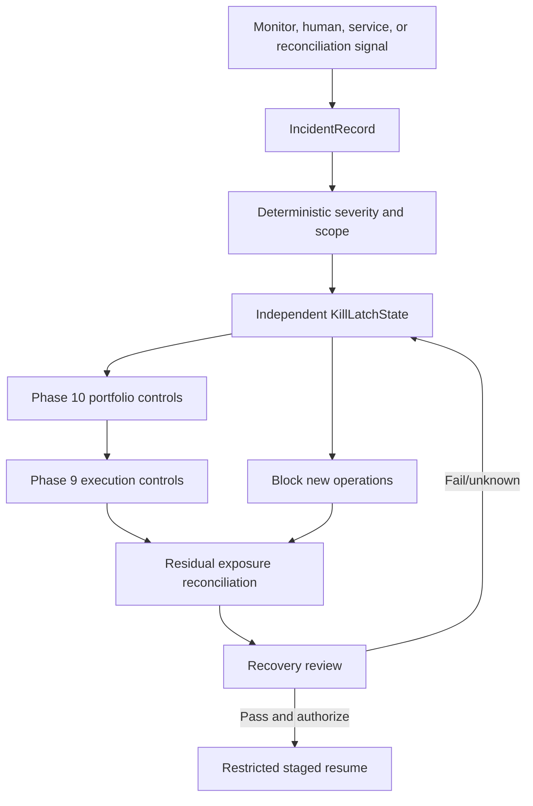
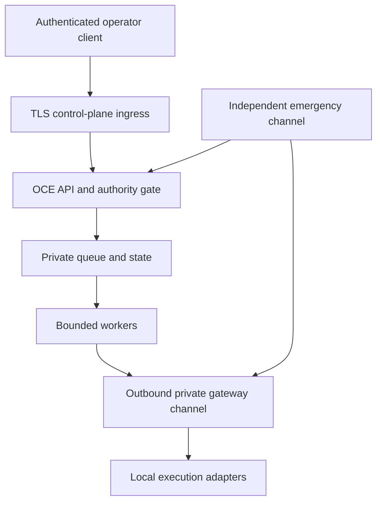

# Phase 11, Book 4 — Incidents, Security, and Recovery

> **Purpose:** Keep authority bounded and exposure managed when agents, models, providers, data, queues, storage, networks, control planes, brokers, credentials, dependencies, or humans fail  
> **Input:** Book 3 lifecycle/drift/cost/control states, Book 1 authority, Book 2 command-center lineage, Phase 9/10 containment interfaces, and selected deployment profile  
> **Output:** Incident and kill planes, degraded-operation matrix, security/tenant/network gates, deployment manifests, backup/restore, and disaster-recovery evidence  
> **Previous:** [Book 3 — Lifecycle, Drift, Utility, and Cost](book-3-lifecycle-drift-utility-cost.md)  
> **Next:** [Book 5 — Sovereign Operations Lock](book-5-sovereign-operations-lock.md)

---

## 1. Success Statement

Every failure becomes a scoped, owned, reconstructable incident; scoped/global kill remains available without the normal UI/model/worker path; no outage or repair expands authority; open/uncertain exposure retains a management path; embedded credentials are revoked and eliminated before deployment; dependencies and images are pinned/scanned; tenant and network boundaries hold; backups restore into isolated disabled state; and the complete control plane can recover without reviving expired authority or trusting unreconciled state.

---

## 2. Applicable Anchors

- **A0:** Human Strategic Authority
- **A1:** One Orchestration Spine
- **A2:** Evidence Before Narrative
- **A3:** Point-in-Time Data
- **A7:** OrderIntent Is the Execution Boundary
- **A8:** Promotion Is State-Based
- **A9:** Separate Research From Approval
- **A10:** Observable and Reconstructable
- **A11:** Repair Before Expansion
- **A12:** Cheap Models Use Tools, Not Memory
- **A13:** Local-First Heavy Compute
- **A14:** No Unofficial Production Broker Dependency
- **A15:** Live Autonomy Is Earned
- **F11:** Autonomy is valid only while control, evidence, and reconstruction remain intact

---

## 3. Incident and Kill Topology



---

## 4. Work Packages

### 4.1 Incident taxonomy

Classify at minimum:

- identity/session/capability/autonomy/approval failure;
- secret exposure or suspicious credential use;
- tenant/data/privacy isolation failure;
- source/data/reference/corporate-action integrity failure;
- research/model/tool grounding or provider failure;
- strategy/validation/simulation invalidation;
- portfolio capital/exposure/reconciliation/control failure;
- execution duplicate/unknown order/position/account/adapter failure;
- queue/database/artifact/event/projection corruption or outage;
- control-plane, worker, local gateway, network, host, disk, memory, or clock failure;
- dependency/image/supply-chain vulnerability or provenance failure;
- budget/cost overrun;
- backup/restore/rollback failure;
- human process/separation/approval mistake.

Severity is based on authority, data integrity, external effect, trading exposure, tenant/privacy, recoverability, and blast radius—not alarm volume.

### 4.2 IncidentRecord

```yaml
incident_record_id: immutable-id
tenant_and_environment_scope: {}
severity: info|minor|major|critical
incident_type: typed-type
detected_at: timestamp
detected_by_principal_or_service_ref: artifact-ref
trigger_evidence_refs: []
affected_principals_roles_capabilities_and_leases: []
affected_lifecycle_run_job_and_lock_refs: []
affected_data_model_provider_service_and_deployment_refs: []
affected_orders_positions_accounts_and_portfolio_refs: []
known_and_unknown_blast_radius: {}
current_state: detected|triaged|contained|investigating|recovering|resolved|postmortem|reopened
control_and_kill_refs: []
residual_and_uncertain_exposure: []
incident_commander_ref: artifact-ref
timeline_event_root: content-hash
recovery_requirements: []
```

The original event/timeline is immutable. Corrections append.

### 4.3 Incident ownership and communications

Each incident declares:

- incident commander and backups;
- security, risk, execution, data, deployment, and communications roles as applicable;
- exact tenant/scope;
- authoritative timeline and evidence channel;
- notification/escalation policy;
- decision log;
- public/user communication policy if distributed;
- containment/recovery checkpoints;
- postmortem owner and deadline.

Agent rooms may coordinate but are not the incident record or kill channel.

### 4.4 KillLatchState

```yaml
kill_latch_state_id: content-id
scope_type: global|tenant|phase|strategy|account|venue|adapter|provider|model|service|deployment
scope_refs: []
state: armed|latched|containment_running|safe_hold|recovery_pending|cleared
trigger_type: automatic_policy|authenticated_human|emergency_channel
trigger_ref: artifact-ref
trigger_principal_or_service_ref: artifact-ref
blocked_action_classes: []
revoked_or_suspended_capability_and_lease_refs: []
phase10_control_request_refs: []
phase9_control_request_refs: []
open_order_position_and_uncertainty_refs: []
residual_exposure: []
acknowledgment_refs: []
latched_at: timestamp
cleared_at: optional-timestamp
recovery_authorization_ref: optional-artifact-ref
state_hash: content-hash
```

A kill is monotonic toward restriction. It cannot create a new external action except separately authorized containment.

### 4.5 Independent kill plane

The kill plane:

- uses dedicated strongly authenticated emergency identity;
- is reachable through at least one path independent of ordinary UI, model, worker queue, and primary event stream;
- persists latches transactionally;
- fans out to OCE schedulers, workers, Phase 10 controls, Phase 9 gateways, and notifications;
- has bounded retries and acknowledgment tracking;
- displays unknown/unacknowledged targets;
- supports local/private execution-gateway enforcement when remote control is disconnected;
- cannot be disabled by ordinary config, model, agent, deployment, or self-healing action.

The plan may include local CLI/private admin endpoint and a separate emergency communication channel. Secrets for the emergency path remain managed and rotated.

### 4.6 Scoped and global kill behavior

On latch:

1. block new affected workflow/action requests;
2. stop dequeue/start of affected jobs;
3. revoke uncommitted autonomy leases and cost reservations where safe;
4. freeze promotion/deployment/allocation increases;
5. request Phase 10 block/throttle/suspend;
6. request Phase 9 cancel/reduce/close only under exact emergency authority;
7. reconcile open/pending/uncertain orders, positions, cash, margin, assignments, settlement, and external activity;
8. preserve evidence and ownership;
9. report residual/unknown exposure;
10. remain latched through restart.

Global kill does not blindly flatten all positions. Unknown market, venue, options, margin, or connectivity state may make an immediate market flatten more dangerous. Frozen policy selects cancel/reduce/close/safe-hold paths through Phase 9/10.

### 4.7 RecoveryAuthorization

```yaml
recovery_authorization_id: immutable-id
incident_and_kill_refs: []
root_cause_and_correction_refs: []
affected_scope: {}
identity_capability_lock_and_policy_reverification_refs: []
data_state_artifact_and_reconciliation_refs: []
open_and_residual_exposure_refs: []
security_secret_dependency_and_deployment_refs: []
required_drill_and_retest_results: []
staged_resume_plan_ref: artifact-ref
approver_principal_refs: []
separation_of_duties_result: pass|fail|reduced_single_operator
authorized_at: timestamp
valid_until: timestamp
```

Clearing the latch requires explicit recovery authorization, not incident status text.

### 4.8 Degraded-operation matrix

| Failure | Continue | Block | Required containment |
|---|---|---|---|
| Model unavailable | Deterministic controls, read-only evidence, approved fallback/queue | Model-required research/judgment | Mark incomplete; no quality downgrade |
| News/data provider unavailable | Existing known-state monitoring within age limits | New claims/scans using stale source | Source outage and freshness latch |
| Identity provider unavailable | Current low-risk read session if policy permits | New high-risk action/approval/session | Read-only/safe hold |
| Queue unavailable | Read current durable state; independent kill | New workflow jobs | Repair/replay queue |
| Projection/UI unavailable | Canonical services and independent kill | UI-originated actions | Read-only alternate status |
| Primary database unavailable | Independent kill and local gateway containment | New durable effects | Fail closed; recover/reconcile |
| Artifact store unavailable | Cached verified emergency records only | New evidence-dependent action | Block affected workflow |
| Model/API budget exhausted | Deterministic/queued work inside policy | Unapproved paid fallback | Cost incident/watch |
| Remote control disconnected | Local gateway manages already-open exposure under policy | New risk from remote plane | Local safe mode and reconnect reconciliation |
| Broker/venue unavailable | Monitor/reconcile known state | New routes to failed cell | Phase 9 uncertainty/incident |
| Market data unavailable | Account/broker reconciliation where possible | New price-dependent risk | Unknown valuation/exposure safe hold |
| Kill channel partial failure | Other independent path and local latches | Recovery/clear | Critical incident |

No degraded mode broadens permission, cost, data age, model scope, or trading risk.

### 4.9 Security baseline

Require:

- authenticated human and workload identities;
- short sessions, strong reauthentication, revocation, CSRF/replay protection;
- least-privilege roles/capabilities and separation;
- tenant isolation;
- TLS for remote traffic and protected local/private transport;
- network allowlists/segmentation and no public adapter ports;
- secret manager/reference use;
- encryption in transit and at rest appropriate to profile;
- input/schema/size/rate validation;
- output/HTML/URL/log redaction and safe rendering;
- dependency/image/SBOM/provenance scanning;
- signed/pinned release artifacts;
- immutable audit and security event retention;
- secure defaults and disabled debug endpoints;
- penetration/threat-model review for remote/distributed profiles.

CORS is not authentication.

### 4.10 Secret remediation gate

Current workspace reality includes credential-shaped material across active scripts/configuration and retained copies/history. Before any remote or live-capable deployment:

1. build a redacted inventory containing only path, line/range, secret type, owner, status, and fingerprint;
2. determine whether each finding is real, example, test, expired, or false positive;
3. immediately revoke/rotate every real or uncertain credential;
4. replace active-source values with secret-manager/environment references;
5. remove secret values from ordinary memory, documentation, logs, fixtures, backups, and generated files;
6. review repository history and backups; any destructive history rewrite requires explicit human coordination;
7. verify downstream services no longer accept old credentials;
8. add pre-commit/CI/runtime secret scanning with redacted output;
9. pass a clean scan or approved false-positive baseline;
10. attach rotation/revocation evidence to deployment admission.

Never paste secret values into an incident, issue, model prompt, dashboard, or FORGE artifact.

### 4.11 SecretReference

```yaml
secret_reference:
  secret_ref_id: opaque-id
  tenant_boundary_ref: artifact-ref
  purpose: typed-purpose
  provider_or_vault_ref: opaque-provider-ref
  permitted_workload_identity_refs: []
  permitted_environment: typed-environment
  created_at: timestamp
  rotation_due_at: timestamp
  last_rotated_at: timestamp
  revocation_state: active|revoked|expired|compromised
```

Artifacts hold references/fingerprints, never secret values.

### 4.12 Supply-chain and dependency security

For every Python/Node/Rust/container/system dependency:

- exact version and source;
- lockfile and integrity hash;
- license and provenance;
- vulnerability/advisory scan;
- transitive dependency graph;
- build image/base image digest;
- SBOM;
- update owner and cadence;
- compatibility/security tests;
- rollback target;
- exception with scope/expiry if unresolved.

The isolated OCE runtime excludes unrelated quant/GPU dependencies. A broad `>=` production dependency range without resolved lock is not a release.

### 4.13 Tenant isolation

In `multi_tenant`, enforce tenant on:

- identities, sessions, roles, grants, leases, approvals;
- API routes, WebSockets, queues, workers, schedules;
- data sources, datasets, features, strategies, Locks;
- memory, prompts, agent rooms, model requests;
- databases, caches, search/vector indexes, artifacts, backups;
- logs, traces, metrics, alerts, costs;
- broker/account/venue bindings;
- incidents, kills, recovery, deletion/export.

Global operator views use separately authorized aggregated data and prevent reverse identification. No agent/model decides tenant boundaries from prose.

### 4.14 Network and control/execution separation



Rules:

- public ingress reaches only authenticated control APIs;
- state/queue/artifact services are private;
- broker/exchange/MT5/Nautilus adapters bind private/local interfaces;
- gateway initiates authenticated outbound connection where possible;
- commands are signed/nonce-bound/expiring/idempotent;
- no port-forwarded trading terminal or raw adapter API;
- remote disconnect blocks new risk and preserves local containment;
- egress allowlists and DNS/TLS identity are verified.

### 4.15 DeploymentManifest

```yaml
deployment_manifest_id: content-id
profile: local_single_operator|local_distributed_workers|remote_shadow_control_plane|hybrid_private_execution|distributed_multi_tenant
environment: typed-environment
source_commit_and_dirty_state: {}
frontend_backend_worker_and_gateway_images: {}
runtime_and_dependency_lock_refs: []
sbom_and_security_scan_refs: []
configuration_schema_and_hashes: {}
secret_reference_inventory_ref: artifact-ref
identity_tenant_network_policy_refs: []
database_queue_artifact_and_cache_refs: []
migration_refs: []
resource_limits: {}
health_slo_and_alert_refs: []
backup_restore_and_dr_refs: []
rollback_ref: artifact-ref
production_capital_grant: absent
production_routing_state: disabled
created_at: timestamp
approvals: []
```

### 4.16 Minimal local profile

The first production-shaped profile uses Docker or Podman Compose (or equivalently reproducible local services) for:

- OCE API;
- command-center frontend;
- bounded control/light workers;
- durable transactional database;
- durable queue/event transport;
- artifact/object store;
- backup job;
- optional local heavy-quant worker;
- private execution gateway disabled by default.

SQLite/JSON may remain for fixtures or a strictly single-process local profile only after concurrency/backup limitations are explicit. They are not the distributed authority store.

### 4.17 Cheap remote/hybrid profile

An inexpensive host such as Railway may run:

- authenticated frontend/API;
- small workers;
- managed/persistent database and queue;
- shadow monitoring and approval queue.

It must not:

- expose execution adapters;
- depend on ephemeral filesystem for authority/evidence;
- run heavy backtests by default;
- hold broker credentials unnecessarily;
- route when the private local gateway is disconnected;
- claim multi-tenant or high availability without tests.

Heavy research/backtests run locally or on explicit burst workers. A $5 service budget is a constraint enforced by Book 3, not a reliability assumption.

### 4.18 Backup policy

Back up nonsecret:

- every Phase 0–11 Lock and canonical artifact;
- identity/role/capability/autonomy metadata;
- approval/action/lifecycle/event/lineage ledgers;
- strategy/data/model/deployment identities;
- portfolio/execution ownership and reconciliation evidence;
- incidents/kills/recovery;
- configurations/schemas/migrations;
- runbooks, tests, reports, SBOMs, and audit.

Secret systems back up encrypted according to provider policy; ordinary application backups contain references only.

Declare RPO, RTO, retention, encryption, location independence, immutability, integrity hashes, restore owner, and deletion/legal requirements.

### 4.19 Isolated restore and disaster recovery

Restore:

1. into isolated networking with production credentials/routes absent;
2. verify backup identity, signatures/hashes, schemas, and migrations;
3. restore event/artifact/state stores;
4. rebuild projections;
5. replay lifecycle/authority/incident/kill state;
6. reconcile Phase 9/10 and any open external exposure from fresh authoritative sources;
7. preserve expired/revoked authority;
8. verify identity/tenant/security/dependency posture;
9. run smoke, control, kill, and lineage tests;
10. require `RecoveryAuthorization`;
11. resume in restricted stages.

Recovery target is a reconciled safe state, not merely running processes.

### 4.20 Release, migration, update, and rollback

Every change records:

- proposal, source commit, build provenance, SBOM, reviews;
- exact schemas/dependencies/images/config;
- data/state migrations and reversibility;
- affected Locks/certification cells;
- canary/shadow/rehearsal plan;
- resource/cost impact;
- open jobs/actions/trading exposure compatibility;
- rollback trigger and target;
- secret/identity/tenant/network changes;
- post-deploy verification.

No auto-update runs across major/schema/security boundaries. Rollback cannot restore compromised secrets or vulnerable dependencies without an explicit constrained exception.

---

## 5. Target Layout

```text
sovereign_operations/
  incidents/
    taxonomy.py
    record.py
    commander.py
    timeline.py
    postmortem.py
  controls/
    kill_latch.py
    fanout.py
    acknowledgments.py
    containment.py
    recovery.py
  degraded/
    matrix.py
    providers.py
    identity.py
    storage.py
    gateway.py
  security/
    auth.py
    secrets.py
    tenants.py
    network.py
    supply_chain.py
    sbom.py
    scans.py
  deployment/
    manifest.py
    compose/
    images/
    migrations/
    release.py
    rollback.py
  recovery/
    backup.py
    restore.py
    reconciliation.py
    drills.py
```

---

## 6. Deliverables

- Incident taxonomy and immutable `IncidentRecord`.
- Incident role/communication/timeline protocol.
- Independent scoped/global `KillLatchState`.
- Phase 10/9-aware containment behavior.
- Immutable `RecoveryAuthorization`.
- Complete degraded-operation matrix.
- Authentication/session/tenant/network/security baseline.
- Redacted secret inventory and rotation/revocation gate.
- Opaque `SecretReference` contract.
- Dependency locks, SBOM, image/provenance, vulnerability gates.
- Multi-tenant isolation contract and tests.
- Control/execution network separation.
- Immutable `DeploymentManifest`.
- Minimal local and cheap remote/hybrid deployment profiles.
- Backup policy with RPO/RTO/retention/integrity.
- Isolated restore and disaster-recovery procedure.
- Release, migration, update, and rollback protocol.

---

## 7. Required Tests

### P11-INC-001 — Deterministic Incident Classification

Same evidence/policy produces the same type, severity, scope, and required controls.

### P11-INC-002 — Authority Incident

Identity, capability, lease, approval, or phase-boundary violation creates an authority incident and blocks affected actions.

### P11-INC-003 — Unknown Exposure Criticality

Unknown order/position/cash/margin/assignment state cannot be downgraded by process health.

### P11-INC-004 — Tenant/Privacy Incident

Cross-tenant or sensitive-data exposure triggers immediate containment and security response.

### P11-INC-005 — Secret Incident

Real/uncertain embedded credential triggers revoke/rotate/block-deploy workflow without logging its value.

### P11-INC-006 — Data Integrity Incident

Corrupt/revised/missing material data identifies exact descendants and stops unsafe use.

### P11-INC-007 — Duplicate External Effect

Duplicate/unknown broker/provider effect opens incident rather than retrying blindly.

### P11-INC-008 — Cost Incident

Unexpected or over-budget spend blocks further affected spend and preserves service safety.

### P11-INC-009 — Incident Ownership

Major/critical incident has authenticated commander, roles, escalation, and backup.

### P11-INC-010 — Immutable Timeline

Corrections append without rewriting original incident events.

### P11-INC-011 — Room Is Not Record

Deleting/editing collaboration room cannot alter incident timeline/control state.

### P11-INC-012 — Incident Scope Expansion

New affected tenant/service/account/strategy is added explicitly and triggers reevaluation.

### P11-INC-013 — Reopened Incident

Recurrence after resolution reopens/links prior incident and does not create clean-history illusion.

### P11-INC-014 — Postmortem Without Secrets

Postmortem reconstructs cause/effect/actions while excluding credentials and unnecessary identifiers.

### P11-INC-015 — Incident Replay

Replay reproduces detection, severity, ownership, controls, exposure, recovery, and terminal state.

### P11-KIL-001 — Independent Global Kill

Global kill latches without ordinary UI, model service, worker queue, or primary event stream.

### P11-KIL-002 — Scoped Kill

Strategy/account/venue/provider/model/service kill blocks exact scope and preserves visible unaffected scope.

### P11-KIL-003 — Kill Persists Restart

Process/host/deployment restart cannot clear a latch.

### P11-KIL-004 — Kill Monotonicity

Kill action can only restrict new operations; it cannot create capital, capability, or risk.

### P11-KIL-005 — Phase 10 Fanout

Portfolio block/throttle/suspend request is issued with exact affected ownership/exposure.

### P11-KIL-006 — Phase 9 Fanout

Broker-facing cancel/reduce/close uses exact emergency authority and one-use lifecycle controls.

### P11-KIL-007 — No Blind Flatten

Unknown/unsafe market, options, margin, liquidity, or venue state selects frozen containment rather than unconditional market flatten.

### P11-KIL-008 — Acknowledgment Truth

Requested, delivered, acknowledged, effective, failed, unknown, and reconciled targets remain separate.

### P11-KIL-009 — Open Exposure Preservation

Kill retains ownership, valuation, management policy, and residual/uncertain exposure.

### P11-KIL-010 — Revokes Uncommitted Authority

Affected uncommitted leases/jobs/cost reservations stop without erasing committed effects.

### P11-KIL-011 — Race With New Action

Kill/action race serializes so no unauthorized post-latch effect occurs.

### P11-KIL-012 — Emergency Identity Limits

Kill principal cannot clear latch, approve recovery, delete evidence, or create trading authority.

### P11-KIL-013 — Local Gateway Enforcement

Private execution gateway enforces kill while remote control plane is disconnected.

### P11-KIL-014 — Recovery Authorization

Latch clears only with exact current recovery artifact and required independent approval.

### P11-KIL-015 — Kill Replay

Replay reproduces trigger, fanout, acknowledgments, residual exposure, and clearance.

### P11-DEG-001 — No Authority Expansion in Outage

Every degraded mode preserves or narrows identity, capability, autonomy, cost, data-age, and trading scope.

### P11-DEG-002 — Model Outage

Deterministic controls continue; model-required work falls back only inside policy or queues/blocks.

### P11-DEG-003 — Data/News Provider Outage

Stale source blocks new affected claims/scans and displays freshness failure.

### P11-DEG-004 — Identity Provider Outage

New high-risk sessions/actions/approvals block while allowed read-only status remains explicit.

### P11-DEG-005 — Queue Outage

Independent kill works and new workflow effects block until durable queue recovers/replays.

### P11-DEG-006 — Database Outage

No new durable effect proceeds when authoritative state cannot commit.

### P11-DEG-007 — Artifact Store Outage

Evidence-dependent actions block rather than operating from unverifiable cache.

### P11-DEG-008 — UI/Projection Outage

Canonical services remain bounded and alternate read/kill paths do not claim fresh dashboard state.

### P11-DEG-009 — Remote Disconnect

Remote plane cannot create new risk; local gateway preserves permitted open-exposure management.

### P11-DEG-010 — Broker/Venue Outage

Failed cell blocks new routes and enters Phase 9 uncertainty/reconciliation.

### P11-DEG-011 — Market Data Outage

Unknown valuation/exposure blocks new risk and does not mark portfolio flat.

### P11-DEG-012 — Degraded Recovery

Recovered dependency reauthenticates, catches up cursors, reconciles, and clears only through policy.

### P11-DRR-001 — Isolated Restore

Backup restores in isolated environment with production credentials, capital, leases, permits, and routes absent.

### P11-DRR-002 — Hash/Signature Verification

Backup artifacts, manifests, event roots, schemas, and images verify before use.

### P11-DRR-003 — Projection Rebuild

Restored canonical events/artifacts reproduce command-center projections.

### P11-DRR-004 — Authority Nonrevival

Restore preserves expired/revoked identities, sessions, grants, leases, decisions, kills, and capital state.

### P11-DRR-005 — Open Exposure Reconciliation

Recovery queries fresh authoritative Phase 9/10/account state and preserves unknowns.

### P11-DRR-006 — Tenant Isolation Restore

Restore cannot merge tenant namespaces, identities, artifacts, backups, or accounts.

### P11-DRR-007 — Secret Reference Restore

Application backup restores secret references only and requires separately validated secret system.

### P11-DRR-008 — Migration Failure

Failed/lossy migration stops restore and preserves original backup.

### P11-DRR-009 — Kill Path Drill

Restored environment proves independent kill before any staged resume.

### P11-DRR-010 — Recovery Authorization

Running processes alone cannot leave disabled/safe-hold state.

### P11-DRR-011 — RPO/RTO Measurement

Drill measures declared data-loss and recovery-time objectives honestly.

### P11-DRR-012 — Disaster Replay

End-to-end DR evidence reproduces backup, failure, restore, reconciliation, review, and restricted resume.

### P11-BKP-001 — Complete Canonical Backup

All required Locks, events, artifacts, authority metadata, lineage, incidents, and runbooks are included.

### P11-BKP-002 — Secret Exclusion

Ordinary application backup contains opaque references/fingerprints, not credential values.

### P11-BKP-003 — Encryption and Access

Backup encryption and read/restore capabilities follow exact tenant/environment policy.

### P11-BKP-004 — Independent Location

Primary host/storage failure does not destroy all backup copies.

### P11-BKP-005 — Retention

Retention/deletion policy preserves required audit while honoring exact tenant/legal policy.

### P11-BKP-006 — Immutable Version

Backup version cannot be silently overwritten or substituted.

### P11-BKP-007 — Incremental Chain

Missing/corrupt incremental link is detected before restore.

### P11-BKP-008 — Backup During Writes

Snapshot is transactionally consistent or has a proven event cursor/replay boundary.

### P11-BKP-009 — Scheduled Verification

Backup success includes periodic real restore verification, not file existence.

### P11-BKP-010 — Backup Failure Alert

Failed/stale backup blocks the deployment profile at its declared threshold.

### P11-SEC-001 — Embedded-Secret Deployment Gate

Real/uncertain credential-shaped finding blocks remote/live-capable deployment until revoked/rotated and remediated.

### P11-SEC-002 — Redacted Inventory

Inventory stores path/type/owner/status/fingerprint without secret value.

### P11-SEC-003 — Old Credential Rejection

After rotation, downstream service rejects old credential and new reference works.

### P11-SEC-004 — No Secret in Outputs

Logs, errors, traces, metrics, prompts, artifacts, UI, rooms, tests, and backups reveal no secret.

### P11-SEC-005 — Strong Authentication

Remote protected APIs/streams reject unauthenticated/weak sessions.

### P11-SEC-006 — CSRF/Replay

Captured interactive request cannot replay a protected effect.

### P11-SEC-007 — Rate/Input Limits

Oversized, malformed, abusive, or high-rate input is bounded without starving kill/control paths.

### P11-SEC-008 — Safe Error Handling

Client error omits stack, internal path, query, payload, token, and sensitive state.

### P11-SEC-009 — Debug Disabled

Debug/admin/test endpoints and permissive settings are absent in certified profiles.

### P11-SEC-010 — Dependency Lock

Resolved Python/Node/runtime dependencies and hashes reproduce exactly.

### P11-SEC-011 — SBOM and Vulnerability Scan

Every release has SBOM/provenance and no unapproved critical/high finding.

### P11-SEC-012 — Signed/Pinned Image

Deployment uses reviewed image digest rather than mutable tag.

### P11-SEC-013 — Supply-Chain Update

Dependency update reruns compatibility, security, replay, and rollback tests.

### P11-SEC-014 — Security Event Audit

Authentication, grant, secret, tenant, network, scan, and admin events are tamper-evident.

### P11-SEC-015 — Threat Review

Remote/distributed profile passes documented threat model and independent security review.

### P11-TNT-001 — Complete Tenant Isolation

Identity, API, stream, queue, worker, data, memory, artifact, log, metric, cost, secret, and account boundaries all enforce tenant.

### P11-TNT-002 — Object-Level Authorization

Valid tenant session cannot access another object by guessed ID.

### P11-TNT-003 — Cache/Search Isolation

Cache key, full-text/vector search, model context, and projection cannot leak another tenant.

### P11-TNT-004 — Worker Isolation

Reused worker clears tenant context/secrets and cannot cross-read prior job.

### P11-TNT-005 — Queue Isolation

Tenant cannot publish/consume/ack another tenant's job/event.

### P11-TNT-006 — Artifact/Backup Isolation

Paths, signed transfers, backups, restore, export, and deletion remain tenant-bound.

### P11-TNT-007 — Model/Provider Isolation

Prompt/history/cache/billing metadata cannot cross tenant.

### P11-TNT-008 — Trading Account Isolation

Intent, portfolio, account, adapter, and broker state cannot cross tenant.

### P11-TNT-009 — Global View Privacy

Authorized aggregate view prevents reverse identification and has no mutation authority.

### P11-TNT-010 — Multi-Tenant Blocker

Any failed isolation cell keeps distributed multi-tenant profile blocked while single-operator scope remains explicit.

### P11-DEP-001 — Reproducible Local Profile

Fresh machine builds pinned API/UI/worker/state/queue/artifact stack and passes smoke tests.

### P11-DEP-002 — Minimal Control Runtime

OCE control-plane tests/build do not install root quant/GPU/heavy-backtest stack.

### P11-DEP-003 — Frontend/Backend Compatibility

Pinned client/server/schema versions negotiate or fail read-only.

### P11-DEP-004 — Durable State

Certified profile does not depend on ephemeral filesystem or process memory for authority/evidence.

### P11-DEP-005 — Resource Limits

Container/process CPU, memory, disk, network, and restart limits protect control work.

### P11-DEP-006 — Health/Readiness Depth

Readiness covers dependencies, cursors, reconciliation, kill path, migrations, and authority—not heartbeat only.

### P11-DEP-007 — Migration

Forward/backward migration preserves immutable evidence, tenant, authority, and replay.

### P11-DEP-008 — Staged Release

Release progresses fixture → rehearsal → shadow → disabled production-shaped with exact gates.

### P11-DEP-009 — Rollback

Rollback preserves open work/exposure, state compatibility, and revoked authority.

### P11-DEP-010 — Remote Shadow Profile

Cheap hosted profile authenticates, persists, backs up, and keeps all trading routes disabled.

### P11-DEP-011 — Hybrid Gateway

Private gateway uses authenticated outbound channel and blocks new risk on disconnect.

### P11-DEP-012 — Deployment Replay

Manifest reproduces source, images, dependencies, config hashes, migrations, security evidence, and status.

### P11-NET-001 — No Public Adapter

Broker/exchange/MT5/Nautilus adapter ports are not reachable from public ingress.

### P11-NET-002 — TLS/Identity

Remote control/gateway connections verify encryption and peer identity.

### P11-NET-003 — Private State Services

Database, queue, cache, artifact, and admin interfaces are private/allowlisted.

### P11-NET-004 — Egress Scope

Service can contact only approved providers/endpoints for its role.

### P11-NET-005 — Command Freshness

Gateway rejects expired, replayed, wrong-tenant, wrong-environment, or duplicate command.

### P11-NET-006 — DNS/Certificate Failure

Identity failure blocks rather than falling back to insecure endpoint.

### P11-NET-007 — Partition

Network partition prevents split-brain authority and reconciles before resume.

### P11-NET-008 — Kill Priority

Kill/control traffic remains bounded-priority and cannot be starved by data/model workload.

---

## 8. Failure Modes

- Global kill depends on the same UI/queue that failed.
- Kill clears on process restart.
- Emergency key can also approve recovery or trade.
- “Flatten all” runs without current market/position evidence.
- Remote disconnect permits queued new risk.
- CORS is treated as authentication.
- Credential values remain in source, backups, or agent memory.
- Secret scan prints the secret into CI logs.
- Mutable container tags and broad dependency ranges reach production.
- JSON room state becomes multi-user authority storage.
- Tenant ID is trusted from request body.
- Restore restarts routing before reconciliation.

---

## 9. Exit Gate

Book 4 is complete only when incidents are deterministic and owned, independent scoped/global kills latch and preserve open-exposure duty, every outage narrows authority, emergency controls traverse Phase 10/9 where broker-facing, embedded credentials are revoked/rotated and cleanly referenced, authentication/tenant/network/supply-chain gates pass, OCE deploys from pinned minimal profiles, public adapters remain unreachable, backups restore and replay in isolation, and no recovery/update/rollback can revive authority or resume before reconciliation and explicit authorization.

---

## 10. Handoff

Book 5 receives the complete authority/command-center/lifecycle stack, incident and kill evidence, degraded-mode matrix, clean secret/security/tenant/network reports, pinned deployment manifests, backups/restores, DR results, SLOs, open/residual/unknown exposure, blocked profiles, and every gate needed for full idea-to-retirement rehearsal, chaos, soak, final audit reconstruction, `SovereignOperationsLockManifest`, and `GLXForgeCompletionManifest`.
