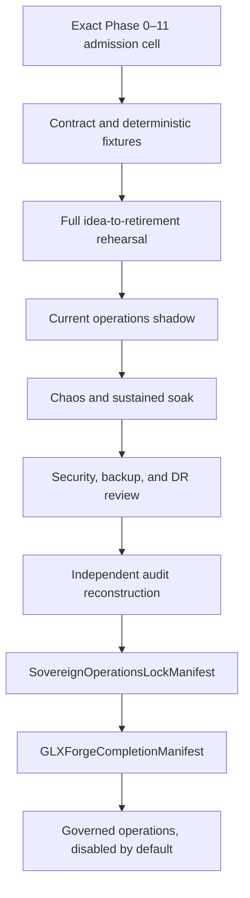

# Phase 11, Book 5 — Sovereign Operations Lock

> **Purpose:** Certify the complete continuously operating GLX system, prove final-action reconstruction and safe degradation, then close FORGE without embedding standing capital, routing, or unrestricted autonomy  
> **Input:** Books 1–4 contracts/implementations/evidence, all Phase 0–10 Locks, selected deployment/tenant cells, full runbooks, and independent reviewers  
> **Output:** `SovereignOperationsCertificationReport`, `SovereignOperationsLockManifest`, `GLXForgeCompletionManifest`, and ongoing governed-operations package  
> **Previous:** [Book 4 — Incidents, Security, and Recovery](book-4-incidents-security-recovery.md)  
> **Next:** Governed operations under the final FORGE completion manifest

---

## 1. Success Statement

The production-shaped GLX stack can operate continuously in fixture, rehearsal, shadow, chaos, soak, and isolated-recovery environments; it rehearses both action and nonaction from macro/news through scanner, research, strategy, validation, simulation, portfolio, execution, monitoring, pause/rollback, and retirement; identities, approvals, autonomy, tenants, costs, incidents, kills, security, and recovery hold under failure; every final outcome reconstructs; blocked scope stays visible; and the final Locks prove bounded readiness without granting capital, standing autonomy, reusable permits, or live routing.

---

## 2. Applicable Anchors

- **A0:** Human Strategic Authority
- **A1:** One Orchestration Spine
- **A2:** Evidence Before Narrative
- **A3:** Point-in-Time Data
- **A4:** StrategySpec Is Truth
- **A5:** Fast Tests Reject; Canonical Tests Qualify
- **A6:** Nautilus Is the Canonical Trading Model
- **A7:** OrderIntent Is the Execution Boundary
- **A8:** Promotion Is State-Based
- **A9:** Separate Research From Approval
- **A10:** Observable and Reconstructable
- **A11:** Repair Before Expansion
- **A12:** Cheap Models Use Tools, Not Memory
- **A13:** Local-First Heavy Compute
- **A14:** No Unofficial Production Broker Dependency
- **A15:** Live Autonomy Is Earned
- **F0–F10:** All established FORGE phase anchors remain active
- **F11:** Autonomy is valid only while control, evidence, and reconstruction remain intact

---

## 3. Final Certification Topology



---

## 4. Work Packages

### 4.1 SovereignOperationsCertificationJob

```yaml
sovereign_operations_certification_job_id: content-id
sovereign_operations_admission_ref: artifact-ref
phase_0_through_10_lock_refs: []
books_1_through_4_policy_and_contract_refs: []
selected_deployment_tenant_environment_cells: []
identity_role_capability_autonomy_and_approval_fixture_plan_ref: artifact-ref
command_center_lineage_fixture_plan_ref: artifact-ref
idea_to_retirement_rehearsal_plan_ref: artifact-ref
operations_shadow_plan_ref: artifact-ref
chaos_and_soak_plan_ref: artifact-ref
security_tenant_supply_chain_review_plan_ref: artifact-ref
backup_restore_and_dr_plan_ref: artifact-ref
audit_reconstruction_plan_ref: artifact-ref
operational_and_api_cost_budget_refs: []
independent_review_refs: []
idempotency_key: opaque-string
correlation_id: typed-id
```

OCE schedules the job under synthetic/shadow authority. The job itself is not an autonomy lease, capital grant, portfolio envelope, execution permit, deployment approval, or route.

### 4.2 Certification job graph

```text
proposed
→ admission_verified
→ contracts_and_static_checks
→ deterministic_fixtures
→ idea_to_retirement_rehearsal
→ operations_shadow
→ approval_denial_review
→ chaos_campaign
→ sustained_soak
→ security_and_tenant_review
→ backup_restore_and_dr
→ audit_reconstruction
→ independent_review
→ production_ready_disabled
→ operations_locked
→ forge_complete
```

`blocked`, `failed`, `quarantined`, `invalidated`, and `expired` are first-class terminal/interruption states.

### 4.3 Certification ladder

Each selected deployment × tenant × environment × phase-service × actor-role × action-class × provider/model × asset/account/venue cell passes:

1. exact upstream Lock and operations admission;
2. schema, version, forbidden-import, and secret/static checks;
3. identity, session, tenant, role, capability, autonomy, and approval fixtures;
4. projection, command, event, queue, lineage, and accessibility fixtures;
5. lifecycle, scheduler, drift, decay, model-utility, cost, pause, rollback, and retirement fixtures;
6. incident, kill, degraded mode, security, tenant, network, deployment, backup, and recovery fixtures;
7. complete idea-to-retirement rehearsal with approve/deny/no-action branches;
8. current operations shadow;
9. duplicate, concurrency, process death, corruption, outage, compromise, and partition chaos;
10. production-shaped sustained soak;
11. security threat review, dependency scan, SBOM, provenance, and secret rotation evidence;
12. isolated backup restore and disaster-recovery drill;
13. final action/nonaction audit reconstruction;
14. independent review;
15. production-capital/routing/standing-autonomy-disabled verification.

No weighted score hides a failed cell.

### 4.4 SovereignOperationsCertificationReport

```yaml
sovereign_operations_certification_report_id: content-id
sovereign_operations_admission_ref: artifact-ref
phase_lock_refs: []
certified_deployment_tenant_environment_cells: []
identity_authority_and_approval_results: {}
command_center_projection_and_lineage_results: {}
lifecycle_drift_decay_utility_and_cost_results: {}
incident_kill_degraded_security_and_recovery_results: {}
idea_to_retirement_rehearsal_results: {}
operations_shadow_results: {}
chaos_and_soak_results: {}
security_tenant_dependency_sbom_and_secret_results: {}
backup_restore_and_dr_results: {}
audit_reconstruction_results: {}
operational_slos_and_error_budgets: {}
rejected_blocked_conditional_and_untested_cells: []
known_limitations: []
disposition: certified|conditionally_certified|blocked|quarantined
review_refs: []
valid_until: timestamp
```

Conditional certification creates no production authority. Every condition has an owner, expiry, excluded scope, and next test.

### 4.5 Deterministic final fixtures

Fixtures cover:

- every principal/session/role/capability/autonomy/approval decision;
- single-operator and prohibited/eligible multi-tenant paths;
- every command-center view/status/freshness/reconciliation state;
- macro/news, revision/retraction, entity/theme/sector, scanner, research, and entry-idea states;
- strategy/validation/simulation/portfolio/execution approved, denied, blocked, expired, invalidated, and retired states;
- event duplicates, ordering, cursor gaps, reconnects, malformed payloads;
- job retries, timeouts, fanout, progress stalls, process death, resource/cost exhaustion;
- drift/decay across every taxonomy dimension;
- model/provider outage and approved/no fallback;
- pause, rollback, retest, recertify, retirement, open-exposure duty;
- incidents, scoped/global kills, acknowledgments, safe hold, recovery;
- secret, dependency, tenant, network, deployment, backup, and restore failures.

Every fixture pins time, seed, source, model/tool, policy, schema, runtime, and expected artifact hashes.

### 4.6 Full idea-to-retirement rehearsal

The canonical rehearsal includes:

1. ingest a point-in-time macro release/news/catalyst and contradictory/revised source;
2. resolve entities, themes, sectors, asset links, and uncertainty under Phase 4;
3. scan the broad versioned market universe deterministically under Phase 5;
4. shortlist stocks/assets with exact reject reasons and capacity fields;
5. assign bounded research agents using MAD's research guidelines;
6. produce cited facts, counterevidence, unresolved claims, candidate play, and entry concept;
7. propose exact `StrategySpec` and build one code path under Phase 6;
8. run fast rejection then canonical Phase 7 validation with realistic costs/uncertainty;
9. run Phase 8 joint execution simulation, incidents, and promotion decision;
10. admit eligible strategy into Phase 10 conflict/allocation/stress review;
11. produce unchanged candidate `OrderIntent` and Phase 9 execution shadow;
12. run approve, deny, defer, revision, expired, and blocked human/authority branches;
13. reconcile expected/observed order, portfolio, cost, and lineage state;
14. inject drift/decay/provider outage/limit breach;
15. pause, rollback/retest, recover or retire;
16. preserve open/uncertain exposure management through terminal reconciliation;
17. reconstruct the final action/nonaction to the original source.

At least one no-action branch must be certified. A system that only rehearses favorable trade paths fails.

### 4.7 Asset and capability cells

Rehearse only supported cells:

- equities through approved data/reference/execution account paths;
- options only with contract, chain, corporate-action, margin, exercise/assignment, combo, and backtest/simulation support;
- crypto through certified Nautilus adapter/account/venue cells;
- FX through the existing approved execution engine and Phase 9 contract—not the unused MT5 MCP path;
- every blocked/missing adapter or framework remains visible.

The final Lock does not claim options backtesting or brokerage support merely because a library/API exists.

### 4.8 Human approval and denial campaign

Exercise:

- proposer versus independent approver;
- strong reauthentication;
- duplicate approver;
- approval expiry;
- changed-since-proposal;
- approve/deny race;
- capability/lease revocation race;
- denial and revised request lineage;
- degraded single-operator sequential attestation;
- emergency kill versus normal approval;
- recovery approval separation;
- attempted model/agent self-approval;
- attempted UI/request-body identity spoof.

### 4.9 Operations shadow

Shadow runs current:

- news/macro schedules and source revisions;
- broad scanners;
- bounded research/model providers;
- strategy/validation/simulation job orchestration where compute permits;
- portfolio/execution counterfactual decisions;
- command-center projections;
- drift/decay/cost/incident controls.

It creates no real capital reservation, active production autonomy lease, Phase 9 permit, order, broker mutation, or route. Counterfactual fills/profits are labeled and never used as live proof.

### 4.10 Chaos campaign

Inject:

- duplicate/reordered/delayed/lost event and command;
- stale/revoked session, capability, approval, lease, Lock, or cost grant;
- concurrent approval/deny/revoke/kill/action;
- worker/process/host death at every durable boundary;
- queue/database/artifact/projection corruption/outage;
- model/provider rate limit, invalid output, latency, silent version change, and outage;
- secret exposure/rotation and suspicious credential use;
- cross-tenant ID/cache/queue/worker/artifact/model/account attack;
- network partition, DNS/TLS failure, remote gateway disconnect;
- data revision/retraction/gap and clock skew;
- broker/venue/market-data outage and unknown execution;
- disk/memory/CPU/storage/token/API-dollar exhaustion;
- backup/migration/restore/rollback failure;
- kill-channel partial failure and recovery attempt.

Each injection declares expected evidence, alert, restriction, control, residual state, cleanup, replay, and no-duplicate proof.

### 4.11 Sustained production-shaped soak

Run the pinned selected profile for a policy-defined duration spanning at least:

- one complete market week or equivalent required schedule cycle;
- overnight/weekend transitions where relevant;
- every macro/news/scanner schedule;
- model free-quota/rate-limit windows;
- backup and restore-verification cycles;
- dependency/provider reconnect;
- multiple worker/API/UI restarts;
- kill/recovery drill;
- log/event/artifact retention/compaction;
- no-trade and blocked periods.

Use realistic tenant, agent, candidate, job, event, approval, strategy, and observation volumes. Production credentials/routes remain absent.

### 4.12 Reconciliation

Reconcile:

1. admissions, Locks, roles, grants, leases, approvals, and decisions;
2. lifecycle runs/jobs/transitions;
3. event logs, queues, artifacts, projections, and lineage;
4. model/provider usage and utility;
5. compute/API/data/host cost reservations versus actual;
6. strategy/validation/simulation/portfolio/execution artifacts;
7. Phase 9/10/Nautilus/account/broker state where applicable;
8. incident/kill/pause/recovery/retirement state;
9. deployment, security, tenant, backup, and restore identities.

```yaml
sovereign_operations_reconciliation_snapshot_id: content-id
as_of_time: timestamp
tenant_and_environment: {}
authority_and_approval_differences: []
lifecycle_job_and_event_differences: []
artifact_projection_and_lineage_differences: []
model_utility_and_cost_differences: []
phase9_10_and_external_state_differences: []
incident_kill_and_recovery_differences: []
deployment_security_tenant_and_backup_differences: []
classification: match|explainable|unexplained_material|critical
required_action: continue|warn|pause|kill|incident|recover|retest
evidence_refs: []
```

### 4.13 Operational SLOs and error budgets

Define by deployment profile:

- identity/authorization decision latency and availability;
- kill request persistence/fanout/acknowledgment;
- event ingestion and projection freshness;
- approval queue visibility;
- scheduler dequeue and control-job priority;
- data/source freshness;
- model/provider latency/availability/invalid-output;
- command/lifecycle/lineage completeness;
- Phase 9/10 reconciliation age;
- backup age and restore verification;
- incident detection/containment/recovery;
- resource/cost utilization;
- security scan/rotation currency.

SLO breach reduces scope according to policy. Error budget is operational tolerance, not permission to ignore a critical invariant.

### 4.14 Audit reconstruction

An independent auditor selects:

- final routed execution/fill/position/PnL effect;
- denied/no-trade action;
- retired strategy;
- model/provider failure;
- human approval/denial;
- incident/kill/recovery;
- cost charge;
- deployment/release.

From immutable roots, reproduce actor, tenant, environment, source, data cursor, transformation, model/tool/code, policy, Locks, decisions, action, outcome, costs, drift, incidents, and terminal reconciliation without relying on mutable dashboards or agent memory.

### 4.15 Security and supply-chain review

Final review includes:

- threat model;
- authentication/session/RBAC/capability/autonomy/approval tests;
- tenant isolation;
- secret inventory, revoke/rotate, old-credential rejection, clean scans;
- code/static/dependency/container/SBOM/license/provenance scans;
- network exposure and private gateway verification;
- input/rate/error/redaction review;
- backup encryption/access/restore;
- incident/kill tamper resistance;
- reviewed exceptions with owner/scope/expiry.

Any unresolved real/uncertain credential or critical remote-exposure finding blocks remote/live-capable cells.

### 4.16 Backup, restore, and DR certification

Perform real independent restore from selected backup into isolated environment, verify RPO/RTO, rebuild projections, replay all relevant states, reconcile fresh external state, prove kill path, and remain disabled until recovery review. Screenshot/prose-only runbook review is insufficient.

### 4.17 Release and rollback certification

Certify:

- source/dependency/image/config/migration identity;
- reproducible builds and signed/pinned artifacts;
- staged fixture/rehearsal/shadow/disabled deployment;
- compatibility with in-flight jobs/actions and open exposure;
- rollback/forward-fix;
- old secret/dependency rejection;
- post-deploy SLO/security/reconciliation;
- exact invalidation graph.

### 4.18 Invalidation graph

Material changes include:

- any Phase 0–10 Lock or artifact;
- identity provider, session, role, capability, tenant, autonomy, approval;
- command-center view/action/event/lineage;
- lifecycle, scheduler, job, agent, drift, decay, model, cost;
- incident, kill, degraded mode, security, secret, dependency, network;
- deployment, database, queue, artifact store, backup, restore, migration, runtime;
- tests, SLOs, reviewers, or final Lock criteria.

The graph identifies exact cells/books/tests/Locks to rerun. A configuration-only appearance cannot hide semantic change.

### 4.19 SovereignOperationsReadinessProposal

```yaml
sovereign_operations_readiness_proposal_id: content-id
sovereign_operations_admission_ref: artifact-ref
certification_report_refs: []
certified_scope: {}
blocked_conditional_and_untested_scope: []
selected_deployment_profiles: []
selected_tenant_modes: []
operator_roles_and_runbooks: []
operational_slos_and_error_budgets: {}
security_secret_dependency_and_dr_refs: []
known_limitations: []
production_capital_grant: absent
standing_capital_allocation: none
active_production_autonomy_lease: null
reusable_execution_permit: null
production_routing_state: disabled
live_authorization: false
```

### 4.20 SovereignOperationsLockManifest

```yaml
phase: 11
lock_id: immutable-id
created_at: timestamp
commit_sha: git-sha
phase_0_through_10_lock_refs: []
sovereign_operations_admission_ref: artifact-ref
contracts_policies_and_schema_hashes: {}
certified_deployment_tenant_environment_cells: []
identity_role_capability_autonomy_and_approval_refs: []
command_center_projection_action_and_lineage_refs: []
lifecycle_drift_decay_model_utility_and_cost_refs: []
incident_kill_degraded_security_and_recovery_refs: []
rehearsal_shadow_chaos_soak_refs: []
security_tenant_dependency_sbom_secret_scan_refs: []
backup_restore_dr_and_reconciliation_refs: []
audit_reconstruction_refs: []
sovereign_operations_certification_refs: []
readiness_proposal_ref: artifact-ref
operational_slos_and_runbook_refs: []
known_limitations_and_blockers: []
certified_scope: {}
disposition: production_ready_not_authorized|shadow_only|blocked|quarantined
production_capital_grant_ref: null
standing_capital_allocation: none
active_production_autonomy_lease_ref: null
reusable_execution_permit_ref: null
production_routing_state: disabled
prohibited_authorities: []
approvals: []
```

The Lock contains no credential, secret, trading account activation, capital envelope/reservation, active production lease, or permit.

### 4.21 GLXForgeCompletionManifest

```yaml
glx_forge_completion_manifest_id: immutable-id
forge_version: semver
phase_lock_refs:
  phase_0_reality: artifact-ref
  phase_1_constitution: artifact-ref
  phase_2_runtime: artifact-ref
  phase_3_data: artifact-ref
  phase_4_intelligence: artifact-ref
  phase_5_discovery: artifact-ref
  phase_6_strategy: artifact-ref
  phase_7_validation: artifact-ref
  phase_8_simulation: artifact-ref
  phase_9_execution: artifact-ref
  phase_10_portfolio: artifact-ref
  phase_11_operations: artifact-ref
certified_system_scope: {}
blocked_conditional_and_untested_scope: []
deployment_tenant_and_environment_scope: {}
operator_role_runbook_and_slo_refs: []
invalidation_and_return_paths: {}
known_limitations: []
completion_disposition: forge_complete_production_ready_not_authorized|forge_complete_shadow_only|incomplete|blocked
production_capital_grant_ref: null
standing_capital_allocation: none
active_production_autonomy_lease_ref: null
reusable_execution_permit_ref: null
production_routing_state: disabled
profitability_guarantee: none
approvals: []
```

This manifest says what was built and certified. It does not compel operation.

### 4.22 Post-FORGE production activation

After completion, any production activation separately requires:

- current verified final and upstream Locks;
- exact external human/MAD operating authority;
- exact Phase 10 production `CapitalAuthorityGrant`;
- exact tenant/environment/account/adapter scope;
- active role/capability grants and short-lived autonomy lease;
- current data/model/provider/deployment/security/recovery evidence;
- no blocking incident/drift/kill;
- per-action Phase 10 envelope/reservation;
- per-action Phase 9 one-use permit;
- staged rollout and rollback;
- explicit human approval according to action class.

Activation artifacts are runtime authority and never embedded into the final Lock.

### 4.23 Ongoing governed operations

After FORGE:

- continuously reevaluate expiry, drift, SLO, costs, security, and incidents;
- recertify changed scope through the earliest affected phase;
- keep blocked scope visible;
- run scheduled backup/restore, kill, and audit drills;
- rotate credentials and dependencies;
- preserve human approval and denial;
- retire invalid strategies/models/providers/deployments;
- never infer authority from previous operation or profitability.

---

## 5. Target Layout

```text
sovereign_operations/
  certification/
    job.py
    ladder.py
    report.py
    fixtures/
    e2e/
    approvals/
    shadow/
    chaos/
    soak/
    reconciliation/
    audit/
    security/
    disaster_recovery/
  operations/
    slos.py
    error_budgets.py
    drills.py
    runbooks.py
  lock/
    manifest.py
    verifier.py
    invalidation.py
  completion/
    forge_manifest.py
    verifier.py
    activation_boundary.py
```

---

## 6. Deliverables

- `SovereignOperationsCertificationJob` and guarded job graph.
- Cell-level certification ladder and report.
- Deterministic final fixture suite.
- Full macro/news-to-retirement rehearsal.
- Asset/capability cell matrix with blocked truth.
- Human approval/denial campaign.
- Current operations shadow.
- Failure-injection/chaos campaign.
- Production-shaped sustained soak.
- Complete cross-system reconciliation snapshot.
- Operational SLO and error-budget registry.
- Independent final-action/nonaction audit reconstruction.
- Security, tenant, dependency, SBOM, provenance, and secret review.
- Real isolated backup/restore/DR certification.
- Release/rollback certification.
- Final invalidation graph.
- `SovereignOperationsReadinessProposal`.
- `SovereignOperationsLockManifest`.
- `GLXForgeCompletionManifest`.
- Separate post-FORGE production-activation boundary.
- Ongoing governed-operations and drill package.

---

## 7. Required Tests

### P11-CERT-001 — Guarded Certification Job

Certification job follows exact state graph and cannot skip or reorder required stages.

### P11-CERT-002 — Exact Cell Granularity

Report certifies exact deployment, tenant, environment, phase, role, action, provider/model, asset/account/venue cells.

### P11-CERT-003 — Upstream Lock Verification

Every selected Phase 0–10 Lock/hash/scope is current and independently verified.

### P11-CERT-004 — Rejected/Blocked Truth

Failed, blocked, conditional, expired, invalidated, and untested cells remain explicit.

### P11-CERT-005 — No Aggregate Masking

Aggregate score cannot hide failed critical cell or invariant.

### P11-CERT-006 — Independent Review

Proposer/build/operator identity cannot be sole final reviewer.

### P11-CERT-007 — Known Limitations

Every limitation has owner, affected scope, consequence, next test, and expiry/review.

### P11-CERT-008 — Certification Expiry

Expired certification cannot support readiness or activation.

### P11-CERT-009 — Conditional Is Nonauthorizing

Conditional certification creates no capability, lease, capital, permit, or route.

### P11-CERT-010 — Source/Dependency Pin

Certification pins source, schemas, policies, runtimes, models, dependencies, images, and fixtures.

### P11-CERT-011 — Clean Secret Gate

Remote/live-capable cell cannot certify with unresolved real/uncertain embedded credential.

### P11-CERT-012 — Production Disabled Evidence

Certification proves credentials/capital/lease/permits/routes absent or disabled.

### P11-CERT-013 — Test Environment Fidelity

Production-shaped profile uses same contracts/controls without debug bypasses or unlimited resources.

### P11-CERT-014 — No Profitability Claim

Operational certification does not guarantee market profitability.

### P11-CERT-015 — Certification Replay

Inputs and stage evidence reproduce report identity/disposition.

### P11-E2E-001 — Complete Idea-to-Retirement Path

One rehearsal traverses every required FORGE phase and operations state causally.

### P11-E2E-002 — Macro/News Point-in-Time

Publication, effective, ingestion, revision, and knowledge times prevent future leakage.

### P11-E2E-003 — Entity/Theme/Sector Evidence

Market relations separate sourced fact, deterministic mapping, agent hypothesis, contradiction, and uncertainty.

### P11-E2E-004 — Broad Deterministic Scan

Code scans exact versioned universe and records every candidate/reject before agent research.

### P11-E2E-005 — Guided Research

Agent follows exact MAD guidelines, cites evidence/counterevidence, uses tools, and may abstain.

### P11-E2E-006 — Entry Idea Boundary

Research entry concept cannot become an intent without Strategy/Validation/Simulation/Portfolio gates.

### P11-E2E-007 — One Strategy Code Path

Scanner/backtest/simulation/execution use exact `StrategySpec`/build semantics.

### P11-E2E-008 — Canonical Validation

Fast rejection cannot substitute for Phase 7 qualification.

### P11-E2E-009 — Joint Simulation

Phase 8 models execution lifecycle and interacting strategies rather than summed results.

### P11-E2E-010 — Portfolio Eligibility

Qualified strategy receives eligibility only and passes conflict/allocation/stress.

### P11-E2E-011 — Immutable Intent

Portfolio/operations cannot silently resize or rewrite `OrderIntent`.

### P11-E2E-012 — Execution Shadow

Phase 9 shadow preserves intent, account, adapter, cost, lifecycle, uncertainty, and reconciliation without routing.

### P11-E2E-013 — Human Approve Branch

Exact approved request still passes every canonical downstream gate.

### P11-E2E-014 — Human Deny Branch

Denied request produces complete nonaction lineage and no external effect.

### P11-E2E-015 — Defer/Revision/Expiry Branches

Deferred, revision-required, and expired actions cannot execute.

### P11-E2E-016 — Drift/Pause Branch

Injected material drift pauses affected new risk and creates exact retest.

### P11-E2E-017 — Rollback/Retirement Branch

Invalid strategy/service/model rolls back or retires while preserving lineage/exposure duty.

### P11-E2E-018 — Asset Capability Truth

Unsupported options/FX/equity/crypto data, backtest, adapter, or account cells remain blocked.

### P11-E2E-019 — Full Outcome Reconciliation

Artifacts, events, costs, portfolio/execution state, incidents, and final outcome reconcile.

### P11-E2E-020 — Root-to-Tip Replay

Original source plus pinned transformations reproduces final action/nonaction graph.

### P11-SOK-001 — Full Schedule Cycle

Soak spans complete required market/news/scanner/backup/provider schedule cycle.

### P11-SOK-002 — Production-Shaped Profile

Pinned API/UI/workers/state/queue/artifacts/controls run without test bypasses or live authority.

### P11-SOK-003 — Realistic Load

Tenant, agent, candidate, job, event, approval, strategy, and observation volumes match declared profile.

### P11-SOK-004 — Control Priority

Kill, incident, authority, and reconciliation work meet SLO under heavy research/backtest load.

### P11-SOK-005 — Resource Bound

CPU, memory, disk, event/artifact growth, tokens, API cost, and retries remain within caps.

### P11-SOK-006 — Restart Cycles

API/UI/worker/queue/dependency restarts preserve latches, idempotency, cursors, and state.

### P11-SOK-007 — Model/Provider Windows

Rate limit/quota/outage windows degrade according to policy without unapproved spend.

### P11-SOK-008 — Backup/Restore Cycle

Soak includes backup and separate verified restore drill.

### P11-SOK-009 — No-Trade/Blocked Period

System remains healthy and honest when no qualified action exists.

### P11-SOK-010 — Clean Terminal Window

Soak ends with reconciled jobs/events/costs/incidents/exposure and no hidden pending effects.

### P11-CHA-001 — Duplicate Delivery

Duplicate trigger/job/event/command/approval/control creates one effective result.

### P11-CHA-002 — Last-Moment Revocation

Session/capability/lease/approval revocation races stop uncommitted effect.

### P11-CHA-003 — Process Death

Death at each durable boundary resumes/reconciles without duplicate effect or authority loss.

### P11-CHA-004 — State Corruption

Corrupt DB/queue/artifact/projection is detected, quarantined, and recovered from evidence.

### P11-CHA-005 — Model/Provider Failure

Invalid output/version drift/rate limit/outage follows declared fallback/queue/block.

### P11-CHA-006 — Secret Compromise

Credential compromise triggers revoke/rotate/contain and old credential rejection.

### P11-CHA-007 — Tenant Attack

Guessed IDs/cache/queue/worker/model/artifact/account paths cannot cross tenant.

### P11-CHA-008 — Network Partition

Partition cannot create split-brain authority or new remote risk.

### P11-CHA-009 — Unknown Broker Effect

Timeout/unknown order state enters Phase 9 reconciliation and blocks duplicate route.

### P11-CHA-010 — Resource Exhaustion

Compute/storage/token/API-cost exhaustion preserves control plane and narrows work.

### P11-CHA-011 — Kill Channel Failure

Partial kill failure uses independent path, shows unknown acknowledgments, and opens critical incident.

### P11-CHA-012 — Restore/Rollback Failure

Failed recovery remains isolated/disabled and preserves original evidence.

### P11-REC-001 — Authority Reconciliation

Identity/session/role/grant/lease/approval/decision state matches event ledger.

### P11-REC-002 — Lifecycle Reconciliation

Runs/jobs/transitions/queues/artifacts match causal state.

### P11-REC-003 — Projection Reconciliation

Every projection matches canonical roots/cursor or reports exact difference.

### P11-REC-004 — Lineage Reconciliation

Graph nodes/edges/tips match artifacts, events, and terminal outcomes.

### P11-REC-005 — Model/Cost Reconciliation

Provider usage, utility, reservations, invoices, and ledger totals reconcile.

### P11-REC-006 — Phase 9/10 Reconciliation

Portfolio/execution/account/broker observations reconcile or remain explicit material/critical differences.

### P11-REC-007 — Incident/Kill Reconciliation

Control requests, acknowledgments, latches, residual exposure, and recovery match.

### P11-REC-008 — Security/Deployment Reconciliation

Source/image/config/secret-reference/tenant/network/runtime state matches manifest.

### P11-REC-009 — Backup/Restore Reconciliation

Restored event/artifact/state roots match declared RPO and differences.

### P11-REC-010 — No Silent Winner

Conflicting sources never overwrite each other; resolution is typed and evidenced.

### P11-REC-011 — Material Mismatch Gate

Unexplained material/critical difference pauses or kills affected scope.

### P11-REC-012 — Reconciliation Replay

Same source snapshots reproduce classification and required action.

### P11-SLO-001 — Authority Decision SLO

Identity/authorization latency/availability meets profile without bypassing checks.

### P11-SLO-002 — Kill SLO

Persistence, fanout, acknowledgment, and unknown-target detection meet critical bounds.

### P11-SLO-003 — Projection Freshness SLO

Event-to-view lag is measured and stale state visibly blocks dependent actions.

### P11-SLO-004 — Control Queue Priority

Safety/control jobs meet latency under maximum declared workload.

### P11-SLO-005 — Reconciliation Age

Phase 9/10/account/operations reconciliation stays within action-specific age.

### P11-SLO-006 — Provider/Model SLO

Availability/latency/invalid-output breach restricts exact model task scope.

### P11-SLO-007 — Backup/Restore SLO

Backup age and tested RPO/RTO remain current.

### P11-SLO-008 — Incident SLO

Detection, ownership, containment, and escalation times meet severity policy.

### P11-SLO-009 — Cost/Resource SLO

Budget/resource thresholds alert and hard-stop at declared points.

### P11-SLO-010 — Error Budget Cannot Waive Critical

Remaining error budget cannot permit authority, tenant, secret, kill, capital, or unknown-exposure invariant failure.

### P11-AUD-001 — Final Trade Reconstruction

Auditor reconstructs routed outcome to original source and every phase/actor/authority edge.

### P11-AUD-002 — No-Trade Reconstruction

Auditor reconstructs denial/block/abstention/expiry and proves absence of external effect.

### P11-AUD-003 — Human Decision Reconstruction

Approval/denial verifies approver identity, capability, separation, request hash, cursor, and expiry.

### P11-AUD-004 — Model Contribution

Every model contribution identifies task, version, prompt/tool schema, utility, evidence, cost, and limitations.

### P11-AUD-005 — Cost Reconstruction

Provider/compute/data/host charge maps to exact tenant/run/job and budget grant.

### P11-AUD-006 — Incident Reconstruction

Incident timeline, kill, exposure, decisions, recovery, and postmortem replay.

### P11-AUD-007 — Retirement Reconstruction

Strategy/model/provider/deployment retirement retains cause, approval, successor, and open-state closure.

### P11-AUD-008 — Deployment Reconstruction

Running profile maps to source, image, SBOM, dependencies, config hashes, migrations, secret refs, and approvals.

### P11-AUD-009 — Dashboard Independence

Audit succeeds from canonical evidence with command-center cache unavailable.

### P11-AUD-010 — Agent Memory Independence

Audit succeeds without agent conversational memory or narrative assertions.

### P11-AUD-011 — Tenant Privacy

Auditor sees exact authorized tenant scope and no unrelated secrets/direct identifiers.

### P11-AUD-012 — Audit Reproducibility

Independent reviewer obtains same graph identities, decisions, and reconciliation from pinned roots.

### P11-SUP-001 — Clean Secret Scan

No unresolved real/uncertain embedded credential remains in certified active source/config/artifacts.

### P11-SUP-002 — Rotation Evidence

Every real/uncertain prior credential has revoke/rotate and old-credential rejection evidence.

### P11-SUP-003 — Dependency Lock Reproduction

Fresh build resolves exact reviewed dependencies/hashes.

### P11-SUP-004 — SBOM Completeness

SBOM covers frontend/backend/workers/gateway/base images and transitive dependencies.

### P11-SUP-005 — Vulnerability Gate

No unapproved critical/high finding enters certified release.

### P11-SUP-006 — Provenance

Source, build, image, artifact, and signature chain verify.

### P11-SUP-007 — License/Terms

Data/model/library/provider use is compatible with selected product/deployment scope.

### P11-SUP-008 — Network Exposure

External scan confirms only approved authenticated ingress and no public trading adapters/state services.

### P11-SUP-009 — Tenant Security

Selected tenancy profile passes all required isolation cells.

### P11-SUP-010 — Security Exception

Any accepted exception has exact scope, compensating controls, owner, expiry, and blocked live cells.

### P11-LCK-001 — Operations Lock Completeness

Lock references every required contract, cell, test, report, security, recovery, SLO, runbook, blocker, and approval.

### P11-LCK-002 — Hash Verification

Every Lock reference/hash/schema/source/image verifies.

### P11-LCK-003 — Certified Scope Intersection

Lock scope equals intersection of upstream Locks and passed Phase 11 cells.

### P11-LCK-004 — Critical Gate

Any failed critical test prevents `production_ready_not_authorized`.

### P11-LCK-005 — Blocked Cell Truth

Blocked/conditional/untested profiles, tenants, roles, actions, providers, assets, accounts, and venues remain explicit.

### P11-LCK-006 — Production Capital Absent

Lock has null production capital grant and no real envelope/reservation.

### P11-LCK-007 — Standing Autonomy Absent

Lock contains no active production autonomy lease or reusable action authority.

### P11-LCK-008 — Execution Authority Absent

Lock contains no active/reusable Phase 9 permit, account activation, or route.

### P11-LCK-009 — Secret Exclusion

Lock/manifests contain references/fingerprints only and no credential value.

### P11-LCK-010 — Independent Verification

Independent verifier reproduces Lock disposition from referenced evidence.

### P11-LCK-011 — Expiry

Lock declares validity and becomes unusable after expiry/material invalidation.

### P11-LCK-012 — Invalidation Graph

Material change identifies exact affected cells/books/tests/Locks.

### P11-LCK-013 — Restore Cannot Revive

Backup/rollback/restore cannot make an invalid Lock current.

### P11-LCK-014 — No Profitability Guarantee

Lock never states certain returns, safety, or future performance.

### P11-LCK-015 — Operations Lock Replay

Pinned inputs reproduce manifest identity, certified scope, blockers, and disposition.

### P11-FIN-001 — All Phase Locks Aggregate

Completion manifest verifies exact current Locks from Phase 0 through Phase 11.

### P11-FIN-002 — Final Scope Exactness

Certified system scope is no broader than intersection of all Locks.

### P11-FIN-003 — Known Limitations

Completion keeps every material limitation and blocked cell visible.

### P11-FIN-004 — Return Path

Every material future change maps to earliest affected FORGE phase.

### P11-FIN-005 — Runbook/SLO Ownership

Final package names operator roles, runbooks, SLOs, drills, and review cadence.

### P11-FIN-006 — Production Ready Is Not Authorized

Completion disposition cannot create capital, account, lease, permit, or route.

### P11-FIN-007 — No Standing Allocation

Final manifest contains no weights, reusable allocations, or automatic capital claims.

### P11-FIN-008 — No Embedded Secret

Final manifest and attachments contain no secret value.

### P11-FIN-009 — No Profitability Guarantee

FORGE completion certifies process/scope, not future profit.

### P11-FIN-010 — Completion Replay

Independent verifier reproduces final disposition from all Locks/evidence.

### P11-AUT-100 — No Unrestricted or Self-Creating Autonomy

No agent, model, UI, deployment, schedule, heartbeat, certification, Lock, completion manifest, profit result, or prior action can create unrestricted autonomy, self-approve authority, or bypass current control/evidence/reconstruction.

---

## 8. Failure Modes

- E2E rehearsal starts at a preselected winning stock.
- Only approved/trade branch is tested.
- Options are declared supported from an API name.
- Blocked FX execution disappears from final scope.
- Shadow fill/PnL is presented as live profitability.
- Aggregate pass hides tenant, role, provider, or kill failure.
- Soak uses unlimited resources or bypassed auth.
- Security scan ignores credential-shaped history/config findings.
- Backup existence substitutes for restore.
- Audit depends on dashboard cache or agent memory.
- Operations Lock includes an active lease or reusable permit.
- “FORGE complete” becomes a live-trading toggle.

---

## 9. Exit Gate

Phase 11 and FORGE are complete only when every selected cell passes exact admission, contracts, authority, projections, lineage, lifecycle, drift/decay, model utility, cost, incidents, kill, degraded modes, security, tenancy, network, deployment, backup/DR, complete idea-to-retirement approve/deny/no-action rehearsal, operations shadow, chaos, sustained soak, reconciliation, SLOs, independent audit, and final review; all blocked scope remains explicit; production capital, standing autonomy, reusable permits, and routing remain absent; and both final manifests independently verify.

Formally:

```text
FORGEComplete =
    Phase0Through10LocksCurrent
    AND Phase11Books1Through5Passed
    AND ExactCellsCertified
    AND FullIdeaToRetirementRehearsed
    AND ApprovalDenialAndNoActionPassed
    AND ContinuousShadowChaosAndSoakPassed
    AND SecurityTenantSupplyChainAndDRPassed
    AND FinalAuditReconstructs
    AND ProductionCapitalStandingAutonomyPermitsAndRoutingAbsent
    AND SovereignOperationsLockVerified
    AND GLXForgeCompletionManifestVerified
```

---

## 10. Handoff

FORGE hands MAD a production-ready-disabled, reconstructable, bounded-operations system with:

- all current Phase 0–11 Locks;
- exact certified/blocked deployment, tenant, strategy, model, provider, asset, account, and venue cells;
- authenticated command center and human decision queue;
- full source-to-action lineage;
- lifecycle, drift, decay, pause, rollback, and retirement automation;
- model utility and operational/API cost controls;
- incident, kill, security, tenant, network, backup, restore, and DR controls;
- SLOs, error budgets, runbooks, drills, invalidation graph, and independent review;
- no embedded production authority.

Any production activation or later expansion is a separate current human-authorized operation over these Locks. Continuous operation remains valid only while control, evidence, and reconstruction remain intact.
