# V3 Cognitive Field System — Architecture Documentation

> **Last Updated:** 2026-05-27 | **V3 Phases:** 10 Complete | **Observer Core:** O-1 through O-4 Complete

## Executive Summary

V3 is a **cognitive field system** that replaces traditional event→handler architectures with signal field→resonance→observer entrainment→execution emergence. This is NOT an agent framework — it's a new computational paradigm.

---

## 1. Core Principles

### 1.1 Signal Coherence Over Computation
- **Performance = Signal Coherence × Topology Stability × Resonance Bandwidth**
- NOT measured in FLOPs or token throughput
- Quality of signal alignment determines system effectiveness

### 1.2 Locality Over Globality
- No observer needs full global state
- Each observer operates on local field coherence
- Global coherence emerges from local interactions

### 1.3 Memory as Reconstruction
- Memory is probabilistic continuity, not linear replay
- State is reconstructed from field signatures
- Past states influence present through attractor basins

### 1.4 Topology as Intelligence
- Structure > Parameter count
- Field topology determines computational capability
- Stable attractors indicate healthy patterns

### 1.5 Compute as Entropy Budget
- Every operation consumes entropy budget
- System must maintain bounded entropy growth
- Efficiency = sustained operation with minimal entropy

### 1.6 Continuity Over Output
- Sustained operation > isolated brilliance
- System health measured by continuity preservation
- Recovery from drift is more important than perfect output

---

## 2. Architecture Layers

### V3 Phase Flow

```mermaid
graph LR
    P1[Phase 1<br/>RSS<br/>7 modules] --> P2[Phase 2<br/>RCM<br/>6 modules]
    P2 --> P3[Phase 3<br/>RT&BSP<br/>7 modules]
    P3 --> P4[Phase 4<br/>SIE<br/>8 modules]
    P4 --> P5[Phase 5<br/>LHCTC<br/>8 modules]
    P5 --> P6[Phase 6<br/>RTI<br/>4 modules]
    P6 --> P7[Phase 7<br/>MSCF<br/>7 modules]
    P7 --> P8[Phase 8<br/>OC<br/>8 modules]
    P8 --> P9[Phase 9<br/>SFE<br/>6 modules]
    P9 --> P10[Phase 10<br/>RFC<br/>5 modules]

    style P1 fill:#3498db,color:#fff
    style P2 fill:#2ecc71,color:#fff
    style P3 fill:#9b59b6,color:#fff
    style P4 fill:#e74c3c,color:#fff
    style P5 fill:#f39c12,color:#fff
    style P6 fill:#1abc9c,color:#fff
    style P7 fill:#34495e,color:#fff
    style P8 fill:#e67e22,color:#fff
    style P9 fill:#2c3e50,color:#fff
    style P10 fill:#8e44ad,color:#fff
```



### 2.1 Resonant Signal Substrate (Phase 1)
**Purpose:** Foundation layer for signal propagation

**Components:**
- `SignalPacket` — Basic signal unit with coherence metadata
- `SignalRouter` — Routes signals based on resonance patterns
- `CoherenceTracker` — Tracks signal coherence across the field
- `SignalCompressor` — Compresses signals while preserving coherence

**Key Innovation:** Signals carry coherence scores, not just data

### 2.2 Reconstructive Continuity Manifold (Phase 2)
**Purpose:** Maintains continuity across state transitions

**Components:**
- `ContinuityEngine` — Manages state reconstruction
- `TrajectoryMapper` — Maps state transition paths
- `MemoryAnchor` — Anchors for memory reconstruction
- `ContinuityValidator` — Validates continuity integrity

**Key Innovation:** Continuity is probabilistic, not deterministic

### 2.3 Resonant Topology & BSP Emergence (Phase 3)
**Purpose:** Emergent boundary signal projection

**Components:**
- `BoundaryDetector` — Detects field boundaries
- `SignalProjector` — Projects signals across boundaries
- `TopologyMapper` — Maps field topology
- `BSPRouter` — Boundary Signal Projection router

**Key Innovation:** Boundaries emerge from field dynamics, not predefined

### 2.4 Sovereign Instrumentation & Embodiment (Phase 4)
**Purpose:** Self-aware system instrumentation

**Components:**
- `ObserverRegistry` — Tracks all observers
- `InstrumentationLayer` — Self-monitoring capabilities
- `EmbodimentEngine` — Physical/digital embodiment
- `SovereigntyValidator` — Validates autonomous operation

**Key Innovation:** System instruments itself through field observers

### 2.5 Long-Horizon Continuity & Temporal Compression (Phase 5)
**Purpose:** Multi-timescale continuity preservation

**Components:**
- `TemporalCompressor` — Compresses time-series data
- `HorizonTracker` — Tracks long-term goals
- `ContinuityBridge` — Bridges time horizons
- `TemporalValidator` — Validates temporal integrity

**Key Innovation:** Time is compressed, not linear

### 2.6 Recursive Topology Introspection (Phase 6)
**Purpose:** System examines its own structure

**Components:**
- `TopologyIntrospector` — Examines field topology
- `RecursionDetector` — Detects recursive patterns
- `IntrospectionEngine` — Self-examination processes
- `TopologyOptimizer` — Optimizes field structure

**Key Innovation:** System can modify its own topology

### 2.7 Multi-Scale Cognitive Fields (Phase 7)
**Purpose:** Operations across multiple scales

**Components:**
- `ScaleBridge` — Bridges different scales
- `MultiScaleObserver` — Observes at multiple scales
- `ScaleCoordinator` — Coordinates across scales
- `ScaleValidator` — Validates scale coherence

**Key Innovation:** Single field operates at multiple scales simultaneously

### 2.8 Operator Coevolution (Phase 8)
**Purpose:** Human-AI coevolution

**Components:**
- `OperatorModel` — Models human operator
- `CoevolutionEngine` — Drives coevolution
- `AlignmentTracker` — Tracks alignment
- `AdaptationEngine` — Adapts to operator

**Key Innovation:** System and operator evolve together

### 2.9 Sovereign Field Emergence (Phase 9)
**Purpose:** Autonomous field emergence

**Components:**
- `ResonanceEngine` — Measures field coherence
- `RecursiveFieldNodes` — Field participants
- `AttractorMapper` — Detects stable configurations
- `DriftGovernor` — Measures divergence
- `ReconstructionCore` — Topology-constrained inference
- `ContinuityIdentityEngine` — Persistent identity

**Key Innovation:** Field becomes sovereign — self-governing and self-preserving

### 2.10 Recursive Field Computation (Phase 10)
**Purpose:** Computation within the field

**Components:**
- `RecursiveComputeGraph` — Compute within field
- `PositionalReferenceSystem` — State as positions
- `ResonancePropagationEngine` — Propagates resonance
- `DynamicConstraintTopology` — Evolving constraints
- `AttractorComputeEngine` — Computation via attractors

**Key Innovation:** Computation IS field dynamics

### Observer Core Phase Flow


---

## 2.11 Observer Core (O-1 through O-7)

**Purpose:** Practical observer implementation building on V3 cognitive field

**Location:** `core/learning/` — 11 backend modules + frontend components

The Observer Core phases implement practical observer functionality that leverages the V3 cognitive field:

| Phase | Name | Backend | Frontend | Tests | Status |
|-------|------|---------|----------|-------|--------|
| O-1 | Primary Observer Core | ✅ 9/9 | ✅ 10/10 | ✅ 42/42 | COMPLETE |
| O-2 | Observer Consensus | ✅ 10/10 | ✅ 7/7 | ⏳ needs alignment | COMPLETE |
| O-3 | Spawn Engine | ✅ 10/10 | ✅ 8/8 | ⏳ needs alignment | COMPLETE |
| O-4 | Field Learning | ✅ 11/11 | ✅ 9/9 | ✅ 14/14 | COMPLETE |
| O-5 | OCE Unified Frontend | ⏳ Planned | ⏳ Planned | — | NEXT (CC) |
| O-6 | Local Substrate | ⏳ Planned | ⏳ Planned | — | Planned (PM) |
| O-7 | Persistent Field | ⏳ Planned | ⏳ Planned | — | Planned (AS) |

### O-4 Field Learning Components

| Component | File | Purpose |
|-----------|------|---------|
| TraceCollector | `core/learning/trace_collector.py` | Captures operational traces |
| OperationalReplay | `core/learning/operational_replay.py` | Records/replays orchestration history |
| WorkflowDistiller | `core/learning/workflow_distiller.py` | Extracts stable patterns from traces |
| RoutingLearning | `core/learning/routing_learning.py` | Improves future routing decisions |
| FailureAnalyzer | `core/learning/failure_analyzer.py` | Analyzes orchestration failures |
| TopologyLearning | `core/learning/topology_learning.py` | Studies topology effects on outcomes |
| ObserverEvolution | `core/learning/observer_evolution.py` | Observer specialization through history |
| PatternMemory | `core/learning/pattern_memory.py` | Stores stable knowledge patterns |
| WorkflowMemory | `core/learning/workflow_memory.py` | Long-horizon workflow continuity |
| OperationalScoring | `core/learning/operational_scoring.py` | Quantifies orchestration quality |
| AdaptationEngine | `core/learning/adaptation_engine.py` | Applies controlled adaptations |

**Key Innovation:** Observers learn from operational history to improve future performance

---

## 3. Key Distinctions from Current AI Paradigm

| Aspect | Current AI | V3 Cognitive Field |
|--------|------------|-------------------|
| **State** | Linear sequence | Field topology |
| **Memory** | Token replay | Probabilistic reconstruction |
| **Computation** | Forward pass | Resonance propagation |
| **Learning** | Gradient descent | Attractor convergence |
| **Coordination** | Central control | Emergent coherence |
| **Failure** | Catastrophic | Localized drift |
| **Recovery** | Restart | Continuity reconstruction |
| **Scaling** | More parameters | More stable attractors |

### 3.1 Signal vs Token
- **Tokens** are discrete units of text
- **Signals** are continuous field values with coherence

### 3.2 Resonance vs Attention
- **Attention** selects relevant information
- **Resonance** aligns signal frequencies for coherent interaction

### 3.3 Attractor vs Optimization
- **Optimization** finds minimum of loss function
- **Attractor** is stable field configuration that system naturally converges to

### 3.4 Drift vs Error
- **Error** is deviation from expected output
- **Drift** is divergence from expected field state

---

## 4. Use Cases

### 4.1 Long-Horizon Task Execution
- **Problem:** Current AI loses context over long conversations
- **V3 Solution:** Continuity preserved through field topology
- **Example:** 7-day research project with consistent identity

### 4.2 Multi-Agent Coordination
- **Problem:** Agents lose coherence in complex workflows
- **V3 Solution:** Shared field coherence maintains alignment
- **Example:** Trading system with multiple specialized observers

### 4.3 Autonomous System Operation
- **Problem:** Systems fail silently and catastrophically
- **V3 Solution:** Drift detection and automatic recovery
- **Example:** 24/7 trading bot that self-heals

### 4.4 Knowledge Synthesis
- **Problem:** Information fragmentation across sources
- **V3 Solution:** Attractor-based knowledge convergence
- **Example:** Research assistant that builds coherent understanding

---

## 5. Phase 11 — Operational Validation

### 5.1 Test Matrix

| Test | Duration | Target | Pass Criteria |
|------|----------|--------|---------------|
| Runtime Stability | 24h | No observer death | >99.5% uptime |
| Continuity Stability | 72h | Identity continuity | ≥95% integrity |
| Memory Stability | 7d | No poisoning | <2% contradiction |
| Orchestration Stability | 7d | No collapse | Stable |
| Resource Stability | 7d | Bounded entropy | Bounded |
| Recovery Stability | Cycles | Identity preserved | <60s recovery |

### 5.2 Chaos Engineering

| Scenario | Purpose | Expected |
|----------|---------|----------|
| Observer Kill | Recovery | Auto-restart |
| Event Flood | Throughput | Backpressure |
| Memory Corruption | Integrity | Detection |
| Router Failure | Resilience | Rerouting |
| WebSocket Loss | Connectivity | Reconnect |
| Token Starvation | Degradation | Graceful |
| Recursive Storm | Stability | Bounded |
| Twin Desync | Sync | Recovery |

---

## 6. Getting Started

### 6.1 Installation
```bash
git clone https://github.com/dabiggestpoppa/larger-lab.git
cd larger-lab
pip install -r requirements.txt
```

### 6.2 Running Tests
```bash
# Unit tests
pytest oce/backend/tests/ -v

# Phase 11 stability tests
python -m tools.testing.long_horizon.stability_runner --hours 24

# Chaos tests
python -m tools.testing.chaos.chaos_engine --scenario observer_death
```

### 6.3 Monitoring
```bash
# WebSocket metrics
ws://localhost:8000/ws/stability

# API endpoints
GET /api/stability/metrics
GET /api/stability/chaos
GET /api/stability/continuity
```

---

## 7. Key Files

| File | Purpose |
|------|---------|
| `oce/backend/field_core/` | Phase 9 core modules |
| `oce/backend/phase10/` | Phase 10 compute modules |
| `core/learning/` | Observer Core O-4 Field Learning modules |
| `core/spawn/` | Observer Core O-3 Spawn Engine modules |
| `core/observer/` | Observer Core O-1 Primary Observer modules |
| `tools/testing/long_horizon/` | Phase 11 test infrastructure |
| `tools/testing/chaos/` | Chaos engineering tools |
| `stability/` | Stability database and reports |
| `docs/chaos_scenarios.md` | Chaos test documentation |

---

## 8. Contact & Contributing

- **Lead Architect:** Claude Code (CC)
- **Research Lead:** RL (OWL)
- **Debug Lead:** PM (Polymorph)
- **Quality Lead:** AS (Assistant Manager)

See `AGENTS.md` for team coordination protocol.