# 🧜 All Mermaid Diagrams — SRRA-OPH Project

> Complete collection of all Mermaid diagrams across the workspace.
> Organized by phase and purpose for quick reference.
> **All diagrams render inline on GitHub!**
> **Updated:** 2026-05-18 | Phase 10 Complete | 1460 tests passing

---

## 📁 Structure

```
all-mermaids/
  README.md                    ← You are here
  phase1-5-original/           ← Original Phase 1-5 diagrams (from PROJECT_PROGRESS.md)
  phase1-5-updated/            ← Updated Phase 1-5 diagrams (from CODEMAP.md)
  phase6-9-resources/          ← Phase 6-9 resource diagrams
```

---

## 📊 Phase 1-5 Original (PROJECT_PROGRESS.md)

### System Architecture Overview

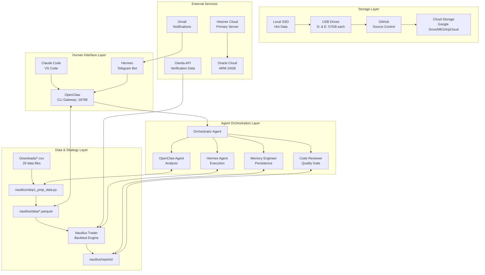

### Agent Communication Flow

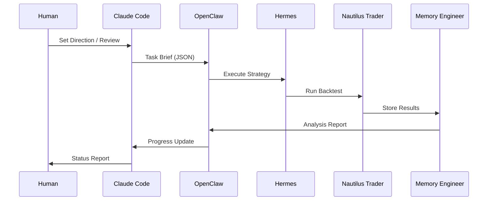

### Data Pipeline Flow

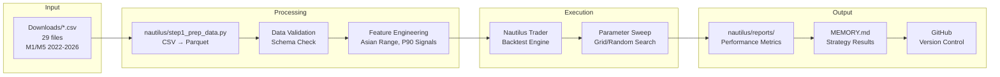

### Backup & Restore Architecture

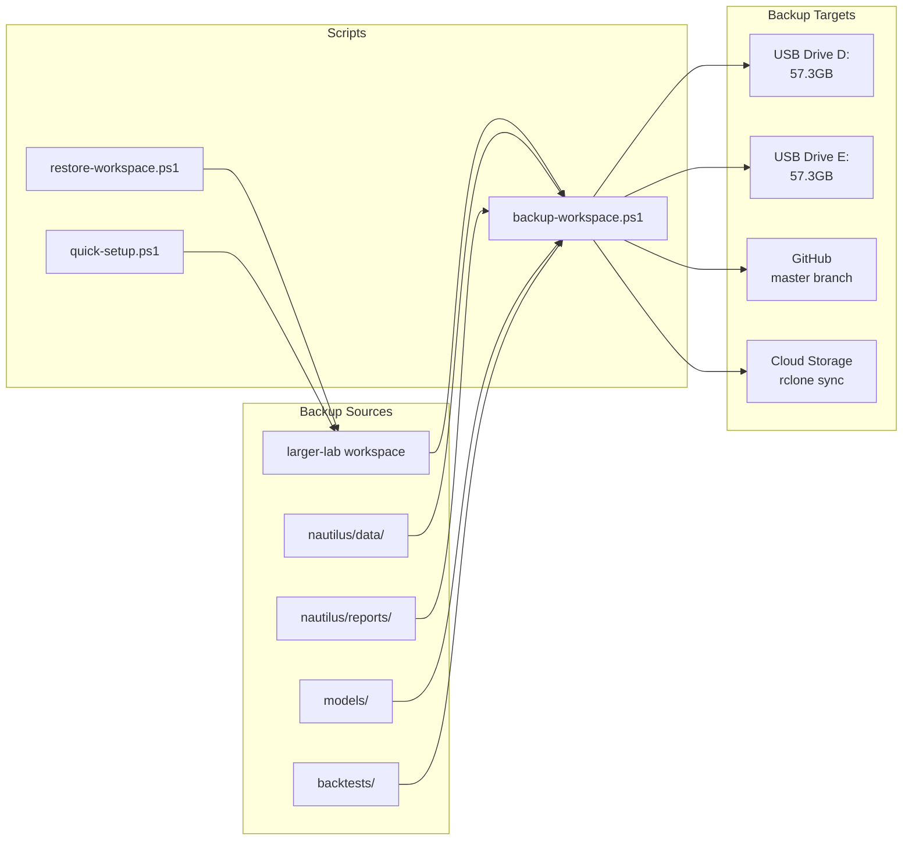

### P90 Strategy Logic Flow

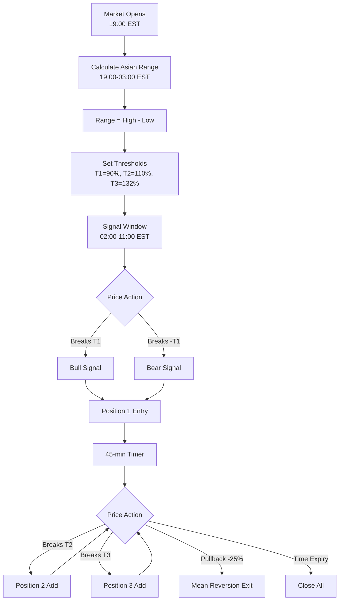

### Workflow Protocol State Machine

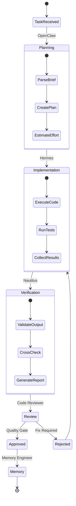

### File Structure Map

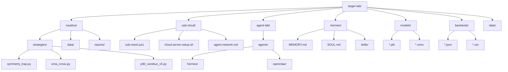

---

## 📊 Phase 1-5 Updated (CODEMAP.md)

### System Overview

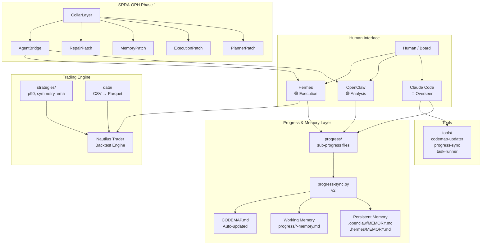

### Agent Workflow

```mermaid
flowchart TD
    H[Human gives direction] --> CC[Claude Code<br/>Overseer]

    CC --> |Task Brief| OC[OpenClaw<br/>Analysis & Planning]
    OC --> |Execution Plan| HR[Hermes<br/>Execution]

    HR --> |Backtest| NT[Nautilus Trader]
    NT --> |Results| HR

    HR --> |Progress Update| PP[progress/hermes-progress.md]
    OC --> |Progress Update| PP2[progress/openclaw-progress.md]
    CC --> |Progress Update| PP3[progress/claude-code-progress.md]

    PP --> SYNC[progress-sync.py]
    PP2 --> SYNC
    PP3 --> SYNC

    SYNC --> |Every 3 updates| PPC[PROJECT_PROGRESS_CLEAN.md]
    SYNC --> |Working Memory| WM[progress/*-memory.md]
    SYNC --> |Append Summary| PM[.openclaw/MEMORY.md<br/>.hermes/MEMORY.md]
    SYNC --> |Global State| RM[/memories/repo/workspace-state.md]

    HR --> |Complete| REVIEW{Overseer Review}
    REVIEW --> |Approve| NEXT[Next Phase]
    REVIEW --> |Fix| HR
    NEXT --> |New Task| OC
```

### Data Pipeline

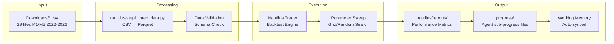

### SRRA-OPH Architecture

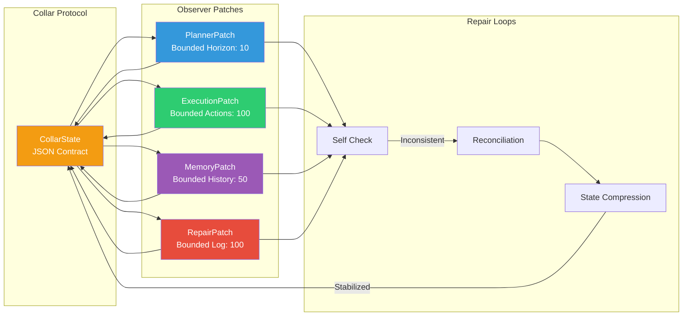

### File Structure

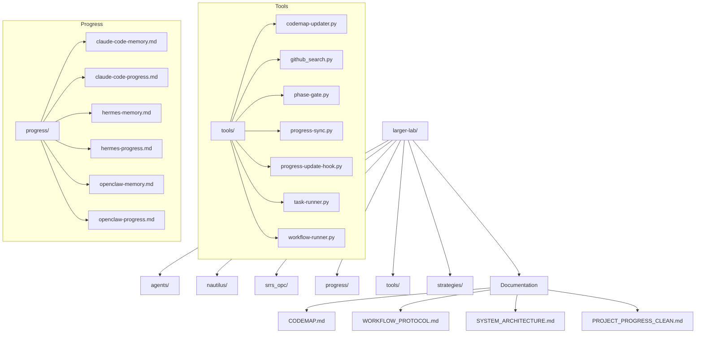

---

## 📊 Phase 6-9 Resources

### Full SRRA-OPH Topology

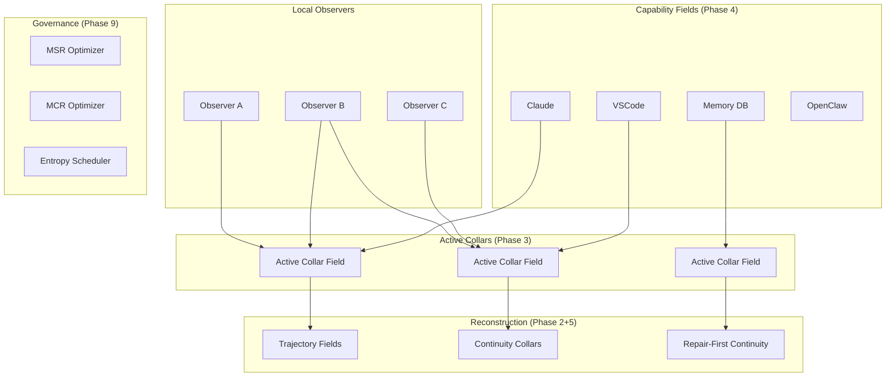

### Agent Integration Points

| Agent | URL/Config | Skills | Memory |
|-------|------------|--------|--------|
| **OpenClaw Gateway** | `ws://127.0.0.1:18789` | `.hermes/skills/` + `nautilus/` | `.openclaw/MEMORY.md` |
| **Hermes Telegram Bot** | Telegram messages | `.hermes/skills/` | `.hermes/MEMORY.md` |
| **Nautilus Trader** | `nautilus/strategies/` | N/A | `nautilus/reports/` |

---

## 🔄 V3 Cognitive Field — Resonant Signal Substrate (Level 6)

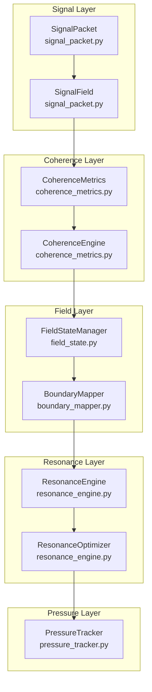

---

## 🔄 V3 Phase 2 — Reconstructive Continuity Manifold (Level 7)

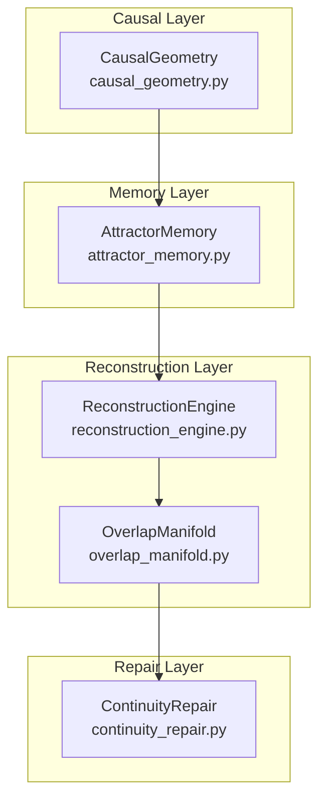
