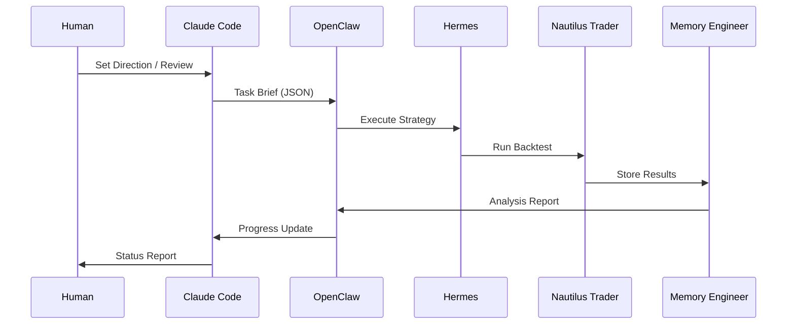

# Agent Communication Flow — Phase 1-5 Original

> Source: PROJECT_PROGRESS.md (line 668)
> Phase: 1-5 Original

```mermaid
sequenceDiagram
    participant H as Human
    participant CC as Claude Code
    participant OC as OpenClaw
    participant HM as Hermes
    participant NT as Nautilus Trader
    participant MEM as Memory Engineer

    H->>CC: Set Direction / Review
    CC->>OC: Task Brief (JSON)
    OC->>HM: Execute Strategy
    HM->>NT: Run Backtest
    NT->>MEM: Store Results
    MEM->>OC: Analysis Report
    OC->>CC: Progress Update
    CC->>H: Status Report
```
