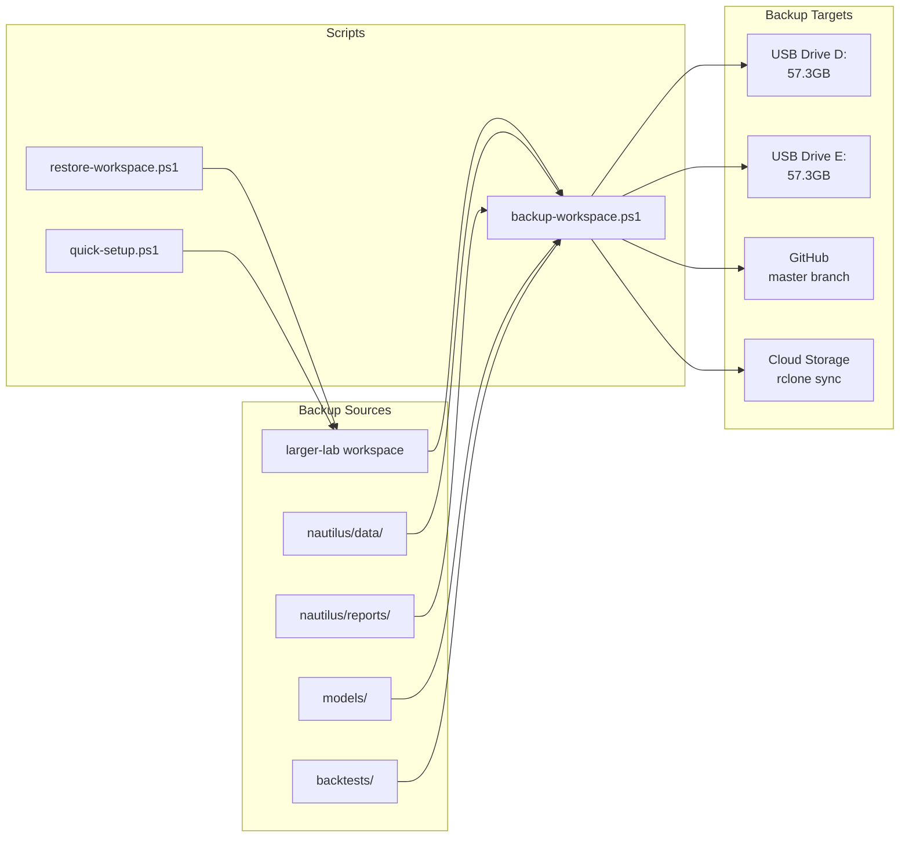

# Backup & Restore Architecture — Phase 1-5 Original

> Source: PROJECT_PROGRESS.md (line 719)
> Phase: 1-5 Original

```mermaid
graph LR
    subgraph "Backup Sources"
        A[larger-lab workspace]
        B[nautilus/data/]
        C[nautilus/reports/]
        D[models/]
        E[backtests/]
    end

    subgraph "Backup Targets"
        F[USB Drive D:<br/>57.3GB]
        G[USB Drive E:<br/>57.3GB]
        H[GitHub<br/>master branch]
        I[Cloud Storage<br/>rclone sync]
    end

    subgraph "Scripts"
        J[backup-workspace.ps1]
        K[restore-workspace.ps1]
        L[quick-setup.ps1]
    end

    A --> J
    B --> J
    C --> J
    D --> J
    E --> J

    J --> F
    J --> G
    J --> H
    J --> I

    K --> A
    L --> A
```
