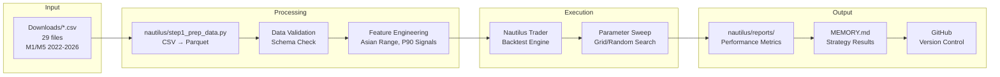

# Data Pipeline Flow — Phase 1-5 Original

> Source: PROJECT_PROGRESS.md (line 689)
> Phase: 1-5 Original

```mermaid
flowchart LR
    subgraph "Input"
        A[Downloads/*.csv<br/>29 files<br/>M1/M5 2022-2026]
    end

    subgraph "Processing"
        B[nautilus/step1_prep_data.py<br/>CSV → Parquet]
        C[Data Validation<br/>Schema Check]
        D[Feature Engineering<br/>Asian Range, P90 Signals]
    end

    subgraph "Execution"
        E[Nautilus Trader<br/>Backtest Engine]
        F[Parameter Sweep<br/>Grid/Random Search]
    end

    subgraph "Output"
        G[nautilus/reports/<br/>Performance Metrics]
        H[MEMORY.md<br/>Strategy Results]
        I[GitHub<br/>Version Control]
    end

    A --> B --> C --> D --> E --> F --> G
    G --> H
    H --> I
```
