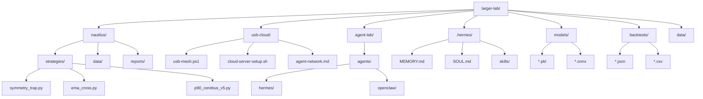

# File Structure Map — Phase 1-5 Original

> Source: PROJECT_PROGRESS.md (line 864)
> Phase: 1-5 Original

```mermaid
graph TD
    A[larger-lab/] --> B[nautilus/]
    A --> C[usb-cloud/]
    A --> D[agent-lab/]
    A --> E[.hermes/]
    A --> F[models/]
    A --> G[backtests/]
    A --> H[data/]

    B --> B1[strategies/]
    B --> B2[data/]
    B --> B3[reports/]
    B1 --> B1a[symmetry_trap.py]
    B1 --> B1b[ema_cross.py]
    B1 --> B1c[p90_cerebus_v5.py]

    C --> C1[usb-mesh.ps1]
    C --> C2[cloud-server-setup.sh]
    C --> C3[agent-network.md]

    D --> D1[agents/]
    D1 --> D1a[hermes/]
    D1 --> D1b[openclaw/]

    E --> E1[MEMORY.md]
    E --> E2[SOUL.md]
    E --> E3[skills/]

    F --> F1[*.pkl]
    F --> F2[*.onnx]

    G --> G1[*.json]
    G --> G2[*.csv]
```
