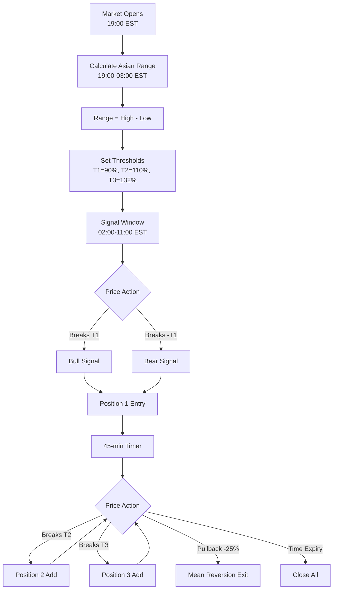

# P90 Strategy Logic Flow — Phase 1-5 Original

> Source: PROJECT_PROGRESS.md (line 759)
> Phase: 1-5 Original

```mermaid
flowchart TD
    A[Market Opens<br/>19:00 EST] --> B[Calculate Asian Range<br/>19:00-03:00 EST]
    B --> C[Range = High - Low]
    C --> D[Set Thresholds<br/>T1=90%, T2=110%, T3=132%]

    D --> E[Signal Window<br/>02:00-11:00 EST]
    E --> F{Price Action}
    F -->|Breaks T1| G[Bull Signal]
    F -->|Breaks -T1| H[Bear Signal]

    G --> I[Position 1 Entry]
    H --> I

    I --> J[45-min Timer]
    J --> K{Price Action}
    K -->|Breaks T2| L[Position 2 Add]
    K -->|Breaks T3| M[Position 3 Add]
    K -->|Pullback -25%| N[Mean Reversion Exit]
    K -->|Time Expiry| O[Close All]

    L --> K
    M --> K
```
