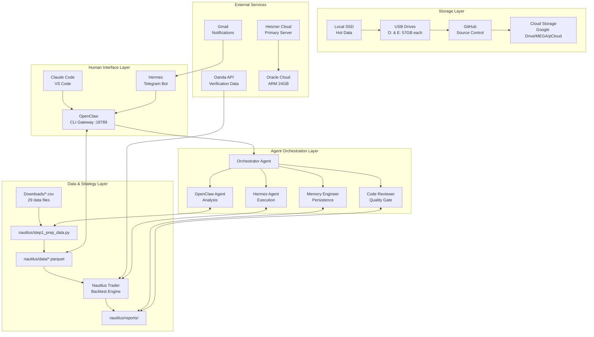

# System Architecture Overview — Phase 1-5 Original

> Source: PROJECT_PROGRESS.md (line 625)
> Phase: 1-5 Original

```mermaid
graph TB
    subgraph "Human Interface Layer"
        A[Claude Code<br/>VS Code] --> B[OpenClaw<br/>CLI Gateway :18789]
        C[Hermes<br/>Telegram Bot] --> B
    end

    subgraph "Agent Orchestration Layer"
        B --> D[Orchestrator Agent]
        D --> E[Hermes Agent<br/>Execution]
        D --> F[OpenClaw Agent<br/>Analysis]
        D --> G[Memory Engineer<br/>Persistence]
        D --> H[Code Reviewer<br/>Quality Gate]
    end

    subgraph "Data & Strategy Layer"
        I[Downloads/*.csv<br/>29 data files] --> J[nautilus/step1_prep_data.py]
        J --> K[nautilus/data/*.parquet]
        K --> L[Nautilus Trader<br/>Backtest Engine]
        L --> M[nautilus/reports/]
    end

    subgraph "Storage Layer"
        N[Local SSD<br/>Hot Data] --> O[USB Drives<br/>D: & E: 57GB each]
        O --> P[GitHub<br/>Source Control]
        P --> Q[Cloud Storage<br/>Google Drive/MEGA/pCloud]
    end

    subgraph "External Services"
        R[Oanda API<br/>Verification Data] --> L
        S[Hetzner Cloud<br/>Primary Server] --> T[Oracle Cloud<br/>ARM 24GB]
        U[Gmail<br/>Notifications] --> C
    end

    B <--> K
    E <--> L
    F <--> J
    G <--> M
    H <--> M
```
