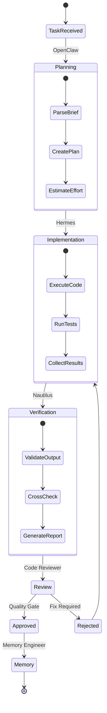

# Workflow Protocol State Machine — Phase 1-5 Original

> Source: PROJECT_PROGRESS.md (line 826)
> Phase: 1-5 Original

```mermaid
stateDiagram-v2
    [*] --> TaskReceived
    TaskReceived --> Planning: OpenClaw
    Planning --> Implementation: Hermes
    Implementation --> Verification: Nautilus
    Verification --> Review: Code Reviewer
    Review --> Approved: Quality Gate
    Review --> Rejected: Fix Required
    Rejected --> Implementation
    Approved --> Memory: Memory Engineer
    Memory --> [*]

    state Planning {
        [*] --> ParseBrief
        ParseBrief --> CreatePlan
        CreatePlan --> EstimateEffort
    }

    state Implementation {
        [*] --> ExecuteCode
        ExecuteCode --> RunTests
        RunTests --> CollectResults
    }

    state Verification {
        [*] --> ValidateOutput
        ValidateOutput --> CrossCheck
        CrossCheck --> GenerateReport
    }
```
