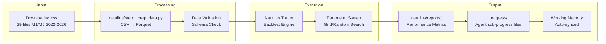

# Data Pipeline — Phase 1-5 Updated

> Source: CODEMAP.md (line 336)
> Phase: 1-5 Updated

```mermaid
flowchart LR
    subgraph "Input"
        CSV[Downloads/*.csv<br/>29 files M1/M5 2022-2026]
    end

    subgraph "Processing"
        PREP[nautilus/step1_prep_data.py<br/>CSV → Parquet]
        VALID[Data Validation<br/>Schema Check]
    end

    subgraph "Execution"
        NT[Nautilus Trader<br/>Backtest Engine]
        SWEEP[Parameter Sweep<br/>Grid/Random Search]
    end

    subgraph "Output"
        REPORTS[nautilus/reports/<br/>Performance Metrics]
        PROGRESS[progress/<br/>Agent sub-progress files]
        MEMORY[Working Memory<br/>Auto-synced]
    end

    CSV --> PREP --> VALID --> NT --> SWEEP --> REPORTS
    REPORTS --> PROGRESS --> MEMORY
```
