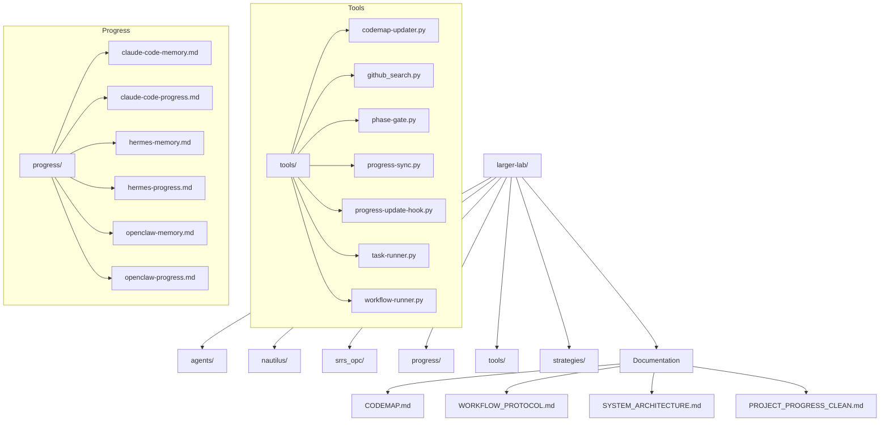

# File Structure — Phase 1-5 Updated

> Source: CODEMAP.md (line 411)
> Phase: 1-5 Updated

```mermaid
graph TD
    ROOT[larger-lab/]

    ROOT --> AGT[agents/]
    ROOT --> NAUT[nautilus/]
    ROOT --> SRRS[srrs_opc/]
    ROOT --> PROG[progress/]
    ROOT --> TOOLS[tools/]
    ROOT --> STRAT[strategies/]

    subgraph "Tools"
        T[tools/]
        T --> codemap-updater[codemap-updater.py]
        T --> github_search[github_search.py]
        T --> phase-gate[phase-gate.py]
        T --> progress-sync[progress-sync.py]
        T --> progress-update-hook[progress-update-hook.py]
        T --> task-runner[task-runner.py]
        T --> workflow-runner[workflow-runner.py]
    end

    subgraph "Progress"
        P[progress/]
        P --> claude-code-memory[claude-code-memory.md]
        P --> claude-code-progress[claude-code-progress.md]
        P --> hermes-memory[hermes-memory.md]
        P --> hermes-progress[hermes-progress.md]
        P --> openclaw-memory[openclaw-memory.md]
        P --> openclaw-progress[openclaw-progress.md]
    end

    ROOT --> DOCS[Documentation]
    DOCS --> CODEMAP[CODEMAP.md]
    DOCS --> WORKFLOW[WORKFLOW_PROTOCOL.md]
    DOCS --> ARCH[SYSTEM_ARCHITECTURE.md]
    DOCS --> PROJ[PROJECT_PROGRESS_CLEAN.md]
```
