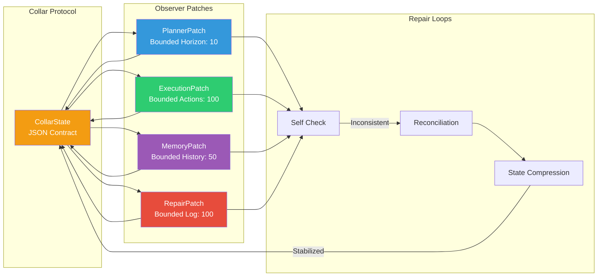

# SRRA-OPH Architecture — Phase 1-5 Updated

> Source: CODEMAP.md (line 364)
> Phase: 1-5 Updated

```mermaid
graph LR
    subgraph "Collar Protocol"
        C1[CollarState<br/>JSON Contract]
    end

    subgraph "Observer Patches"
        PP[PlannerPatch<br/>Bounded Horizon: 10]
        EP[ExecutionPatch<br/>Bounded Actions: 100]
        MP[MemoryPatch<br/>Bounded History: 50]
        RP[RepairPatch<br/>Bounded Log: 100]
    end

    subgraph "Repair Loops"
        SC[Self Check]
        RE[Reconciliation]
        COMP[State Compression]
    end

    PP --> C1
    EP --> C1
    MP --> C1
    RP --> C1

    C1 --> PP
    C1 --> EP
    C1 --> MP
    C1 --> RP

    PP --> SC
    EP --> SC
    MP --> SC
    RP --> SC

    SC -->|Inconsistent| RE
    RE --> COMP
    COMP -->|Stabilized| C1

    style PP fill:#3498db,color:#fff
    style EP fill:#2ecc71,color:#fff
    style MP fill:#9b59b6,color:#fff
    style RP fill:#e74c3c,color:#fff
    style C1 fill:#f39c12,color:#fff
```
