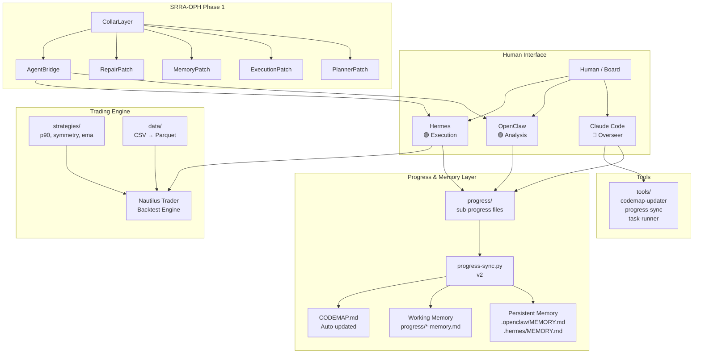

# System Overview — Phase 1-5 Updated

> Source: CODEMAP.md (line 259)
> Phase: 1-5 Updated

```mermaid
graph TB
    subgraph "Human Interface"
        H[Human / Board] --> CC[Claude Code<br/>🔵 Overseer]
        H --> OC[OpenClaw<br/>🟣 Analysis]
        H --> HR[Hermes<br/>🟢 Execution]
    end

    subgraph "Progress & Memory Layer"
        PP[progress/<br/>sub-progress files] --> SYNC[progress-sync.py<br/>v2]
        SYNC --> PM[Persistent Memory<br/>.openclaw/MEMORY.md<br/>.hermes/MEMORY.md]
        SYNC --> WM[Working Memory<br/>progress/*-memory.md]
        SYNC --> CM[CODEMAP.md<br/>Auto-updated]
    end

    subgraph "SRRA-OPH Phase 1"
        CL[CollarLayer] --> PP1[PlannerPatch]
        CL --> EP[ExecutionPatch]
        CL --> MP[MemoryPatch]
        CL --> RP[RepairPatch]
        CL --> AB[AgentBridge]
    end

    subgraph "Trading Engine"
        NT[Nautilus Trader<br/>Backtest Engine]
        STR[strategies/<br/>p90, symmetry, ema]
        DATA[data/<br/>CSV → Parquet]
    end

    subgraph "Tools"
        TU[tools/<br/>codemap-updater<br/>progress-sync<br/>task-runner]
    end

    CC --> PP
    OC --> PP
    HR --> PP
    CC --> TU
    HR --> NT
    AB --> OC
    AB --> HR
    DATA --> NT
    STR --> NT
```
