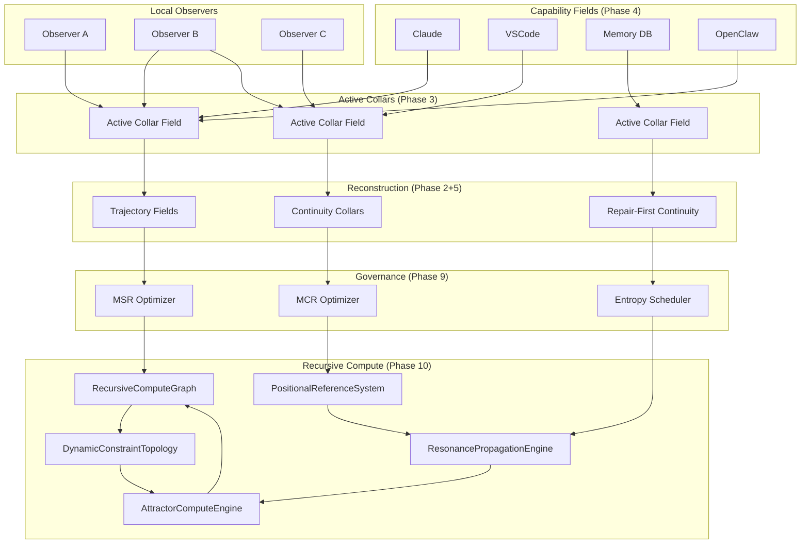

# Full SRRA-OPH Topology — Phases 1-10

> Source: CODEMAP.md (line 125)
> Phase: 6-9 Resources | Updated: Phase 10 Complete

## Phase 10: Recursive Field Computation ✅ COMPLETE

| Module | File | Tests | Purpose |
|--------|------|-------|---------|
| RecursiveComputeGraph | `oce/backend/phase10/rcg.py` | 6 | Recursive compute graph + stabilization |
| PositionalReferenceSystem | `oce/backend/phase10/prs.py` | 5 | Positional reference system |
| ResonancePropagationEngine | `oce/backend/phase10/rpe.py` | 4 | Resonance propagation engine |
| DynamicConstraintTopology | `oce/backend/phase10/dct.py` | 4 | Dynamic constraint topology |
| AttractorComputeEngine | `oce/backend/phase10/ace.py` | 4 | Attractor compute engine |
| **Total** | | **23 tests** | |
