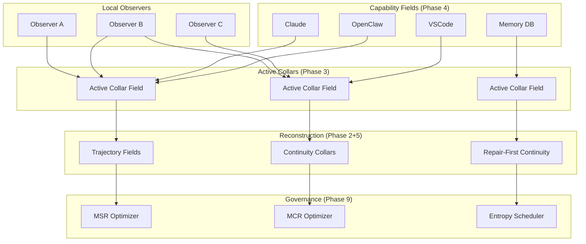

# Full SRRA-OPH Topology — Phases 1-9

> Source: CODEMAP.md (line 125)
> Phase: 6-9 Resources

```mermaid
graph TD
    subgraph "Local Observers"
        O1[Observer A]
        O2[Observer B]
        O3[Observer C]
    end

    subgraph "Active Collars (Phase 3)"
        AC1[Active Collar Field]
        AC2[Active Collar Field]
        AC3[Active Collar Field]
    end

    subgraph "Reconstruction (Phase 2+5)"
        TF[Trajectory Fields]
        CC[Continuity Collars]
        RP[Repair-First Continuity]
    end

    subgraph "Capability Fields (Phase 4)"
        CF1[Claude]
        CF2[VSCode]
        CF3[Memory DB]
        CF4[OpenClaw]
    end

    subgraph "Governance (Phase 9)"
        MSR[MSR Optimizer]
        MCR[MCR Optimizer]
        ES[Entropy Scheduler]
    end

    O1 --> AC1
    O2 --> AC1
    O2 --> AC2
    O3 --> AC2

    AC1 --> TF
    AC2 --> CC
    AC3 --> RP

    CF1 --> AC1
    CF2 --> AC2
    CF3 --> AC3
    CF4 --> AC1

    TF --> MSR
    CC --> MCR
    RP --> ES
```
