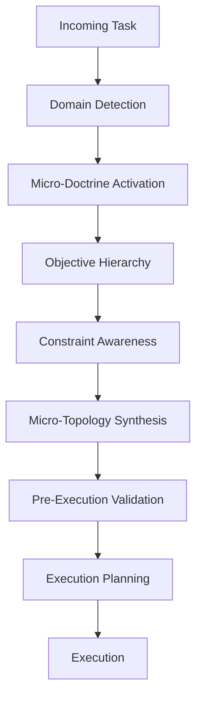
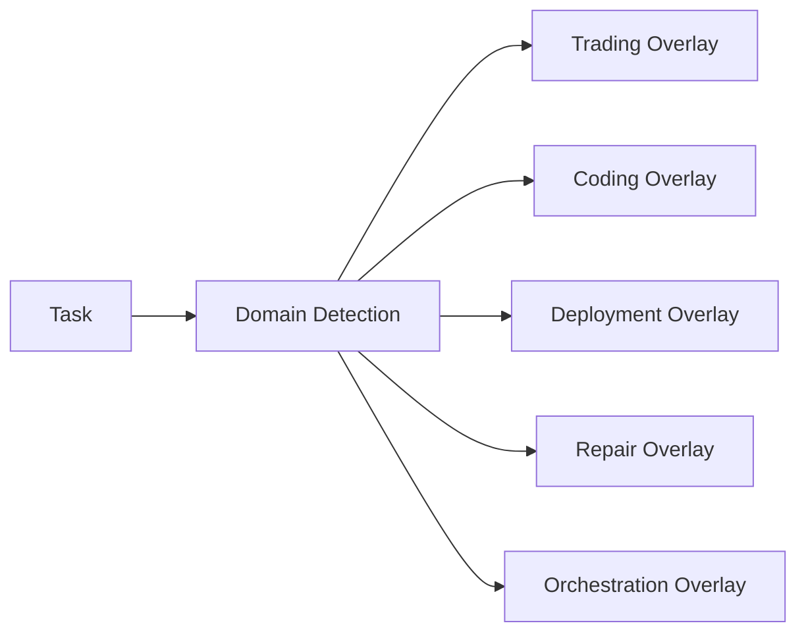
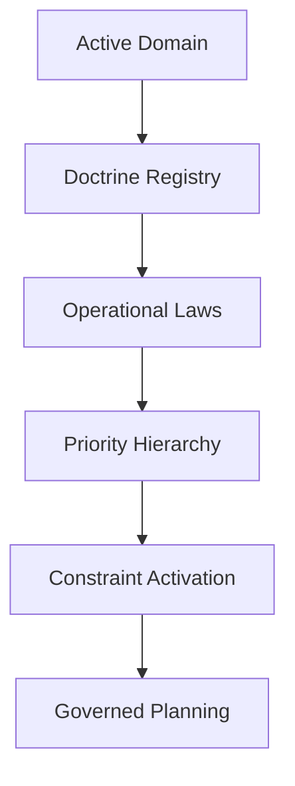
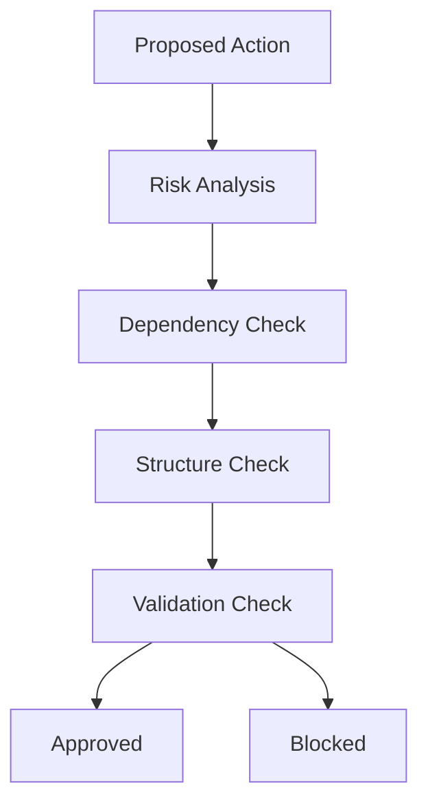
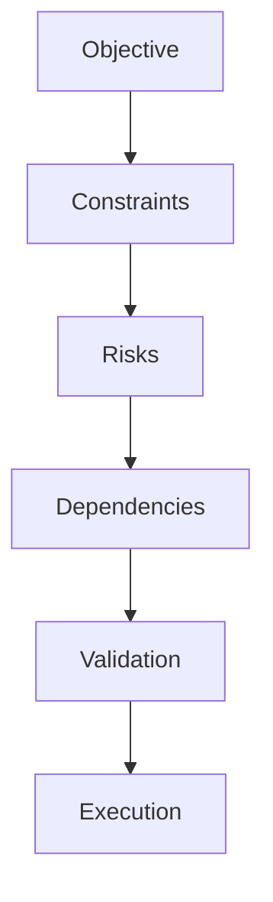
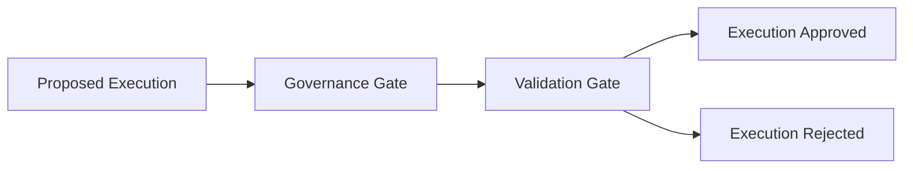
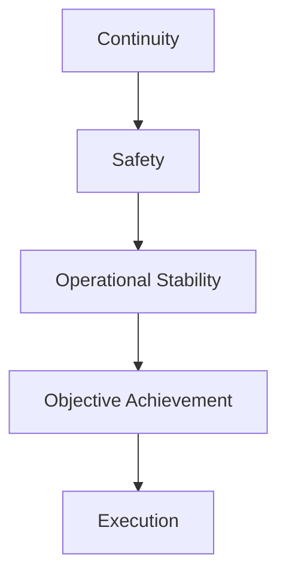
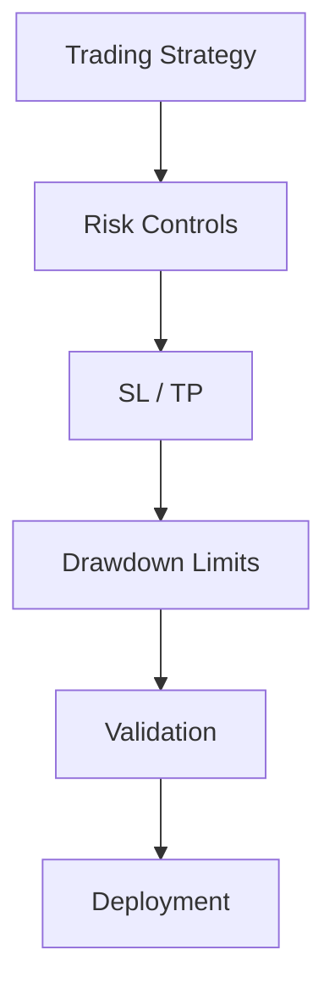
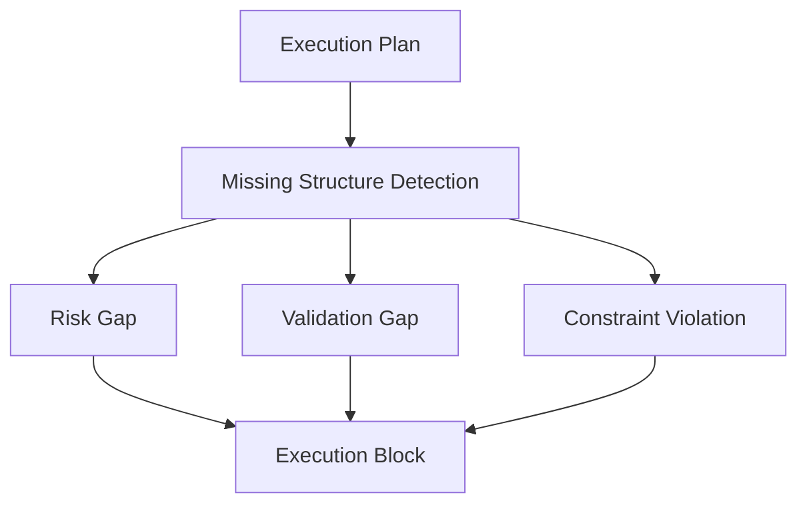
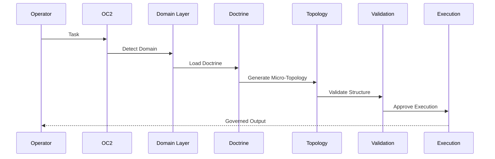

# CG-1 MERMAID VISUAL SPECIFICATIONS (MAD 2026-05-28)

## Master Operational Flow

## Component 1: Domain Activation Flow

## Component 2: Micro-Doctrine Injection

## Component 3: Pre-Execution Validation Loop

## Component 4: Micro-Topology Thinking

## Component 5: Execution Gating

## Component 6: Priority Hierarchy Engine

## Trading Domain Example

## Failure Detection Flow

## OC2 Governed Execution Model (Sequence)

---
_CG-1 Visual Specs | 2026-05-28 | For reference. Internal思维 tool, not for constant rendering._
