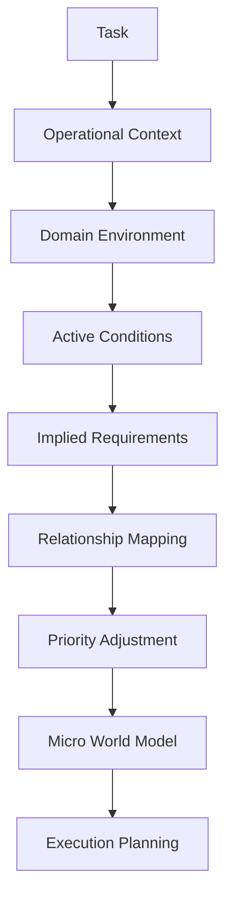
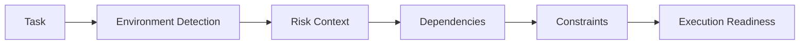
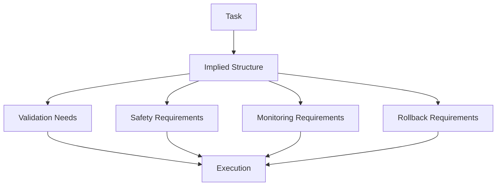
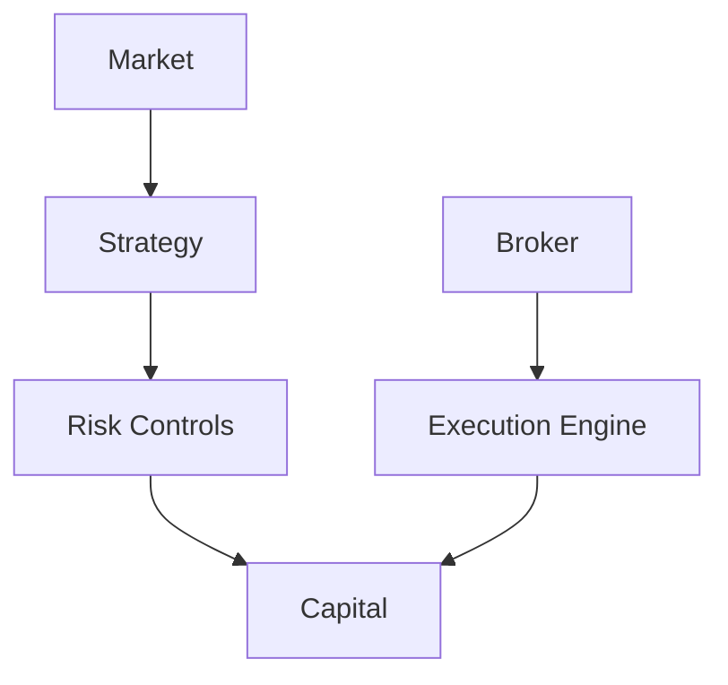
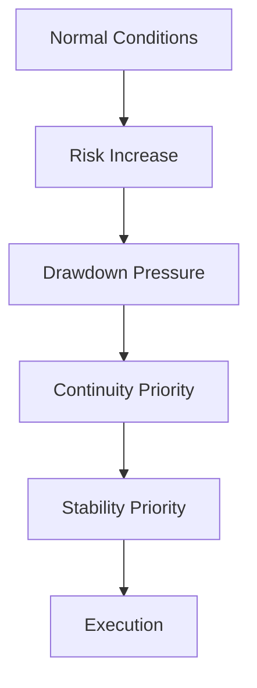
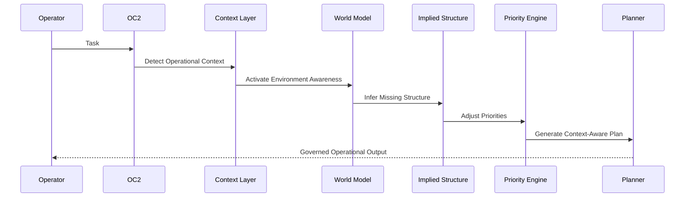

# CG-2 MERMAID VISUAL SPECIFICATIONS + ANCHOR DIRECTIVE (MAD 2026-05-28)

## Anchor Directive — READ THIS FIRST
This phase does NOT require AGI, consciousness, human intuition, omniscience, or full reality simulation.

**What this phase IS:** Operational situational awareness — recognizing the operational environment surrounding a task.

**What this phase is NOT:** Infinite reasoning, unlimited abstraction, philosophy, recursive expansion, god-model cognition.

**Core principle:** Reduce operational blindness. That's it.

**Keep world modeling:** operational, bounded, lightweight, execution-oriented, context-relevant — NOT philosophical or infinitely recursive.

## Master Graph

## Operational Context Flow

## Implied Structure Inference

## Micro World Model Example

## Contextual Priority Shift

## Full Phase 2 Execution Sequence

---
_CG-2 Visual Specs + Anchor Directive | 2026-05-28 | Bounded operational cognition. Not infinite reasoning._
