# CG-4 EXECUTION INTELLIGENCE — MERMAID VISUAL SPECS (MAD 2026-05-28)

## Master Execution Intelligence Graph
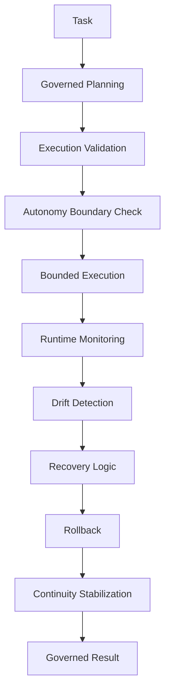

## Component 1: Execution Governance
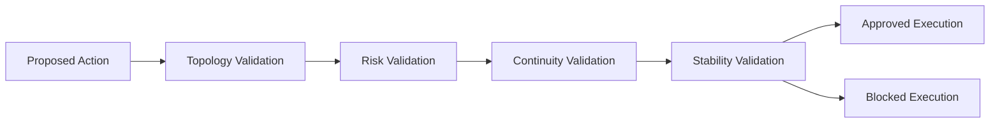

## Component 2: Autonomy Boundaries
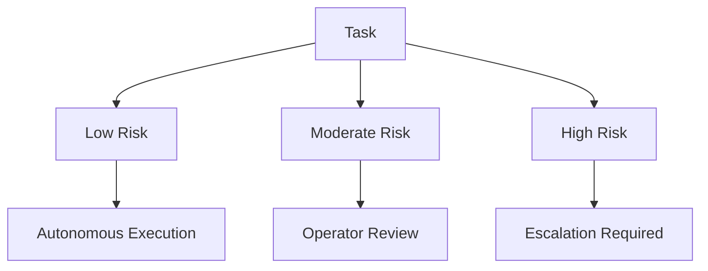

## Component 3: Execution Monitoring
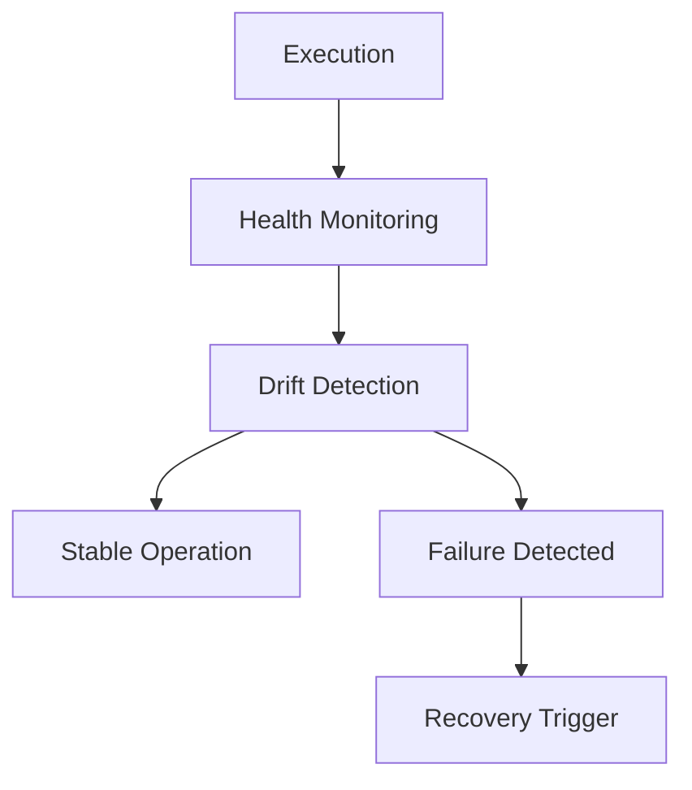

## Component 4: Recovery + Rollback
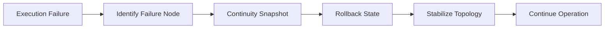

## Component 5: Execution Stabilization
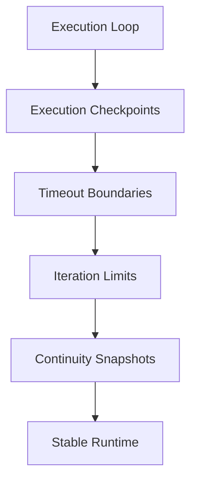

## Component 6: Subagent Governance
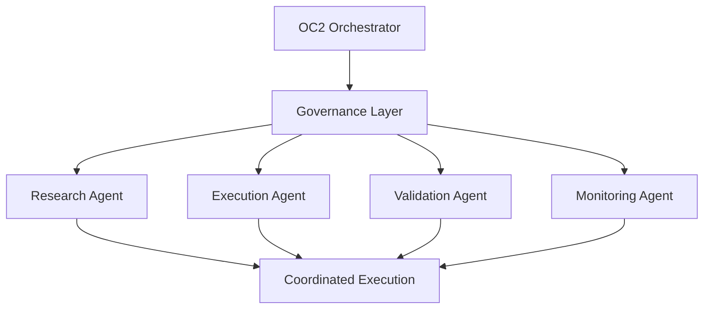

## Component 7: Operational Recovery Memory
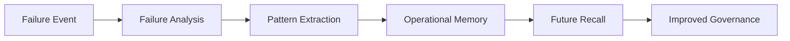

## OpenClaw Execution Overlay
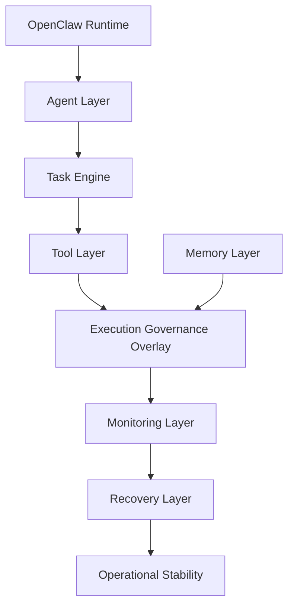

## Execution Failure Propagation
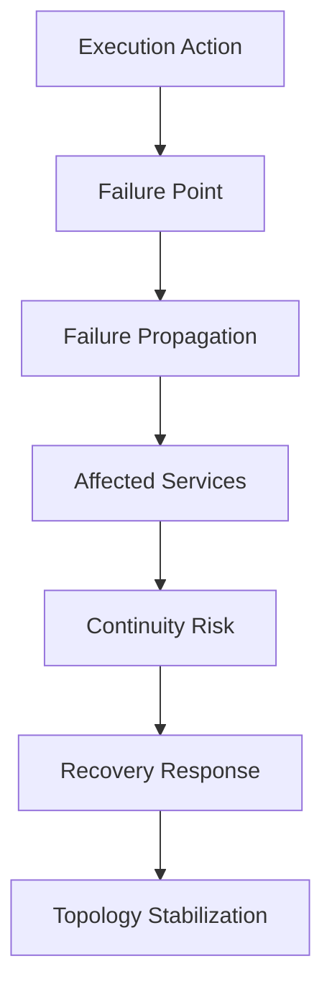

## Governed Tool Execution Flow
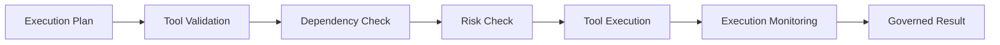

## Full Phase 4 Execution Sequence
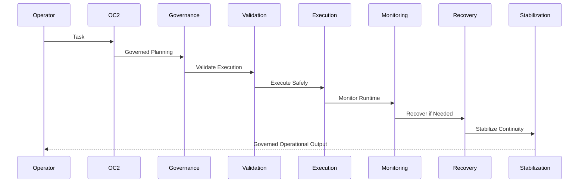

---
_CG-4 Visual Specs | 2026-05-28 | Reference graphs for execution intelligence cognition._
