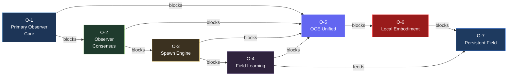
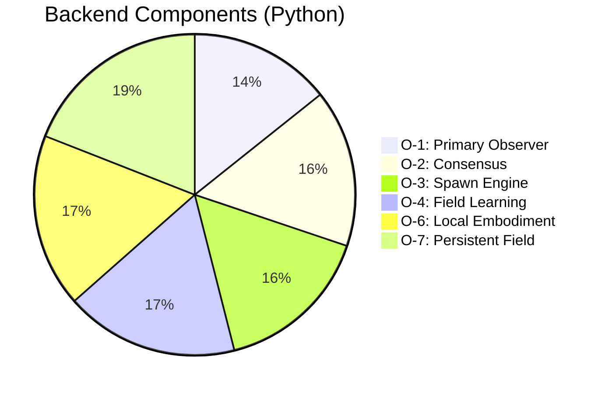
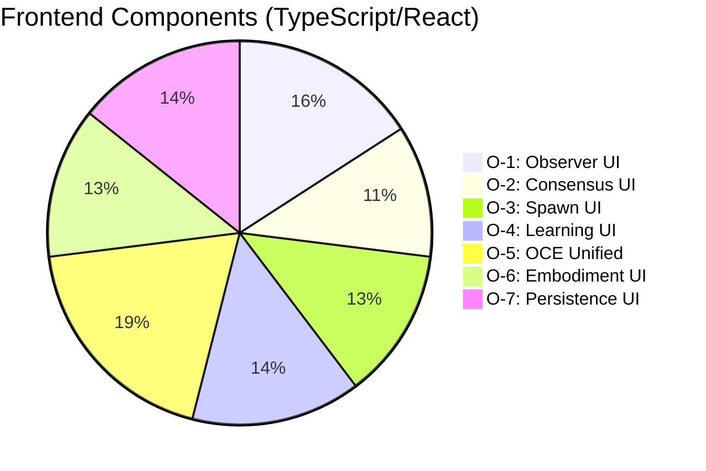

# OBSERVER CORE + OCE UNIFIED — WORKSPACE STATE

> **Created:** 2026-05-26
> **Last Updated:** 2026-05-26 13:00 UTC
> **Status:** PLANNING COMPLETE — Ready for Task Assignment

---

## WHAT PHASE IS THIS?

This is the **Observer Core + OCE Unified** phase — the next major development phase after Phase 11 testing.

**Key insight from source files:** The observer is NOT an LLM. It's a continuity abstraction layer. The intelligence is the field, not any single model or agent.

---

## PHASE STATUS OVERVIEW

---

## COMPONENT COUNT BY PHASE

## SOURCE FILES (Read in this order)

1. **`OBSERVER CORE BUILD AFTER FRONT END.txt`** — Phases O-0 → O-7, build order, development rules
2. **`oce front end upgrade plan.txt`** — Primary Observer UX, two-layer UI, chat-centric design
3. **`FRONT END AND SYSTEM CLARITY FOR BUILD.txt`** — Unified architecture (ONE system), OCE role, SRRA role
4. **`EXTRA CONTEXT AND PLANS FOR FRONT END AND OBSERVERS.txt`** — Observer ≠ LLM, corrected architecture

---

## PLANNING FILES CREATED

| File | Purpose |
|------|---------|
| `plans/observer-core/MASTER-PLAN-OBSERVER-CORE.md` | Complete master plan with all phases, architecture, rules |
| `plans/observer-core/PHASE-BREAKDOWN.md` | Component-by-component task breakdown for each phase |
| `plans/observer-core/OBSERVER-CORE-WORKSPACE-STATE.md` | This file — workspace state and progress tracking |
| `plans/observer-core/OCE-UNIFIED-FRONTEND-PLAN.md` | OCE unified frontend integration plan |

---

## ARCHITECTURE DECISIONS MADE

1. **ONE unified OCE frontend** — SRRA-OPH observatory integrated as Layer 2 panels, not separate app
2. **Observer ≠ LLM** — Primary Observer is continuity abstraction layer, not a chatbot
3. **Build order: Stability → Visibility → Replay → Boundaries → Persistence → Adaptation → Automation**
4. **Agents are temporary** — Spawned models are ephemeral cognition workers, not the system
5. **Most system should be dormant** — Low-energy observational state, acts only when required
6. **Bounded execution mandatory** — Every layer has operational boundaries
7. **Replay is core infrastructure** — Not optional, mandatory for all systems

---

## PHASES AND STATUS

| Phase | Name | Status | Priority |
|-------|------|--------|----------|
| O-1 | Primary Observer Core | ⏳ Planned | IMMEDIATE |
| O-2 | Observer Consensus + Task Routing | ⏳ Planned | IMMEDIATE |
| O-3 | Spawn Engine + Context Inheritance | ⏳ Planned | IMMEDIATE |
| O-4 | Operational Trace + Field Learning | ⏳ Planned | IMMEDIATE |
| O-5 | OCE Unified Operational Observatory | ⏳ Planned | IMMEDIATE |
| O-6 | Local Execution Substrate | ⏳ Planned | LATER |
| O-7 | Persistent Field Mode | ⏳ Planned | LATER |

---

## BUILD ORDER (MANDATORY)

1. **O-1: Primary Observer Core** — Foundation
2. **O-2: Observer Consensus** — Routing intelligence
3. **O-3: Spawn Engine** — Dynamic cognition deployment
4. **O-4: Field Learning** — Meta-operational adaptation
5. **O-5: OCE Unified** — Frontend integration
6. **O-6: Local Embodiment** — Machine awareness
7. **O-7: Persistent Field** — Continuous continuity

**NEVER skip:** replay, logging, entropy tracking, boundaries, topology visibility, recovery paths.

---

## KEY METRICS TO TRACK

| Metric | Meaning |
|--------|---------|
| continuity stability | system coherence |
| entropy pressure | orchestration health |
| replay completeness | explainability |
| recovery success rate | resilience |
| topology stability | structural integrity |
| observer synchronization | coordination quality |
| orchestration latency | operational efficiency |
| spawn success rate | runtime reliability |

---

## DEVELOPMENT RULES

1. **OBSERVE BEFORE AUTOMATING** — Visualize, replay, monitor, understand. Then automate.
2. **TEST LONGER THAN YOU THINK** — Most failures appear after 24hr, 72hr, during idle, during recovery.
3. **BUILD FOR RECOVERY** — Assume observers crash, models fail, runtimes hang, memory corrupts.
4. **PREVENT ORCHESTRATION STORMS** — Rate limits and execution caps always.
5. **DO NOT OVER-CENTRALIZE** — Primary observer coordinates, doesn't execute everything.
6. **TOPOLOGY IS A REAL SIGNAL** — Treat topology changes as operational telemetry.
7. **MEMORY SHOULD BE STRUCTURED** — Vector/graph memory, not massive prompt stuffing.

---

## NEXT ACTIONS (when ready to start)

1. Assign O-1 Primary Observer Core tasks to agents
2. Begin with backend components (PrimaryObserver, ObserverState, RuntimeAwareness)
3. Build frontend components in parallel (ChatPanel, ObserverConsole, observerStore)
4. Run O-1 tests before proceeding to O-2
