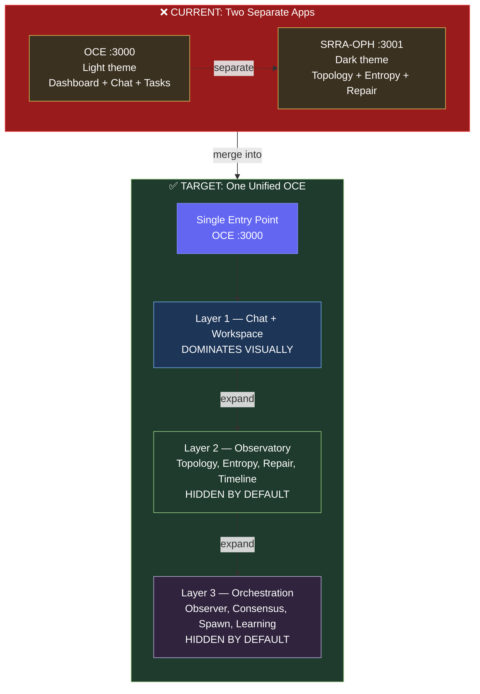
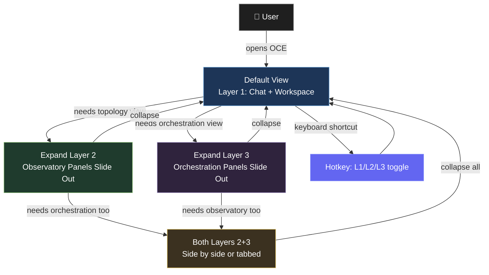
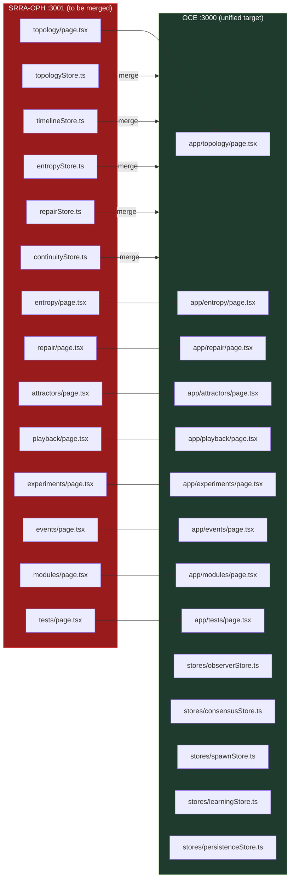
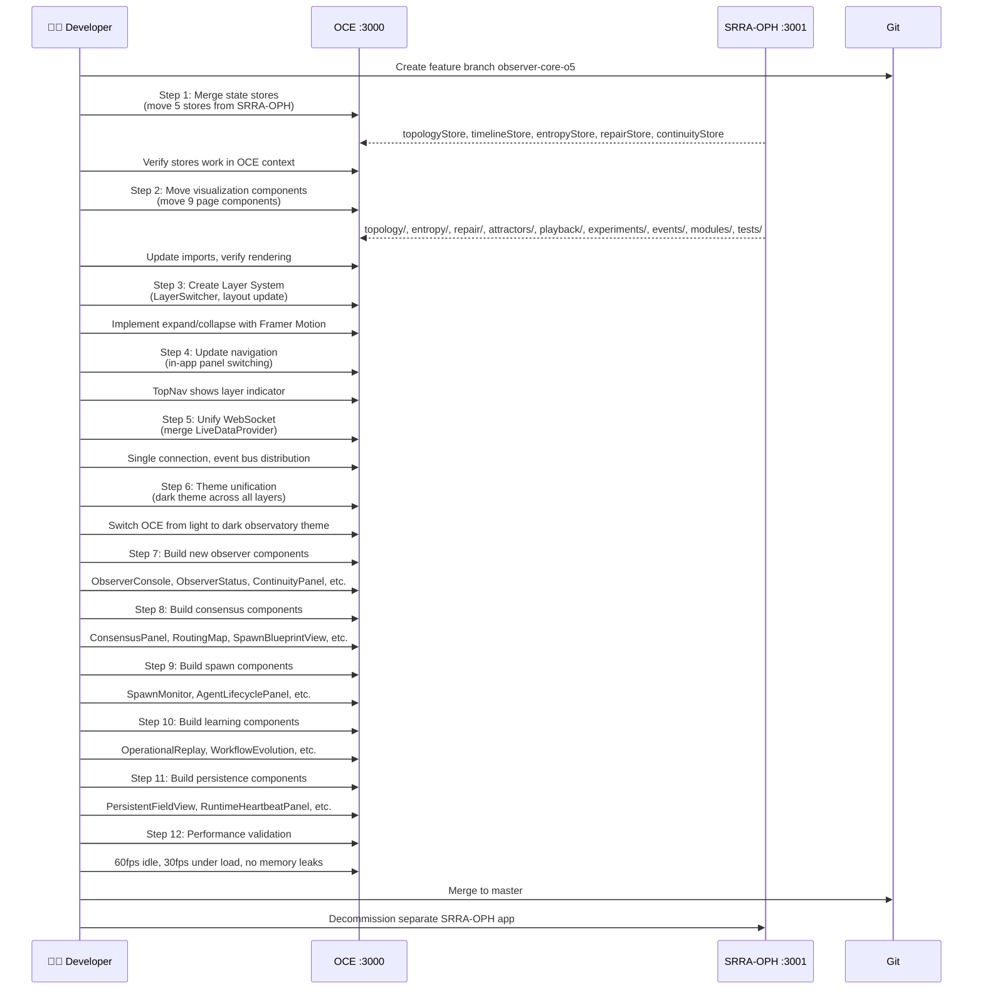

# OCE UNIFIED FRONTEND — PLAN

> **Created:** 2026-05-26
> **Status:** Planning — Ready for Task Assignment
> **Source:** `FRONT END AND SYSTEM CLARITY FOR BUILD.txt` + `oce front end upgrade plan.txt`

---

## CRITICAL ARCHITECTURE CORRECTION

**Current state:** Two separate frontend apps
- OCE (:3000) — operational cockpit
- SRRA-OPH (:3001) — topology observatory

**Target state:** ONE unified OCE frontend
- SRRA-OPH observatory panels integrated INTO OCE as Layer 2 (hidden by default)
- Single entry point, single navigation, single WebSocket connection
- User experiences ONE system, not two

---

## CURRENT vs TARGET ARCHITECTURE



---

## LAYER SWITCHING UX FLOW



---

## COMPONENT MIGRATION MAP



---

## UNIFIED STATE MANAGEMENT

```mermaid
flowchart TD
    subgraph STORES["Zustand Stores (Unified)"]
        direction TB
        OS["observerStore.ts<br/>Primary Observer state"]
        CS["consensusStore.ts<br/>Consensus state"]
        SS["spawnStore.ts<br/>Spawn state"]
        LS["learningStore.ts<br/>Learning state"]
        PS["persistenceStore.ts<br/>Persistence state"]
        TS["topologyStore.ts<br/>Topology state (moved from SRRA-OPH)"]
        TLS["timelineStore.ts<br/>Timeline state (moved from SRRA-OPH)"]
        ES["entropyStore.ts<br/>Entropy state (moved from SRRA-OPH)"]
        RS["repairStore.ts<br/>Repair state (moved from SRRA-OPH)"]
        COS["continuityStore.ts<br/>Continuity state (moved from SRRA-OPH)"]
        US["uiStore.ts<br/>UI state (exists in OCE)"]
    end
    
    subgraph WS["WebSocket (Unified)"]
        WSS["Single WebSocket Connection"]
    end
    
    WSS -->|"events"| OS
    WSS -->|"events"| CS
    WSS -->|"events"| SS
    WSS -->|"events"| LS
    WSS -->|"events"| PS
    WSS -->|"events"| TS
    WSS -->|"events"| TLS
    WSS -->|"events"| ES
    WSS -->|"events"| RS
    WSS -->|"events"| COS
    WSS -->|"events"| US
    
    style STORES fill:#1d3557,stroke:#6fa8dc,color:#fff
    style WS fill:#3b3120,stroke:#d6b656,color:#fff
    style WSS fill:#6366f1,stroke:#818cf8,color:#fff
```



---

## INTEGRATION SEQUENCE



## UNIFIED ARCHITECTURE

```
USER
 ↓
OCE FRONTEND (singular interface on one port)
 ↓
Layer 1 — Simple User Layer (DOMINATES)
  ├── Chat Panel (Primary Observer interface)
  ├── Task Workspace
  ├── Execution Feed
  ├── Artifacts/Results
  ├── Live Progress
  └── Replay Summaries
 ↓
Layer 2 — Observational Layer (HIDDEN BY DEFAULT)
  ├── Topology Observatory (moved from SRRA-OPH :3001)
  ├── Entropy Field View
  ├── Repair Cascade Viewer
  ├── Attractor Basin View
  ├── Temporal Playback System
  └── Experiment Session Viewer
 ↓
Layer 3 — Orchestration Layer (NEW — from Observer Core phases)
  ├── Observer Status Panel
  ├── Consensus View
  ├── Spawn Monitor
  ├── Agent Lifecycle Panel
  ├── Context Injection View
  ├── Execution Boundary View
  ├── Multi-Agent Flow Graph
  ├── Operational Replay
  ├── Routing Learning Map
  ├── Failure Analysis Panel
  ├── Observer Evolution Map
  └── Adaptation Monitor
 ↓
SRRA/OPH RUNTIME (backend, invisible)
```

---

## FRONTEND STACK (confirmed from existing code)

- **Framework:** Next.js (not Vite — already built with Next.js)
- **Language:** TypeScript
- **Styling:** TailwindCSS + CSS variables for field states
- **State:** Zustand (already in use)
- **Visualization:** Cytoscape (topology), D3.js, Plotly, Framer Motion
- **Real-time:** WebSocket (already in use via LiveDataProvider)

---

## VISUAL DESIGN RULES (from source files)

1. **Dark environment** — Deep matte black/charette background (#0a0a0f)
2. **Low-glow interface** — Minimal neon accents, no high saturation
3. **NO corporate UI** — No rounded cards, bubbly UI, oversized spacing, SaaS aesthetic
4. **Information density** — Compact layouts, layered data, contextual overlays, multi-scale zoom
5. **Spatial continuity** — Everything feels spatially connected, graphs feel alive
6. **Time is first-class** — All visual systems support replay, temporal scrub, continuity drift analysis
7. **Typography** — IBM Plex Mono, JetBrains Mono, Inter for labels only
8. **Color language:**
   - Blue = stable
   - Gold = active
   - Red = entropy
   - Green = repair
   - Purple = orchestration
   - White = observer continuity

---

## CURRENT OCE STATE vs REQUIRED STATE

### What Exists (OCE :3000):
- ✅ Layout: TopNav + MainContent + RightPanel + StatusBar
- ✅ Zustand stores: taskStore, agentStore, sessionStore, uiStore
- ✅ LiveDataProvider with WebSocket
- ✅ Pages: /dashboard, /tasks, /agents, /chaos, /settings
- ✅ Chat interface on main page (basic)
- ✅ Light theme (needs to change to dark)

### What's Missing (Gaps to Close):
- ❌ No Primary Observer concept in UI (chat is generic, not continuity-aware)
- ❌ No execution feed / spawned task visibility
- ❌ No replay summaries in chat
- ❌ No artifacts/results panel
- ❌ No observer state panel (topology awareness, runtime state, continuity context)
- ❌ No right context panel for observer details
- ❌ No persistent bottom timeline/scrubber
- ❌ No experiment session comparison viewer
- ❌ No instrumentation layer (Phase 11 test results not visible)
- ❌ Light theme instead of dark observatory theme
- ❌ Separate SRRA-OPH app not integrated

### What Exists (SRRA-OPH :3001):
- ✅ Dark theme (#0a0a0f)
- ✅ Topology canvas with Cytoscape
- ✅ Zustand stores: topologyStore, timelineStore, entropyStore, repairStore, continuityStore
- ✅ Pages: /topology, /entropy, /repair, /attractors, /experiments, /playback, /events, /modules, /tests
- ✅ Observer state machine (7 states)
- ✅ Edge flow animation
- ✅ Clustering engine
- ✅ Entropy overlay
- ✅ Repair wave animation
- ✅ Timeline/playback system
- ✅ Frame interpolation
- ✅ Event sequencer
- ✅ Perturbation injector
- ✅ Collapse detector
- ✅ Pressure field visualization
- ✅ Repair cascade viewer
- ✅ Continuity monitor
- ✅ Stability index

### What Needs Integration:
- All SRRA-OPH pages need to become Layer 2 panels within OCE
- WebSocket connections need to merge
- State stores need to unify
- Navigation needs to change from separate apps to in-app panel switching

---

## UNIFIED COMPONENT STRUCTURE

```
oce/frontend/
├── app/
│   ├── layout.tsx              # Unified layout (already exists, needs update)
│   ├── page.tsx                # Main chat (Primary Observer interface)
│   ├── dashboard/page.tsx      # Operational overview
│   ├── tasks/page.tsx          # Task management
│   ├── agents/page.tsx         # Agent management
│   ├── settings/page.tsx       # Settings
│   ├── topology/page.tsx       # MOVED from SRRA-OPH — Layer 2
│   ├── entropy/page.tsx        # MOVED from SRRA-OPH — Layer 2
│   ├── repair/page.tsx         # MOVED from SRRA-OPH — Layer 2
│   ├── attractors/page.tsx     # MOVED from SRRA-OPH — Layer 2
│   ├── playback/page.tsx       # MOVED from SRRA-OPH — Layer 2
│   ├── experiments/page.tsx    # MOVED from SRRA-OPH — Layer 2
│   ├── events/page.tsx         # MOVED from SRRA-OPH — Layer 2
│   ├── modules/page.tsx        # MOVED from SRRA-OPH — Layer 2
│   └── tests/page.tsx          # MOVED from SRRA-OPH — Layer 2
├── components/
│   ├── layout/
│   │   ├── TopNav.tsx          # Updated for unified nav
│   │   ├── StatusBar.tsx       # Updated for unified status
│   │   ├── RightPanel.tsx      # Updated for unified context
│   │   └── LayerSwitcher.tsx   # NEW — switches between Layer 1/2/3
│   ├── chat/
│   │   ├── ChatPanel.tsx       # Primary Observer chat (enhanced)
│   │   ├── MessageBubble.tsx   # Message display
│   │   ├── ExecutionFeed.tsx   # NEW — live execution visibility
│   │   ├── ReplaySummary.tsx   # NEW — replay summaries in chat
│   │   └── ArtifactViewer.tsx  # NEW — artifacts/results panel
│   ├── observer/
│   │   ├── ObserverConsole.tsx # NEW — Primary Observer interface
│   │   ├── ObserverStatus.tsx  # NEW — observer alive state
│   │   ├── ContinuityPanel.tsx # NEW — continuity state display
│   │   ├── RuntimeSummary.tsx  # NEW — runtime awareness display
│   │   └── ObserverHealthPanel.tsx # NEW
│   ├── consensus/              # NEW — Phase O-2
│   │   ├── ConsensusPanel.tsx
│   │   ├── RoutingMap.tsx
│   │   ├── SpawnBlueprintView.tsx
│   │   └── ConsensusReplayPanel.tsx
│   ├── spawn/                  # NEW — Phase O-3
│   │   ├── SpawnMonitor.tsx
│   │   ├── AgentLifecyclePanel.tsx
│   │   ├── ContextInjectionView.tsx
│   │   ├── ExecutionBoundaryView.tsx
│   │   ├── MultiAgentFlowGraph.tsx
│   │   └── SpawnReplayPanel.tsx
│   ├── learning/               # NEW — Phase O-4
│   │   ├── OperationalReplay.tsx
│   │   ├── WorkflowEvolution.tsx
│   │   ├── RoutingLearningMap.tsx
│   │   ├── FailureAnalysisPanel.tsx
│   │   ├── TopologyEvolutionView.tsx
│   │   ├── ObserverEvolutionMap.tsx
│   │   └── AdaptationMonitor.tsx
│   ├── persistence/            # NEW — Phase O-7
│   │   ├── PersistentFieldView.tsx
│   │   ├── RuntimeHeartbeatPanel.tsx
│   │   ├── DormantStateMonitor.tsx
│   │   ├── DriftAnalysisPanel.tsx
│   │   ├── LongHorizonTimeline.tsx
│   │   ├── AutonomousRepairView.tsx
│   │   └── RecoveryContinuityPanel.tsx
│   ├── topology/               # MOVED from SRRA-OPH
│   │   ├── TopologyCanvas.tsx
│   │   ├── FieldGraph.tsx
│   │   ├── NodeInspector.tsx
│   │   ├── RoutingOverlay.tsx
│   │   └── TopologyReplay.tsx
│   ├── entropy/                # MOVED from SRRA-OPH
│   │   ├── EntropyMap.tsx
│   │   ├── RepairPressureGraph.tsx
│   │   ├── FieldStressView.tsx
│   │   └── InstabilityTimeline.tsx
│   ├── repair/                 # MOVED from SRRA-OPH
│   │   ├── RepairWaveRenderer.tsx
│   │   ├── StabilizationMetrics.tsx
│   │   ├── RecoveryTimeline.tsx
│   │   └── RepairOverlay.tsx
│   ├── timeline/               # MOVED from SRRA-OPH
│   │   ├── TimelineController.tsx
│   │   ├── PlaybackControls.tsx
│   │   ├── Scrubber.tsx
│   │   ├── EventDensity.tsx
│   │   └── ReplayLoader.tsx
│   └── shared/
│       ├── LayerPanel.tsx      # Generic layer panel wrapper
│       ├── PanelHeader.tsx     # Consistent panel headers
│       ├── StatusIndicator.tsx # Status dots/indicators
│       └── MetricCard.tsx      # Consistent metric display
├── stores/
│   ├── observerStore.ts        # NEW — Primary Observer state
│   ├── consensusStore.ts       # NEW — Consensus state
│   ├── spawnStore.ts           # NEW — Spawn state
│   ├── learningStore.ts        # NEW — Learning state
│   ├── persistenceStore.ts     # NEW — Persistence state
│   ├── topologyStore.ts        # MOVED from SRRA-OPH
│   ├── timelineStore.ts        # MOVED from SRRA-OPH
│   ├── entropyStore.ts         # MOVED from SRRA-OPH
│   ├── repairStore.ts          # MOVED from SRRA-OPH
│   ├── continuityStore.ts      # MOVED from SRRA-OPH
│   ├── taskStore.ts            # EXISTS
│   ├── agentStore.ts           # EXISTS
│   ├── sessionStore.ts         # EXISTS
│   └── uiStore.ts              # EXISTS
├── hooks/
│   ├── useWebSocket.ts         # EXISTS
│   ├── useTemporalSync.ts      # MOVED from SRRA-OPH
│   ├── useObserverState.ts     # NEW
│   ├── useConsensus.ts         # NEW
│   ├── useSpawnMonitor.ts      # NEW
│   ├── useLayerVisibility.ts   # NEW — manages Layer 1/2/3 visibility
│   └── usePlaybackSync.ts      # MOVED from SRRA-OPH
├── lib/
│   ├── api.ts                  # API client
│   ├── websocket.ts            # WebSocket manager
│   ├── eventBus.ts             # Internal event bus
│   └── constants.ts            # Constants
└── styles/
    └── globals.css             # Updated for unified dark theme
```

---

## LAYER SWITCHING UX

The user should be able to:
1. **Default view:** Layer 1 (Chat + Workspace) — full screen, no clutter
2. **Toggle Layer 2:** Slide-out or expandable panels for topology/entropy/repair/timeline
3. **Toggle Layer 3:** Slide-out or expandable panels for orchestration/consensus/spawn/learning
4. **Keyboard shortcuts:** Quick toggle between layers
5. **Persistent preference:** User's layer preference saved across sessions

The key principle: **Layer 1 dominates visually. Layers 2 and 3 are hidden unless explicitly expanded.**

---

## INTEGRATION PLAN (SRRA-OPH → OCE)

### Step 1: Merge State Stores
- Move topologyStore, timelineStore, entropyStore, repairStore, continuityStore from SRRA-OPH to OCE
- Unify under single Zustand store structure
- Ensure no naming conflicts

### Step 2: Move Visualization Components
- Move all topology/, entropy/, repair/, timeline/ components from SRRA-OPH to OCE
- Update imports to use OCE's store structure
- Ensure Cytoscape/D3/Plotly dependencies are in OCE's package.json

### Step 3: Create Layer System
- Build LayerSwitcher component
- Modify layout.tsx to support three layers
- Implement panel expand/collapse with Framer Motion

### Step 4: Update Navigation
- Replace separate app navigation with in-app layer/panel navigation
- TopNav shows current layer indicator
- Sidebar or hotkey for layer switching

### Step 5: Unify WebSocket
- Merge LiveDataProvider (OCE) with SRRA-OPH's WebSocket connections
- Single WebSocket connection for all real-time data
- Event bus distributes to all stores

### Step 6: Theme Unification
- Switch OCE from light theme to dark observatory theme
- Ensure consistent color language across all layers
- CSS variables for field states (entropy, repair, sync, etc.)

---

## SUCCESS CRITERIA

- ✅ Single OCE frontend (no separate SRRA-OPH app)
- ✅ Layer 1 (chat + workspace) dominates visually
- ✅ Layer 2 (observational) accessible but hidden by default
- ✅ Layer 3 (orchestration) accessible but hidden by default
- ✅ All SRRA-OPH visualization components working within OCE
- ✅ Dark theme across all layers
- ✅ Unified WebSocket connection
- ✅ Unified state management
- ✅ 60fps idle, 30fps under load
- ✅ No memory leaks during extended sessions
